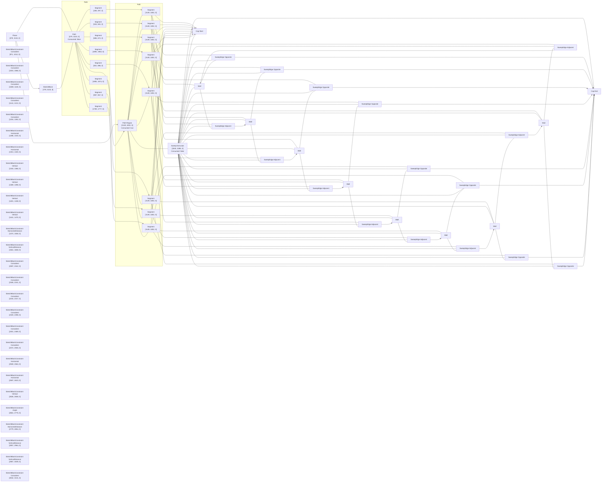

```mermaid
flowchart LR
  subgraph path2 [Path]
    2["Path<br>[379, 3133, 0]<br>Consumed: false"]
      %% [ProgramBodyItem { index: 7 }, VariableDeclarationDeclaration, VariableDeclarationInit]
    3["Segment<br>[436, 497, 0]"]
      %% [ProgramBodyItem { index: 7 }, VariableDeclarationDeclaration, VariableDeclarationInit, SketchBlockBody, SketchBlockBodyItem { index: 0 }, VariableDeclarationDeclaration, VariableDeclarationInit]
    4["Segment<br>[515, 581, 0]"]
      %% [ProgramBodyItem { index: 7 }, VariableDeclarationDeclaration, VariableDeclarationInit, SketchBlockBody, SketchBlockBodyItem { index: 1 }, VariableDeclarationDeclaration, VariableDeclarationInit]
    5["Segment<br>[606, 674, 0]"]
      %% [ProgramBodyItem { index: 7 }, VariableDeclarationDeclaration, VariableDeclarationInit, SketchBlockBody, SketchBlockBodyItem { index: 2 }, VariableDeclarationDeclaration, VariableDeclarationInit]
    6["Segment<br>[821, 886, 0]"]
      %% [ProgramBodyItem { index: 7 }, VariableDeclarationDeclaration, VariableDeclarationInit, SketchBlockBody, SketchBlockBodyItem { index: 4 }, VariableDeclarationDeclaration, VariableDeclarationInit]
    7["Segment<br>[907, 967, 0]"]
      %% [ProgramBodyItem { index: 7 }, VariableDeclarationDeclaration, VariableDeclarationInit, SketchBlockBody, SketchBlockBodyItem { index: 5 }, VariableDeclarationDeclaration, VariableDeclarationInit]
    8["Segment<br>[1709, 1777, 0]"]
      %% [ProgramBodyItem { index: 7 }, VariableDeclarationDeclaration, VariableDeclarationInit, SketchBlockBody, SketchBlockBodyItem { index: 19 }, VariableDeclarationDeclaration, VariableDeclarationInit]
    9["Segment<br>[1805, 1874, 0]"]
      %% [ProgramBodyItem { index: 7 }, VariableDeclarationDeclaration, VariableDeclarationInit, SketchBlockBody, SketchBlockBodyItem { index: 20 }, VariableDeclarationDeclaration, VariableDeclarationInit]
    10["Segment<br>[1893, 1963, 0]"]
      %% [ProgramBodyItem { index: 7 }, VariableDeclarationDeclaration, VariableDeclarationInit, SketchBlockBody, SketchBlockBodyItem { index: 21 }, VariableDeclarationDeclaration, VariableDeclarationInit]
  end
  subgraph path11 [Path]
    11["Path Region<br>[3149, 3202, 0]<br>Consumed: true"]
      %% [ProgramBodyItem { index: 8 }, VariableDeclarationDeclaration, VariableDeclarationInit]
    12["Segment<br>[3149, 3202, 0]"]
      %% [ProgramBodyItem { index: 8 }, VariableDeclarationDeclaration, VariableDeclarationInit]
    13["Segment<br>[3149, 3202, 0]"]
      %% [ProgramBodyItem { index: 8 }, VariableDeclarationDeclaration, VariableDeclarationInit]
    14["Segment<br>[3149, 3202, 0]"]
      %% [ProgramBodyItem { index: 8 }, VariableDeclarationDeclaration, VariableDeclarationInit]
    15["Segment<br>[3149, 3202, 0]"]
      %% [ProgramBodyItem { index: 8 }, VariableDeclarationDeclaration, VariableDeclarationInit]
    16["Segment<br>[3149, 3202, 0]"]
      %% [ProgramBodyItem { index: 8 }, VariableDeclarationDeclaration, VariableDeclarationInit]
    17["Segment<br>[3149, 3202, 0]"]
      %% [ProgramBodyItem { index: 8 }, VariableDeclarationDeclaration, VariableDeclarationInit]
    18["Segment<br>[3149, 3202, 0]"]
      %% [ProgramBodyItem { index: 8 }, VariableDeclarationDeclaration, VariableDeclarationInit]
    19["Segment<br>[3149, 3202, 0]"]
      %% [ProgramBodyItem { index: 8 }, VariableDeclarationDeclaration, VariableDeclarationInit]
  end
  1["Plane<br>[379, 3133, 0]"]
    %% [ProgramBodyItem { index: 7 }, VariableDeclarationDeclaration, VariableDeclarationInit]
  20["Sweep Extrusion<br>[3240, 3285, 0]<br>Consumed: false"]
    %% [ProgramBodyItem { index: 10 }, VariableDeclarationDeclaration, VariableDeclarationInit]
  21[Wall]
    %% face_code_ref=Missing NodePath
  22[Wall]
    %% face_code_ref=Missing NodePath
  23[Wall]
    %% face_code_ref=Missing NodePath
  24[Wall]
    %% face_code_ref=Missing NodePath
  25[Wall]
    %% face_code_ref=Missing NodePath
  26[Wall]
    %% face_code_ref=Missing NodePath
  27[Wall]
    %% face_code_ref=Missing NodePath
  28[Wall]
    %% face_code_ref=Missing NodePath
  29["Cap Start"]
    %% face_code_ref=Missing NodePath
  30["Cap End"]
    %% face_code_ref=Missing NodePath
  31["SweepEdge Opposite"]
  32["SweepEdge Adjacent"]
  33["SweepEdge Opposite"]
  34["SweepEdge Adjacent"]
  35["SweepEdge Opposite"]
  36["SweepEdge Adjacent"]
  37["SweepEdge Opposite"]
  38["SweepEdge Adjacent"]
  39["SweepEdge Opposite"]
  40["SweepEdge Adjacent"]
  41["SweepEdge Opposite"]
  42["SweepEdge Adjacent"]
  43["SweepEdge Opposite"]
  44["SweepEdge Adjacent"]
  45["SweepEdge Opposite"]
  46["SweepEdge Adjacent"]
  47["SketchBlock<br>[379, 3133, 0]"]
    %% [ProgramBodyItem { index: 7 }, VariableDeclarationDeclaration, VariableDeclarationInit]
  48["SketchBlockConstraint Coincident<br>[971, 1012, 0]"]
    %% [ProgramBodyItem { index: 7 }, VariableDeclarationDeclaration, VariableDeclarationInit, SketchBlockBody, SketchBlockBodyItem { index: 6 }, ExpressionStatementExpr]
  49["SketchBlockConstraint Coincident<br>[1015, 1066, 0]"]
    %% [ProgramBodyItem { index: 7 }, VariableDeclarationDeclaration, VariableDeclarationInit, SketchBlockBody, SketchBlockBodyItem { index: 7 }, ExpressionStatementExpr]
  50["SketchBlockConstraint Coincident<br>[1069, 1138, 0]"]
    %% [ProgramBodyItem { index: 7 }, VariableDeclarationDeclaration, VariableDeclarationInit, SketchBlockBody, SketchBlockBodyItem { index: 8 }, ExpressionStatementExpr]
  51["SketchBlockConstraint Coincident<br>[1141, 1213, 0]"]
    %% [ProgramBodyItem { index: 7 }, VariableDeclarationDeclaration, VariableDeclarationInit, SketchBlockBody, SketchBlockBodyItem { index: 9 }, ExpressionStatementExpr]
  52["SketchBlockConstraint Coincident<br>[1216, 1282, 0]"]
    %% [ProgramBodyItem { index: 7 }, VariableDeclarationDeclaration, VariableDeclarationInit, SketchBlockBody, SketchBlockBodyItem { index: 10 }, ExpressionStatementExpr]
  53["SketchBlockConstraint Horizontal<br>[1286, 1310, 0]"]
    %% [ProgramBodyItem { index: 7 }, VariableDeclarationDeclaration, VariableDeclarationInit, SketchBlockBody, SketchBlockBodyItem { index: 11 }, ExpressionStatementExpr]
  54["SketchBlockConstraint Horizontal<br>[1313, 1340, 0]"]
    %% [ProgramBodyItem { index: 7 }, VariableDeclarationDeclaration, VariableDeclarationInit, SketchBlockBody, SketchBlockBodyItem { index: 12 }, ExpressionStatementExpr]
  55["SketchBlockConstraint Vertical<br>[1343, 1366, 0]"]
    %% [ProgramBodyItem { index: 7 }, VariableDeclarationDeclaration, VariableDeclarationInit, SketchBlockBody, SketchBlockBodyItem { index: 13 }, ExpressionStatementExpr]
  56["SketchBlockConstraint Vertical<br>[1369, 1398, 0]"]
    %% [ProgramBodyItem { index: 7 }, VariableDeclarationDeclaration, VariableDeclarationInit, SketchBlockBody, SketchBlockBodyItem { index: 14 }, ExpressionStatementExpr]
  57["SketchBlockConstraint Vertical<br>[1401, 1438, 0]"]
    %% [ProgramBodyItem { index: 7 }, VariableDeclarationDeclaration, VariableDeclarationInit, SketchBlockBody, SketchBlockBodyItem { index: 15 }, ExpressionStatementExpr]
  58["SketchBlockConstraint Vertical<br>[1441, 1470, 0]"]
    %% [ProgramBodyItem { index: 7 }, VariableDeclarationDeclaration, VariableDeclarationInit, SketchBlockBody, SketchBlockBodyItem { index: 16 }, ExpressionStatementExpr]
  59["SketchBlockConstraint HorizontalDistance<br>[1474, 1558, 0]"]
    %% [ProgramBodyItem { index: 7 }, VariableDeclarationDeclaration, VariableDeclarationInit, SketchBlockBody, SketchBlockBodyItem { index: 17 }, ExpressionStatementExpr]
  60["SketchBlockConstraint VerticalDistance<br>[1561, 1658, 0]"]
    %% [ProgramBodyItem { index: 7 }, VariableDeclarationDeclaration, VariableDeclarationInit, SketchBlockBody, SketchBlockBodyItem { index: 18 }, ExpressionStatementExpr]
  61["SketchBlockConstraint Coincident<br>[2087, 2162, 0]"]
    %% [ProgramBodyItem { index: 7 }, VariableDeclarationDeclaration, VariableDeclarationInit, SketchBlockBody, SketchBlockBodyItem { index: 23 }, ExpressionStatementExpr]
  62["SketchBlockConstraint Coincident<br>[2165, 2241, 0]"]
    %% [ProgramBodyItem { index: 7 }, VariableDeclarationDeclaration, VariableDeclarationInit, SketchBlockBody, SketchBlockBodyItem { index: 24 }, ExpressionStatementExpr]
  63["SketchBlockConstraint Coincident<br>[2244, 2317, 0]"]
    %% [ProgramBodyItem { index: 7 }, VariableDeclarationDeclaration, VariableDeclarationInit, SketchBlockBody, SketchBlockBodyItem { index: 25 }, ExpressionStatementExpr]
  64["SketchBlockConstraint Coincident<br>[2320, 2398, 0]"]
    %% [ProgramBodyItem { index: 7 }, VariableDeclarationDeclaration, VariableDeclarationInit, SketchBlockBody, SketchBlockBodyItem { index: 26 }, ExpressionStatementExpr]
  65["SketchBlockConstraint Coincident<br>[2401, 2469, 0]"]
    %% [ProgramBodyItem { index: 7 }, VariableDeclarationDeclaration, VariableDeclarationInit, SketchBlockBody, SketchBlockBodyItem { index: 27 }, ExpressionStatementExpr]
  66["SketchBlockConstraint Coincident<br>[2472, 2555, 0]"]
    %% [ProgramBodyItem { index: 7 }, VariableDeclarationDeclaration, VariableDeclarationInit, SketchBlockBody, SketchBlockBodyItem { index: 28 }, ExpressionStatementExpr]
  67["SketchBlockConstraint Horizontal<br>[2559, 2584, 0]"]
    %% [ProgramBodyItem { index: 7 }, VariableDeclarationDeclaration, VariableDeclarationInit, SketchBlockBody, SketchBlockBodyItem { index: 29 }, ExpressionStatementExpr]
  68["SketchBlockConstraint Horizontal<br>[2587, 2623, 0]"]
    %% [ProgramBodyItem { index: 7 }, VariableDeclarationDeclaration, VariableDeclarationInit, SketchBlockBody, SketchBlockBodyItem { index: 30 }, ExpressionStatementExpr]
  69["SketchBlockConstraint Vertical<br>[2626, 2658, 0]"]
    %% [ProgramBodyItem { index: 7 }, VariableDeclarationDeclaration, VariableDeclarationInit, SketchBlockBody, SketchBlockBodyItem { index: 31 }, ExpressionStatementExpr]
  70["SketchBlockConstraint Angle<br>[2661, 2775, 0]"]
    %% [ProgramBodyItem { index: 7 }, VariableDeclarationDeclaration, VariableDeclarationInit, SketchBlockBody, SketchBlockBodyItem { index: 32 }, ExpressionStatementExpr]
  71["SketchBlockConstraint HorizontalDistance<br>[2779, 2854, 0]"]
    %% [ProgramBodyItem { index: 7 }, VariableDeclarationDeclaration, VariableDeclarationInit, SketchBlockBody, SketchBlockBodyItem { index: 33 }, ExpressionStatementExpr]
  72["SketchBlockConstraint VerticalDistance<br>[2857, 2964, 0]"]
    %% [ProgramBodyItem { index: 7 }, VariableDeclarationDeclaration, VariableDeclarationInit, SketchBlockBody, SketchBlockBodyItem { index: 34 }, ExpressionStatementExpr]
  73["SketchBlockConstraint VerticalDistance<br>[2967, 3039, 0]"]
    %% [ProgramBodyItem { index: 7 }, VariableDeclarationDeclaration, VariableDeclarationInit, SketchBlockBody, SketchBlockBodyItem { index: 35 }, ExpressionStatementExpr]
  74["SketchBlockConstraint Coincident<br>[3042, 3131, 0]"]
    %% [ProgramBodyItem { index: 7 }, VariableDeclarationDeclaration, VariableDeclarationInit, SketchBlockBody, SketchBlockBodyItem { index: 36 }, ExpressionStatementExpr]
  1 --- 2
  1 <--x 11
  1 <--x 47
  2 --- 3
  2 --- 4
  2 --- 5
  2 --- 6
  2 --- 7
  2 --- 8
  2 --- 9
  2 --- 10
  2 <--x 11
  47 --- 2
  3 <--x 12
  4 <--x 13
  5 <--x 14
  6 <--x 15
  7 <--x 16
  8 <--x 17
  9 <--x 18
  10 <--x 19
  11 --- 12
  11 --- 13
  11 --- 14
  11 --- 15
  11 --- 16
  11 --- 17
  11 --- 18
  11 --- 19
  11 ---- 20
  12 --- 21
  12 x--> 29
  12 --- 31
  12 --- 32
  13 --- 22
  13 x--> 29
  13 --- 33
  13 --- 34
  14 --- 23
  14 x--> 29
  14 --- 35
  14 --- 36
  15 --- 24
  15 x--> 29
  15 --- 37
  15 --- 38
  16 --- 25
  16 x--> 29
  16 --- 39
  16 --- 40
  17 --- 26
  17 x--> 29
  17 --- 41
  17 --- 42
  18 --- 27
  18 x--> 29
  18 --- 43
  18 --- 44
  19 --- 28
  19 x--> 29
  19 --- 45
  19 --- 46
  20 --- 21
  20 --- 22
  20 --- 23
  20 --- 24
  20 --- 25
  20 --- 26
  20 --- 27
  20 --- 28
  20 --- 29
  20 --- 30
  20 --- 31
  20 --- 32
  20 --- 33
  20 --- 34
  20 --- 35
  20 --- 36
  20 --- 37
  20 --- 38
  20 --- 39
  20 --- 40
  20 --- 41
  20 --- 42
  20 --- 43
  20 --- 44
  20 --- 45
  20 --- 46
  21 --- 31
  21 --- 32
  46 <--x 21
  32 <--x 22
  22 --- 33
  22 --- 34
  34 <--x 23
  23 --- 35
  23 --- 36
  36 <--x 24
  24 --- 37
  24 --- 38
  38 <--x 25
  25 --- 39
  25 --- 40
  40 <--x 26
  26 --- 41
  26 --- 42
  42 <--x 27
  27 --- 43
  27 --- 44
  44 <--x 28
  28 --- 45
  28 --- 46
  31 <--x 30
  33 <--x 30
  35 <--x 30
  37 <--x 30
  39 <--x 30
  41 <--x 30
  43 <--x 30
  45 <--x 30
```
