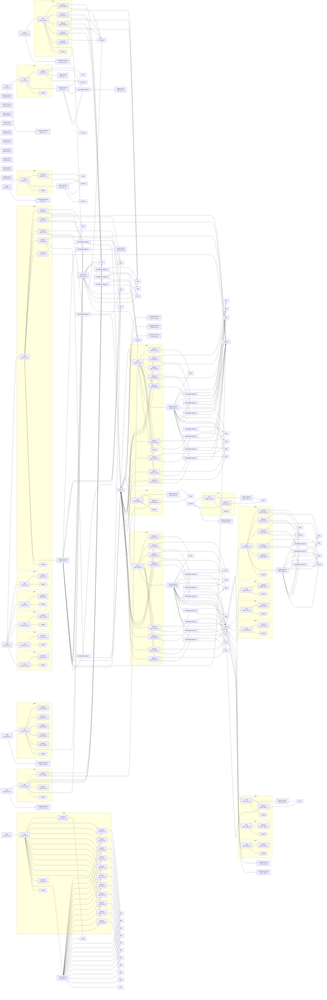

```mermaid
flowchart LR
  subgraph path2 [Path]
    2["Path<br>[323, 370, 6]"]
    3["Segment<br>[376, 444, 6]"]
    4["Segment<br>[450, 550, 6]"]
    5["Segment<br>[556, 673, 6]"]
    6["Segment<br>[679, 764, 6]"]
    7["Segment<br>[770, 777, 6]"]
    8[Solid2d]
  end
  subgraph path9 [Path]
    9["Path<br>[788, 823, 6]"]
    10["Segment<br>[788, 823, 6]"]
    11[Solid2d]
  end
  subgraph path12 [Path]
    12["Path<br>[838, 985, 6]"]
    13["Segment<br>[838, 985, 6]"]
    14[Solid2d]
  end
  subgraph path15 [Path]
    15["Path<br>[1000, 1148, 6]"]
    16["Segment<br>[1000, 1148, 6]"]
    17[Solid2d]
  end
  subgraph path18 [Path]
    18["Path<br>[1163, 1311, 6]"]
    19["Segment<br>[1163, 1311, 6]"]
    20[Solid2d]
  end
  subgraph path21 [Path]
    21["Path<br>[1326, 1475, 6]"]
    22["Segment<br>[1326, 1475, 6]"]
    23[Solid2d]
  end
  subgraph path34 [Path]
    34["Path<br>[1646, 1702, 6]"]
    35["Segment<br>[1708, 1773, 6]"]
    36["Segment<br>[1779, 1831, 6]"]
    37["Segment<br>[1837, 1888, 6]"]
    38["Segment<br>[1894, 1946, 6]"]
    39["Segment<br>[1952, 2018, 6]"]
    40["Segment<br>[2024, 2076, 6]"]
    41["Segment<br>[2082, 2114, 6]"]
    42["Segment<br>[2120, 2185, 6]"]
    43["Segment<br>[2191, 2198, 6]"]
    44[Solid2d]
  end
  subgraph path64 [Path]
    64["Path<br>[2547, 2660, 6]"]
    65["Segment<br>[2666, 2721, 6]"]
    66["Segment<br>[2727, 2762, 6]"]
    67["Segment<br>[2768, 2823, 6]"]
    68["Segment<br>[2829, 2865, 6]"]
    69["Segment<br>[2871, 2926, 6]"]
    70["Segment<br>[2932, 2968, 6]"]
    71["Segment<br>[2974, 3029, 6]"]
    72["Segment<br>[3035, 3091, 6]"]
  end
  subgraph path90 [Path]
    90["Path<br>[3240, 3291, 6]"]
    91["Segment<br>[3240, 3291, 6]"]
    92[Solid2d]
  end
  subgraph path95 [Path]
    95["Path<br>[3470, 3532, 6]"]
    96["Segment<br>[3538, 3606, 6]"]
    97["Segment<br>[3612, 3712, 6]"]
    98["Segment<br>[3718, 3835, 6]"]
    99["Segment<br>[3841, 3926, 6]"]
    100["Segment<br>[3932, 3939, 6]"]
    101[Solid2d]
  end
  subgraph path102 [Path]
    102["Path<br>[3950, 4001, 6]"]
    103["Segment<br>[3950, 4001, 6]"]
    104[Solid2d]
  end
  subgraph path105 [Path]
    105["Path<br>[4016, 4163, 6]"]
    106["Segment<br>[4016, 4163, 6]"]
    107[Solid2d]
  end
  subgraph path108 [Path]
    108["Path<br>[4178, 4326, 6]"]
    109["Segment<br>[4178, 4326, 6]"]
    110[Solid2d]
  end
  subgraph path111 [Path]
    111["Path<br>[4341, 4489, 6]"]
    112["Segment<br>[4341, 4489, 6]"]
    113[Solid2d]
  end
  subgraph path114 [Path]
    114["Path<br>[4504, 4653, 6]"]
    115["Segment<br>[4504, 4653, 6]"]
    116[Solid2d]
  end
  subgraph path127 [Path]
    127["Path<br>[4798, 4836, 6]"]
    128["Segment<br>[4798, 4836, 6]"]
    129[Solid2d]
  end
  subgraph path133 [Path]
    133["Path<br>[4909, 4945, 6]"]
    134["Segment<br>[4909, 4945, 6]"]
    135[Solid2d]
  end
  subgraph path148 [Path]
    148["Path<br>[277, 327, 7]"]
    149["Segment<br>[277, 327, 7]"]
    150[Solid2d]
  end
  subgraph path157 [Path]
    157["Path<br>[502, 537, 7]"]
    158["Segment<br>[502, 537, 7]"]
    159[Solid2d]
  end
  subgraph path167 [Path]
    167["Path<br>[216, 255, 8]"]
    168["Segment<br>[261, 291, 8]"]
    169["Segment<br>[297, 336, 8]"]
    170["Segment<br>[342, 366, 8]"]
    171["Segment<br>[372, 396, 8]"]
    172["Segment<br>[402, 443, 8]"]
    173["Segment<br>[449, 487, 8]"]
    174["Segment<br>[493, 516, 8]"]
    175["Segment<br>[522, 539, 8]"]
    176["Segment<br>[545, 566, 8]"]
    177["Segment<br>[572, 659, 8]"]
    178["Segment<br>[665, 702, 8]"]
    179["Segment<br>[708, 745, 8]"]
    180["Segment<br>[751, 758, 8]"]
    181[Solid2d]
  end
  subgraph path196 [Path]
    196["Path<br>[1100, 1212, 8]"]
    197["Segment<br>[1220, 1289, 8]"]
    198["Segment<br>[1297, 1641, 8]"]
    199["Segment<br>[1649, 1995, 8]"]
    200["Segment<br>[2003, 2244, 8]"]
    201["Segment<br>[2252, 2259, 8]"]
    202[Solid2d]
  end
  subgraph path204 [Path]
    204["Path<br>[1100, 1212, 8]"]
    205["Segment<br>[1220, 1289, 8]"]
    206["Segment<br>[1297, 1641, 8]"]
    207["Segment<br>[1649, 1995, 8]"]
    208["Segment<br>[2003, 2244, 8]"]
    209["Segment<br>[2252, 2259, 8]"]
    210[Solid2d]
  end
  subgraph path212 [Path]
    212["Path<br>[1100, 1212, 8]"]
    213["Segment<br>[1220, 1289, 8]"]
    217["Segment<br>[2252, 2259, 8]"]
    218[Solid2d]
  end
  1["Plane<br>[300, 317, 6]"]
  24["Sweep Extrusion<br>[1485, 1504, 6]"]
  25[Wall]
  26[Wall]
  27[Wall]
  28[Wall]
  29["Cap Start"]
  30["Cap End"]
  31["SweepEdge Opposite"]
  32["SweepEdge Opposite"]
  33["SweepEdge Opposite"]
  45["Sweep Extrusion<br>[2338, 2358, 6]"]
  46[Wall]
  47[Wall]
  48[Wall]
  49[Wall]
  50[Wall]
  51[Wall]
  52[Wall]
  53[Wall]
  54["SweepEdge Opposite"]
  55["SweepEdge Opposite"]
  56["SweepEdge Opposite"]
  57["SweepEdge Opposite"]
  58["SweepEdge Opposite"]
  59["SweepEdge Opposite"]
  60["SweepEdge Opposite"]
  61["Sweep Extrusion<br>[2338, 2358, 6]"]
  62["Sweep Extrusion<br>[2338, 2358, 6]"]
  63["Sweep Extrusion<br>[2338, 2358, 6]"]
  73["Sweep Extrusion<br>[3097, 3132, 6]"]
  74[Wall]
  75[Wall]
  76[Wall]
  77[Wall]
  78[Wall]
  79[Wall]
  80[Wall]
  81[Wall]
  82["Cap End"]
  83["SweepEdge Opposite"]
  84["SweepEdge Opposite"]
  85["SweepEdge Opposite"]
  86["SweepEdge Opposite"]
  87["SweepEdge Opposite"]
  88["SweepEdge Opposite"]
  89["SweepEdge Opposite"]
  93["Sweep Extrusion<br>[3297, 3335, 6]"]
  94[Wall]
  117["Sweep Extrusion<br>[4663, 4682, 6]"]
  118[Wall]
  119[Wall]
  120[Wall]
  121[Wall]
  122["Cap Start"]
  123["Cap End"]
  124["SweepEdge Opposite"]
  125["SweepEdge Opposite"]
  126["SweepEdge Opposite"]
  130["Sweep Extrusion<br>[4842, 4862, 6]"]
  131[Wall]
  132["Cap End"]
  136["Sweep Extrusion<br>[4951, 4972, 6]"]
  137[Wall]
  138["SweepEdge Adjacent"]
  139["EdgeCut Fillet<br>[5013, 5524, 6]"]
  140["EdgeCut Fillet<br>[5013, 5524, 6]"]
  141["EdgeCut Fillet<br>[5013, 5524, 6]"]
  142["EdgeCut Fillet<br>[5013, 5524, 6]"]
  143["EdgeCut Fillet<br>[5013, 5524, 6]"]
  144["EdgeCut Fillet<br>[5013, 5524, 6]"]
  145["EdgeCut Fillet<br>[5013, 5524, 6]"]
  146["EdgeCut Fillet<br>[5013, 5524, 6]"]
  147["Plane<br>[204, 231, 7]"]
  151["Sweep Extrusion<br>[333, 353, 7]"]
  152[Wall]
  153["Cap Start"]
  154["Cap End"]
  155["SweepEdge Opposite"]
  156["Plane<br>[467, 495, 7]"]
  160["Sweep Extrusion<br>[543, 564, 7]"]
  161[Wall]
  162["Cap Start"]
  163["Cap End"]
  164["EdgeCut Fillet<br>[394, 452, 7]"]
  165["EdgeCut Fillet<br>[394, 452, 7]"]
  166["Plane<br>[193, 210, 8]"]
  182["Sweep Revolve<br>[764, 846, 8]"]
  183[Wall]
  184[Wall]
  185[Wall]
  186[Wall]
  187[Wall]
  188[Wall]
  189[Wall]
  190[Wall]
  191[Wall]
  192[Wall]
  193[Wall]
  194[Wall]
  195["Plane<br>[1053, 1091, 8]"]
  203["Plane<br>[1053, 1091, 8]"]
  211["Plane<br>[1053, 1091, 8]"]
  214["SweepEdge Opposite"]
  215["SweepEdge Opposite"]
  216["SweepEdge Opposite"]
  219["Sweep Loft<br>[2378, 2498, 8]"]
  220[Wall]
  221[Wall]
  222[Wall]
  223[Wall]
  224["Cap End"]
  225["Cap End"]
  226["StartSketchOnFace<br>[1597, 1640, 6]"]
  227["StartSketchOnFace<br>[2498, 2541, 6]"]
  228["StartSketchOnFace<br>[3197, 3234, 6]"]
  229["StartSketchOnFace<br>[3421, 3458, 6]"]
  230["StartSketchOnFace<br>[4749, 4792, 6]"]
  231["StartSketchOnFace<br>[4864, 4903, 6]"]
  232["StartSketchOnPlane<br>[244, 271, 7]"]
  233["StartSketchOnPlane<br>[453, 496, 7]"]
  234["StartSketchOnPlane<br>[1039, 1092, 8]"]
  235["StartSketchOnPlane<br>[1039, 1092, 8]"]
  236["StartSketchOnPlane<br>[1039, 1092, 8]"]
  1 --- 2
  1 --- 9
  1 --- 12
  1 --- 15
  1 --- 18
  1 --- 21
  2 --- 3
  2 --- 4
  2 --- 5
  2 --- 6
  2 --- 7
  2 ---- 24
  2 --- 8
  3 --- 25
  3 --- 138
  3 x--> 29
  4 --- 26
  4 --- 31
  4 x--> 29
  5 --- 27
  5 --- 32
  5 x--> 29
  6 --- 28
  6 --- 33
  6 x--> 29
  9 --- 10
  9 --- 11
  12 --- 13
  12 --- 14
  15 --- 16
  15 --- 17
  18 --- 19
  18 --- 20
  21 --- 22
  21 --- 23
  24 --- 25
  24 --- 26
  24 --- 27
  24 --- 28
  24 --- 29
  24 --- 30
  24 --- 31
  24 --- 32
  24 --- 33
  24 --- 138
  30 --- 34
  30 --- 64
  30 --- 127
  31 <--x 26
  31 <--x 30
  32 <--x 27
  32 <--x 30
  33 <--x 28
  33 <--x 30
  34 --- 35
  34 --- 36
  34 --- 37
  34 --- 38
  34 --- 39
  34 --- 40
  34 --- 41
  34 --- 42
  34 --- 43
  34 ---- 45
  34 --- 44
  35 --- 46
  35 <--x 30
  36 --- 47
  36 --- 54
  36 <--x 30
  37 --- 48
  37 --- 55
  37 <--x 30
  38 --- 49
  38 --- 56
  38 <--x 30
  39 --- 50
  39 --- 57
  39 <--x 30
  40 --- 51
  40 --- 58
  40 <--x 30
  41 --- 52
  41 --- 59
  41 <--x 30
  42 --- 53
  42 --- 60
  42 <--x 30
  45 --- 46
  45 --- 47
  45 --- 48
  45 --- 49
  45 --- 50
  45 --- 51
  45 --- 52
  45 --- 53
  45 --- 54
  45 --- 55
  45 --- 56
  45 --- 57
  45 --- 58
  45 --- 59
  45 --- 60
  54 <--x 47
  54 <--x 29
  55 <--x 48
  55 <--x 29
  56 <--x 49
  56 <--x 29
  57 <--x 50
  57 <--x 29
  58 <--x 51
  58 <--x 29
  59 <--x 52
  59 <--x 29
  60 <--x 53
  60 <--x 29
  64 --- 65
  64 --- 66
  64 --- 67
  64 --- 68
  64 --- 69
  64 --- 70
  64 --- 71
  64 --- 72
  64 ---- 73
  65 --- 74
  65 <--x 30
  66 --- 75
  66 --- 83
  66 <--x 30
  67 --- 76
  67 --- 84
  67 <--x 30
  68 --- 77
  68 --- 85
  68 <--x 30
  69 --- 78
  69 --- 86
  69 <--x 30
  70 --- 79
  70 --- 87
  70 <--x 30
  71 --- 80
  71 --- 88
  71 <--x 30
  72 --- 81
  72 --- 89
  72 <--x 30
  73 --- 74
  73 --- 75
  73 --- 76
  73 --- 77
  73 --- 78
  73 --- 79
  73 --- 80
  73 --- 81
  73 --- 82
  73 --- 83
  73 --- 84
  73 --- 85
  73 --- 86
  73 --- 87
  73 --- 88
  73 --- 89
  82 --- 90
  82 --- 95
  82 --- 102
  82 --- 105
  82 --- 108
  82 --- 111
  82 --- 114
  83 <--x 75
  83 <--x 82
  84 <--x 76
  84 <--x 82
  85 <--x 77
  85 <--x 82
  86 <--x 78
  86 <--x 82
  87 <--x 79
  87 <--x 82
  88 <--x 80
  88 <--x 82
  89 <--x 81
  89 <--x 82
  90 --- 91
  90 ---- 93
  90 --- 92
  91 --- 94
  91 <--x 82
  93 --- 94
  95 --- 96
  95 --- 97
  95 --- 98
  95 --- 99
  95 --- 100
  95 ---- 117
  95 --- 101
  96 --- 118
  96 x--> 122
  97 --- 119
  97 --- 124
  97 x--> 122
  98 --- 120
  98 --- 125
  98 x--> 122
  99 --- 121
  99 --- 126
  99 x--> 122
  102 --- 103
  102 --- 104
  105 --- 106
  105 --- 107
  108 --- 109
  108 --- 110
  111 --- 112
  111 --- 113
  114 --- 115
  114 --- 116
  117 --- 118
  117 --- 119
  117 --- 120
  117 --- 121
  117 --- 122
  117 --- 123
  117 --- 124
  117 --- 125
  117 --- 126
  124 <--x 119
  124 <--x 123
  125 <--x 120
  125 <--x 123
  126 <--x 121
  126 <--x 123
  127 --- 128
  127 ---- 130
  127 --- 129
  128 --- 131
  128 <--x 30
  130 --- 131
  130 --- 132
  132 --- 133
  133 --- 134
  133 ---- 136
  133 --- 135
  134 --- 137
  134 <--x 132
  136 --- 137
  138 <--x 139
  147 --- 148
  148 --- 149
  148 ---- 151
  148 --- 150
  149 --- 152
  149 --- 155
  149 --- 165
  149 x--> 153
  151 --- 152
  151 --- 153
  151 --- 154
  151 --- 155
  156 --- 157
  157 --- 158
  157 ---- 160
  157 --- 159
  158 --- 161
  158 x--> 162
  160 --- 161
  160 --- 162
  160 --- 163
  155 <--x 164
  166 --- 167
  167 --- 168
  167 --- 169
  167 --- 170
  167 --- 171
  167 --- 172
  167 --- 173
  167 --- 174
  167 --- 175
  167 --- 176
  167 --- 177
  167 --- 178
  167 --- 179
  167 --- 180
  167 ---- 182
  167 --- 181
  168 --- 183
  169 --- 184
  170 --- 185
  171 --- 186
  172 --- 187
  173 --- 188
  174 --- 189
  175 --- 190
  176 --- 191
  177 --- 192
  178 --- 193
  179 --- 194
  182 --- 183
  182 --- 184
  182 --- 185
  182 --- 186
  182 --- 187
  182 --- 188
  182 --- 189
  182 --- 190
  182 --- 191
  182 --- 192
  182 --- 193
  182 --- 194
  182 <--x 169
  182 <--x 170
  182 <--x 171
  182 <--x 172
  182 <--x 173
  182 <--x 174
  182 <--x 175
  182 <--x 176
  182 <--x 177
  182 <--x 178
  182 <--x 179
  195 --- 196
  196 --- 197
  196 --- 198
  196 --- 199
  196 --- 200
  196 --- 201
  196 ---- 219
  196 --- 202
  197 --- 220
  197 x--> 224
  198 --- 221
  198 --- 214
  198 x--> 224
  199 --- 222
  199 --- 215
  199 x--> 224
  200 --- 223
  200 --- 216
  200 x--> 224
  203 --- 204
  204 --- 205
  204 --- 206
  204 --- 207
  204 --- 208
  204 --- 209
  204 x---> 219
  204 --- 210
  211 --- 212
  212 --- 213
  212 x--> 214
  212 x--> 215
  212 x--> 216
  212 --- 217
  212 x---> 219
  212 --- 218
  213 x--> 220
  213 x--> 225
  219 --- 214
  214 x--> 221
  214 x--> 225
  219 --- 215
  215 x--> 222
  215 x--> 225
  219 --- 216
  216 x--> 223
  216 x--> 225
  219 --- 220
  219 --- 221
  219 --- 222
  219 --- 223
  219 --- 224
  219 --- 225
  30 <--x 226
  30 <--x 227
  82 <--x 228
  82 <--x 229
  30 <--x 230
  132 <--x 231
  147 <--x 232
  156 <--x 233
  195 <--x 234
  203 <--x 235
  211 <--x 236
```
