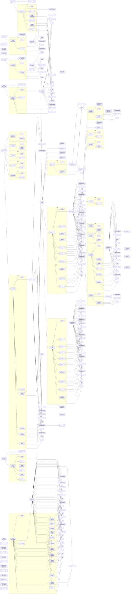

```mermaid
flowchart LR
  subgraph path2 [Path]
    2["Path<br>[354, 401, 5]"]
    3["Segment<br>[409, 459, 5]"]
    4["Segment<br>[467, 576, 5]"]
    5["Segment<br>[584, 710, 5]"]
    6["Segment<br>[718, 803, 5]"]
    7["Segment<br>[811, 818, 5]"]
    8[Solid2d]
  end
  subgraph path9 [Path]
    9["Path<br>[831, 866, 5]"]
    10["Segment<br>[831, 866, 5]"]
    11[Solid2d]
  end
  subgraph path12 [Path]
    12["Path<br>[883, 1042, 5]"]
    13["Segment<br>[883, 1042, 5]"]
    14[Solid2d]
  end
  subgraph path15 [Path]
    15["Path<br>[1059, 1219, 5]"]
    16["Segment<br>[1059, 1219, 5]"]
    17[Solid2d]
  end
  subgraph path18 [Path]
    18["Path<br>[1236, 1396, 5]"]
    19["Segment<br>[1236, 1396, 5]"]
    20[Solid2d]
  end
  subgraph path21 [Path]
    21["Path<br>[1413, 1574, 5]"]
    22["Segment<br>[1413, 1574, 5]"]
    23[Solid2d]
  end
  subgraph path39 [Path]
    39["Path<br>[1748, 1804, 5]"]
    40["Segment<br>[1812, 1859, 5]"]
    41["Segment<br>[1867, 1952, 5]"]
    42["Segment<br>[1960, 1999, 5]"]
    43["Segment<br>[2007, 2092, 5]"]
    44["Segment<br>[2100, 2154, 5]"]
    45["Segment<br>[2162, 2247, 5]"]
    46["Segment<br>[2255, 2287, 5]"]
    47["Segment<br>[2295, 2351, 5]"]
    48["Segment<br>[2359, 2366, 5]"]
    49[Solid2d]
  end
  subgraph path78 [Path]
    78["Path<br>[2863, 2968, 5]"]
    79["Segment<br>[2976, 3012, 5]"]
    80["Segment<br>[3020, 3056, 5]"]
    81["Segment<br>[3064, 3107, 5]"]
    82["Segment<br>[3115, 3158, 5]"]
    83["Segment<br>[3166, 3210, 5]"]
    84["Segment<br>[3218, 3262, 5]"]
    85["Segment<br>[3270, 3314, 5]"]
    86["Segment<br>[3322, 3365, 5]"]
    87["Segment<br>[3373, 3380, 5]"]
    88[Solid2d]
  end
  subgraph path115 [Path]
    115["Path<br>[3532, 3583, 5]"]
    116["Segment<br>[3532, 3583, 5]"]
    117[Solid2d]
  end
  subgraph path122 [Path]
    122["Path<br>[3765, 3824, 5]"]
    123["Segment<br>[3832, 3882, 5]"]
    124["Segment<br>[3890, 3999, 5]"]
    125["Segment<br>[4007, 4133, 5]"]
    126["Segment<br>[4141, 4226, 5]"]
    127["Segment<br>[4234, 4241, 5]"]
    128[Solid2d]
  end
  subgraph path129 [Path]
    129["Path<br>[4254, 4305, 5]"]
    130["Segment<br>[4254, 4305, 5]"]
    131[Solid2d]
  end
  subgraph path132 [Path]
    132["Path<br>[4322, 4481, 5]"]
    133["Segment<br>[4322, 4481, 5]"]
    134[Solid2d]
  end
  subgraph path135 [Path]
    135["Path<br>[4498, 4658, 5]"]
    136["Segment<br>[4498, 4658, 5]"]
    137[Solid2d]
  end
  subgraph path138 [Path]
    138["Path<br>[4675, 4835, 5]"]
    139["Segment<br>[4675, 4835, 5]"]
    140[Solid2d]
  end
  subgraph path141 [Path]
    141["Path<br>[4852, 5013, 5]"]
    142["Segment<br>[4852, 5013, 5]"]
    143[Solid2d]
  end
  subgraph path159 [Path]
    159["Path<br>[5161, 5199, 5]"]
    160["Segment<br>[5161, 5199, 5]"]
    161[Solid2d]
  end
  subgraph path167 [Path]
    167["Path<br>[5285, 5321, 5]"]
    168["Segment<br>[5285, 5321, 5]"]
    169[Solid2d]
  end
  subgraph path175 [Path]
    175["Path<br>[301, 351, 7]"]
    176["Segment<br>[301, 351, 7]"]
    177[Solid2d]
  end
  subgraph path185 [Path]
    185["Path<br>[548, 583, 7]"]
    186["Segment<br>[548, 583, 7]"]
    187[Solid2d]
  end
  subgraph path195 [Path]
    195["Path<br>[240, 279, 8]"]
    196["Segment<br>[287, 317, 8]"]
    197["Segment<br>[325, 372, 8]"]
    198["Segment<br>[380, 404, 8]"]
    199["Segment<br>[412, 436, 8]"]
    200["Segment<br>[444, 485, 8]"]
    201["Segment<br>[493, 539, 8]"]
    202["Segment<br>[547, 570, 8]"]
    203["Segment<br>[578, 595, 8]"]
    204["Segment<br>[603, 624, 8]"]
    205["Segment<br>[632, 725, 8]"]
    206["Segment<br>[733, 770, 8]"]
    207["Segment<br>[778, 815, 8]"]
    208["Segment<br>[823, 830, 8]"]
    209[Solid2d]
  end
  subgraph path235 [Path]
    235["Path<br>[1190, 1308, 8]"]
    236["Segment<br>[1318, 1436, 8]"]
    237["Segment<br>[1446, 1798, 8]"]
    238["Segment<br>[1808, 2162, 8]"]
    239["Segment<br>[2172, 2415, 8]"]
    240["Segment<br>[2425, 2432, 8]"]
    241[Solid2d]
  end
  subgraph path243 [Path]
    243["Path<br>[1190, 1308, 8]"]
    244["Segment<br>[1318, 1436, 8]"]
    245["Segment<br>[1446, 1798, 8]"]
    246["Segment<br>[1808, 2162, 8]"]
    247["Segment<br>[2172, 2415, 8]"]
    248["Segment<br>[2425, 2432, 8]"]
    249[Solid2d]
  end
  subgraph path251 [Path]
    251["Path<br>[1190, 1308, 8]"]
    256["Segment<br>[2425, 2432, 8]"]
    257[Solid2d]
  end
  1["Plane<br>[329, 346, 5]"]
  24["Sweep Extrusion<br>[1586, 1605, 5]"]
  25[Wall]
  26[Wall]
  27[Wall]
  28[Wall]
  29["Cap Start"]
  30["Cap End"]
  31["SweepEdge Opposite"]
  32["SweepEdge Adjacent"]
  33["SweepEdge Opposite"]
  34["SweepEdge Adjacent"]
  35["SweepEdge Opposite"]
  36["SweepEdge Adjacent"]
  37["SweepEdge Opposite"]
  38["SweepEdge Adjacent"]
  50["Sweep Extrusion<br>[2520, 2540, 5]"]
  51[Wall]
  52[Wall]
  53[Wall]
  54[Wall]
  55[Wall]
  56[Wall]
  57[Wall]
  58[Wall]
  59["SweepEdge Opposite"]
  60["SweepEdge Adjacent"]
  61["SweepEdge Opposite"]
  62["SweepEdge Adjacent"]
  63["SweepEdge Opposite"]
  64["SweepEdge Adjacent"]
  65["SweepEdge Opposite"]
  66["SweepEdge Adjacent"]
  67["SweepEdge Opposite"]
  68["SweepEdge Adjacent"]
  69["SweepEdge Opposite"]
  70["SweepEdge Adjacent"]
  71["SweepEdge Opposite"]
  72["SweepEdge Adjacent"]
  73["SweepEdge Opposite"]
  74["SweepEdge Adjacent"]
  75["Sweep Extrusion<br>[2520, 2540, 5]"]
  76["Sweep Extrusion<br>[2520, 2540, 5]"]
  77["Sweep Extrusion<br>[2520, 2540, 5]"]
  89["Sweep Extrusion<br>[3388, 3423, 5]"]
  90[Wall]
  91[Wall]
  92[Wall]
  93[Wall]
  94[Wall]
  95[Wall]
  96[Wall]
  97[Wall]
  98["Cap End"]
  99["SweepEdge Opposite"]
  100["SweepEdge Adjacent"]
  101["SweepEdge Opposite"]
  102["SweepEdge Adjacent"]
  103["SweepEdge Opposite"]
  104["SweepEdge Adjacent"]
  105["SweepEdge Opposite"]
  106["SweepEdge Adjacent"]
  107["SweepEdge Opposite"]
  108["SweepEdge Adjacent"]
  109["SweepEdge Opposite"]
  110["SweepEdge Adjacent"]
  111["SweepEdge Opposite"]
  112["SweepEdge Adjacent"]
  113["SweepEdge Opposite"]
  114["SweepEdge Adjacent"]
  118["Sweep Extrusion<br>[3591, 3629, 5]"]
  119[Wall]
  120["SweepEdge Opposite"]
  121["SweepEdge Adjacent"]
  144["Sweep Extrusion<br>[5025, 5044, 5]"]
  145[Wall]
  146[Wall]
  147[Wall]
  148[Wall]
  149["Cap Start"]
  150["Cap End"]
  151["SweepEdge Opposite"]
  152["SweepEdge Adjacent"]
  153["SweepEdge Opposite"]
  154["SweepEdge Adjacent"]
  155["SweepEdge Opposite"]
  156["SweepEdge Adjacent"]
  157["SweepEdge Opposite"]
  158["SweepEdge Adjacent"]
  162["Sweep Extrusion<br>[5207, 5227, 5]"]
  163[Wall]
  164["Cap End"]
  165["SweepEdge Opposite"]
  166["SweepEdge Adjacent"]
  170["Sweep Extrusion<br>[5329, 5350, 5]"]
  171[Wall]
  172["SweepEdge Opposite"]
  173["SweepEdge Adjacent"]
  174["Plane<br>[224, 251, 7]"]
  178["Sweep Extrusion<br>[359, 379, 7]"]
  179[Wall]
  180["Cap Start"]
  181["Cap End"]
  182["SweepEdge Opposite"]
  183["SweepEdge Adjacent"]
  184["Plane<br>[511, 539, 7]"]
  188["Sweep Extrusion<br>[591, 612, 7]"]
  189[Wall]
  190["Cap Start"]
  191["Cap End"]
  192["SweepEdge Opposite"]
  193["SweepEdge Adjacent"]
  194["Plane<br>[215, 232, 8]"]
  210["Sweep Revolve<br>[838, 926, 8]"]
  211[Wall]
  212[Wall]
  213[Wall]
  214[Wall]
  215[Wall]
  216[Wall]
  217[Wall]
  218[Wall]
  219[Wall]
  220[Wall]
  221[Wall]
  222[Wall]
  223["SweepEdge Adjacent"]
  224["SweepEdge Adjacent"]
  225["SweepEdge Adjacent"]
  226["SweepEdge Adjacent"]
  227["SweepEdge Adjacent"]
  228["SweepEdge Adjacent"]
  229["SweepEdge Adjacent"]
  230["SweepEdge Adjacent"]
  231["SweepEdge Adjacent"]
  232["SweepEdge Adjacent"]
  233["SweepEdge Adjacent"]
  234["Plane<br>[1141, 1179, 8]"]
  242["Plane<br>[1141, 1179, 8]"]
  250["Plane<br>[1141, 1179, 8]"]
  252["SweepEdge Opposite"]
  253["SweepEdge Opposite"]
  254["SweepEdge Opposite"]
  255["SweepEdge Opposite"]
  258["Sweep Loft<br>[2571, 2697, 8]"]
  259[Wall]
  260[Wall]
  261[Wall]
  262[Wall]
  263["Cap End"]
  264["Cap End"]
  265["SweepEdge Adjacent"]
  266["SweepEdge Adjacent"]
  267["SweepEdge Adjacent"]
  268["SweepEdge Adjacent"]
  269["EdgeCut Fillet<br>[5395, 5930, 5]"]
  270["EdgeCut Fillet<br>[5395, 5930, 5]"]
  271["EdgeCut Fillet<br>[5395, 5930, 5]"]
  272["EdgeCut Fillet<br>[5395, 5930, 5]"]
  273["EdgeCut Fillet<br>[5395, 5930, 5]"]
  274["EdgeCut Fillet<br>[5395, 5930, 5]"]
  275["EdgeCut Fillet<br>[5395, 5930, 5]"]
  276["EdgeCut Fillet<br>[5395, 5930, 5]"]
  277["EdgeCut Fillet<br>[424, 482, 7]"]
  278["EdgeCut Fillet<br>[424, 482, 7]"]
  279["StartSketchOnFace<br>[1702, 1740, 5]"]
  280["StartSketchOnFace<br>[2817, 2855, 5]"]
  281["StartSketchOnFace<br>[3492, 3524, 5]"]
  282["StartSketchOnFace<br>[3719, 3751, 5]"]
  283["StartSketchOnFace<br>[5115, 5153, 5]"]
  284["StartSketchOnFace<br>[5243, 5277, 5]"]
  285["StartSketchOnPlane<br>[266, 293, 7]"]
  286["StartSketchOnPlane<br>[497, 540, 7]"]
  287["StartSketchOnPlane<br>[1127, 1180, 8]"]
  288["StartSketchOnPlane<br>[1127, 1180, 8]"]
  289["StartSketchOnPlane<br>[1127, 1180, 8]"]
  290["StartSketchOnFace<br>[1702, 1740, 5]"]
  291["StartSketchOnFace<br>[2817, 2855, 5]"]
  292["StartSketchOnFace<br>[3492, 3524, 5]"]
  293["StartSketchOnFace<br>[3719, 3751, 5]"]
  294["StartSketchOnFace<br>[5115, 5153, 5]"]
  295["StartSketchOnFace<br>[5243, 5277, 5]"]
  296["StartSketchOnPlane<br>[266, 293, 7]"]
  297["StartSketchOnPlane<br>[497, 540, 7]"]
  298["StartSketchOnPlane<br>[1127, 1180, 8]"]
  299["StartSketchOnPlane<br>[1127, 1180, 8]"]
  300["StartSketchOnPlane<br>[1127, 1180, 8]"]
  1 --- 2
  1 --- 9
  1 --- 12
  1 --- 15
  1 --- 18
  1 --- 21
  2 --- 3
  2 --- 4
  2 --- 5
  2 --- 6
  2 --- 7
  2 ---- 24
  2 --- 8
  3 --- 25
  3 --- 31
  3 --- 32
  4 --- 26
  4 --- 33
  4 --- 34
  5 --- 27
  5 --- 35
  5 --- 36
  6 --- 28
  6 --- 37
  6 --- 38
  9 --- 10
  9 --- 11
  12 --- 13
  12 --- 14
  15 --- 16
  15 --- 17
  18 --- 19
  18 --- 20
  21 --- 22
  21 --- 23
  24 --- 25
  24 --- 26
  24 --- 27
  24 --- 28
  24 --- 29
  24 --- 30
  24 --- 31
  24 --- 32
  24 --- 33
  24 --- 34
  24 --- 35
  24 --- 36
  24 --- 37
  24 --- 38
  30 --- 39
  30 --- 78
  30 --- 159
  39 --- 40
  39 --- 41
  39 --- 42
  39 --- 43
  39 --- 44
  39 --- 45
  39 --- 46
  39 --- 47
  39 --- 48
  39 ---- 50
  39 --- 49
  40 --- 51
  40 --- 59
  40 --- 60
  41 --- 52
  41 --- 61
  41 --- 62
  42 --- 53
  42 --- 63
  42 --- 64
  43 --- 54
  43 --- 65
  43 --- 66
  44 --- 55
  44 --- 67
  44 --- 68
  45 --- 56
  45 --- 69
  45 --- 70
  46 --- 57
  46 --- 71
  46 --- 72
  47 --- 58
  47 --- 73
  47 --- 74
  50 --- 51
  50 --- 52
  50 --- 53
  50 --- 54
  50 --- 55
  50 --- 56
  50 --- 57
  50 --- 58
  50 --- 59
  50 --- 60
  50 --- 61
  50 --- 62
  50 --- 63
  50 --- 64
  50 --- 65
  50 --- 66
  50 --- 67
  50 --- 68
  50 --- 69
  50 --- 70
  50 --- 71
  50 --- 72
  50 --- 73
  50 --- 74
  78 --- 79
  78 --- 80
  78 --- 81
  78 --- 82
  78 --- 83
  78 --- 84
  78 --- 85
  78 --- 86
  78 --- 87
  78 ---- 89
  78 --- 88
  79 --- 90
  79 --- 99
  79 --- 100
  80 --- 91
  80 --- 101
  80 --- 102
  81 --- 92
  81 --- 103
  81 --- 104
  82 --- 93
  82 --- 105
  82 --- 106
  83 --- 94
  83 --- 107
  83 --- 108
  84 --- 95
  84 --- 109
  84 --- 110
  85 --- 96
  85 --- 111
  85 --- 112
  86 --- 97
  86 --- 113
  86 --- 114
  89 --- 90
  89 --- 91
  89 --- 92
  89 --- 93
  89 --- 94
  89 --- 95
  89 --- 96
  89 --- 97
  89 --- 98
  89 --- 99
  89 --- 100
  89 --- 101
  89 --- 102
  89 --- 103
  89 --- 104
  89 --- 105
  89 --- 106
  89 --- 107
  89 --- 108
  89 --- 109
  89 --- 110
  89 --- 111
  89 --- 112
  89 --- 113
  89 --- 114
  98 --- 115
  98 --- 122
  98 --- 129
  98 --- 132
  98 --- 135
  98 --- 138
  98 --- 141
  115 --- 116
  115 ---- 118
  115 --- 117
  116 --- 119
  116 --- 120
  116 --- 121
  118 --- 119
  118 --- 120
  118 --- 121
  122 --- 123
  122 --- 124
  122 --- 125
  122 --- 126
  122 --- 127
  122 ---- 144
  122 --- 128
  123 --- 145
  123 --- 151
  123 --- 152
  124 --- 146
  124 --- 153
  124 --- 154
  125 --- 147
  125 --- 155
  125 --- 156
  126 --- 148
  126 --- 157
  126 --- 158
  129 --- 130
  129 --- 131
  132 --- 133
  132 --- 134
  135 --- 136
  135 --- 137
  138 --- 139
  138 --- 140
  141 --- 142
  141 --- 143
  144 --- 145
  144 --- 146
  144 --- 147
  144 --- 148
  144 --- 149
  144 --- 150
  144 --- 151
  144 --- 152
  144 --- 153
  144 --- 154
  144 --- 155
  144 --- 156
  144 --- 157
  144 --- 158
  159 --- 160
  159 ---- 162
  159 --- 161
  160 --- 163
  160 --- 165
  160 --- 166
  162 --- 163
  162 --- 164
  162 --- 165
  162 --- 166
  164 --- 167
  167 --- 168
  167 ---- 170
  167 --- 169
  168 --- 171
  168 --- 172
  168 --- 173
  170 --- 171
  170 --- 172
  170 --- 173
  174 --- 175
  175 --- 176
  175 ---- 178
  175 --- 177
  176 --- 179
  176 --- 182
  176 --- 183
  176 --- 278
  178 --- 179
  178 --- 180
  178 --- 181
  178 --- 182
  178 --- 183
  184 --- 185
  185 --- 186
  185 ---- 188
  185 --- 187
  186 --- 189
  186 --- 192
  186 --- 193
  188 --- 189
  188 --- 190
  188 --- 191
  188 --- 192
  188 --- 193
  194 --- 195
  195 --- 196
  195 --- 197
  195 --- 198
  195 --- 199
  195 --- 200
  195 --- 201
  195 --- 202
  195 --- 203
  195 --- 204
  195 --- 205
  195 --- 206
  195 --- 207
  195 --- 208
  195 ---- 210
  195 --- 209
  196 --- 211
  196 x--> 223
  197 --- 212
  197 --- 223
  198 --- 213
  198 --- 224
  199 --- 214
  199 --- 225
  200 --- 215
  200 --- 226
  201 --- 216
  201 --- 227
  202 --- 217
  202 --- 228
  203 --- 218
  203 --- 229
  204 --- 219
  204 --- 230
  205 --- 220
  205 --- 231
  206 --- 221
  206 --- 232
  207 --- 222
  207 --- 233
  210 --- 211
  210 --- 212
  210 --- 213
  210 --- 214
  210 --- 215
  210 --- 216
  210 --- 217
  210 --- 218
  210 --- 219
  210 --- 220
  210 --- 221
  210 --- 222
  210 <--x 196
  210 --- 223
  210 <--x 197
  210 <--x 198
  210 --- 224
  210 <--x 199
  210 --- 225
  210 <--x 200
  210 --- 226
  210 <--x 201
  210 --- 227
  210 <--x 202
  210 --- 228
  210 <--x 203
  210 --- 229
  210 <--x 204
  210 --- 230
  210 <--x 205
  210 --- 231
  210 <--x 206
  210 --- 232
  210 <--x 207
  210 --- 233
  234 --- 235
  235 --- 236
  235 --- 237
  235 --- 238
  235 --- 239
  235 --- 240
  235 ---- 258
  235 --- 241
  236 --- 259
  236 --- 252
  236 --- 265
  237 --- 260
  237 --- 253
  237 --- 266
  238 --- 261
  238 --- 254
  238 --- 267
  239 --- 262
  239 --- 255
  239 --- 268
  242 --- 243
  243 --- 244
  243 --- 245
  243 --- 246
  243 --- 247
  243 --- 248
  243 x---> 258
  243 --- 249
  250 --- 251
  251 x--> 252
  251 x--> 253
  251 x--> 254
  251 x--> 255
  251 --- 256
  251 x---> 258
  251 --- 257
  258 --- 252
  258 --- 253
  258 --- 254
  258 --- 255
  258 --- 259
  258 --- 260
  258 --- 261
  258 --- 262
  258 --- 263
  258 --- 264
  258 --- 265
  258 --- 266
  258 --- 267
  258 --- 268
  32 <--x 269
  34 <--x 270
  36 <--x 271
  38 <--x 272
  152 <--x 273
  154 <--x 274
  156 <--x 275
  158 <--x 276
  182 <--x 277
  30 <--x 290
  30 <--x 291
  98 <--x 292
  98 <--x 293
  30 <--x 294
  164 <--x 295
  174 <--x 296
  184 <--x 297
  234 <--x 298
  242 <--x 299
  250 <--x 300
```
