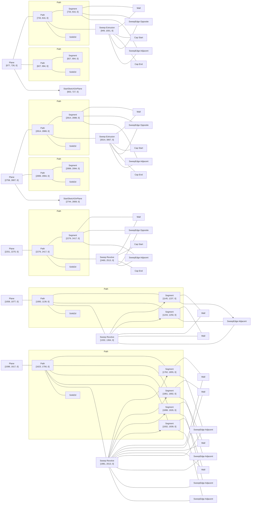

```mermaid
flowchart LR
  subgraph path2 [Path]
    2["Path<br>[733, 816, 0]"]
    3["Segment<br>[733, 816, 0]"]
    4[Solid2d]
  end
  subgraph path5 [Path]
    5["Path<br>[827, 894, 0]"]
    6["Segment<br>[827, 894, 0]"]
    7[Solid2d]
  end
  subgraph path15 [Path]
    15["Path<br>[1083, 1139, 0]"]
    16["Segment<br>[1145, 1237, 0]"]
    17["Segment<br>[1243, 1250, 0]"]
    18[Solid2d]
  end
  subgraph path24 [Path]
    24["Path<br>[1623, 1756, 0]"]
    25["Segment<br>[1762, 1855, 0]"]
    26["Segment<br>[1861, 1892, 0]"]
    27["Segment<br>[1898, 1926, 0]"]
    28["Segment<br>[1932, 1939, 0]"]
    29[Solid2d]
  end
  subgraph path40 [Path]
    40["Path<br>[2276, 2417, 0]"]
    41["Segment<br>[2276, 2417, 0]"]
    42[Solid2d]
  end
  subgraph path50 [Path]
    50["Path<br>[2814, 2888, 0]"]
    51["Segment<br>[2814, 2888, 0]"]
    52[Solid2d]
  end
  subgraph path53 [Path]
    53["Path<br>[2899, 2994, 0]"]
    54["Segment<br>[2899, 2994, 0]"]
    55[Solid2d]
  end
  1["Plane<br>[677, 726, 0]"]
  8["Sweep Extrusion<br>[949, 1001, 0]"]
  9[Wall]
  10["Cap Start"]
  11["Cap End"]
  12["SweepEdge Opposite"]
  13["SweepEdge Adjacent"]
  14["Plane<br>[1058, 1077, 0]"]
  19["Sweep Revolve<br>[1332, 1364, 0]"]
  20[Wall]
  21[Wall]
  22["SweepEdge Adjacent"]
  23["Plane<br>[1598, 1617, 0]"]
  30["Sweep Revolve<br>[1981, 2013, 0]"]
  31[Wall]
  32[Wall]
  33[Wall]
  34[Wall]
  35["SweepEdge Adjacent"]
  36["SweepEdge Adjacent"]
  37["SweepEdge Adjacent"]
  38["SweepEdge Adjacent"]
  39["Plane<br>[2251, 2270, 0]"]
  43["Sweep Revolve<br>[2460, 2513, 0]"]
  44[Wall]
  45["Cap Start"]
  46["Cap End"]
  47["SweepEdge Opposite"]
  48["SweepEdge Adjacent"]
  49["Plane<br>[2758, 2807, 0]"]
  56["Sweep Extrusion<br>[3014, 3067, 0]"]
  57[Wall]
  58["Cap Start"]
  59["Cap End"]
  60["SweepEdge Opposite"]
  61["SweepEdge Adjacent"]
  62["StartSketchOnPlane<br>[663, 727, 0]"]
  63["StartSketchOnPlane<br>[2744, 2808, 0]"]
  1 --- 2
  1 --- 5
  2 --- 3
  2 ---- 8
  2 --- 4
  3 --- 9
  3 --- 12
  3 --- 13
  5 --- 6
  5 --- 7
  8 --- 9
  8 --- 10
  8 --- 11
  8 --- 12
  8 --- 13
  14 --- 15
  15 --- 16
  15 --- 17
  15 ---- 19
  15 --- 18
  16 --- 20
  16 x--> 22
  17 --- 21
  17 --- 22
  19 --- 20
  19 --- 21
  19 <--x 16
  19 --- 22
  19 <--x 17
  23 --- 24
  24 --- 25
  24 --- 26
  24 --- 27
  24 --- 28
  24 ---- 30
  24 --- 29
  25 --- 31
  25 --- 35
  26 --- 32
  26 --- 36
  27 --- 33
  27 --- 37
  28 --- 34
  28 --- 38
  30 --- 31
  30 --- 32
  30 --- 33
  30 --- 34
  30 <--x 25
  30 --- 35
  30 <--x 26
  30 --- 36
  30 <--x 27
  30 --- 37
  30 <--x 28
  30 --- 38
  39 --- 40
  40 --- 41
  40 ---- 43
  40 --- 42
  41 --- 44
  41 --- 47
  41 --- 48
  43 --- 44
  43 --- 45
  43 --- 46
  43 --- 47
  43 --- 48
  49 --- 50
  49 --- 53
  50 --- 51
  50 ---- 56
  50 --- 52
  51 --- 57
  51 --- 60
  51 --- 61
  53 --- 54
  53 --- 55
  56 --- 57
  56 --- 58
  56 --- 59
  56 --- 60
  56 --- 61
  1 <--x 62
  49 <--x 63
```
