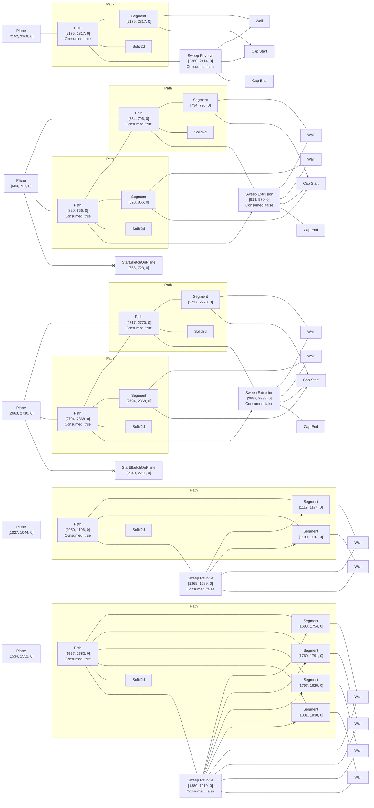

```mermaid
flowchart LR
  subgraph path2 [Path]
    2["Path<br>[734, 796, 0]<br>Consumed: true"]
      %% [ProgramBodyItem { index: 10 }, VariableDeclarationDeclaration, VariableDeclarationInit, PipeBodyItem { index: 1 }]
    3["Segment<br>[734, 796, 0]"]
      %% [ProgramBodyItem { index: 10 }, VariableDeclarationDeclaration, VariableDeclarationInit, PipeBodyItem { index: 1 }]
    4[Solid2d]
  end
  subgraph path5 [Path]
    5["Path<br>[820, 866, 0]<br>Consumed: true"]
      %% [ProgramBodyItem { index: 10 }, VariableDeclarationDeclaration, VariableDeclarationInit, PipeBodyItem { index: 2 }, CallKwArg { index: 0 }]
    6["Segment<br>[820, 866, 0]"]
      %% [ProgramBodyItem { index: 10 }, VariableDeclarationDeclaration, VariableDeclarationInit, PipeBodyItem { index: 2 }, CallKwArg { index: 0 }]
    7[Solid2d]
  end
  subgraph path14 [Path]
    14["Path<br>[1050, 1106, 0]<br>Consumed: true"]
      %% [ProgramBodyItem { index: 12 }, VariableDeclarationDeclaration, VariableDeclarationInit, PipeBodyItem { index: 1 }]
    15["Segment<br>[1112, 1174, 0]"]
      %% [ProgramBodyItem { index: 12 }, VariableDeclarationDeclaration, VariableDeclarationInit, PipeBodyItem { index: 2 }]
    16["Segment<br>[1180, 1187, 0]"]
      %% [ProgramBodyItem { index: 12 }, VariableDeclarationDeclaration, VariableDeclarationInit, PipeBodyItem { index: 3 }]
    17[Solid2d]
  end
  subgraph path22 [Path]
    22["Path<br>[1557, 1682, 0]<br>Consumed: true"]
      %% [ProgramBodyItem { index: 14 }, VariableDeclarationDeclaration, VariableDeclarationInit, PipeBodyItem { index: 1 }]
    23["Segment<br>[1688, 1754, 0]"]
      %% [ProgramBodyItem { index: 14 }, VariableDeclarationDeclaration, VariableDeclarationInit, PipeBodyItem { index: 2 }]
    24["Segment<br>[1760, 1791, 0]"]
      %% [ProgramBodyItem { index: 14 }, VariableDeclarationDeclaration, VariableDeclarationInit, PipeBodyItem { index: 3 }]
    25["Segment<br>[1797, 1825, 0]"]
      %% [ProgramBodyItem { index: 14 }, VariableDeclarationDeclaration, VariableDeclarationInit, PipeBodyItem { index: 4 }]
    26["Segment<br>[1831, 1838, 0]"]
      %% [ProgramBodyItem { index: 14 }, VariableDeclarationDeclaration, VariableDeclarationInit, PipeBodyItem { index: 5 }]
    27[Solid2d]
  end
  subgraph path34 [Path]
    34["Path<br>[2175, 2317, 0]<br>Consumed: true"]
      %% [ProgramBodyItem { index: 16 }, VariableDeclarationDeclaration, VariableDeclarationInit, PipeBodyItem { index: 1 }]
    35["Segment<br>[2175, 2317, 0]"]
      %% [ProgramBodyItem { index: 16 }, VariableDeclarationDeclaration, VariableDeclarationInit, PipeBodyItem { index: 1 }]
    36[Solid2d]
  end
  subgraph path42 [Path]
    42["Path<br>[2717, 2770, 0]<br>Consumed: true"]
      %% [ProgramBodyItem { index: 18 }, VariableDeclarationDeclaration, VariableDeclarationInit, PipeBodyItem { index: 1 }]
    43["Segment<br>[2717, 2770, 0]"]
      %% [ProgramBodyItem { index: 18 }, VariableDeclarationDeclaration, VariableDeclarationInit, PipeBodyItem { index: 1 }]
    44[Solid2d]
  end
  subgraph path45 [Path]
    45["Path<br>[2794, 2868, 0]<br>Consumed: true"]
      %% [ProgramBodyItem { index: 18 }, VariableDeclarationDeclaration, VariableDeclarationInit, PipeBodyItem { index: 2 }, CallKwArg { index: 0 }]
    46["Segment<br>[2794, 2868, 0]"]
      %% [ProgramBodyItem { index: 18 }, VariableDeclarationDeclaration, VariableDeclarationInit, PipeBodyItem { index: 2 }, CallKwArg { index: 0 }]
    47[Solid2d]
  end
  1["Plane<br>[680, 727, 0]"]
    %% [ProgramBodyItem { index: 10 }, VariableDeclarationDeclaration, VariableDeclarationInit, PipeBodyItem { index: 0 }, CallKwUnlabeledArg]
  8["Sweep Extrusion<br>[918, 970, 0]<br>Consumed: false"]
    %% [ProgramBodyItem { index: 11 }, VariableDeclarationDeclaration, VariableDeclarationInit]
  9[Wall]
    %% face_code_ref=Missing NodePath
  10[Wall]
    %% face_code_ref=Missing NodePath
  11["Cap Start"]
    %% face_code_ref=Missing NodePath
  12["Cap End"]
    %% face_code_ref=Missing NodePath
  13["Plane<br>[1027, 1044, 0]"]
    %% [ProgramBodyItem { index: 12 }, VariableDeclarationDeclaration, VariableDeclarationInit, PipeBodyItem { index: 0 }]
  18["Sweep Revolve<br>[1269, 1299, 0]<br>Consumed: false"]
    %% [ProgramBodyItem { index: 13 }, VariableDeclarationDeclaration, VariableDeclarationInit, PipeBodyItem { index: 0 }]
  19[Wall]
    %% face_code_ref=Missing NodePath
  20[Wall]
    %% face_code_ref=Missing NodePath
  21["Plane<br>[1534, 1551, 0]"]
    %% [ProgramBodyItem { index: 14 }, VariableDeclarationDeclaration, VariableDeclarationInit, PipeBodyItem { index: 0 }]
  28["Sweep Revolve<br>[1880, 1910, 0]<br>Consumed: false"]
    %% [ProgramBodyItem { index: 15 }, VariableDeclarationDeclaration, VariableDeclarationInit, PipeBodyItem { index: 0 }]
  29[Wall]
    %% face_code_ref=Missing NodePath
  30[Wall]
    %% face_code_ref=Missing NodePath
  31[Wall]
    %% face_code_ref=Missing NodePath
  32[Wall]
    %% face_code_ref=Missing NodePath
  33["Plane<br>[2152, 2169, 0]"]
    %% [ProgramBodyItem { index: 16 }, VariableDeclarationDeclaration, VariableDeclarationInit, PipeBodyItem { index: 0 }]
  37["Sweep Revolve<br>[2360, 2414, 0]<br>Consumed: false"]
    %% [ProgramBodyItem { index: 17 }, VariableDeclarationDeclaration, VariableDeclarationInit, PipeBodyItem { index: 0 }]
  38[Wall]
    %% face_code_ref=Missing NodePath
  39["Cap Start"]
    %% face_code_ref=Missing NodePath
  40["Cap End"]
    %% face_code_ref=Missing NodePath
  41["Plane<br>[2663, 2710, 0]"]
    %% [ProgramBodyItem { index: 18 }, VariableDeclarationDeclaration, VariableDeclarationInit, PipeBodyItem { index: 0 }, CallKwUnlabeledArg]
  48["Sweep Extrusion<br>[2885, 2938, 0]<br>Consumed: false"]
    %% [ProgramBodyItem { index: 19 }, VariableDeclarationDeclaration, VariableDeclarationInit]
  49[Wall]
    %% face_code_ref=Missing NodePath
  50[Wall]
    %% face_code_ref=Missing NodePath
  51["Cap Start"]
    %% face_code_ref=Missing NodePath
  52["Cap End"]
    %% face_code_ref=Missing NodePath
  53["StartSketchOnPlane<br>[666, 728, 0]"]
    %% [ProgramBodyItem { index: 10 }, VariableDeclarationDeclaration, VariableDeclarationInit, PipeBodyItem { index: 0 }]
  54["StartSketchOnPlane<br>[2649, 2711, 0]"]
    %% [ProgramBodyItem { index: 18 }, VariableDeclarationDeclaration, VariableDeclarationInit, PipeBodyItem { index: 0 }]
  1 --- 2
  1 --- 5
  1 <--x 53
  2 --- 3
  2 --- 4
  5 --- 2
  2 ---- 8
  3 --- 9
  3 x--> 11
  5 --- 6
  5 --- 7
  5 x---> 8
  6 --- 10
  6 x--> 11
  8 --- 9
  8 --- 10
  8 --- 11
  8 --- 12
  13 --- 14
  14 --- 15
  14 --- 16
  14 --- 17
  14 ---- 18
  18 <--x 15
  15 --- 19
  18 <--x 16
  16 --- 20
  18 --- 19
  18 --- 20
  21 --- 22
  22 --- 23
  22 --- 24
  22 --- 25
  22 --- 26
  22 --- 27
  22 ---- 28
  28 <--x 23
  23 --- 29
  28 <--x 24
  24 --- 30
  28 <--x 25
  25 --- 31
  28 <--x 26
  26 --- 32
  28 --- 29
  28 --- 30
  28 --- 31
  28 --- 32
  33 --- 34
  34 --- 35
  34 --- 36
  34 ---- 37
  35 --- 38
  35 x--> 39
  37 --- 38
  37 --- 39
  37 --- 40
  41 --- 42
  41 --- 45
  41 <--x 54
  42 --- 43
  42 --- 44
  45 --- 42
  42 ---- 48
  43 --- 49
  43 x--> 51
  45 --- 46
  45 --- 47
  45 x---> 48
  46 --- 50
  46 x--> 51
  48 --- 49
  48 --- 50
  48 --- 51
  48 --- 52
```
