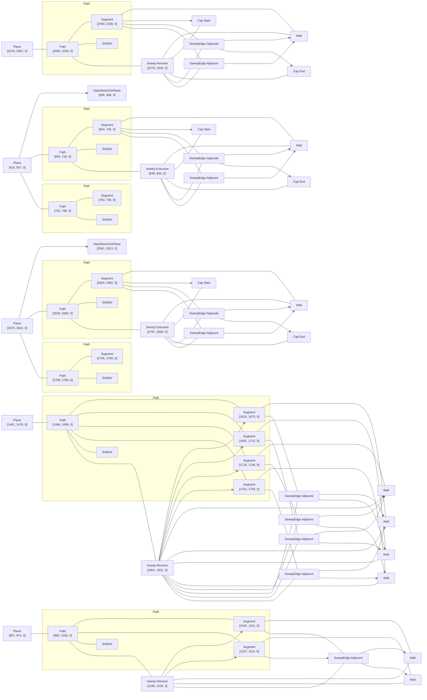

```mermaid
flowchart LR
  subgraph path8 [Path]
    8["Path<br>[664, 726, 0]"]
    15["Segment<br>[664, 726, 0]"]
    30[Solid2d]
  end
  subgraph path9 [Path]
    9["Path<br>[750, 796, 0]"]
    16["Segment<br>[750, 796, 0]"]
    32[Solid2d]
  end
  subgraph path10 [Path]
    10["Path<br>[980, 1036, 0]"]
    17["Segment<br>[1042, 1101, 0]"]
    18["Segment<br>[1107, 1114, 0]"]
    28[Solid2d]
  end
  subgraph path11 [Path]
    11["Path<br>[1484, 1609, 0]"]
    19["Segment<br>[1615, 1675, 0]"]
    20["Segment<br>[1681, 1712, 0]"]
    21["Segment<br>[1718, 1746, 0]"]
    22["Segment<br>[1752, 1759, 0]"]
    29[Solid2d]
  end
  subgraph path12 [Path]
    12["Path<br>[2093, 2235, 0]"]
    23["Segment<br>[2093, 2235, 0]"]
    27[Solid2d]
  end
  subgraph path13 [Path]
    13["Path<br>[2629, 2682, 0]"]
    24["Segment<br>[2629, 2682, 0]"]
    31[Solid2d]
  end
  subgraph path14 [Path]
    14["Path<br>[2706, 2780, 0]"]
    25["Segment<br>[2706, 2780, 0]"]
    26[Solid2d]
  end
  1["Plane<br>[610, 657, 0]"]
  2["Plane<br>[957, 974, 0]"]
  3["Plane<br>[1461, 1478, 0]"]
  4["Plane<br>[2070, 2087, 0]"]
  5["Plane<br>[2575, 2622, 0]"]
  6["StartSketchOnPlane<br>[596, 658, 0]"]
  7["StartSketchOnPlane<br>[2561, 2623, 0]"]
  33["Sweep Extrusion<br>[848, 900, 0]"]
  34["Sweep Revolve<br>[1196, 1226, 0]"]
  35["Sweep Revolve<br>[1801, 1831, 0]"]
  36["Sweep Revolve<br>[2278, 2329, 0]"]
  37["Sweep Extrusion<br>[2797, 2850, 0]"]
  38[Wall]
  39[Wall]
  40[Wall]
  41[Wall]
  42[Wall]
  43[Wall]
  44[Wall]
  45[Wall]
  46[Wall]
  47["Cap Start"]
  48["Cap End"]
  49["Cap Start"]
  50["Cap End"]
  51["Cap Start"]
  52["Cap End"]
  53["SweepEdge Opposite"]
  54["SweepEdge Adjacent"]
  55["SweepEdge Opposite"]
  56["SweepEdge Adjacent"]
  57["SweepEdge Opposite"]
  58["SweepEdge Adjacent"]
  59["SweepEdge Adjacent"]
  60["SweepEdge Adjacent"]
  61["SweepEdge Adjacent"]
  62["SweepEdge Adjacent"]
  63["SweepEdge Adjacent"]
  1 <--x 6
  1 --- 8
  1 --- 9
  2 --- 10
  3 --- 11
  4 --- 12
  5 <--x 7
  5 --- 13
  5 --- 14
  8 --- 15
  8 --- 30
  8 ---- 33
  9 --- 16
  9 --- 32
  10 --- 17
  10 --- 18
  10 --- 28
  10 ---- 34
  11 --- 19
  11 --- 20
  11 --- 21
  11 --- 22
  11 --- 29
  11 ---- 35
  12 --- 23
  12 --- 27
  12 ---- 36
  13 --- 24
  13 --- 31
  13 ---- 37
  14 --- 25
  14 --- 26
  15 --- 39
  15 x--> 49
  15 --- 55
  15 --- 56
  34 <--x 17
  17 --- 45
  17 --- 63
  34 <--x 18
  18 --- 46
  18 x--> 63
  35 <--x 19
  19 --- 42
  19 --- 60
  35 <--x 20
  20 --- 43
  20 --- 61
  35 <--x 21
  21 --- 41
  21 --- 59
  35 <--x 22
  22 --- 44
  22 --- 62
  23 --- 38
  23 x--> 47
  23 --- 53
  23 --- 54
  24 --- 40
  24 x--> 51
  24 --- 57
  24 --- 58
  33 --- 39
  33 --- 49
  33 --- 50
  33 --- 55
  33 --- 56
  34 --- 45
  34 --- 46
  34 --- 63
  35 --- 41
  35 --- 42
  35 --- 43
  35 --- 44
  35 --- 59
  35 --- 60
  35 --- 61
  35 --- 62
  36 --- 38
  36 --- 47
  36 --- 48
  36 --- 53
  36 --- 54
  37 --- 40
  37 --- 51
  37 --- 52
  37 --- 57
  37 --- 58
  53 <--x 38
  54 <--x 38
  55 <--x 39
  56 <--x 39
  57 <--x 40
  58 <--x 40
  59 <--x 41
  61 <--x 41
  60 <--x 42
  62 <--x 42
  60 <--x 43
  61 <--x 43
  59 <--x 44
  62 <--x 44
  63 <--x 45
  63 <--x 46
  53 <--x 48
  55 <--x 50
  57 <--x 52
```
