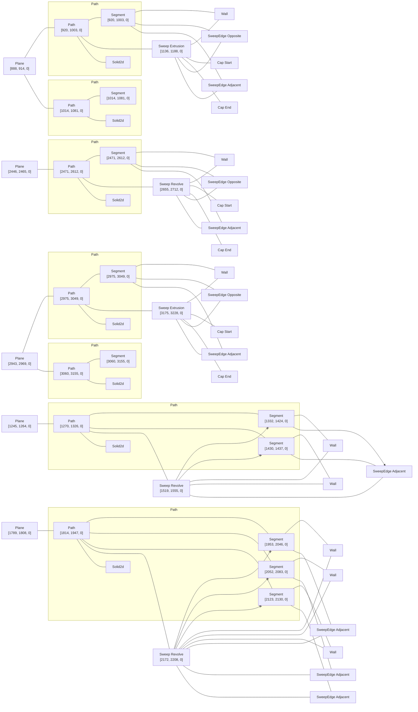

```mermaid
flowchart LR
  subgraph path2 [Path]
    2["Path<br>[920, 1003, 0]"]
    3["Segment<br>[920, 1003, 0]"]
    4[Solid2d]
  end
  subgraph path5 [Path]
    5["Path<br>[1014, 1081, 0]"]
    6["Segment<br>[1014, 1081, 0]"]
    7[Solid2d]
  end
  subgraph path15 [Path]
    15["Path<br>[1270, 1326, 0]"]
    16["Segment<br>[1332, 1424, 0]"]
    17["Segment<br>[1430, 1437, 0]"]
    18[Solid2d]
  end
  subgraph path24 [Path]
    24["Path<br>[1814, 1947, 0]"]
    25["Segment<br>[1953, 2046, 0]"]
    26["Segment<br>[2052, 2083, 0]"]
    27["Segment<br>[2123, 2130, 0]"]
    28[Solid2d]
  end
  subgraph path37 [Path]
    37["Path<br>[2471, 2612, 0]"]
    38["Segment<br>[2471, 2612, 0]"]
    39[Solid2d]
  end
  subgraph path47 [Path]
    47["Path<br>[2975, 3049, 0]"]
    48["Segment<br>[2975, 3049, 0]"]
    49[Solid2d]
  end
  subgraph path50 [Path]
    50["Path<br>[3060, 3155, 0]"]
    51["Segment<br>[3060, 3155, 0]"]
    52[Solid2d]
  end
  1["Plane<br>[888, 914, 0]"]
  8["Sweep Extrusion<br>[1136, 1188, 0]"]
  9[Wall]
  10["Cap Start"]
  11["Cap End"]
  12["SweepEdge Opposite"]
  13["SweepEdge Adjacent"]
  14["Plane<br>[1245, 1264, 0]"]
  19["Sweep Revolve<br>[1519, 1555, 0]"]
  20[Wall]
  21[Wall]
  22["SweepEdge Adjacent"]
  23["Plane<br>[1789, 1808, 0]"]
  29["Sweep Revolve<br>[2172, 2208, 0]"]
  30[Wall]
  31[Wall]
  32[Wall]
  33["SweepEdge Adjacent"]
  34["SweepEdge Adjacent"]
  35["SweepEdge Adjacent"]
  36["Plane<br>[2446, 2465, 0]"]
  40["Sweep Revolve<br>[2655, 2712, 0]"]
  41[Wall]
  42["Cap Start"]
  43["Cap End"]
  44["SweepEdge Opposite"]
  45["SweepEdge Adjacent"]
  46["Plane<br>[2943, 2969, 0]"]
  53["Sweep Extrusion<br>[3175, 3228, 0]"]
  54[Wall]
  55["Cap Start"]
  56["Cap End"]
  57["SweepEdge Opposite"]
  58["SweepEdge Adjacent"]
  1 --- 2
  1 --- 5
  2 --- 3
  2 ---- 8
  2 --- 4
  3 --- 9
  3 --- 12
  3 --- 13
  5 --- 6
  5 --- 7
  8 --- 9
  8 --- 10
  8 --- 11
  8 --- 12
  8 --- 13
  14 --- 15
  15 --- 16
  15 --- 17
  15 ---- 19
  15 --- 18
  16 --- 20
  16 x--> 22
  17 --- 21
  17 --- 22
  19 --- 20
  19 --- 21
  19 <--x 16
  19 --- 22
  19 <--x 17
  23 --- 24
  24 --- 25
  24 --- 26
  24 --- 27
  24 ---- 29
  24 --- 28
  25 --- 30
  25 --- 33
  26 --- 31
  26 --- 34
  27 --- 32
  27 --- 35
  29 --- 30
  29 --- 31
  29 --- 32
  29 <--x 25
  29 --- 33
  29 <--x 26
  29 --- 34
  29 <--x 27
  29 --- 35
  36 --- 37
  37 --- 38
  37 ---- 40
  37 --- 39
  38 --- 41
  38 --- 44
  38 --- 45
  40 --- 41
  40 --- 42
  40 --- 43
  40 --- 44
  40 --- 45
  46 --- 47
  46 --- 50
  47 --- 48
  47 ---- 53
  47 --- 49
  48 --- 54
  48 --- 57
  48 --- 58
  50 --- 51
  50 --- 52
  53 --- 54
  53 --- 55
  53 --- 56
  53 --- 57
  53 --- 58
```
