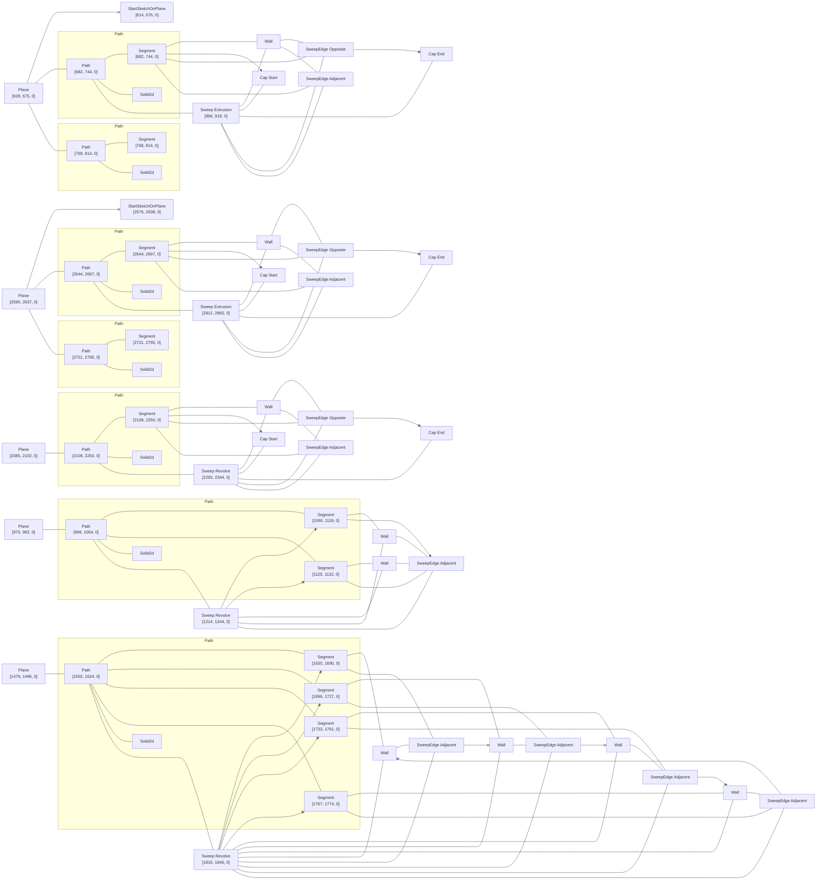

```mermaid
flowchart LR
  subgraph path8 [Path]
    8["Path<br>[682, 744, 0]"]
      %% [ProgramBodyItem { index: 10 }, VariableDeclarationDeclaration, VariableDeclarationInit, PipeBodyItem { index: 1 }]
    15["Segment<br>[682, 744, 0]"]
      %% [ProgramBodyItem { index: 10 }, VariableDeclarationDeclaration, VariableDeclarationInit, PipeBodyItem { index: 1 }]
    32[Solid2d]
  end
  subgraph path9 [Path]
    9["Path<br>[768, 814, 0]"]
      %% [ProgramBodyItem { index: 10 }, VariableDeclarationDeclaration, VariableDeclarationInit, PipeBodyItem { index: 2 }, CallKwArg { index: 0 }]
    16["Segment<br>[768, 814, 0]"]
      %% [ProgramBodyItem { index: 10 }, VariableDeclarationDeclaration, VariableDeclarationInit, PipeBodyItem { index: 2 }, CallKwArg { index: 0 }]
    31[Solid2d]
  end
  subgraph path10 [Path]
    10["Path<br>[998, 1054, 0]"]
      %% [ProgramBodyItem { index: 12 }, VariableDeclarationDeclaration, VariableDeclarationInit, PipeBodyItem { index: 1 }]
    17["Segment<br>[1060, 1119, 0]"]
      %% [ProgramBodyItem { index: 12 }, VariableDeclarationDeclaration, VariableDeclarationInit, PipeBodyItem { index: 2 }]
    18["Segment<br>[1125, 1132, 0]"]
      %% [ProgramBodyItem { index: 12 }, VariableDeclarationDeclaration, VariableDeclarationInit, PipeBodyItem { index: 3 }]
    29[Solid2d]
  end
  subgraph path11 [Path]
    11["Path<br>[1502, 1624, 0]"]
      %% [ProgramBodyItem { index: 14 }, VariableDeclarationDeclaration, VariableDeclarationInit, PipeBodyItem { index: 1 }]
    19["Segment<br>[1630, 1690, 0]"]
      %% [ProgramBodyItem { index: 14 }, VariableDeclarationDeclaration, VariableDeclarationInit, PipeBodyItem { index: 2 }]
    20["Segment<br>[1696, 1727, 0]"]
      %% [ProgramBodyItem { index: 14 }, VariableDeclarationDeclaration, VariableDeclarationInit, PipeBodyItem { index: 3 }]
    21["Segment<br>[1733, 1761, 0]"]
      %% [ProgramBodyItem { index: 14 }, VariableDeclarationDeclaration, VariableDeclarationInit, PipeBodyItem { index: 4 }]
    22["Segment<br>[1767, 1774, 0]"]
      %% [ProgramBodyItem { index: 14 }, VariableDeclarationDeclaration, VariableDeclarationInit, PipeBodyItem { index: 5 }]
    27[Solid2d]
  end
  subgraph path12 [Path]
    12["Path<br>[2108, 2250, 0]"]
      %% [ProgramBodyItem { index: 16 }, VariableDeclarationDeclaration, VariableDeclarationInit, PipeBodyItem { index: 1 }]
    23["Segment<br>[2108, 2250, 0]"]
      %% [ProgramBodyItem { index: 16 }, VariableDeclarationDeclaration, VariableDeclarationInit, PipeBodyItem { index: 1 }]
    28[Solid2d]
  end
  subgraph path13 [Path]
    13["Path<br>[2644, 2697, 0]"]
      %% [ProgramBodyItem { index: 18 }, VariableDeclarationDeclaration, VariableDeclarationInit, PipeBodyItem { index: 1 }]
    24["Segment<br>[2644, 2697, 0]"]
      %% [ProgramBodyItem { index: 18 }, VariableDeclarationDeclaration, VariableDeclarationInit, PipeBodyItem { index: 1 }]
    30[Solid2d]
  end
  subgraph path14 [Path]
    14["Path<br>[2721, 2795, 0]"]
      %% [ProgramBodyItem { index: 18 }, VariableDeclarationDeclaration, VariableDeclarationInit, PipeBodyItem { index: 2 }, CallKwArg { index: 0 }]
    25["Segment<br>[2721, 2795, 0]"]
      %% [ProgramBodyItem { index: 18 }, VariableDeclarationDeclaration, VariableDeclarationInit, PipeBodyItem { index: 2 }, CallKwArg { index: 0 }]
    26[Solid2d]
  end
  1["Plane<br>[628, 675, 0]"]
    %% [ProgramBodyItem { index: 10 }, VariableDeclarationDeclaration, VariableDeclarationInit, PipeBodyItem { index: 0 }, CallKwUnlabeledArg]
  2["Plane<br>[975, 992, 0]"]
    %% [ProgramBodyItem { index: 12 }, VariableDeclarationDeclaration, VariableDeclarationInit, PipeBodyItem { index: 0 }]
  3["Plane<br>[1479, 1496, 0]"]
    %% [ProgramBodyItem { index: 14 }, VariableDeclarationDeclaration, VariableDeclarationInit, PipeBodyItem { index: 0 }]
  4["Plane<br>[2085, 2102, 0]"]
    %% [ProgramBodyItem { index: 16 }, VariableDeclarationDeclaration, VariableDeclarationInit, PipeBodyItem { index: 0 }]
  5["Plane<br>[2590, 2637, 0]"]
    %% [ProgramBodyItem { index: 18 }, VariableDeclarationDeclaration, VariableDeclarationInit, PipeBodyItem { index: 0 }, CallKwUnlabeledArg]
  6["StartSketchOnPlane<br>[614, 676, 0]"]
    %% [ProgramBodyItem { index: 10 }, VariableDeclarationDeclaration, VariableDeclarationInit, PipeBodyItem { index: 0 }]
  7["StartSketchOnPlane<br>[2576, 2638, 0]"]
    %% [ProgramBodyItem { index: 18 }, VariableDeclarationDeclaration, VariableDeclarationInit, PipeBodyItem { index: 0 }]
  33["Sweep Extrusion<br>[866, 918, 0]"]
    %% [ProgramBodyItem { index: 11 }, VariableDeclarationDeclaration, VariableDeclarationInit]
  34["Sweep Revolve<br>[1214, 1244, 0]"]
    %% [ProgramBodyItem { index: 13 }, VariableDeclarationDeclaration, VariableDeclarationInit, PipeBodyItem { index: 0 }]
  35["Sweep Revolve<br>[1816, 1846, 0]"]
    %% [ProgramBodyItem { index: 15 }, VariableDeclarationDeclaration, VariableDeclarationInit, PipeBodyItem { index: 0 }]
  36["Sweep Revolve<br>[2293, 2344, 0]"]
    %% [ProgramBodyItem { index: 17 }, VariableDeclarationDeclaration, VariableDeclarationInit, PipeBodyItem { index: 0 }]
  37["Sweep Extrusion<br>[2812, 2865, 0]"]
    %% [ProgramBodyItem { index: 19 }, VariableDeclarationDeclaration, VariableDeclarationInit]
  38[Wall]
    %% face_code_ref=Missing NodePath
  39[Wall]
    %% face_code_ref=Missing NodePath
  40[Wall]
    %% face_code_ref=Missing NodePath
  41[Wall]
    %% face_code_ref=Missing NodePath
  42[Wall]
    %% face_code_ref=Missing NodePath
  43[Wall]
    %% face_code_ref=Missing NodePath
  44[Wall]
    %% face_code_ref=Missing NodePath
  45[Wall]
    %% face_code_ref=Missing NodePath
  46[Wall]
    %% face_code_ref=Missing NodePath
  47["Cap Start"]
    %% face_code_ref=Missing NodePath
  48["Cap Start"]
    %% face_code_ref=Missing NodePath
  49["Cap Start"]
    %% face_code_ref=Missing NodePath
  50["Cap End"]
    %% face_code_ref=Missing NodePath
  51["Cap End"]
    %% face_code_ref=Missing NodePath
  52["Cap End"]
    %% face_code_ref=Missing NodePath
  53["SweepEdge Opposite"]
  54["SweepEdge Opposite"]
  55["SweepEdge Opposite"]
  56["SweepEdge Adjacent"]
  57["SweepEdge Adjacent"]
  58["SweepEdge Adjacent"]
  59["SweepEdge Adjacent"]
  60["SweepEdge Adjacent"]
  61["SweepEdge Adjacent"]
  62["SweepEdge Adjacent"]
  63["SweepEdge Adjacent"]
  1 <--x 6
  1 --- 8
  1 --- 9
  2 --- 10
  3 --- 11
  4 --- 12
  5 <--x 7
  5 --- 13
  5 --- 14
  8 --- 15
  8 --- 32
  8 ---- 33
  9 --- 16
  9 --- 31
  10 --- 17
  10 --- 18
  10 --- 29
  10 ---- 34
  11 --- 19
  11 --- 20
  11 --- 21
  11 --- 22
  11 --- 27
  11 ---- 35
  12 --- 23
  12 --- 28
  12 ---- 36
  13 --- 24
  13 --- 30
  13 ---- 37
  14 --- 25
  14 --- 26
  15 --- 41
  15 x--> 47
  15 --- 54
  15 --- 58
  34 <--x 17
  17 --- 40
  17 x--> 57
  34 <--x 18
  18 --- 39
  18 --- 57
  35 <--x 19
  19 --- 45
  19 --- 59
  35 <--x 20
  20 --- 43
  20 --- 60
  35 <--x 21
  21 --- 42
  21 --- 61
  35 <--x 22
  22 --- 44
  22 --- 62
  23 --- 38
  23 x--> 49
  23 --- 53
  23 --- 56
  24 --- 46
  24 x--> 48
  24 --- 55
  24 --- 63
  33 --- 41
  33 --- 47
  33 --- 50
  33 --- 54
  33 --- 58
  34 --- 39
  34 --- 40
  34 --- 57
  35 --- 42
  35 --- 43
  35 --- 44
  35 --- 45
  35 --- 59
  35 --- 60
  35 --- 61
  35 --- 62
  36 --- 38
  36 --- 49
  36 --- 52
  36 --- 53
  36 --- 56
  37 --- 46
  37 --- 48
  37 --- 51
  37 --- 55
  37 --- 63
  38 --- 53
  38 --- 56
  39 --- 57
  40 --- 57
  41 --- 54
  41 --- 58
  60 <--x 42
  42 --- 61
  59 <--x 43
  43 --- 60
  61 <--x 44
  44 --- 62
  45 --- 59
  62 <--x 45
  46 --- 55
  46 --- 63
  54 <--x 50
  55 <--x 51
  53 <--x 52
```
