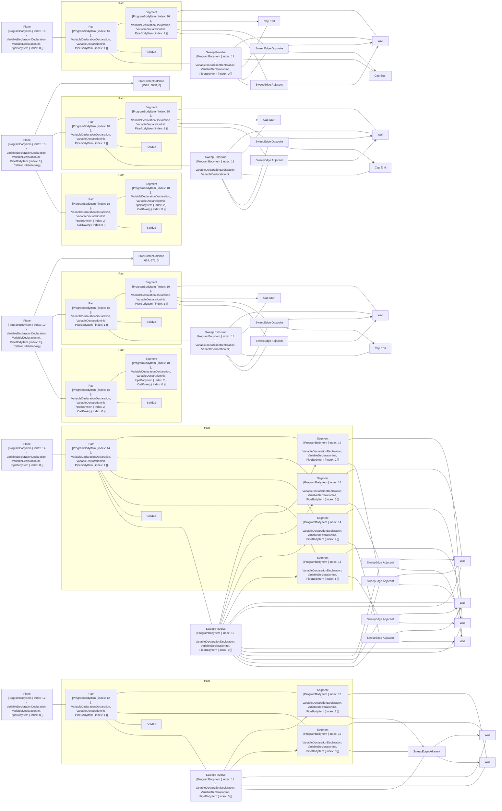

```mermaid
flowchart LR
  subgraph path8 [Path]
    8["Path<br>[ProgramBodyItem { index: 10 }, VariableDeclarationDeclaration, VariableDeclarationInit, PipeBodyItem { index: 1 }]"]
    15["Segment<br>[ProgramBodyItem { index: 10 }, VariableDeclarationDeclaration, VariableDeclarationInit, PipeBodyItem { index: 1 }]"]
    32[Solid2d]
  end
  subgraph path9 [Path]
    9["Path<br>[ProgramBodyItem { index: 10 }, VariableDeclarationDeclaration, VariableDeclarationInit, PipeBodyItem { index: 2 }, CallKwArg { index: 0 }]"]
    16["Segment<br>[ProgramBodyItem { index: 10 }, VariableDeclarationDeclaration, VariableDeclarationInit, PipeBodyItem { index: 2 }, CallKwArg { index: 0 }]"]
    31[Solid2d]
  end
  subgraph path10 [Path]
    10["Path<br>[ProgramBodyItem { index: 12 }, VariableDeclarationDeclaration, VariableDeclarationInit, PipeBodyItem { index: 1 }]"]
    17["Segment<br>[ProgramBodyItem { index: 12 }, VariableDeclarationDeclaration, VariableDeclarationInit, PipeBodyItem { index: 2 }]"]
    18["Segment<br>[ProgramBodyItem { index: 12 }, VariableDeclarationDeclaration, VariableDeclarationInit, PipeBodyItem { index: 3 }]"]
    30[Solid2d]
  end
  subgraph path11 [Path]
    11["Path<br>[ProgramBodyItem { index: 14 }, VariableDeclarationDeclaration, VariableDeclarationInit, PipeBodyItem { index: 1 }]"]
    19["Segment<br>[ProgramBodyItem { index: 14 }, VariableDeclarationDeclaration, VariableDeclarationInit, PipeBodyItem { index: 2 }]"]
    20["Segment<br>[ProgramBodyItem { index: 14 }, VariableDeclarationDeclaration, VariableDeclarationInit, PipeBodyItem { index: 3 }]"]
    21["Segment<br>[ProgramBodyItem { index: 14 }, VariableDeclarationDeclaration, VariableDeclarationInit, PipeBodyItem { index: 4 }]"]
    22["Segment<br>[ProgramBodyItem { index: 14 }, VariableDeclarationDeclaration, VariableDeclarationInit, PipeBodyItem { index: 5 }]"]
    27[Solid2d]
  end
  subgraph path12 [Path]
    12["Path<br>[ProgramBodyItem { index: 16 }, VariableDeclarationDeclaration, VariableDeclarationInit, PipeBodyItem { index: 1 }]"]
    23["Segment<br>[ProgramBodyItem { index: 16 }, VariableDeclarationDeclaration, VariableDeclarationInit, PipeBodyItem { index: 1 }]"]
    28[Solid2d]
  end
  subgraph path13 [Path]
    13["Path<br>[ProgramBodyItem { index: 18 }, VariableDeclarationDeclaration, VariableDeclarationInit, PipeBodyItem { index: 1 }]"]
    24["Segment<br>[ProgramBodyItem { index: 18 }, VariableDeclarationDeclaration, VariableDeclarationInit, PipeBodyItem { index: 1 }]"]
    26[Solid2d]
  end
  subgraph path14 [Path]
    14["Path<br>[ProgramBodyItem { index: 18 }, VariableDeclarationDeclaration, VariableDeclarationInit, PipeBodyItem { index: 2 }, CallKwArg { index: 0 }]"]
    25["Segment<br>[ProgramBodyItem { index: 18 }, VariableDeclarationDeclaration, VariableDeclarationInit, PipeBodyItem { index: 2 }, CallKwArg { index: 0 }]"]
    29[Solid2d]
  end
  1["Plane<br>[ProgramBodyItem { index: 10 }, VariableDeclarationDeclaration, VariableDeclarationInit, PipeBodyItem { index: 0 }, CallKwUnlabeledArg]"]
  2["Plane<br>[ProgramBodyItem { index: 12 }, VariableDeclarationDeclaration, VariableDeclarationInit, PipeBodyItem { index: 0 }]"]
  3["Plane<br>[ProgramBodyItem { index: 14 }, VariableDeclarationDeclaration, VariableDeclarationInit, PipeBodyItem { index: 0 }]"]
  4["Plane<br>[ProgramBodyItem { index: 16 }, VariableDeclarationDeclaration, VariableDeclarationInit, PipeBodyItem { index: 0 }]"]
  5["Plane<br>[ProgramBodyItem { index: 18 }, VariableDeclarationDeclaration, VariableDeclarationInit, PipeBodyItem { index: 0 }, CallKwUnlabeledArg]"]
  6["StartSketchOnPlane<br>[2576, 2638, 0]"]
  7["StartSketchOnPlane<br>[614, 676, 0]"]
  33["Sweep Extrusion<br>[ProgramBodyItem { index: 11 }, VariableDeclarationDeclaration, VariableDeclarationInit]"]
  34["Sweep Revolve<br>[ProgramBodyItem { index: 13 }, VariableDeclarationDeclaration, VariableDeclarationInit, PipeBodyItem { index: 0 }]"]
  35["Sweep Revolve<br>[ProgramBodyItem { index: 15 }, VariableDeclarationDeclaration, VariableDeclarationInit, PipeBodyItem { index: 0 }]"]
  36["Sweep Revolve<br>[ProgramBodyItem { index: 17 }, VariableDeclarationDeclaration, VariableDeclarationInit, PipeBodyItem { index: 0 }]"]
  37["Sweep Extrusion<br>[ProgramBodyItem { index: 19 }, VariableDeclarationDeclaration, VariableDeclarationInit]"]
  38[Wall]
  39[Wall]
  40[Wall]
  41[Wall]
  42[Wall]
  43[Wall]
  44[Wall]
  45[Wall]
  46[Wall]
  47["Cap Start"]
  48["Cap Start"]
  49["Cap Start"]
  50["Cap End"]
  51["Cap End"]
  52["Cap End"]
  53["SweepEdge Opposite"]
  54["SweepEdge Opposite"]
  55["SweepEdge Opposite"]
  56["SweepEdge Adjacent"]
  57["SweepEdge Adjacent"]
  58["SweepEdge Adjacent"]
  59["SweepEdge Adjacent"]
  60["SweepEdge Adjacent"]
  61["SweepEdge Adjacent"]
  62["SweepEdge Adjacent"]
  63["SweepEdge Adjacent"]
  1 <--x 7
  1 --- 8
  1 --- 9
  2 --- 10
  3 --- 11
  4 --- 12
  5 <--x 6
  5 --- 13
  5 --- 14
  8 --- 15
  8 --- 32
  8 ---- 33
  9 --- 16
  9 --- 31
  10 --- 17
  10 --- 18
  10 --- 30
  10 ---- 34
  11 --- 19
  11 --- 20
  11 --- 21
  11 --- 22
  11 --- 27
  11 ---- 35
  12 --- 23
  12 --- 28
  12 ---- 36
  13 --- 24
  13 --- 26
  13 ---- 37
  14 --- 25
  14 --- 29
  15 --- 46
  15 x--> 47
  15 --- 55
  15 --- 63
  34 <--x 17
  17 --- 45
  17 x--> 62
  34 <--x 18
  18 --- 44
  18 --- 62
  35 <--x 19
  19 --- 43
  19 --- 60
  35 <--x 20
  20 --- 41
  20 --- 58
  35 <--x 21
  21 --- 42
  21 --- 61
  35 <--x 22
  22 --- 40
  22 --- 59
  23 --- 38
  23 x--> 52
  23 --- 53
  23 --- 56
  24 --- 39
  24 x--> 48
  24 --- 54
  24 --- 57
  33 --- 46
  33 --- 47
  33 --- 50
  33 --- 55
  33 --- 63
  34 --- 44
  34 --- 45
  34 --- 62
  35 --- 40
  35 --- 41
  35 --- 42
  35 --- 43
  35 --- 58
  35 --- 59
  35 --- 60
  35 --- 61
  36 --- 38
  36 --- 49
  36 --- 52
  36 --- 53
  36 --- 56
  37 --- 39
  37 --- 48
  37 --- 51
  37 --- 54
  37 --- 57
  53 <--x 38
  56 <--x 38
  54 <--x 39
  57 <--x 39
  59 <--x 40
  61 <--x 40
  58 <--x 41
  60 <--x 41
  58 <--x 42
  61 <--x 42
  59 <--x 43
  60 <--x 43
  62 <--x 44
  62 <--x 45
  55 <--x 46
  63 <--x 46
  53 <--x 49
  55 <--x 50
  54 <--x 51
```
