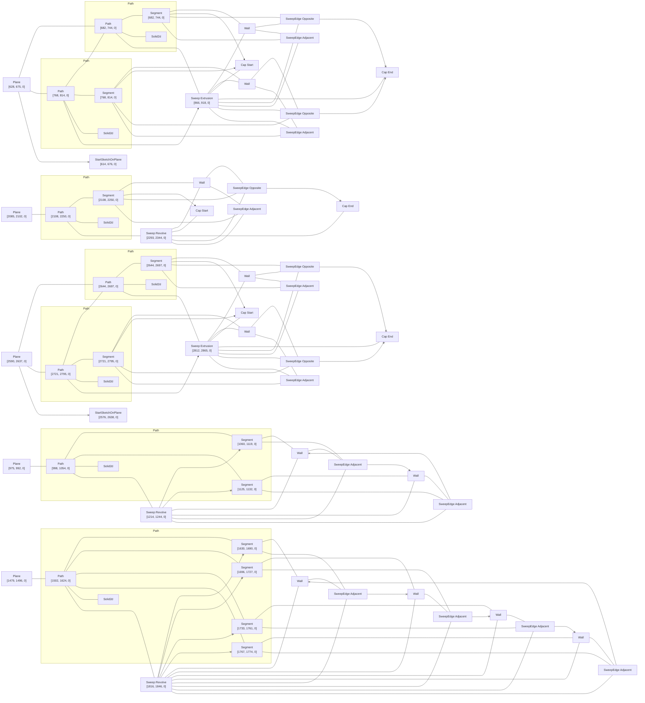

```mermaid
flowchart LR
  subgraph path2 [Path]
    2["Path<br>[682, 744, 0]"]
      %% [ProgramBodyItem { index: 10 }, VariableDeclarationDeclaration, VariableDeclarationInit, PipeBodyItem { index: 1 }]
    3["Segment<br>[682, 744, 0]"]
      %% [ProgramBodyItem { index: 10 }, VariableDeclarationDeclaration, VariableDeclarationInit, PipeBodyItem { index: 1 }]
    4[Solid2d]
  end
  subgraph path5 [Path]
    5["Path<br>[768, 814, 0]"]
      %% [ProgramBodyItem { index: 10 }, VariableDeclarationDeclaration, VariableDeclarationInit, PipeBodyItem { index: 2 }, CallKwArg { index: 0 }]
    6["Segment<br>[768, 814, 0]"]
      %% [ProgramBodyItem { index: 10 }, VariableDeclarationDeclaration, VariableDeclarationInit, PipeBodyItem { index: 2 }, CallKwArg { index: 0 }]
    7[Solid2d]
  end
  subgraph path18 [Path]
    18["Path<br>[998, 1054, 0]"]
      %% [ProgramBodyItem { index: 12 }, VariableDeclarationDeclaration, VariableDeclarationInit, PipeBodyItem { index: 1 }]
    19["Segment<br>[1060, 1119, 0]"]
      %% [ProgramBodyItem { index: 12 }, VariableDeclarationDeclaration, VariableDeclarationInit, PipeBodyItem { index: 2 }]
    20["Segment<br>[1125, 1132, 0]"]
      %% [ProgramBodyItem { index: 12 }, VariableDeclarationDeclaration, VariableDeclarationInit, PipeBodyItem { index: 3 }]
    21[Solid2d]
  end
  subgraph path28 [Path]
    28["Path<br>[1502, 1624, 0]"]
      %% [ProgramBodyItem { index: 14 }, VariableDeclarationDeclaration, VariableDeclarationInit, PipeBodyItem { index: 1 }]
    29["Segment<br>[1630, 1690, 0]"]
      %% [ProgramBodyItem { index: 14 }, VariableDeclarationDeclaration, VariableDeclarationInit, PipeBodyItem { index: 2 }]
    30["Segment<br>[1696, 1727, 0]"]
      %% [ProgramBodyItem { index: 14 }, VariableDeclarationDeclaration, VariableDeclarationInit, PipeBodyItem { index: 3 }]
    31["Segment<br>[1733, 1761, 0]"]
      %% [ProgramBodyItem { index: 14 }, VariableDeclarationDeclaration, VariableDeclarationInit, PipeBodyItem { index: 4 }]
    32["Segment<br>[1767, 1774, 0]"]
      %% [ProgramBodyItem { index: 14 }, VariableDeclarationDeclaration, VariableDeclarationInit, PipeBodyItem { index: 5 }]
    33[Solid2d]
  end
  subgraph path44 [Path]
    44["Path<br>[2108, 2250, 0]"]
      %% [ProgramBodyItem { index: 16 }, VariableDeclarationDeclaration, VariableDeclarationInit, PipeBodyItem { index: 1 }]
    45["Segment<br>[2108, 2250, 0]"]
      %% [ProgramBodyItem { index: 16 }, VariableDeclarationDeclaration, VariableDeclarationInit, PipeBodyItem { index: 1 }]
    46[Solid2d]
  end
  subgraph path54 [Path]
    54["Path<br>[2644, 2697, 0]"]
      %% [ProgramBodyItem { index: 18 }, VariableDeclarationDeclaration, VariableDeclarationInit, PipeBodyItem { index: 1 }]
    55["Segment<br>[2644, 2697, 0]"]
      %% [ProgramBodyItem { index: 18 }, VariableDeclarationDeclaration, VariableDeclarationInit, PipeBodyItem { index: 1 }]
    56[Solid2d]
  end
  subgraph path57 [Path]
    57["Path<br>[2721, 2795, 0]"]
      %% [ProgramBodyItem { index: 18 }, VariableDeclarationDeclaration, VariableDeclarationInit, PipeBodyItem { index: 2 }, CallKwArg { index: 0 }]
    58["Segment<br>[2721, 2795, 0]"]
      %% [ProgramBodyItem { index: 18 }, VariableDeclarationDeclaration, VariableDeclarationInit, PipeBodyItem { index: 2 }, CallKwArg { index: 0 }]
    59[Solid2d]
  end
  1["Plane<br>[628, 675, 0]"]
    %% [ProgramBodyItem { index: 10 }, VariableDeclarationDeclaration, VariableDeclarationInit, PipeBodyItem { index: 0 }, CallKwUnlabeledArg]
  8["Sweep Extrusion<br>[866, 918, 0]"]
    %% [ProgramBodyItem { index: 11 }, VariableDeclarationDeclaration, VariableDeclarationInit]
  9[Wall]
    %% face_code_ref=Missing NodePath
  10[Wall]
    %% face_code_ref=Missing NodePath
  11["Cap Start"]
    %% face_code_ref=Missing NodePath
  12["Cap End"]
    %% face_code_ref=Missing NodePath
  13["SweepEdge Opposite"]
  14["SweepEdge Adjacent"]
  15["SweepEdge Opposite"]
  16["SweepEdge Adjacent"]
  17["Plane<br>[975, 992, 0]"]
    %% [ProgramBodyItem { index: 12 }, VariableDeclarationDeclaration, VariableDeclarationInit, PipeBodyItem { index: 0 }]
  22["Sweep Revolve<br>[1214, 1244, 0]"]
    %% [ProgramBodyItem { index: 13 }, VariableDeclarationDeclaration, VariableDeclarationInit, PipeBodyItem { index: 0 }]
  23[Wall]
    %% face_code_ref=Missing NodePath
  24[Wall]
    %% face_code_ref=Missing NodePath
  25["SweepEdge Adjacent"]
  26["SweepEdge Adjacent"]
  27["Plane<br>[1479, 1496, 0]"]
    %% [ProgramBodyItem { index: 14 }, VariableDeclarationDeclaration, VariableDeclarationInit, PipeBodyItem { index: 0 }]
  34["Sweep Revolve<br>[1816, 1846, 0]"]
    %% [ProgramBodyItem { index: 15 }, VariableDeclarationDeclaration, VariableDeclarationInit, PipeBodyItem { index: 0 }]
  35[Wall]
    %% face_code_ref=Missing NodePath
  36[Wall]
    %% face_code_ref=Missing NodePath
  37[Wall]
    %% face_code_ref=Missing NodePath
  38[Wall]
    %% face_code_ref=Missing NodePath
  39["SweepEdge Adjacent"]
  40["SweepEdge Adjacent"]
  41["SweepEdge Adjacent"]
  42["SweepEdge Adjacent"]
  43["Plane<br>[2085, 2102, 0]"]
    %% [ProgramBodyItem { index: 16 }, VariableDeclarationDeclaration, VariableDeclarationInit, PipeBodyItem { index: 0 }]
  47["Sweep Revolve<br>[2293, 2344, 0]"]
    %% [ProgramBodyItem { index: 17 }, VariableDeclarationDeclaration, VariableDeclarationInit, PipeBodyItem { index: 0 }]
  48[Wall]
    %% face_code_ref=Missing NodePath
  49["Cap Start"]
    %% face_code_ref=Missing NodePath
  50["Cap End"]
    %% face_code_ref=Missing NodePath
  51["SweepEdge Opposite"]
  52["SweepEdge Adjacent"]
  53["Plane<br>[2590, 2637, 0]"]
    %% [ProgramBodyItem { index: 18 }, VariableDeclarationDeclaration, VariableDeclarationInit, PipeBodyItem { index: 0 }, CallKwUnlabeledArg]
  60["Sweep Extrusion<br>[2812, 2865, 0]"]
    %% [ProgramBodyItem { index: 19 }, VariableDeclarationDeclaration, VariableDeclarationInit]
  61[Wall]
    %% face_code_ref=Missing NodePath
  62[Wall]
    %% face_code_ref=Missing NodePath
  63["Cap Start"]
    %% face_code_ref=Missing NodePath
  64["Cap End"]
    %% face_code_ref=Missing NodePath
  65["SweepEdge Opposite"]
  66["SweepEdge Adjacent"]
  67["SweepEdge Opposite"]
  68["SweepEdge Adjacent"]
  69["StartSketchOnPlane<br>[614, 676, 0]"]
    %% [ProgramBodyItem { index: 10 }, VariableDeclarationDeclaration, VariableDeclarationInit, PipeBodyItem { index: 0 }]
  70["StartSketchOnPlane<br>[2576, 2638, 0]"]
    %% [ProgramBodyItem { index: 18 }, VariableDeclarationDeclaration, VariableDeclarationInit, PipeBodyItem { index: 0 }]
  1 --- 2
  1 --- 5
  1 <--x 69
  2 --- 3
  2 --- 4
  5 --- 2
  2 ---- 8
  3 --- 9
  3 x--> 11
  3 --- 13
  3 --- 14
  5 --- 6
  5 --- 7
  5 x---> 8
  6 --- 10
  6 x--> 11
  6 --- 15
  6 --- 16
  8 --- 9
  8 --- 10
  8 --- 11
  8 --- 12
  8 --- 13
  8 --- 14
  8 --- 15
  8 --- 16
  9 --- 13
  9 --- 14
  10 --- 15
  10 --- 16
  13 <--x 12
  15 <--x 12
  17 --- 18
  18 --- 19
  18 --- 20
  18 --- 21
  18 ---- 22
  22 <--x 19
  19 --- 23
  19 --- 25
  22 <--x 20
  20 --- 24
  20 --- 26
  22 --- 23
  22 --- 24
  22 --- 25
  22 --- 26
  23 --- 25
  26 <--x 23
  25 <--x 24
  24 --- 26
  27 --- 28
  28 --- 29
  28 --- 30
  28 --- 31
  28 --- 32
  28 --- 33
  28 ---- 34
  34 <--x 29
  29 --- 35
  29 --- 39
  34 <--x 30
  30 --- 36
  30 --- 40
  34 <--x 31
  31 --- 37
  31 --- 41
  34 <--x 32
  32 --- 38
  32 --- 42
  34 --- 35
  34 --- 36
  34 --- 37
  34 --- 38
  34 --- 39
  34 --- 40
  34 --- 41
  34 --- 42
  35 --- 39
  42 <--x 35
  39 <--x 36
  36 --- 40
  40 <--x 37
  37 --- 41
  41 <--x 38
  38 --- 42
  43 --- 44
  44 --- 45
  44 --- 46
  44 ---- 47
  45 --- 48
  45 x--> 49
  45 --- 51
  45 --- 52
  47 --- 48
  47 --- 49
  47 --- 50
  47 --- 51
  47 --- 52
  48 --- 51
  48 --- 52
  51 <--x 50
  53 --- 54
  53 --- 57
  53 <--x 70
  54 --- 55
  54 --- 56
  57 --- 54
  54 ---- 60
  55 --- 61
  55 x--> 63
  55 --- 65
  55 --- 66
  57 --- 58
  57 --- 59
  57 x---> 60
  58 --- 62
  58 x--> 63
  58 --- 67
  58 --- 68
  60 --- 61
  60 --- 62
  60 --- 63
  60 --- 64
  60 --- 65
  60 --- 66
  60 --- 67
  60 --- 68
  61 --- 65
  61 --- 66
  62 --- 67
  62 --- 68
  65 <--x 64
  67 <--x 64
```
