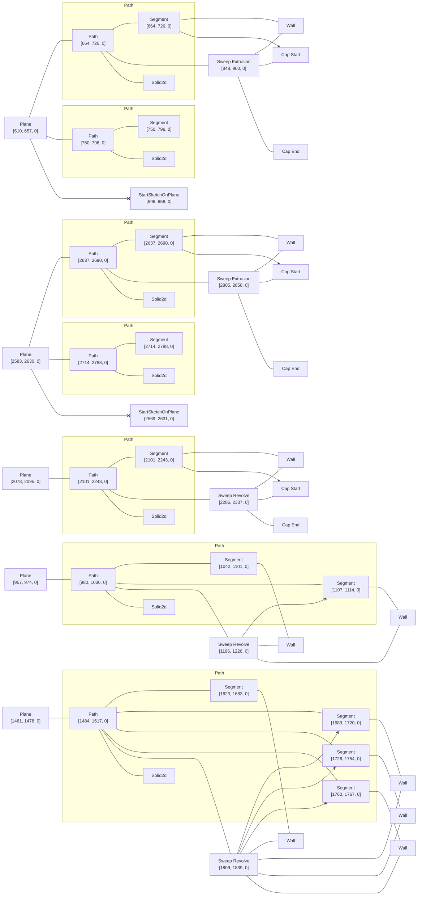

```mermaid
flowchart LR
  subgraph path2 [Path]
    2["Path<br>[664, 726, 0]"]
    3["Segment<br>[664, 726, 0]"]
    4[Solid2d]
  end
  subgraph path5 [Path]
    5["Path<br>[750, 796, 0]"]
    6["Segment<br>[750, 796, 0]"]
    7[Solid2d]
  end
  subgraph path13 [Path]
    13["Path<br>[980, 1036, 0]"]
    14["Segment<br>[1042, 1101, 0]"]
    15["Segment<br>[1107, 1114, 0]"]
    16[Solid2d]
  end
  subgraph path21 [Path]
    21["Path<br>[1484, 1617, 0]"]
    22["Segment<br>[1623, 1683, 0]"]
    23["Segment<br>[1689, 1720, 0]"]
    24["Segment<br>[1726, 1754, 0]"]
    25["Segment<br>[1760, 1767, 0]"]
    26[Solid2d]
  end
  subgraph path33 [Path]
    33["Path<br>[2101, 2243, 0]"]
    34["Segment<br>[2101, 2243, 0]"]
    35[Solid2d]
  end
  subgraph path41 [Path]
    41["Path<br>[2637, 2690, 0]"]
    42["Segment<br>[2637, 2690, 0]"]
    43[Solid2d]
  end
  subgraph path44 [Path]
    44["Path<br>[2714, 2788, 0]"]
    45["Segment<br>[2714, 2788, 0]"]
    46[Solid2d]
  end
  1["Plane<br>[610, 657, 0]"]
  8["Sweep Extrusion<br>[848, 900, 0]"]
  9[Wall]
  10["Cap Start"]
  11["Cap End"]
  12["Plane<br>[957, 974, 0]"]
  17["Sweep Revolve<br>[1196, 1226, 0]"]
  18[Wall]
  19[Wall]
  20["Plane<br>[1461, 1478, 0]"]
  27["Sweep Revolve<br>[1809, 1839, 0]"]
  28[Wall]
  29[Wall]
  30[Wall]
  31[Wall]
  32["Plane<br>[2078, 2095, 0]"]
  36["Sweep Revolve<br>[2286, 2337, 0]"]
  37[Wall]
  38["Cap Start"]
  39["Cap End"]
  40["Plane<br>[2583, 2630, 0]"]
  47["Sweep Extrusion<br>[2805, 2858, 0]"]
  48[Wall]
  49["Cap Start"]
  50["Cap End"]
  51["StartSketchOnPlane<br>[596, 658, 0]"]
  52["StartSketchOnPlane<br>[2569, 2631, 0]"]
  1 --- 2
  1 --- 5
  2 --- 3
  2 ---- 8
  2 --- 4
  3 --- 9
  3 x--> 10
  5 --- 6
  5 --- 7
  8 --- 9
  8 --- 10
  8 --- 11
  12 --- 13
  13 --- 14
  13 --- 15
  13 ---- 17
  13 --- 16
  14 --- 18
  15 --- 19
  17 --- 18
  17 --- 19
  17 <--x 15
  20 --- 21
  21 --- 22
  21 --- 23
  21 --- 24
  21 --- 25
  21 ---- 27
  21 --- 26
  22 --- 28
  23 --- 29
  24 --- 30
  25 --- 31
  27 --- 28
  27 --- 29
  27 --- 30
  27 --- 31
  27 <--x 23
  27 <--x 24
  27 <--x 25
  32 --- 33
  33 --- 34
  33 ---- 36
  33 --- 35
  34 --- 37
  34 x--> 38
  36 --- 37
  36 --- 38
  36 --- 39
  40 --- 41
  40 --- 44
  41 --- 42
  41 ---- 47
  41 --- 43
  42 --- 48
  42 x--> 49
  44 --- 45
  44 --- 46
  47 --- 48
  47 --- 49
  47 --- 50
  1 <--x 51
  40 <--x 52
```
