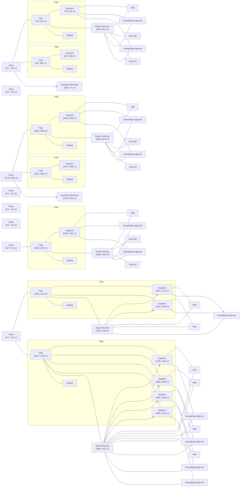

```mermaid
flowchart LR
  subgraph path8 [Path]
    8["Path<br>[733, 816, 0]"]
    9["Segment<br>[733, 816, 0]"]
    10[Solid2d]
  end
  subgraph path11 [Path]
    11["Path<br>[827, 894, 0]"]
    12["Segment<br>[827, 894, 0]"]
    13[Solid2d]
  end
  subgraph path20 [Path]
    20["Path<br>[1083, 1139, 0]"]
    21["Segment<br>[1145, 1237, 0]"]
    22["Segment<br>[1243, 1250, 0]"]
    23[Solid2d]
  end
  subgraph path28 [Path]
    28["Path<br>[1627, 1760, 0]"]
    29["Segment<br>[1766, 1859, 0]"]
    30["Segment<br>[1865, 1896, 0]"]
    31["Segment<br>[1902, 1930, 0]"]
    32["Segment<br>[1936, 1943, 0]"]
    33[Solid2d]
  end
  subgraph path43 [Path]
    43["Path<br>[2284, 2425, 0]"]
    44["Segment<br>[2284, 2425, 0]"]
    45[Solid2d]
  end
  subgraph path53 [Path]
    53["Path<br>[2826, 2900, 0]"]
    54["Segment<br>[2826, 2900, 0]"]
    55[Solid2d]
  end
  subgraph path56 [Path]
    56["Path<br>[2911, 3006, 0]"]
    57["Segment<br>[2911, 3006, 0]"]
    58[Solid2d]
  end
  1["Plane<br>[677, 726, 0]"]
  2["Plane<br>[677, 726, 0]"]
  3["Plane<br>[677, 726, 0]"]
  4["Plane<br>[677, 726, 0]"]
  5["Plane<br>[677, 726, 0]"]
  6["Plane<br>[677, 726, 0]"]
  7["Plane<br>[677, 726, 0]"]
  14["Sweep Extrusion<br>[949, 1001, 0]"]
  15[Wall]
  16["Cap Start"]
  17["Cap End"]
  18["SweepEdge Opposite"]
  19["SweepEdge Adjacent"]
  24["Sweep Revolve<br>[1332, 1368, 0]"]
  25[Wall]
  26[Wall]
  27["SweepEdge Adjacent"]
  34["Sweep Revolve<br>[1985, 2021, 0]"]
  35[Wall]
  36[Wall]
  37[Wall]
  38[Wall]
  39["SweepEdge Adjacent"]
  40["SweepEdge Adjacent"]
  41["SweepEdge Adjacent"]
  42["SweepEdge Adjacent"]
  46["Sweep Revolve<br>[2468, 2525, 0]"]
  47[Wall]
  48["Cap Start"]
  49["Cap End"]
  50["SweepEdge Opposite"]
  51["SweepEdge Adjacent"]
  52["Plane<br>[2770, 2819, 0]"]
  59["Sweep Extrusion<br>[3026, 3079, 0]"]
  60[Wall]
  61["Cap Start"]
  62["Cap End"]
  63["SweepEdge Opposite"]
  64["SweepEdge Adjacent"]
  65["StartSketchOnPlane<br>[663, 727, 0]"]
  66["StartSketchOnPlane<br>[2756, 2820, 0]"]
  1 --- 20
  1 --- 28
  3 --- 43
  7 --- 8
  7 --- 11
  8 --- 9
  8 ---- 14
  8 --- 10
  9 --- 15
  9 --- 18
  9 --- 19
  11 --- 12
  11 --- 13
  14 --- 15
  14 --- 16
  14 --- 17
  14 --- 18
  14 --- 19
  20 --- 21
  20 --- 22
  20 ---- 24
  20 --- 23
  21 --- 25
  21 x--> 27
  22 --- 26
  22 --- 27
  24 --- 25
  24 --- 26
  24 <--x 21
  24 --- 27
  24 <--x 22
  28 --- 29
  28 --- 30
  28 --- 31
  28 --- 32
  28 ---- 34
  28 --- 33
  29 --- 35
  29 --- 39
  30 --- 36
  30 --- 40
  31 --- 37
  31 --- 41
  32 --- 38
  32 --- 42
  34 --- 35
  34 --- 36
  34 --- 37
  34 --- 38
  34 <--x 29
  34 --- 39
  34 <--x 30
  34 --- 40
  34 <--x 31
  34 --- 41
  34 <--x 32
  34 --- 42
  43 --- 44
  43 ---- 46
  43 --- 45
  44 --- 47
  44 --- 50
  44 --- 51
  46 --- 47
  46 --- 48
  46 --- 49
  46 --- 50
  46 --- 51
  52 --- 53
  52 --- 56
  53 --- 54
  53 ---- 59
  53 --- 55
  54 --- 60
  54 --- 63
  54 --- 64
  56 --- 57
  56 --- 58
  59 --- 60
  59 --- 61
  59 --- 62
  59 --- 63
  59 --- 64
  7 <--x 65
  52 <--x 66
```
