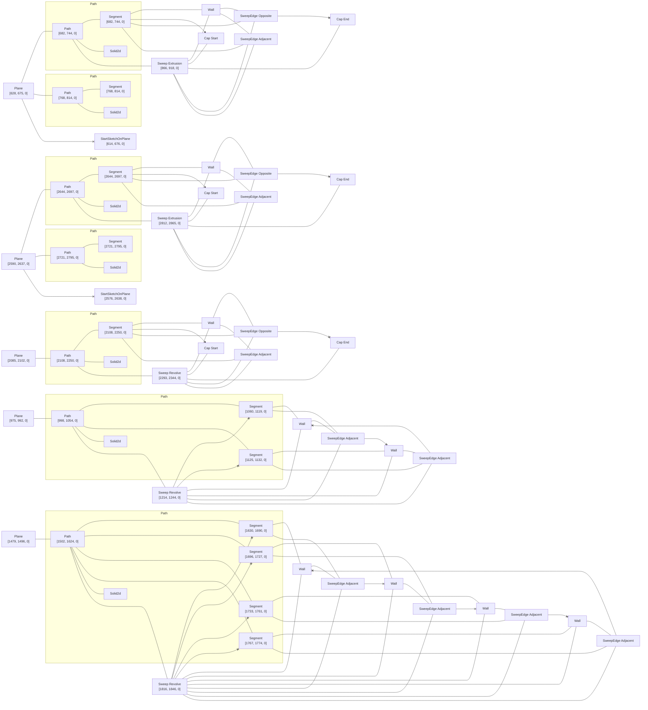

```mermaid
flowchart LR
  subgraph path2 [Path]
    2["Path<br>[682, 744, 0]"]
      %% [ProgramBodyItem { index: 10 }, VariableDeclarationDeclaration, VariableDeclarationInit, PipeBodyItem { index: 1 }]
    3["Segment<br>[682, 744, 0]"]
      %% [ProgramBodyItem { index: 10 }, VariableDeclarationDeclaration, VariableDeclarationInit, PipeBodyItem { index: 1 }]
    4[Solid2d]
  end
  subgraph path5 [Path]
    5["Path<br>[768, 814, 0]"]
      %% [ProgramBodyItem { index: 10 }, VariableDeclarationDeclaration, VariableDeclarationInit, PipeBodyItem { index: 2 }, CallKwArg { index: 0 }]
    6["Segment<br>[768, 814, 0]"]
      %% [ProgramBodyItem { index: 10 }, VariableDeclarationDeclaration, VariableDeclarationInit, PipeBodyItem { index: 2 }, CallKwArg { index: 0 }]
    7[Solid2d]
  end
  subgraph path15 [Path]
    15["Path<br>[998, 1054, 0]"]
      %% [ProgramBodyItem { index: 12 }, VariableDeclarationDeclaration, VariableDeclarationInit, PipeBodyItem { index: 1 }]
    16["Segment<br>[1060, 1119, 0]"]
      %% [ProgramBodyItem { index: 12 }, VariableDeclarationDeclaration, VariableDeclarationInit, PipeBodyItem { index: 2 }]
    17["Segment<br>[1125, 1132, 0]"]
      %% [ProgramBodyItem { index: 12 }, VariableDeclarationDeclaration, VariableDeclarationInit, PipeBodyItem { index: 3 }]
    18[Solid2d]
  end
  subgraph path25 [Path]
    25["Path<br>[1502, 1624, 0]"]
      %% [ProgramBodyItem { index: 14 }, VariableDeclarationDeclaration, VariableDeclarationInit, PipeBodyItem { index: 1 }]
    26["Segment<br>[1630, 1690, 0]"]
      %% [ProgramBodyItem { index: 14 }, VariableDeclarationDeclaration, VariableDeclarationInit, PipeBodyItem { index: 2 }]
    27["Segment<br>[1696, 1727, 0]"]
      %% [ProgramBodyItem { index: 14 }, VariableDeclarationDeclaration, VariableDeclarationInit, PipeBodyItem { index: 3 }]
    28["Segment<br>[1733, 1761, 0]"]
      %% [ProgramBodyItem { index: 14 }, VariableDeclarationDeclaration, VariableDeclarationInit, PipeBodyItem { index: 4 }]
    29["Segment<br>[1767, 1774, 0]"]
      %% [ProgramBodyItem { index: 14 }, VariableDeclarationDeclaration, VariableDeclarationInit, PipeBodyItem { index: 5 }]
    30[Solid2d]
  end
  subgraph path41 [Path]
    41["Path<br>[2108, 2250, 0]"]
      %% [ProgramBodyItem { index: 16 }, VariableDeclarationDeclaration, VariableDeclarationInit, PipeBodyItem { index: 1 }]
    42["Segment<br>[2108, 2250, 0]"]
      %% [ProgramBodyItem { index: 16 }, VariableDeclarationDeclaration, VariableDeclarationInit, PipeBodyItem { index: 1 }]
    43[Solid2d]
  end
  subgraph path51 [Path]
    51["Path<br>[2644, 2697, 0]"]
      %% [ProgramBodyItem { index: 18 }, VariableDeclarationDeclaration, VariableDeclarationInit, PipeBodyItem { index: 1 }]
    52["Segment<br>[2644, 2697, 0]"]
      %% [ProgramBodyItem { index: 18 }, VariableDeclarationDeclaration, VariableDeclarationInit, PipeBodyItem { index: 1 }]
    53[Solid2d]
  end
  subgraph path54 [Path]
    54["Path<br>[2721, 2795, 0]"]
      %% [ProgramBodyItem { index: 18 }, VariableDeclarationDeclaration, VariableDeclarationInit, PipeBodyItem { index: 2 }, CallKwArg { index: 0 }]
    55["Segment<br>[2721, 2795, 0]"]
      %% [ProgramBodyItem { index: 18 }, VariableDeclarationDeclaration, VariableDeclarationInit, PipeBodyItem { index: 2 }, CallKwArg { index: 0 }]
    56[Solid2d]
  end
  1["Plane<br>[628, 675, 0]"]
    %% [ProgramBodyItem { index: 10 }, VariableDeclarationDeclaration, VariableDeclarationInit, PipeBodyItem { index: 0 }, CallKwUnlabeledArg]
  8["Sweep Extrusion<br>[866, 918, 0]"]
    %% [ProgramBodyItem { index: 11 }, VariableDeclarationDeclaration, VariableDeclarationInit]
  9[Wall]
    %% face_code_ref=Missing NodePath
  10["Cap Start"]
    %% face_code_ref=Missing NodePath
  11["Cap End"]
    %% face_code_ref=Missing NodePath
  12["SweepEdge Opposite"]
  13["SweepEdge Adjacent"]
  14["Plane<br>[975, 992, 0]"]
    %% [ProgramBodyItem { index: 12 }, VariableDeclarationDeclaration, VariableDeclarationInit, PipeBodyItem { index: 0 }]
  19["Sweep Revolve<br>[1214, 1244, 0]"]
    %% [ProgramBodyItem { index: 13 }, VariableDeclarationDeclaration, VariableDeclarationInit, PipeBodyItem { index: 0 }]
  20[Wall]
    %% face_code_ref=Missing NodePath
  21[Wall]
    %% face_code_ref=Missing NodePath
  22["SweepEdge Adjacent"]
  23["SweepEdge Adjacent"]
  24["Plane<br>[1479, 1496, 0]"]
    %% [ProgramBodyItem { index: 14 }, VariableDeclarationDeclaration, VariableDeclarationInit, PipeBodyItem { index: 0 }]
  31["Sweep Revolve<br>[1816, 1846, 0]"]
    %% [ProgramBodyItem { index: 15 }, VariableDeclarationDeclaration, VariableDeclarationInit, PipeBodyItem { index: 0 }]
  32[Wall]
    %% face_code_ref=Missing NodePath
  33[Wall]
    %% face_code_ref=Missing NodePath
  34[Wall]
    %% face_code_ref=Missing NodePath
  35[Wall]
    %% face_code_ref=Missing NodePath
  36["SweepEdge Adjacent"]
  37["SweepEdge Adjacent"]
  38["SweepEdge Adjacent"]
  39["SweepEdge Adjacent"]
  40["Plane<br>[2085, 2102, 0]"]
    %% [ProgramBodyItem { index: 16 }, VariableDeclarationDeclaration, VariableDeclarationInit, PipeBodyItem { index: 0 }]
  44["Sweep Revolve<br>[2293, 2344, 0]"]
    %% [ProgramBodyItem { index: 17 }, VariableDeclarationDeclaration, VariableDeclarationInit, PipeBodyItem { index: 0 }]
  45[Wall]
    %% face_code_ref=Missing NodePath
  46["Cap Start"]
    %% face_code_ref=Missing NodePath
  47["Cap End"]
    %% face_code_ref=Missing NodePath
  48["SweepEdge Opposite"]
  49["SweepEdge Adjacent"]
  50["Plane<br>[2590, 2637, 0]"]
    %% [ProgramBodyItem { index: 18 }, VariableDeclarationDeclaration, VariableDeclarationInit, PipeBodyItem { index: 0 }, CallKwUnlabeledArg]
  57["Sweep Extrusion<br>[2812, 2865, 0]"]
    %% [ProgramBodyItem { index: 19 }, VariableDeclarationDeclaration, VariableDeclarationInit]
  58[Wall]
    %% face_code_ref=Missing NodePath
  59["Cap Start"]
    %% face_code_ref=Missing NodePath
  60["Cap End"]
    %% face_code_ref=Missing NodePath
  61["SweepEdge Opposite"]
  62["SweepEdge Adjacent"]
  63["StartSketchOnPlane<br>[614, 676, 0]"]
    %% [ProgramBodyItem { index: 10 }, VariableDeclarationDeclaration, VariableDeclarationInit, PipeBodyItem { index: 0 }]
  64["StartSketchOnPlane<br>[2576, 2638, 0]"]
    %% [ProgramBodyItem { index: 18 }, VariableDeclarationDeclaration, VariableDeclarationInit, PipeBodyItem { index: 0 }]
  1 --- 2
  1 --- 5
  1 <--x 63
  2 --- 3
  2 --- 4
  2 ---- 8
  3 --- 9
  3 x--> 10
  3 --- 12
  3 --- 13
  5 --- 6
  5 --- 7
  8 --- 9
  8 --- 10
  8 --- 11
  8 --- 12
  8 --- 13
  9 --- 12
  9 --- 13
  12 <--x 11
  14 --- 15
  15 --- 16
  15 --- 17
  15 --- 18
  15 ---- 19
  19 <--x 16
  16 --- 20
  16 --- 22
  19 <--x 17
  17 --- 21
  17 --- 23
  19 --- 20
  19 --- 21
  19 --- 22
  19 --- 23
  20 --- 22
  23 <--x 20
  22 <--x 21
  21 --- 23
  24 --- 25
  25 --- 26
  25 --- 27
  25 --- 28
  25 --- 29
  25 --- 30
  25 ---- 31
  31 <--x 26
  26 --- 32
  26 --- 36
  31 <--x 27
  27 --- 33
  27 --- 37
  31 <--x 28
  28 --- 34
  28 --- 38
  31 <--x 29
  29 --- 35
  29 --- 39
  31 --- 32
  31 --- 33
  31 --- 34
  31 --- 35
  31 --- 36
  31 --- 37
  31 --- 38
  31 --- 39
  32 --- 36
  39 <--x 32
  36 <--x 33
  33 --- 37
  37 <--x 34
  34 --- 38
  38 <--x 35
  35 --- 39
  40 --- 41
  41 --- 42
  41 --- 43
  41 ---- 44
  42 --- 45
  42 x--> 46
  42 --- 48
  42 --- 49
  44 --- 45
  44 --- 46
  44 --- 47
  44 --- 48
  44 --- 49
  45 --- 48
  45 --- 49
  48 <--x 47
  50 --- 51
  50 --- 54
  50 <--x 64
  51 --- 52
  51 --- 53
  51 ---- 57
  52 --- 58
  52 x--> 59
  52 --- 61
  52 --- 62
  54 --- 55
  54 --- 56
  57 --- 58
  57 --- 59
  57 --- 60
  57 --- 61
  57 --- 62
  58 --- 61
  58 --- 62
  61 <--x 60
```
