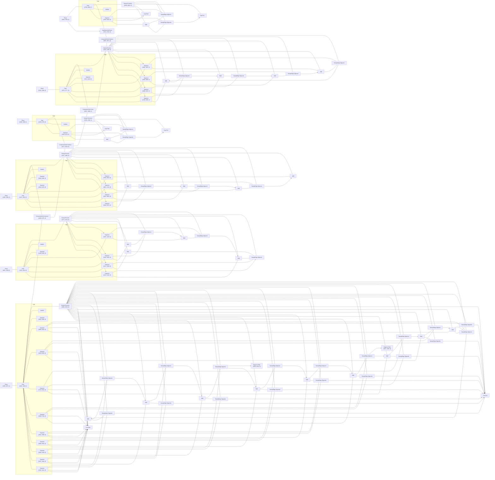

```mermaid
flowchart LR
  subgraph path8 [Path]
    8["Path<br>[1123, 1211, 0]"]
      %% [ProgramBodyItem { index: 20 }, VariableDeclarationDeclaration, VariableDeclarationInit, PipeBodyItem { index: 0 }]
    14["Segment<br>[1217, 1311, 0]"]
      %% [ProgramBodyItem { index: 20 }, VariableDeclarationDeclaration, VariableDeclarationInit, PipeBodyItem { index: 1 }]
    15["Segment<br>[1317, 1339, 0]"]
      %% [ProgramBodyItem { index: 20 }, VariableDeclarationDeclaration, VariableDeclarationInit, PipeBodyItem { index: 2 }]
    16["Segment<br>[1345, 1381, 0]"]
      %% [ProgramBodyItem { index: 20 }, VariableDeclarationDeclaration, VariableDeclarationInit, PipeBodyItem { index: 3 }]
    17["Segment<br>[1387, 1443, 0]"]
      %% [ProgramBodyItem { index: 20 }, VariableDeclarationDeclaration, VariableDeclarationInit, PipeBodyItem { index: 4 }]
    18["Segment<br>[1449, 1456, 0]"]
      %% [ProgramBodyItem { index: 20 }, VariableDeclarationDeclaration, VariableDeclarationInit, PipeBodyItem { index: 5 }]
    44[Solid2d]
  end
  subgraph path9 [Path]
    9["Path<br>[1672, 1777, 0]"]
      %% [ProgramBodyItem { index: 23 }, VariableDeclarationDeclaration, VariableDeclarationInit, PipeBodyItem { index: 0 }]
    19["Segment<br>[1783, 1894, 0]"]
      %% [ProgramBodyItem { index: 23 }, VariableDeclarationDeclaration, VariableDeclarationInit, PipeBodyItem { index: 1 }]
    20["Segment<br>[1900, 1927, 0]"]
      %% [ProgramBodyItem { index: 23 }, VariableDeclarationDeclaration, VariableDeclarationInit, PipeBodyItem { index: 2 }]
    21["Segment<br>[1933, 2045, 0]"]
      %% [ProgramBodyItem { index: 23 }, VariableDeclarationDeclaration, VariableDeclarationInit, PipeBodyItem { index: 3 }]
    22["Segment<br>[2051, 2107, 0]"]
      %% [ProgramBodyItem { index: 23 }, VariableDeclarationDeclaration, VariableDeclarationInit, PipeBodyItem { index: 4 }]
    23["Segment<br>[2113, 2120, 0]"]
      %% [ProgramBodyItem { index: 23 }, VariableDeclarationDeclaration, VariableDeclarationInit, PipeBodyItem { index: 5 }]
    46[Solid2d]
  end
  subgraph path10 [Path]
    10["Path<br>[2437, 2523, 0]"]
      %% [ProgramBodyItem { index: 27 }, VariableDeclarationDeclaration, VariableDeclarationInit, PipeBodyItem { index: 0 }]
    24["Segment<br>[2529, 2572, 0]"]
      %% [ProgramBodyItem { index: 27 }, VariableDeclarationDeclaration, VariableDeclarationInit, PipeBodyItem { index: 1 }]
    25["Segment<br>[2612, 2661, 0]"]
      %% [ProgramBodyItem { index: 27 }, VariableDeclarationDeclaration, VariableDeclarationInit, PipeBodyItem { index: 2 }]
    26["Segment<br>[2667, 2743, 0]"]
      %% [ProgramBodyItem { index: 27 }, VariableDeclarationDeclaration, VariableDeclarationInit, PipeBodyItem { index: 3 }]
    27["Segment<br>[2792, 2814, 0]"]
      %% [ProgramBodyItem { index: 27 }, VariableDeclarationDeclaration, VariableDeclarationInit, PipeBodyItem { index: 4 }]
    28["Segment<br>[2820, 2876, 0]"]
      %% [ProgramBodyItem { index: 27 }, VariableDeclarationDeclaration, VariableDeclarationInit, PipeBodyItem { index: 5 }]
    29["Segment<br>[2882, 2889, 0]"]
      %% [ProgramBodyItem { index: 27 }, VariableDeclarationDeclaration, VariableDeclarationInit, PipeBodyItem { index: 6 }]
    42[Solid2d]
  end
  subgraph path11 [Path]
    11["Path<br>[3302, 3385, 0]"]
      %% [ProgramBodyItem { index: 30 }, VariableDeclarationDeclaration, VariableDeclarationInit, PipeBodyItem { index: 0 }]
    30["Segment<br>[3391, 3421, 0]"]
      %% [ProgramBodyItem { index: 30 }, VariableDeclarationDeclaration, VariableDeclarationInit, PipeBodyItem { index: 1 }]
    31["Segment<br>[3427, 3494, 0]"]
      %% [ProgramBodyItem { index: 30 }, VariableDeclarationDeclaration, VariableDeclarationInit, PipeBodyItem { index: 2 }]
    32["Segment<br>[3500, 3593, 0]"]
      %% [ProgramBodyItem { index: 30 }, VariableDeclarationDeclaration, VariableDeclarationInit, PipeBodyItem { index: 3 }]
    33["Segment<br>[3599, 3635, 0]"]
      %% [ProgramBodyItem { index: 30 }, VariableDeclarationDeclaration, VariableDeclarationInit, PipeBodyItem { index: 4 }]
    34["Segment<br>[3641, 3690, 0]"]
      %% [ProgramBodyItem { index: 30 }, VariableDeclarationDeclaration, VariableDeclarationInit, PipeBodyItem { index: 5 }]
    35["Segment<br>[3696, 3740, 0]"]
      %% [ProgramBodyItem { index: 30 }, VariableDeclarationDeclaration, VariableDeclarationInit, PipeBodyItem { index: 6 }]
    36["Segment<br>[3746, 3823, 0]"]
      %% [ProgramBodyItem { index: 30 }, VariableDeclarationDeclaration, VariableDeclarationInit, PipeBodyItem { index: 7 }]
    37["Segment<br>[3829, 3863, 0]"]
      %% [ProgramBodyItem { index: 30 }, VariableDeclarationDeclaration, VariableDeclarationInit, PipeBodyItem { index: 8 }]
    38["Segment<br>[3869, 3925, 0]"]
      %% [ProgramBodyItem { index: 30 }, VariableDeclarationDeclaration, VariableDeclarationInit, PipeBodyItem { index: 9 }]
    39["Segment<br>[3931, 3938, 0]"]
      %% [ProgramBodyItem { index: 30 }, VariableDeclarationDeclaration, VariableDeclarationInit, PipeBodyItem { index: 10 }]
    47[Solid2d]
  end
  subgraph path12 [Path]
    12["Path<br>[4320, 4379, 0]"]
      %% [ProgramBodyItem { index: 34 }, VariableDeclarationDeclaration, VariableDeclarationInit]
    40["Segment<br>[4320, 4379, 0]"]
      %% [ProgramBodyItem { index: 34 }, VariableDeclarationDeclaration, VariableDeclarationInit]
    45[Solid2d]
  end
  subgraph path13 [Path]
    13["Path<br>[4758, 4820, 0]"]
      %% [ProgramBodyItem { index: 40 }, VariableDeclarationDeclaration, VariableDeclarationInit]
    41["Segment<br>[4758, 4820, 0]"]
      %% [ProgramBodyItem { index: 40 }, VariableDeclarationDeclaration, VariableDeclarationInit]
    43[Solid2d]
  end
  1["Plane<br>[1091, 1108, 0]"]
    %% [ProgramBodyItem { index: 19 }, VariableDeclarationDeclaration, VariableDeclarationInit]
  2["Plane<br>[1631, 1648, 0]"]
    %% [ProgramBodyItem { index: 22 }, VariableDeclarationDeclaration, VariableDeclarationInit]
  3["Plane<br>[2385, 2402, 0]"]
    %% [ProgramBodyItem { index: 26 }, VariableDeclarationDeclaration, VariableDeclarationInit]
  4["Plane<br>[3256, 3274, 0]"]
    %% [ProgramBodyItem { index: 29 }, VariableDeclarationDeclaration, VariableDeclarationInit]
  5["Plane<br>[4288, 4306, 0]"]
    %% [ProgramBodyItem { index: 33 }, VariableDeclarationDeclaration, VariableDeclarationInit]
  6["Plane<br>[4648, 4708, 0]"]
    %% [ProgramBodyItem { index: 38 }, VariableDeclarationDeclaration, VariableDeclarationInit]
  7["StartSketchOnPlane<br>[4721, 4744, 0]"]
    %% [ProgramBodyItem { index: 39 }, VariableDeclarationDeclaration, VariableDeclarationInit]
  48["Sweep Revolve<br>[1471, 1514, 0]"]
    %% [ProgramBodyItem { index: 21 }, VariableDeclarationDeclaration, VariableDeclarationInit, PipeBodyItem { index: 0 }]
  49["Sweep Revolve<br>[2144, 2196, 0]"]
    %% [ProgramBodyItem { index: 24 }, VariableDeclarationDeclaration, VariableDeclarationInit]
  50["Sweep Revolve<br>[2917, 2980, 0]"]
    %% [ProgramBodyItem { index: 28 }, VariableDeclarationDeclaration, VariableDeclarationInit]
  51["Sweep Extrusion<br>[3964, 4010, 0]"]
    %% [ProgramBodyItem { index: 31 }, VariableDeclarationDeclaration, VariableDeclarationInit, PipeBodyItem { index: 0 }]
  52["Sweep Extrusion<br>[4393, 4426, 0]"]
    %% [ProgramBodyItem { index: 35 }, VariableDeclarationDeclaration, VariableDeclarationInit, PipeBodyItem { index: 0 }]
  53["Sweep Extrusion<br>[4839, 4882, 0]"]
    %% [ProgramBodyItem { index: 41 }, VariableDeclarationDeclaration, VariableDeclarationInit]
  54["CompositeSolid Subtract<br>[4924, 4971, 0]"]
    %% [ProgramBodyItem { index: 42 }, VariableDeclarationDeclaration, VariableDeclarationInit]
  55["CompositeSolid Subtract<br>[4477, 4519, 0]"]
    %% [ProgramBodyItem { index: 36 }, VariableDeclarationDeclaration, VariableDeclarationInit]
  56["CompositeSolid Intersect<br>[4208, 4275, 0]"]
    %% [ProgramBodyItem { index: 32 }, VariableDeclarationDeclaration, VariableDeclarationInit]
  57["CompositeSolid Union<br>[4597, 4636, 0]"]
    %% [ProgramBodyItem { index: 37 }, VariableDeclarationDeclaration, VariableDeclarationInit]
  58[Wall]
    %% face_code_ref=Missing NodePath
  59[Wall]
    %% face_code_ref=Missing NodePath
  60[Wall]
    %% face_code_ref=Missing NodePath
  61[Wall]
    %% face_code_ref=Missing NodePath
  62[Wall]
    %% face_code_ref=Missing NodePath
  63[Wall]
    %% face_code_ref=Missing NodePath
  64[Wall]
    %% face_code_ref=Missing NodePath
  65[Wall]
    %% face_code_ref=Missing NodePath
  66[Wall]
    %% face_code_ref=Missing NodePath
  67[Wall]
    %% face_code_ref=Missing NodePath
  68[Wall]
    %% face_code_ref=Missing NodePath
  69[Wall]
    %% face_code_ref=Missing NodePath
  70[Wall]
    %% face_code_ref=Missing NodePath
  71[Wall]
    %% face_code_ref=Missing NodePath
  72[Wall]
    %% face_code_ref=Missing NodePath
  73[Wall]
    %% face_code_ref=Missing NodePath
  74[Wall]
    %% face_code_ref=Missing NodePath
  75[Wall]
    %% face_code_ref=Missing NodePath
  76[Wall]
    %% face_code_ref=Missing NodePath
  77[Wall]
    %% face_code_ref=Missing NodePath
  78[Wall]
    %% face_code_ref=Missing NodePath
  79[Wall]
    %% face_code_ref=Missing NodePath
  80[Wall]
    %% face_code_ref=Missing NodePath
  81["Cap Start"]
    %% face_code_ref=Missing NodePath
  82["Cap Start"]
    %% face_code_ref=Missing NodePath
  83["Cap Start"]
    %% face_code_ref=Missing NodePath
  84["Cap End"]
    %% face_code_ref=Missing NodePath
  85["Cap End"]
    %% face_code_ref=Missing NodePath
  86["Cap End"]
    %% face_code_ref=Missing NodePath
  87["SweepEdge Opposite"]
  88["SweepEdge Opposite"]
  89["SweepEdge Opposite"]
  90["SweepEdge Opposite"]
  91["SweepEdge Opposite"]
  92["SweepEdge Opposite"]
  93["SweepEdge Opposite"]
  94["SweepEdge Opposite"]
  95["SweepEdge Opposite"]
  96["SweepEdge Opposite"]
  97["SweepEdge Opposite"]
  98["SweepEdge Adjacent"]
  99["SweepEdge Adjacent"]
  100["SweepEdge Adjacent"]
  101["SweepEdge Adjacent"]
  102["SweepEdge Adjacent"]
  103["SweepEdge Adjacent"]
  104["SweepEdge Adjacent"]
  105["SweepEdge Adjacent"]
  106["SweepEdge Adjacent"]
  107["SweepEdge Adjacent"]
  108["SweepEdge Adjacent"]
  109["SweepEdge Adjacent"]
  110["SweepEdge Adjacent"]
  111["SweepEdge Adjacent"]
  112["SweepEdge Adjacent"]
  113["SweepEdge Adjacent"]
  114["SweepEdge Adjacent"]
  115["SweepEdge Adjacent"]
  116["SweepEdge Adjacent"]
  117["SweepEdge Adjacent"]
  118["SweepEdge Adjacent"]
  119["EdgeCut Fillet<br>[4053, 4121, 0]"]
    %% [ProgramBodyItem { index: 31 }, VariableDeclarationDeclaration, VariableDeclarationInit, PipeBodyItem { index: 2 }]
  120["EdgeCut Fillet<br>[4127, 4195, 0]"]
    %% [ProgramBodyItem { index: 31 }, VariableDeclarationDeclaration, VariableDeclarationInit, PipeBodyItem { index: 3 }]
  1 --- 8
  2 --- 9
  3 --- 10
  4 --- 11
  5 --- 12
  6 <--x 7
  6 --- 13
  8 --- 14
  8 --- 15
  8 --- 16
  8 --- 17
  8 --- 18
  8 --- 44
  8 ---- 48
  9 --- 19
  9 --- 20
  9 --- 21
  9 --- 22
  9 --- 23
  9 --- 46
  9 ---- 49
  9 --- 57
  10 --- 24
  10 --- 25
  10 --- 26
  10 --- 27
  10 --- 28
  10 --- 29
  10 --- 42
  10 ---- 50
  10 --- 56
  11 --- 30
  11 --- 31
  11 --- 32
  11 --- 33
  11 --- 34
  11 --- 35
  11 --- 36
  11 --- 37
  11 --- 38
  11 --- 39
  11 --- 47
  11 ---- 51
  11 --- 56
  12 --- 40
  12 --- 45
  12 ---- 52
  12 --- 55
  13 --- 41
  13 --- 43
  13 ---- 53
  13 --- 54
  48 <--x 14
  14 --- 63
  14 x--> 100
  48 <--x 15
  15 --- 61
  15 --- 100
  48 <--x 16
  16 --- 60
  16 --- 101
  48 <--x 17
  17 --- 62
  17 --- 102
  49 <--x 19
  19 --- 75
  19 --- 112
  49 <--x 20
  20 --- 74
  20 --- 113
  49 <--x 21
  21 --- 76
  21 --- 114
  49 <--x 22
  22 --- 73
  22 --- 115
  50 <--x 24
  24 --- 80
  24 --- 116
  50 <--x 25
  25 --- 78
  25 --- 117
  50 <--x 26
  26 --- 77
  26 --- 118
  50 <--x 27
  27 --- 79
  30 --- 71
  30 x--> 82
  30 --- 89
  30 --- 103
  31 --- 69
  31 x--> 82
  31 --- 90
  31 --- 104
  32 --- 64
  32 x--> 82
  32 --- 91
  32 --- 105
  33 --- 66
  33 x--> 82
  33 --- 92
  33 --- 106
  34 --- 68
  34 x--> 82
  34 --- 93
  34 --- 107
  35 --- 65
  35 x--> 82
  35 --- 94
  35 --- 108
  36 --- 67
  36 x--> 82
  36 --- 95
  36 --- 109
  37 --- 70
  37 x--> 82
  37 --- 96
  37 --- 110
  38 --- 72
  38 x--> 82
  38 --- 97
  38 --- 111
  40 --- 58
  40 x--> 81
  40 --- 87
  40 --- 98
  41 --- 59
  41 x--> 83
  41 --- 88
  41 --- 99
  48 --- 60
  48 --- 61
  48 --- 62
  48 --- 63
  48 --- 100
  48 --- 101
  48 --- 102
  49 --- 73
  49 --- 74
  49 --- 75
  49 --- 76
  49 --- 112
  49 --- 113
  49 --- 114
  49 --- 115
  50 --- 77
  50 --- 78
  50 --- 79
  50 --- 80
  50 --- 116
  50 --- 117
  50 --- 118
  51 --- 64
  51 --- 65
  51 --- 66
  51 --- 67
  51 --- 68
  51 --- 69
  51 --- 70
  51 --- 71
  51 --- 72
  51 --- 82
  51 --- 85
  51 --- 89
  51 --- 90
  51 --- 91
  51 --- 92
  51 --- 93
  51 --- 94
  51 --- 95
  51 --- 96
  51 --- 97
  51 --- 103
  51 --- 104
  51 --- 105
  51 --- 106
  51 --- 107
  51 --- 108
  51 --- 109
  51 --- 110
  51 --- 111
  52 --- 58
  52 --- 81
  52 --- 84
  52 --- 87
  52 --- 98
  53 --- 59
  53 --- 83
  53 --- 86
  53 --- 88
  53 --- 99
  57 --- 54
  56 --- 55
  55 --- 57
  58 --- 87
  58 --- 98
  59 --- 88
  59 --- 99
  60 --- 101
  61 --- 100
  101 <--x 62
  62 --- 102
  63 --- 100
  102 <--x 63
  64 --- 91
  104 <--x 64
  64 --- 105
  65 --- 94
  107 <--x 65
  65 --- 108
  66 --- 92
  105 <--x 66
  66 --- 106
  67 --- 95
  108 <--x 67
  67 --- 109
  68 --- 93
  106 <--x 68
  68 --- 107
  69 --- 90
  103 <--x 69
  69 --- 104
  70 --- 96
  109 <--x 70
  70 --- 110
  71 --- 89
  71 --- 103
  111 <--x 71
  72 --- 97
  110 <--x 72
  72 --- 111
  114 <--x 73
  73 --- 115
  112 <--x 74
  74 --- 113
  75 --- 112
  115 <--x 75
  113 <--x 76
  76 --- 114
  117 <--x 77
  77 --- 118
  116 <--x 78
  78 --- 117
  118 <--x 79
  80 --- 116
  87 <--x 84
  89 <--x 85
  90 <--x 85
  91 <--x 85
  92 <--x 85
  93 <--x 85
  94 <--x 85
  95 <--x 85
  96 <--x 85
  97 <--x 85
  88 <--x 86
  105 <--x 119
  108 <--x 120
```
