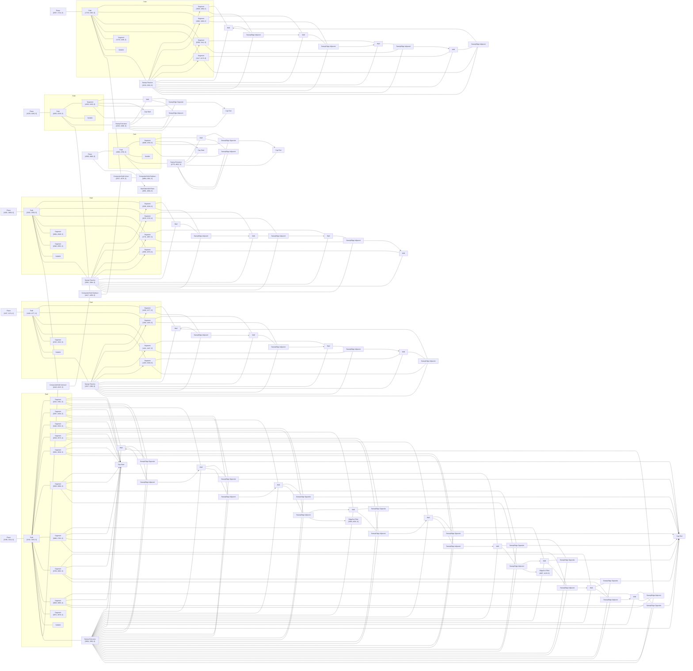

```mermaid
flowchart LR
  subgraph path2 [Path]
    2["Path<br>[1189, 1277, 0]"]
      %% [ProgramBodyItem { index: 20 }, VariableDeclarationDeclaration, VariableDeclarationInit, PipeBodyItem { index: 0 }]
    3["Segment<br>[1283, 1377, 0]"]
      %% [ProgramBodyItem { index: 20 }, VariableDeclarationDeclaration, VariableDeclarationInit, PipeBodyItem { index: 1 }]
    4["Segment<br>[1383, 1405, 0]"]
      %% [ProgramBodyItem { index: 20 }, VariableDeclarationDeclaration, VariableDeclarationInit, PipeBodyItem { index: 2 }]
    5["Segment<br>[1411, 1447, 0]"]
      %% [ProgramBodyItem { index: 20 }, VariableDeclarationDeclaration, VariableDeclarationInit, PipeBodyItem { index: 3 }]
    6["Segment<br>[1453, 1509, 0]"]
      %% [ProgramBodyItem { index: 20 }, VariableDeclarationDeclaration, VariableDeclarationInit, PipeBodyItem { index: 4 }]
    7["Segment<br>[1515, 1522, 0]"]
      %% [ProgramBodyItem { index: 20 }, VariableDeclarationDeclaration, VariableDeclarationInit, PipeBodyItem { index: 5 }]
    8[Solid2d]
  end
  subgraph path19 [Path]
    19["Path<br>[1738, 1843, 0]"]
      %% [ProgramBodyItem { index: 23 }, VariableDeclarationDeclaration, VariableDeclarationInit, PipeBodyItem { index: 0 }]
    20["Segment<br>[1849, 1960, 0]"]
      %% [ProgramBodyItem { index: 23 }, VariableDeclarationDeclaration, VariableDeclarationInit, PipeBodyItem { index: 1 }]
    21["Segment<br>[1966, 1993, 0]"]
      %% [ProgramBodyItem { index: 23 }, VariableDeclarationDeclaration, VariableDeclarationInit, PipeBodyItem { index: 2 }]
    22["Segment<br>[1999, 2111, 0]"]
      %% [ProgramBodyItem { index: 23 }, VariableDeclarationDeclaration, VariableDeclarationInit, PipeBodyItem { index: 3 }]
    23["Segment<br>[2117, 2173, 0]"]
      %% [ProgramBodyItem { index: 23 }, VariableDeclarationDeclaration, VariableDeclarationInit, PipeBodyItem { index: 4 }]
    24["Segment<br>[2179, 2186, 0]"]
      %% [ProgramBodyItem { index: 23 }, VariableDeclarationDeclaration, VariableDeclarationInit, PipeBodyItem { index: 5 }]
    25[Solid2d]
  end
  subgraph path36 [Path]
    36["Path<br>[2503, 2589, 0]"]
      %% [ProgramBodyItem { index: 27 }, VariableDeclarationDeclaration, VariableDeclarationInit, PipeBodyItem { index: 0 }]
    37["Segment<br>[2595, 2638, 0]"]
      %% [ProgramBodyItem { index: 27 }, VariableDeclarationDeclaration, VariableDeclarationInit, PipeBodyItem { index: 1 }]
    38["Segment<br>[2676, 2725, 0]"]
      %% [ProgramBodyItem { index: 27 }, VariableDeclarationDeclaration, VariableDeclarationInit, PipeBodyItem { index: 2 }]
    39["Segment<br>[2731, 2807, 0]"]
      %% [ProgramBodyItem { index: 27 }, VariableDeclarationDeclaration, VariableDeclarationInit, PipeBodyItem { index: 3 }]
    40["Segment<br>[2856, 2878, 0]"]
      %% [ProgramBodyItem { index: 27 }, VariableDeclarationDeclaration, VariableDeclarationInit, PipeBodyItem { index: 4 }]
    41["Segment<br>[2884, 2940, 0]"]
      %% [ProgramBodyItem { index: 27 }, VariableDeclarationDeclaration, VariableDeclarationInit, PipeBodyItem { index: 5 }]
    42["Segment<br>[2946, 2953, 0]"]
      %% [ProgramBodyItem { index: 27 }, VariableDeclarationDeclaration, VariableDeclarationInit, PipeBodyItem { index: 6 }]
    43[Solid2d]
  end
  subgraph path53 [Path]
    53["Path<br>[3242, 3325, 0]"]
      %% [ProgramBodyItem { index: 30 }, VariableDeclarationDeclaration, VariableDeclarationInit, PipeBodyItem { index: 0 }]
    54["Segment<br>[3331, 3361, 0]"]
      %% [ProgramBodyItem { index: 30 }, VariableDeclarationDeclaration, VariableDeclarationInit, PipeBodyItem { index: 1 }]
    55["Segment<br>[3367, 3434, 0]"]
      %% [ProgramBodyItem { index: 30 }, VariableDeclarationDeclaration, VariableDeclarationInit, PipeBodyItem { index: 2 }]
    56["Segment<br>[3440, 3533, 0]"]
      %% [ProgramBodyItem { index: 30 }, VariableDeclarationDeclaration, VariableDeclarationInit, PipeBodyItem { index: 3 }]
    57["Segment<br>[3539, 3575, 0]"]
      %% [ProgramBodyItem { index: 30 }, VariableDeclarationDeclaration, VariableDeclarationInit, PipeBodyItem { index: 4 }]
    58["Segment<br>[3581, 3630, 0]"]
      %% [ProgramBodyItem { index: 30 }, VariableDeclarationDeclaration, VariableDeclarationInit, PipeBodyItem { index: 5 }]
    59["Segment<br>[3636, 3680, 0]"]
      %% [ProgramBodyItem { index: 30 }, VariableDeclarationDeclaration, VariableDeclarationInit, PipeBodyItem { index: 6 }]
    60["Segment<br>[3686, 3763, 0]"]
      %% [ProgramBodyItem { index: 30 }, VariableDeclarationDeclaration, VariableDeclarationInit, PipeBodyItem { index: 7 }]
    61["Segment<br>[3769, 3803, 0]"]
      %% [ProgramBodyItem { index: 30 }, VariableDeclarationDeclaration, VariableDeclarationInit, PipeBodyItem { index: 8 }]
    62["Segment<br>[3809, 3865, 0]"]
      %% [ProgramBodyItem { index: 30 }, VariableDeclarationDeclaration, VariableDeclarationInit, PipeBodyItem { index: 9 }]
    63["Segment<br>[3871, 3878, 0]"]
      %% [ProgramBodyItem { index: 30 }, VariableDeclarationDeclaration, VariableDeclarationInit, PipeBodyItem { index: 10 }]
    64[Solid2d]
  end
  subgraph path99 [Path]
    99["Path<br>[4260, 4319, 0]"]
      %% [ProgramBodyItem { index: 34 }, VariableDeclarationDeclaration, VariableDeclarationInit]
    100["Segment<br>[4260, 4319, 0]"]
      %% [ProgramBodyItem { index: 34 }, VariableDeclarationDeclaration, VariableDeclarationInit]
    101[Solid2d]
  end
  subgraph path111 [Path]
    111["Path<br>[4698, 4760, 0]"]
      %% [ProgramBodyItem { index: 40 }, VariableDeclarationDeclaration, VariableDeclarationInit]
    112["Segment<br>[4698, 4760, 0]"]
      %% [ProgramBodyItem { index: 40 }, VariableDeclarationDeclaration, VariableDeclarationInit]
    113[Solid2d]
  end
  1["Plane<br>[1157, 1174, 0]"]
    %% [ProgramBodyItem { index: 19 }, VariableDeclarationDeclaration, VariableDeclarationInit]
  9["Sweep Revolve<br>[1537, 1580, 0]"]
    %% [ProgramBodyItem { index: 21 }, VariableDeclarationDeclaration, VariableDeclarationInit, PipeBodyItem { index: 0 }]
  10[Wall]
    %% face_code_ref=Missing NodePath
  11[Wall]
    %% face_code_ref=Missing NodePath
  12[Wall]
    %% face_code_ref=Missing NodePath
  13[Wall]
    %% face_code_ref=Missing NodePath
  14["SweepEdge Adjacent"]
  15["SweepEdge Adjacent"]
  16["SweepEdge Adjacent"]
  17["SweepEdge Adjacent"]
  18["Plane<br>[1697, 1714, 0]"]
    %% [ProgramBodyItem { index: 22 }, VariableDeclarationDeclaration, VariableDeclarationInit]
  26["Sweep Revolve<br>[2210, 2262, 0]"]
    %% [ProgramBodyItem { index: 24 }, VariableDeclarationDeclaration, VariableDeclarationInit]
  27[Wall]
    %% face_code_ref=Missing NodePath
  28[Wall]
    %% face_code_ref=Missing NodePath
  29[Wall]
    %% face_code_ref=Missing NodePath
  30[Wall]
    %% face_code_ref=Missing NodePath
  31["SweepEdge Adjacent"]
  32["SweepEdge Adjacent"]
  33["SweepEdge Adjacent"]
  34["SweepEdge Adjacent"]
  35["Plane<br>[2451, 2468, 0]"]
    %% [ProgramBodyItem { index: 26 }, VariableDeclarationDeclaration, VariableDeclarationInit]
  44["Sweep Revolve<br>[2981, 3044, 0]"]
    %% [ProgramBodyItem { index: 28 }, VariableDeclarationDeclaration, VariableDeclarationInit]
  45[Wall]
    %% face_code_ref=Missing NodePath
  46[Wall]
    %% face_code_ref=Missing NodePath
  47[Wall]
    %% face_code_ref=Missing NodePath
  48[Wall]
    %% face_code_ref=Missing NodePath
  49["SweepEdge Adjacent"]
  50["SweepEdge Adjacent"]
  51["SweepEdge Adjacent"]
  52["Plane<br>[3196, 3214, 0]"]
    %% [ProgramBodyItem { index: 29 }, VariableDeclarationDeclaration, VariableDeclarationInit]
  65["Sweep Extrusion<br>[3904, 3950, 0]"]
    %% [ProgramBodyItem { index: 31 }, VariableDeclarationDeclaration, VariableDeclarationInit, PipeBodyItem { index: 0 }]
  66[Wall]
    %% face_code_ref=Missing NodePath
  67[Wall]
    %% face_code_ref=Missing NodePath
  68[Wall]
    %% face_code_ref=Missing NodePath
  69[Wall]
    %% face_code_ref=Missing NodePath
  70[Wall]
    %% face_code_ref=Missing NodePath
  71[Wall]
    %% face_code_ref=Missing NodePath
  72[Wall]
    %% face_code_ref=Missing NodePath
  73[Wall]
    %% face_code_ref=Missing NodePath
  74[Wall]
    %% face_code_ref=Missing NodePath
  75["Cap Start"]
    %% face_code_ref=Missing NodePath
  76["Cap End"]
    %% face_code_ref=Missing NodePath
  77["SweepEdge Opposite"]
  78["SweepEdge Adjacent"]
  79["SweepEdge Opposite"]
  80["SweepEdge Adjacent"]
  81["SweepEdge Opposite"]
  82["SweepEdge Adjacent"]
  83["SweepEdge Opposite"]
  84["SweepEdge Adjacent"]
  85["SweepEdge Opposite"]
  86["SweepEdge Adjacent"]
  87["SweepEdge Opposite"]
  88["SweepEdge Adjacent"]
  89["SweepEdge Opposite"]
  90["SweepEdge Adjacent"]
  91["SweepEdge Opposite"]
  92["SweepEdge Adjacent"]
  93["SweepEdge Opposite"]
  94["SweepEdge Adjacent"]
  95["EdgeCut Fillet<br>[3993, 4061, 0]"]
    %% [ProgramBodyItem { index: 31 }, VariableDeclarationDeclaration, VariableDeclarationInit, PipeBodyItem { index: 2 }]
  96["EdgeCut Fillet<br>[4067, 4135, 0]"]
    %% [ProgramBodyItem { index: 31 }, VariableDeclarationDeclaration, VariableDeclarationInit, PipeBodyItem { index: 3 }]
  97["CompositeSolid Intersect<br>[4148, 4215, 0]"]
    %% [ProgramBodyItem { index: 32 }, VariableDeclarationDeclaration, VariableDeclarationInit]
  98["Plane<br>[4228, 4246, 0]"]
    %% [ProgramBodyItem { index: 33 }, VariableDeclarationDeclaration, VariableDeclarationInit]
  102["Sweep Extrusion<br>[4333, 4366, 0]"]
    %% [ProgramBodyItem { index: 35 }, VariableDeclarationDeclaration, VariableDeclarationInit, PipeBodyItem { index: 0 }]
  103[Wall]
    %% face_code_ref=Missing NodePath
  104["Cap Start"]
    %% face_code_ref=Missing NodePath
  105["Cap End"]
    %% face_code_ref=Missing NodePath
  106["SweepEdge Opposite"]
  107["SweepEdge Adjacent"]
  108["CompositeSolid Subtract<br>[4417, 4459, 0]"]
    %% [ProgramBodyItem { index: 36 }, VariableDeclarationDeclaration, VariableDeclarationInit]
  109["CompositeSolid Union<br>[4537, 4576, 0]"]
    %% [ProgramBodyItem { index: 37 }, VariableDeclarationDeclaration, VariableDeclarationInit]
  110["Plane<br>[4588, 4648, 0]"]
    %% [ProgramBodyItem { index: 38 }, VariableDeclarationDeclaration, VariableDeclarationInit]
  114["Sweep Extrusion<br>[4779, 4822, 0]"]
    %% [ProgramBodyItem { index: 41 }, VariableDeclarationDeclaration, VariableDeclarationInit]
  115[Wall]
    %% face_code_ref=Missing NodePath
  116["Cap Start"]
    %% face_code_ref=Missing NodePath
  117["Cap End"]
    %% face_code_ref=Missing NodePath
  118["SweepEdge Opposite"]
  119["SweepEdge Adjacent"]
  120["CompositeSolid Subtract<br>[4864, 4911, 0]"]
    %% [ProgramBodyItem { index: 42 }, VariableDeclarationDeclaration, VariableDeclarationInit]
  121["StartSketchOnPlane<br>[4661, 4684, 0]"]
    %% [ProgramBodyItem { index: 39 }, VariableDeclarationDeclaration, VariableDeclarationInit]
  1 --- 2
  2 --- 3
  2 --- 4
  2 --- 5
  2 --- 6
  2 --- 7
  2 --- 8
  2 ---- 9
  9 <--x 3
  3 --- 10
  3 --- 14
  9 <--x 4
  4 --- 11
  4 --- 15
  9 <--x 5
  5 --- 12
  5 --- 16
  9 <--x 6
  6 --- 13
  6 --- 17
  9 --- 10
  9 --- 11
  9 --- 12
  9 --- 13
  9 --- 14
  9 --- 15
  9 --- 16
  9 --- 17
  10 --- 14
  17 <--x 10
  14 <--x 11
  11 --- 15
  15 <--x 12
  12 --- 16
  16 <--x 13
  13 --- 17
  18 --- 19
  19 --- 20
  19 --- 21
  19 --- 22
  19 --- 23
  19 --- 24
  19 --- 25
  19 ---- 26
  19 --- 109
  26 <--x 20
  20 --- 27
  20 --- 31
  26 <--x 21
  21 --- 28
  21 --- 32
  26 <--x 22
  22 --- 29
  22 --- 33
  26 <--x 23
  23 --- 30
  23 --- 34
  26 --- 27
  26 --- 28
  26 --- 29
  26 --- 30
  26 --- 31
  26 --- 32
  26 --- 33
  26 --- 34
  27 --- 31
  34 <--x 27
  31 <--x 28
  28 --- 32
  32 <--x 29
  29 --- 33
  33 <--x 30
  30 --- 34
  35 --- 36
  36 --- 37
  36 --- 38
  36 --- 39
  36 --- 40
  36 --- 41
  36 --- 42
  36 --- 43
  36 ---- 44
  36 --- 97
  44 <--x 37
  37 --- 45
  37 --- 49
  44 <--x 38
  38 --- 46
  38 --- 50
  44 <--x 39
  39 --- 47
  39 --- 51
  44 <--x 40
  40 --- 48
  44 --- 45
  44 --- 46
  44 --- 47
  44 --- 48
  44 --- 49
  44 --- 50
  44 --- 51
  45 --- 49
  49 <--x 46
  46 --- 50
  50 <--x 47
  47 --- 51
  51 <--x 48
  52 --- 53
  53 --- 54
  53 --- 55
  53 --- 56
  53 --- 57
  53 --- 58
  53 --- 59
  53 --- 60
  53 --- 61
  53 --- 62
  53 --- 63
  53 --- 64
  53 ---- 65
  53 --- 97
  54 --- 66
  54 x--> 75
  54 --- 77
  54 --- 78
  55 --- 67
  55 x--> 75
  55 --- 79
  55 --- 80
  56 --- 68
  56 x--> 75
  56 --- 81
  56 --- 82
  57 --- 69
  57 x--> 75
  57 --- 83
  57 --- 84
  58 --- 70
  58 x--> 75
  58 --- 85
  58 --- 86
  59 --- 71
  59 x--> 75
  59 --- 87
  59 --- 88
  60 --- 72
  60 x--> 75
  60 --- 89
  60 --- 90
  61 --- 73
  61 x--> 75
  61 --- 91
  61 --- 92
  62 --- 74
  62 x--> 75
  62 --- 93
  62 --- 94
  65 --- 66
  65 --- 67
  65 --- 68
  65 --- 69
  65 --- 70
  65 --- 71
  65 --- 72
  65 --- 73
  65 --- 74
  65 --- 75
  65 --- 76
  65 --- 77
  65 --- 78
  65 --- 79
  65 --- 80
  65 --- 81
  65 --- 82
  65 --- 83
  65 --- 84
  65 --- 85
  65 --- 86
  65 --- 87
  65 --- 88
  65 --- 89
  65 --- 90
  65 --- 91
  65 --- 92
  65 --- 93
  65 --- 94
  66 --- 77
  66 --- 78
  94 <--x 66
  78 <--x 67
  67 --- 79
  67 --- 80
  80 <--x 68
  68 --- 81
  68 --- 82
  82 <--x 69
  69 --- 83
  69 --- 84
  84 <--x 70
  70 --- 85
  70 --- 86
  86 <--x 71
  71 --- 87
  71 --- 88
  88 <--x 72
  72 --- 89
  72 --- 90
  90 <--x 73
  73 --- 91
  73 --- 92
  92 <--x 74
  74 --- 93
  74 --- 94
  77 <--x 76
  79 <--x 76
  81 <--x 76
  83 <--x 76
  85 <--x 76
  87 <--x 76
  89 <--x 76
  91 <--x 76
  93 <--x 76
  82 <--x 95
  88 <--x 96
  97 --- 108
  98 --- 99
  99 --- 100
  99 --- 101
  99 ---- 102
  99 --- 108
  100 --- 103
  100 x--> 104
  100 --- 106
  100 --- 107
  102 --- 103
  102 --- 104
  102 --- 105
  102 --- 106
  102 --- 107
  103 --- 106
  103 --- 107
  106 <--x 105
  108 --- 109
  109 --- 120
  110 --- 111
  110 <--x 121
  111 --- 112
  111 --- 113
  111 ---- 114
  111 --- 120
  112 --- 115
  112 x--> 116
  112 --- 118
  112 --- 119
  114 --- 115
  114 --- 116
  114 --- 117
  114 --- 118
  114 --- 119
  115 --- 118
  115 --- 119
  118 <--x 117
```
