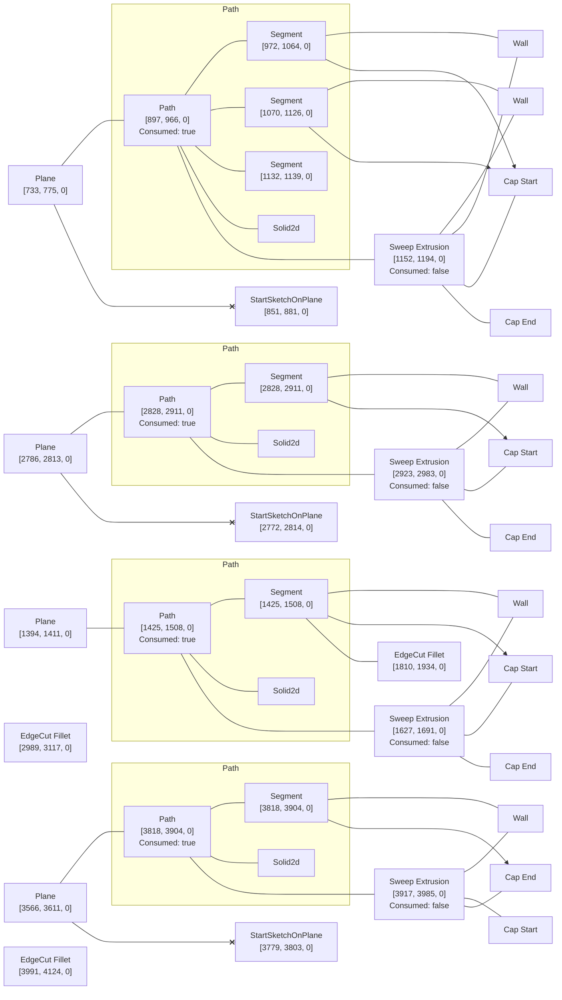

```mermaid
flowchart LR
  subgraph path2 [Path]
    2["Path<br>[897, 966, 0]<br>Consumed: true"]
      %% [ProgramBodyItem { index: 7 }, VariableDeclarationDeclaration, VariableDeclarationInit, PipeBodyItem { index: 0 }]
    3["Segment<br>[972, 1064, 0]"]
      %% [ProgramBodyItem { index: 7 }, VariableDeclarationDeclaration, VariableDeclarationInit, PipeBodyItem { index: 1 }]
    4["Segment<br>[1070, 1126, 0]"]
      %% [ProgramBodyItem { index: 7 }, VariableDeclarationDeclaration, VariableDeclarationInit, PipeBodyItem { index: 2 }]
    5["Segment<br>[1132, 1139, 0]"]
      %% [ProgramBodyItem { index: 7 }, VariableDeclarationDeclaration, VariableDeclarationInit, PipeBodyItem { index: 3 }]
    6[Solid2d]
  end
  subgraph path13 [Path]
    13["Path<br>[1425, 1508, 0]<br>Consumed: true"]
      %% [ProgramBodyItem { index: 11 }, VariableDeclarationDeclaration, VariableDeclarationInit]
    14["Segment<br>[1425, 1508, 0]"]
      %% [ProgramBodyItem { index: 11 }, VariableDeclarationDeclaration, VariableDeclarationInit]
    15[Solid2d]
  end
  subgraph path22 [Path]
    22["Path<br>[2828, 2911, 0]<br>Consumed: true"]
      %% [ProgramBodyItem { index: 28 }, VariableDeclarationDeclaration, VariableDeclarationInit]
    23["Segment<br>[2828, 2911, 0]"]
      %% [ProgramBodyItem { index: 28 }, VariableDeclarationDeclaration, VariableDeclarationInit]
    24[Solid2d]
  end
  subgraph path31 [Path]
    31["Path<br>[3818, 3904, 0]<br>Consumed: true"]
      %% [ProgramBodyItem { index: 37 }, VariableDeclarationDeclaration, VariableDeclarationInit]
    32["Segment<br>[3818, 3904, 0]"]
      %% [ProgramBodyItem { index: 37 }, VariableDeclarationDeclaration, VariableDeclarationInit]
    33[Solid2d]
  end
  1["Plane<br>[733, 775, 0]"]
    %% [ProgramBodyItem { index: 5 }, VariableDeclarationDeclaration, VariableDeclarationInit]
  7["Sweep Extrusion<br>[1152, 1194, 0]<br>Consumed: false"]
    %% [ProgramBodyItem { index: 8 }, VariableDeclarationDeclaration, VariableDeclarationInit]
  8[Wall]
    %% face_code_ref=Missing NodePath
  9[Wall]
    %% face_code_ref=Missing NodePath
  10["Cap Start"]
    %% face_code_ref=Missing NodePath
  11["Cap End"]
    %% face_code_ref=Missing NodePath
  12["Plane<br>[1394, 1411, 0]"]
    %% [ProgramBodyItem { index: 10 }, VariableDeclarationDeclaration, VariableDeclarationInit]
  16["Sweep Extrusion<br>[1627, 1691, 0]<br>Consumed: false"]
    %% [ProgramBodyItem { index: 13 }, VariableDeclarationDeclaration, VariableDeclarationInit]
  17[Wall]
    %% face_code_ref=Missing NodePath
  18["Cap Start"]
    %% face_code_ref=Missing NodePath
  19["Cap End"]
    %% face_code_ref=Missing NodePath
  20["EdgeCut Fillet<br>[1810, 1934, 0]"]
    %% [ProgramBodyItem { index: 15 }, VariableDeclarationDeclaration, VariableDeclarationInit]
  21["Plane<br>[2786, 2813, 0]"]
    %% [ProgramBodyItem { index: 27 }, VariableDeclarationDeclaration, VariableDeclarationInit, CallKwUnlabeledArg]
  25["Sweep Extrusion<br>[2923, 2983, 0]<br>Consumed: false"]
    %% [ProgramBodyItem { index: 29 }, VariableDeclarationDeclaration, VariableDeclarationInit, PipeBodyItem { index: 0 }]
  26[Wall]
    %% face_code_ref=Missing NodePath
  27["Cap Start"]
    %% face_code_ref=Missing NodePath
  28["Cap End"]
    %% face_code_ref=Missing NodePath
  29["EdgeCut Fillet<br>[2989, 3117, 0]"]
    %% [ProgramBodyItem { index: 29 }, VariableDeclarationDeclaration, VariableDeclarationInit, PipeBodyItem { index: 1 }]
  30["Plane<br>[3566, 3611, 0]"]
    %% [ProgramBodyItem { index: 31 }, VariableDeclarationDeclaration, VariableDeclarationInit]
  34["Sweep Extrusion<br>[3917, 3985, 0]<br>Consumed: false"]
    %% [ProgramBodyItem { index: 38 }, VariableDeclarationDeclaration, VariableDeclarationInit, PipeBodyItem { index: 0 }]
  35[Wall]
    %% face_code_ref=Missing NodePath
  36["Cap Start"]
    %% face_code_ref=Missing NodePath
  37["Cap End"]
    %% face_code_ref=Missing NodePath
  38["EdgeCut Fillet<br>[3991, 4124, 0]"]
    %% [ProgramBodyItem { index: 38 }, VariableDeclarationDeclaration, VariableDeclarationInit, PipeBodyItem { index: 1 }]
  39["StartSketchOnPlane<br>[851, 881, 0]"]
    %% [ProgramBodyItem { index: 6 }, VariableDeclarationDeclaration, VariableDeclarationInit]
  40["StartSketchOnPlane<br>[2772, 2814, 0]"]
    %% [ProgramBodyItem { index: 27 }, VariableDeclarationDeclaration, VariableDeclarationInit]
  41["StartSketchOnPlane<br>[3779, 3803, 0]"]
    %% [ProgramBodyItem { index: 36 }, VariableDeclarationDeclaration, VariableDeclarationInit]
  1 --- 2
  1 <--x 39
  2 --- 3
  2 --- 4
  2 --- 5
  2 --- 6
  2 ---- 7
  3 --- 9
  3 x--> 10
  4 --- 8
  4 x--> 10
  7 --- 8
  7 --- 9
  7 --- 10
  7 --- 11
  12 --- 13
  13 --- 14
  13 --- 15
  13 ---- 16
  14 --- 17
  14 x--> 18
  14 --- 20
  16 --- 17
  16 --- 18
  16 --- 19
  21 --- 22
  21 <--x 40
  22 --- 23
  22 --- 24
  22 ---- 25
  23 --- 26
  23 x--> 27
  25 --- 26
  25 --- 27
  25 --- 28
  30 --- 31
  30 <--x 41
  31 --- 32
  31 --- 33
  31 ---- 34
  32 --- 35
  32 x--> 37
  34 --- 35
  34 --- 36
  34 --- 37
```
