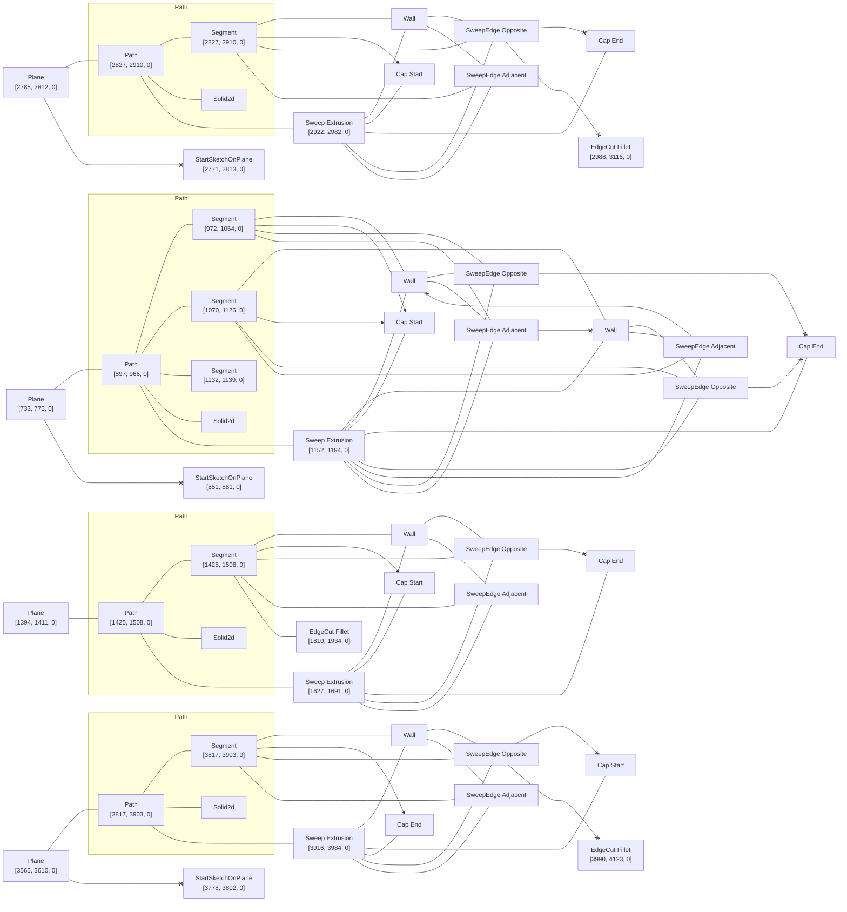

```mermaid
flowchart LR
  subgraph path2 [Path]
    2["Path<br>[897, 966, 0]"]
      %% [ProgramBodyItem { index: 7 }, VariableDeclarationDeclaration, VariableDeclarationInit, PipeBodyItem { index: 0 }]
    3["Segment<br>[972, 1064, 0]"]
      %% [ProgramBodyItem { index: 7 }, VariableDeclarationDeclaration, VariableDeclarationInit, PipeBodyItem { index: 1 }]
    4["Segment<br>[1070, 1126, 0]"]
      %% [ProgramBodyItem { index: 7 }, VariableDeclarationDeclaration, VariableDeclarationInit, PipeBodyItem { index: 2 }]
    5["Segment<br>[1132, 1139, 0]"]
      %% [ProgramBodyItem { index: 7 }, VariableDeclarationDeclaration, VariableDeclarationInit, PipeBodyItem { index: 3 }]
    6[Solid2d]
  end
  subgraph path17 [Path]
    17["Path<br>[1425, 1508, 0]"]
      %% [ProgramBodyItem { index: 11 }, VariableDeclarationDeclaration, VariableDeclarationInit]
    18["Segment<br>[1425, 1508, 0]"]
      %% [ProgramBodyItem { index: 11 }, VariableDeclarationDeclaration, VariableDeclarationInit]
    19[Solid2d]
  end
  subgraph path28 [Path]
    28["Path<br>[2827, 2910, 0]"]
      %% [ProgramBodyItem { index: 28 }, VariableDeclarationDeclaration, VariableDeclarationInit]
    29["Segment<br>[2827, 2910, 0]"]
      %% [ProgramBodyItem { index: 28 }, VariableDeclarationDeclaration, VariableDeclarationInit]
    30[Solid2d]
  end
  subgraph path39 [Path]
    39["Path<br>[3817, 3903, 0]"]
      %% [ProgramBodyItem { index: 37 }, VariableDeclarationDeclaration, VariableDeclarationInit]
    40["Segment<br>[3817, 3903, 0]"]
      %% [ProgramBodyItem { index: 37 }, VariableDeclarationDeclaration, VariableDeclarationInit]
    41[Solid2d]
  end
  1["Plane<br>[733, 775, 0]"]
    %% [ProgramBodyItem { index: 5 }, VariableDeclarationDeclaration, VariableDeclarationInit]
  7["Sweep Extrusion<br>[1152, 1194, 0]"]
    %% [ProgramBodyItem { index: 8 }, VariableDeclarationDeclaration, VariableDeclarationInit]
  8[Wall]
    %% face_code_ref=Missing NodePath
  9[Wall]
    %% face_code_ref=Missing NodePath
  10["Cap Start"]
    %% face_code_ref=Missing NodePath
  11["Cap End"]
    %% face_code_ref=Missing NodePath
  12["SweepEdge Opposite"]
  13["SweepEdge Adjacent"]
  14["SweepEdge Opposite"]
  15["SweepEdge Adjacent"]
  16["Plane<br>[1394, 1411, 0]"]
    %% [ProgramBodyItem { index: 10 }, VariableDeclarationDeclaration, VariableDeclarationInit]
  20["Sweep Extrusion<br>[1627, 1691, 0]"]
    %% [ProgramBodyItem { index: 13 }, VariableDeclarationDeclaration, VariableDeclarationInit]
  21[Wall]
    %% face_code_ref=Missing NodePath
  22["Cap Start"]
    %% face_code_ref=Missing NodePath
  23["Cap End"]
    %% face_code_ref=Missing NodePath
  24["SweepEdge Opposite"]
  25["SweepEdge Adjacent"]
  26["EdgeCut Fillet<br>[1810, 1934, 0]"]
    %% [ProgramBodyItem { index: 15 }, VariableDeclarationDeclaration, VariableDeclarationInit]
  27["Plane<br>[2785, 2812, 0]"]
    %% [ProgramBodyItem { index: 27 }, VariableDeclarationDeclaration, VariableDeclarationInit, CallKwUnlabeledArg]
  31["Sweep Extrusion<br>[2922, 2982, 0]"]
    %% [ProgramBodyItem { index: 29 }, VariableDeclarationDeclaration, VariableDeclarationInit, PipeBodyItem { index: 0 }]
  32[Wall]
    %% face_code_ref=Missing NodePath
  33["Cap Start"]
    %% face_code_ref=Missing NodePath
  34["Cap End"]
    %% face_code_ref=Missing NodePath
  35["SweepEdge Opposite"]
  36["SweepEdge Adjacent"]
  37["EdgeCut Fillet<br>[2988, 3116, 0]"]
    %% [ProgramBodyItem { index: 29 }, VariableDeclarationDeclaration, VariableDeclarationInit, PipeBodyItem { index: 1 }]
  38["Plane<br>[3565, 3610, 0]"]
    %% [ProgramBodyItem { index: 31 }, VariableDeclarationDeclaration, VariableDeclarationInit]
  42["Sweep Extrusion<br>[3916, 3984, 0]"]
    %% [ProgramBodyItem { index: 38 }, VariableDeclarationDeclaration, VariableDeclarationInit, PipeBodyItem { index: 0 }]
  43[Wall]
    %% face_code_ref=Missing NodePath
  44["Cap Start"]
    %% face_code_ref=Missing NodePath
  45["Cap End"]
    %% face_code_ref=Missing NodePath
  46["SweepEdge Opposite"]
  47["SweepEdge Adjacent"]
  48["EdgeCut Fillet<br>[3990, 4123, 0]"]
    %% [ProgramBodyItem { index: 38 }, VariableDeclarationDeclaration, VariableDeclarationInit, PipeBodyItem { index: 1 }]
  49["StartSketchOnPlane<br>[851, 881, 0]"]
    %% [ProgramBodyItem { index: 6 }, VariableDeclarationDeclaration, VariableDeclarationInit]
  50["StartSketchOnPlane<br>[2771, 2813, 0]"]
    %% [ProgramBodyItem { index: 27 }, VariableDeclarationDeclaration, VariableDeclarationInit]
  51["StartSketchOnPlane<br>[3778, 3802, 0]"]
    %% [ProgramBodyItem { index: 36 }, VariableDeclarationDeclaration, VariableDeclarationInit]
  1 --- 2
  1 <--x 49
  2 --- 3
  2 --- 4
  2 --- 5
  2 --- 6
  2 ---- 7
  3 --- 9
  3 x--> 10
  3 --- 14
  3 --- 15
  4 --- 8
  4 x--> 10
  4 --- 12
  4 --- 13
  7 --- 8
  7 --- 9
  7 --- 10
  7 --- 11
  7 --- 12
  7 --- 13
  7 --- 14
  7 --- 15
  8 --- 12
  8 --- 13
  15 <--x 8
  13 <--x 9
  9 --- 14
  9 --- 15
  12 <--x 11
  14 <--x 11
  16 --- 17
  17 --- 18
  17 --- 19
  17 ---- 20
  18 --- 21
  18 x--> 22
  18 --- 24
  18 --- 25
  18 --- 26
  20 --- 21
  20 --- 22
  20 --- 23
  20 --- 24
  20 --- 25
  21 --- 24
  21 --- 25
  24 <--x 23
  27 --- 28
  27 <--x 50
  28 --- 29
  28 --- 30
  28 ---- 31
  29 --- 32
  29 x--> 33
  29 --- 35
  29 --- 36
  31 --- 32
  31 --- 33
  31 --- 34
  31 --- 35
  31 --- 36
  32 --- 35
  32 --- 36
  35 <--x 34
  35 <--x 37
  38 --- 39
  38 <--x 51
  39 --- 40
  39 --- 41
  39 ---- 42
  40 --- 43
  40 x--> 45
  40 --- 46
  40 --- 47
  42 --- 43
  42 --- 44
  42 --- 45
  42 --- 46
  42 --- 47
  43 --- 46
  43 --- 47
  46 <--x 44
  46 <--x 48
```
