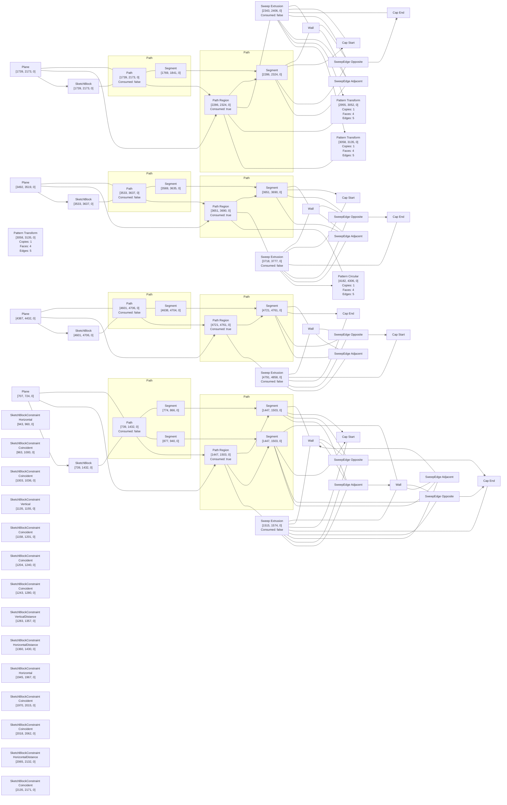

```mermaid
flowchart LR
  subgraph path2 [Path]
    2["Path<br>[739, 1432, 0]<br>Consumed: false"]
      %% [ProgramBodyItem { index: 6 }, VariableDeclarationDeclaration, VariableDeclarationInit]
    3["Segment<br>[774, 866, 0]"]
      %% [ProgramBodyItem { index: 6 }, VariableDeclarationDeclaration, VariableDeclarationInit, SketchBlockBody, SketchBlockBodyItem { index: 0 }, VariableDeclarationDeclaration, VariableDeclarationInit]
    4["Segment<br>[877, 940, 0]"]
      %% [ProgramBodyItem { index: 6 }, VariableDeclarationDeclaration, VariableDeclarationInit, SketchBlockBody, SketchBlockBodyItem { index: 1 }, VariableDeclarationDeclaration, VariableDeclarationInit]
  end
  subgraph path5 [Path]
    5["Path Region<br>[1447, 1503, 0]<br>Consumed: true"]
      %% [ProgramBodyItem { index: 7 }, VariableDeclarationDeclaration, VariableDeclarationInit]
    6["Segment<br>[1447, 1503, 0]"]
      %% [ProgramBodyItem { index: 7 }, VariableDeclarationDeclaration, VariableDeclarationInit]
    7["Segment<br>[1447, 1503, 0]"]
      %% [ProgramBodyItem { index: 7 }, VariableDeclarationDeclaration, VariableDeclarationInit]
  end
  subgraph path18 [Path]
    18["Path<br>[1739, 2173, 0]<br>Consumed: false"]
      %% [ProgramBodyItem { index: 11 }, VariableDeclarationDeclaration, VariableDeclarationInit]
    19["Segment<br>[1769, 1841, 0]"]
      %% [ProgramBodyItem { index: 11 }, VariableDeclarationDeclaration, VariableDeclarationInit, SketchBlockBody, SketchBlockBodyItem { index: 0 }, VariableDeclarationDeclaration, VariableDeclarationInit]
  end
  subgraph path20 [Path]
    20["Path Region<br>[2286, 2324, 0]<br>Consumed: true"]
      %% [ProgramBodyItem { index: 13 }, VariableDeclarationDeclaration, VariableDeclarationInit]
    21["Segment<br>[2286, 2324, 0]"]
      %% [ProgramBodyItem { index: 13 }, VariableDeclarationDeclaration, VariableDeclarationInit]
  end
  subgraph path32 [Path]
    32["Path<br>[3533, 3637, 0]<br>Consumed: false"]
      %% [ProgramBodyItem { index: 30 }, VariableDeclarationDeclaration, VariableDeclarationInit]
    33["Segment<br>[3569, 3635, 0]"]
      %% [ProgramBodyItem { index: 30 }, VariableDeclarationDeclaration, VariableDeclarationInit, SketchBlockBody, SketchBlockBodyItem { index: 0 }, VariableDeclarationDeclaration, VariableDeclarationInit]
  end
  subgraph path34 [Path]
    34["Path Region<br>[3651, 3690, 0]<br>Consumed: true"]
      %% [ProgramBodyItem { index: 31 }, VariableDeclarationDeclaration, VariableDeclarationInit]
    35["Segment<br>[3651, 3690, 0]"]
      %% [ProgramBodyItem { index: 31 }, VariableDeclarationDeclaration, VariableDeclarationInit]
  end
  subgraph path44 [Path]
    44["Path<br>[4601, 4706, 0]<br>Consumed: false"]
      %% [ProgramBodyItem { index: 40 }, VariableDeclarationDeclaration, VariableDeclarationInit]
    45["Segment<br>[4638, 4704, 0]"]
      %% [ProgramBodyItem { index: 40 }, VariableDeclarationDeclaration, VariableDeclarationInit, SketchBlockBody, SketchBlockBodyItem { index: 0 }, VariableDeclarationDeclaration, VariableDeclarationInit]
  end
  subgraph path46 [Path]
    46["Path Region<br>[4721, 4761, 0]<br>Consumed: true"]
      %% [ProgramBodyItem { index: 41 }, VariableDeclarationDeclaration, VariableDeclarationInit]
    47["Segment<br>[4721, 4761, 0]"]
      %% [ProgramBodyItem { index: 41 }, VariableDeclarationDeclaration, VariableDeclarationInit]
  end
  1["Plane<br>[707, 724, 0]"]
    %% [ProgramBodyItem { index: 5 }, VariableDeclarationDeclaration, VariableDeclarationInit]
  8["Sweep Extrusion<br>[1515, 1574, 0]<br>Consumed: false"]
    %% [ProgramBodyItem { index: 8 }, VariableDeclarationDeclaration, VariableDeclarationInit]
  9[Wall]
    %% face_code_ref=Missing NodePath
  10[Wall]
    %% face_code_ref=Missing NodePath
  11["Cap Start"]
    %% face_code_ref=Missing NodePath
  12["Cap End"]
    %% face_code_ref=Missing NodePath
  13["SweepEdge Opposite"]
  14["SweepEdge Adjacent"]
  15["SweepEdge Opposite"]
  16["SweepEdge Adjacent"]
  17["Plane<br>[1739, 2173, 0]"]
    %% [ProgramBodyItem { index: 11 }, VariableDeclarationDeclaration, VariableDeclarationInit]
  22["Sweep Extrusion<br>[2343, 2406, 0]<br>Consumed: false"]
    %% [ProgramBodyItem { index: 14 }, VariableDeclarationDeclaration, VariableDeclarationInit]
  23[Wall]
    %% face_code_ref=Missing NodePath
  24["Cap Start"]
    %% face_code_ref=Missing NodePath
  25["Cap End"]
    %% face_code_ref=Missing NodePath
  26["SweepEdge Opposite"]
  27["SweepEdge Adjacent"]
  28["Pattern Transform<br>[2955, 3052, 0]<br>Copies: 1<br>Faces: 4<br>Edges: 5"]
    %% [ProgramBodyItem { index: 21 }, VariableDeclarationDeclaration, VariableDeclarationInit, PipeBodyItem { index: 0 }]
  29["Pattern Transform<br>[3058, 3135, 0]<br>Copies: 1<br>Faces: 4<br>Edges: 5"]
    %% [ProgramBodyItem { index: 21 }, VariableDeclarationDeclaration, VariableDeclarationInit, PipeBodyItem { index: 1 }]
  30["Pattern Transform<br>[3058, 3135, 0]<br>Copies: 1<br>Faces: 4<br>Edges: 5"]
    %% [ProgramBodyItem { index: 21 }, VariableDeclarationDeclaration, VariableDeclarationInit, PipeBodyItem { index: 1 }]
  31["Plane<br>[3492, 3519, 0]"]
    %% [ProgramBodyItem { index: 29 }, VariableDeclarationDeclaration, VariableDeclarationInit]
  36["Sweep Extrusion<br>[3718, 3777, 0]<br>Consumed: false"]
    %% [ProgramBodyItem { index: 33 }, VariableDeclarationDeclaration, VariableDeclarationInit, PipeBodyItem { index: 0 }]
  37[Wall]
    %% face_code_ref=Missing NodePath
  38["Cap Start"]
    %% face_code_ref=Missing NodePath
  39["Cap End"]
    %% face_code_ref=Missing NodePath
  40["SweepEdge Opposite"]
  41["SweepEdge Adjacent"]
  42["Pattern Circular<br>[4182, 4306, 0]<br>Copies: 1<br>Faces: 4<br>Edges: 5"]
    %% [ProgramBodyItem { index: 34 }, VariableDeclarationDeclaration, VariableDeclarationInit]
  43["Plane<br>[4387, 4432, 0]"]
    %% [ProgramBodyItem { index: 35 }, VariableDeclarationDeclaration, VariableDeclarationInit]
  48["Sweep Extrusion<br>[4791, 4858, 0]<br>Consumed: false"]
    %% [ProgramBodyItem { index: 43 }, VariableDeclarationDeclaration, VariableDeclarationInit, PipeBodyItem { index: 0 }]
  49[Wall]
    %% face_code_ref=Missing NodePath
  50["Cap Start"]
    %% face_code_ref=Missing NodePath
  51["Cap End"]
    %% face_code_ref=Missing NodePath
  52["SweepEdge Opposite"]
  53["SweepEdge Adjacent"]
  54["SketchBlock<br>[739, 1432, 0]"]
    %% [ProgramBodyItem { index: 6 }, VariableDeclarationDeclaration, VariableDeclarationInit]
  55["SketchBlockConstraint Horizontal<br>[943, 960, 0]"]
    %% [ProgramBodyItem { index: 6 }, VariableDeclarationDeclaration, VariableDeclarationInit, SketchBlockBody, SketchBlockBodyItem { index: 2 }, ExpressionStatementExpr]
  56["SketchBlockConstraint Coincident<br>[963, 1000, 0]"]
    %% [ProgramBodyItem { index: 6 }, VariableDeclarationDeclaration, VariableDeclarationInit, SketchBlockBody, SketchBlockBodyItem { index: 3 }, ExpressionStatementExpr]
  57["SketchBlockConstraint Coincident<br>[1003, 1036, 0]"]
    %% [ProgramBodyItem { index: 6 }, VariableDeclarationDeclaration, VariableDeclarationInit, SketchBlockBody, SketchBlockBodyItem { index: 4 }, ExpressionStatementExpr]
  58["SketchBlockConstraint Vertical<br>[1135, 1155, 0]"]
    %% [ProgramBodyItem { index: 6 }, VariableDeclarationDeclaration, VariableDeclarationInit, SketchBlockBody, SketchBlockBodyItem { index: 6 }, ExpressionStatementExpr]
  59["SketchBlockConstraint Coincident<br>[1158, 1201, 0]"]
    %% [ProgramBodyItem { index: 6 }, VariableDeclarationDeclaration, VariableDeclarationInit, SketchBlockBody, SketchBlockBodyItem { index: 7 }, ExpressionStatementExpr]
  60["SketchBlockConstraint Coincident<br>[1204, 1240, 0]"]
    %% [ProgramBodyItem { index: 6 }, VariableDeclarationDeclaration, VariableDeclarationInit, SketchBlockBody, SketchBlockBodyItem { index: 8 }, ExpressionStatementExpr]
  61["SketchBlockConstraint Coincident<br>[1243, 1280, 0]"]
    %% [ProgramBodyItem { index: 6 }, VariableDeclarationDeclaration, VariableDeclarationInit, SketchBlockBody, SketchBlockBodyItem { index: 9 }, ExpressionStatementExpr]
  62["SketchBlockConstraint VerticalDistance<br>[1283, 1357, 0]"]
    %% [ProgramBodyItem { index: 6 }, VariableDeclarationDeclaration, VariableDeclarationInit, SketchBlockBody, SketchBlockBodyItem { index: 10 }, ExpressionStatementExpr]
  63["SketchBlockConstraint HorizontalDistance<br>[1360, 1430, 0]"]
    %% [ProgramBodyItem { index: 6 }, VariableDeclarationDeclaration, VariableDeclarationInit, SketchBlockBody, SketchBlockBodyItem { index: 11 }, ExpressionStatementExpr]
  64["SketchBlock<br>[1739, 2173, 0]"]
    %% [ProgramBodyItem { index: 11 }, VariableDeclarationDeclaration, VariableDeclarationInit]
  65["SketchBlockConstraint Horizontal<br>[1945, 1967, 0]"]
    %% [ProgramBodyItem { index: 11 }, VariableDeclarationDeclaration, VariableDeclarationInit, SketchBlockBody, SketchBlockBodyItem { index: 2 }, ExpressionStatementExpr]
  66["SketchBlockConstraint Coincident<br>[1970, 2015, 0]"]
    %% [ProgramBodyItem { index: 11 }, VariableDeclarationDeclaration, VariableDeclarationInit, SketchBlockBody, SketchBlockBodyItem { index: 3 }, ExpressionStatementExpr]
  67["SketchBlockConstraint Coincident<br>[2018, 2062, 0]"]
    %% [ProgramBodyItem { index: 11 }, VariableDeclarationDeclaration, VariableDeclarationInit, SketchBlockBody, SketchBlockBodyItem { index: 4 }, ExpressionStatementExpr]
  68["SketchBlockConstraint HorizontalDistance<br>[2065, 2132, 0]"]
    %% [ProgramBodyItem { index: 11 }, VariableDeclarationDeclaration, VariableDeclarationInit, SketchBlockBody, SketchBlockBodyItem { index: 5 }, ExpressionStatementExpr]
  69["SketchBlockConstraint Coincident<br>[2135, 2171, 0]"]
    %% [ProgramBodyItem { index: 11 }, VariableDeclarationDeclaration, VariableDeclarationInit, SketchBlockBody, SketchBlockBodyItem { index: 6 }, ExpressionStatementExpr]
  70["SketchBlock<br>[3533, 3637, 0]"]
    %% [ProgramBodyItem { index: 30 }, VariableDeclarationDeclaration, VariableDeclarationInit]
  71["SketchBlock<br>[4601, 4706, 0]"]
    %% [ProgramBodyItem { index: 40 }, VariableDeclarationDeclaration, VariableDeclarationInit]
  1 --- 2
  1 <--x 5
  1 <--x 54
  2 --- 3
  2 --- 4
  2 <--x 5
  54 --- 2
  3 <--x 6
  4 <--x 7
  5 <--x 6
  5 <--x 7
  5 ---- 8
  6 --- 10
  6 x--> 11
  6 --- 15
  6 --- 16
  7 --- 9
  7 x--> 11
  7 --- 13
  7 --- 14
  8 --- 9
  8 --- 10
  8 --- 11
  8 --- 12
  8 --- 13
  8 --- 14
  8 --- 15
  8 --- 16
  9 --- 13
  9 --- 14
  16 <--x 9
  14 <--x 10
  10 --- 15
  10 --- 16
  13 <--x 12
  15 <--x 12
  17 --- 18
  17 <--x 20
  17 <--x 64
  18 --- 19
  18 <--x 20
  64 --- 18
  19 <--x 21
  20 <--x 21
  20 ---- 22
  20 --- 28
  20 --- 29
  21 --- 23
  21 x--> 24
  21 --- 26
  21 --- 27
  22 --- 23
  22 --- 24
  22 --- 25
  22 --- 26
  22 --- 27
  22 x--> 28
  22 x--> 29
  23 --- 26
  23 --- 27
  26 <--x 25
  31 --- 32
  31 <--x 34
  31 <--x 70
  32 --- 33
  32 <--x 34
  70 --- 32
  33 <--x 35
  34 <--x 35
  34 ---- 36
  34 --- 42
  35 --- 37
  35 x--> 38
  35 --- 40
  35 --- 41
  36 --- 37
  36 --- 38
  36 --- 39
  36 --- 40
  36 --- 41
  36 x--> 42
  37 --- 40
  37 --- 41
  40 <--x 39
  43 --- 44
  43 <--x 46
  43 <--x 71
  44 --- 45
  44 <--x 46
  71 --- 44
  45 <--x 47
  46 <--x 47
  46 ---- 48
  47 --- 49
  47 x--> 51
  47 --- 52
  47 --- 53
  48 --- 49
  48 --- 50
  48 --- 51
  48 --- 52
  48 --- 53
  49 --- 52
  49 --- 53
  52 <--x 50
```
