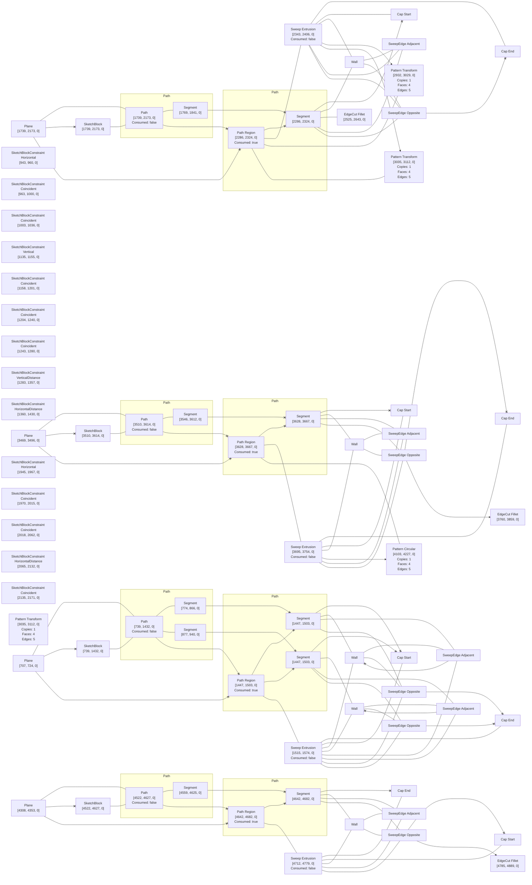

```mermaid
flowchart LR
  subgraph path15 [Path]
    15["Path<br>[739, 1432, 0]<br>Consumed: false"]
      %% [ProgramBodyItem { index: 6 }, VariableDeclarationDeclaration, VariableDeclarationInit]
    17["Segment<br>[774, 866, 0]"]
      %% [ProgramBodyItem { index: 6 }, VariableDeclarationDeclaration, VariableDeclarationInit, SketchBlockBody, SketchBlockBodyItem { index: 0 }, VariableDeclarationDeclaration, VariableDeclarationInit]
    18["Segment<br>[877, 940, 0]"]
      %% [ProgramBodyItem { index: 6 }, VariableDeclarationDeclaration, VariableDeclarationInit, SketchBlockBody, SketchBlockBodyItem { index: 1 }, VariableDeclarationDeclaration, VariableDeclarationInit]
  end
  subgraph path28 [Path]
    28["Path Region<br>[1447, 1503, 0]<br>Consumed: true"]
      %% [ProgramBodyItem { index: 7 }, VariableDeclarationDeclaration, VariableDeclarationInit]
    29["Segment<br>[1447, 1503, 0]"]
      %% [ProgramBodyItem { index: 7 }, VariableDeclarationDeclaration, VariableDeclarationInit]
    30["Segment<br>[1447, 1503, 0]"]
      %% [ProgramBodyItem { index: 7 }, VariableDeclarationDeclaration, VariableDeclarationInit]
  end
  subgraph path32 [Path]
    32["Path<br>[1739, 2173, 0]<br>Consumed: false"]
      %% [ProgramBodyItem { index: 11 }, VariableDeclarationDeclaration, VariableDeclarationInit]
    35["Segment<br>[1769, 1841, 0]"]
      %% [ProgramBodyItem { index: 11 }, VariableDeclarationDeclaration, VariableDeclarationInit, SketchBlockBody, SketchBlockBodyItem { index: 0 }, VariableDeclarationDeclaration, VariableDeclarationInit]
  end
  subgraph path41 [Path]
    41["Path Region<br>[2286, 2324, 0]<br>Consumed: true"]
      %% [ProgramBodyItem { index: 13 }, VariableDeclarationDeclaration, VariableDeclarationInit]
    42["Segment<br>[2286, 2324, 0]"]
      %% [ProgramBodyItem { index: 13 }, VariableDeclarationDeclaration, VariableDeclarationInit]
  end
  subgraph path49 [Path]
    49["Path<br>[3510, 3614, 0]<br>Consumed: false"]
      %% [ProgramBodyItem { index: 30 }, VariableDeclarationDeclaration, VariableDeclarationInit]
    51["Segment<br>[3546, 3612, 0]"]
      %% [ProgramBodyItem { index: 30 }, VariableDeclarationDeclaration, VariableDeclarationInit, SketchBlockBody, SketchBlockBodyItem { index: 0 }, VariableDeclarationDeclaration, VariableDeclarationInit]
  end
  subgraph path52 [Path]
    52["Path Region<br>[3628, 3667, 0]<br>Consumed: true"]
      %% [ProgramBodyItem { index: 31 }, VariableDeclarationDeclaration, VariableDeclarationInit]
    53["Segment<br>[3628, 3667, 0]"]
      %% [ProgramBodyItem { index: 31 }, VariableDeclarationDeclaration, VariableDeclarationInit]
  end
  subgraph path58 [Path]
    58["Path<br>[4522, 4627, 0]<br>Consumed: false"]
      %% [ProgramBodyItem { index: 40 }, VariableDeclarationDeclaration, VariableDeclarationInit]
    60["Segment<br>[4559, 4625, 0]"]
      %% [ProgramBodyItem { index: 40 }, VariableDeclarationDeclaration, VariableDeclarationInit, SketchBlockBody, SketchBlockBodyItem { index: 0 }, VariableDeclarationDeclaration, VariableDeclarationInit]
  end
  subgraph path61 [Path]
    61["Path Region<br>[4642, 4682, 0]<br>Consumed: true"]
      %% [ProgramBodyItem { index: 41 }, VariableDeclarationDeclaration, VariableDeclarationInit]
    62["Segment<br>[4642, 4682, 0]"]
      %% [ProgramBodyItem { index: 41 }, VariableDeclarationDeclaration, VariableDeclarationInit]
  end
  1["Cap End"]
    %% face_code_ref=Missing NodePath
  2["Cap End"]
    %% face_code_ref=Missing NodePath
  3["Cap End"]
    %% face_code_ref=Missing NodePath
  4["Cap End"]
    %% face_code_ref=Missing NodePath
  5["Cap Start"]
    %% face_code_ref=Missing NodePath
  6["Cap Start"]
    %% face_code_ref=Missing NodePath
  7["Cap Start"]
    %% face_code_ref=Missing NodePath
  8["Cap Start"]
    %% face_code_ref=Missing NodePath
  9[Wall]
    %% face_code_ref=Missing NodePath
  10[Wall]
    %% face_code_ref=Missing NodePath
  11[Wall]
    %% face_code_ref=Missing NodePath
  12[Wall]
    %% face_code_ref=Missing NodePath
  13[Wall]
    %% face_code_ref=Missing NodePath
  14["Plane<br>[707, 724, 0]"]
    %% [ProgramBodyItem { index: 5 }, VariableDeclarationDeclaration, VariableDeclarationInit]
  16["SketchBlock<br>[739, 1432, 0]"]
    %% [ProgramBodyItem { index: 6 }, VariableDeclarationDeclaration, VariableDeclarationInit]
  19["SketchBlockConstraint Horizontal<br>[943, 960, 0]"]
    %% [ProgramBodyItem { index: 6 }, VariableDeclarationDeclaration, VariableDeclarationInit, SketchBlockBody, SketchBlockBodyItem { index: 2 }, ExpressionStatementExpr]
  20["SketchBlockConstraint Coincident<br>[963, 1000, 0]"]
    %% [ProgramBodyItem { index: 6 }, VariableDeclarationDeclaration, VariableDeclarationInit, SketchBlockBody, SketchBlockBodyItem { index: 3 }, ExpressionStatementExpr]
  21["SketchBlockConstraint Coincident<br>[1003, 1036, 0]"]
    %% [ProgramBodyItem { index: 6 }, VariableDeclarationDeclaration, VariableDeclarationInit, SketchBlockBody, SketchBlockBodyItem { index: 4 }, ExpressionStatementExpr]
  22["SketchBlockConstraint Vertical<br>[1135, 1155, 0]"]
    %% [ProgramBodyItem { index: 6 }, VariableDeclarationDeclaration, VariableDeclarationInit, SketchBlockBody, SketchBlockBodyItem { index: 6 }, ExpressionStatementExpr]
  23["SketchBlockConstraint Coincident<br>[1158, 1201, 0]"]
    %% [ProgramBodyItem { index: 6 }, VariableDeclarationDeclaration, VariableDeclarationInit, SketchBlockBody, SketchBlockBodyItem { index: 7 }, ExpressionStatementExpr]
  24["SketchBlockConstraint Coincident<br>[1204, 1240, 0]"]
    %% [ProgramBodyItem { index: 6 }, VariableDeclarationDeclaration, VariableDeclarationInit, SketchBlockBody, SketchBlockBodyItem { index: 8 }, ExpressionStatementExpr]
  25["SketchBlockConstraint Coincident<br>[1243, 1280, 0]"]
    %% [ProgramBodyItem { index: 6 }, VariableDeclarationDeclaration, VariableDeclarationInit, SketchBlockBody, SketchBlockBodyItem { index: 9 }, ExpressionStatementExpr]
  26["SketchBlockConstraint VerticalDistance<br>[1283, 1357, 0]"]
    %% [ProgramBodyItem { index: 6 }, VariableDeclarationDeclaration, VariableDeclarationInit, SketchBlockBody, SketchBlockBodyItem { index: 10 }, ExpressionStatementExpr]
  27["SketchBlockConstraint HorizontalDistance<br>[1360, 1430, 0]"]
    %% [ProgramBodyItem { index: 6 }, VariableDeclarationDeclaration, VariableDeclarationInit, SketchBlockBody, SketchBlockBodyItem { index: 11 }, ExpressionStatementExpr]
  31["Sweep Extrusion<br>[1515, 1574, 0]<br>Consumed: false"]
    %% [ProgramBodyItem { index: 8 }, VariableDeclarationDeclaration, VariableDeclarationInit]
  33["Plane<br>[1739, 2173, 0]"]
    %% [ProgramBodyItem { index: 11 }, VariableDeclarationDeclaration, VariableDeclarationInit]
  34["SketchBlock<br>[1739, 2173, 0]"]
    %% [ProgramBodyItem { index: 11 }, VariableDeclarationDeclaration, VariableDeclarationInit]
  36["SketchBlockConstraint Horizontal<br>[1945, 1967, 0]"]
    %% [ProgramBodyItem { index: 11 }, VariableDeclarationDeclaration, VariableDeclarationInit, SketchBlockBody, SketchBlockBodyItem { index: 2 }, ExpressionStatementExpr]
  37["SketchBlockConstraint Coincident<br>[1970, 2015, 0]"]
    %% [ProgramBodyItem { index: 11 }, VariableDeclarationDeclaration, VariableDeclarationInit, SketchBlockBody, SketchBlockBodyItem { index: 3 }, ExpressionStatementExpr]
  38["SketchBlockConstraint Coincident<br>[2018, 2062, 0]"]
    %% [ProgramBodyItem { index: 11 }, VariableDeclarationDeclaration, VariableDeclarationInit, SketchBlockBody, SketchBlockBodyItem { index: 4 }, ExpressionStatementExpr]
  39["SketchBlockConstraint HorizontalDistance<br>[2065, 2132, 0]"]
    %% [ProgramBodyItem { index: 11 }, VariableDeclarationDeclaration, VariableDeclarationInit, SketchBlockBody, SketchBlockBodyItem { index: 5 }, ExpressionStatementExpr]
  40["SketchBlockConstraint Coincident<br>[2135, 2171, 0]"]
    %% [ProgramBodyItem { index: 11 }, VariableDeclarationDeclaration, VariableDeclarationInit, SketchBlockBody, SketchBlockBodyItem { index: 6 }, ExpressionStatementExpr]
  43["Sweep Extrusion<br>[2343, 2406, 0]<br>Consumed: false"]
    %% [ProgramBodyItem { index: 14 }, VariableDeclarationDeclaration, VariableDeclarationInit]
  44["EdgeCut Fillet<br>[2525, 2643, 0]"]
    %% [ProgramBodyItem { index: 16 }, VariableDeclarationDeclaration, VariableDeclarationInit]
  45["Pattern Transform<br>[2932, 3029, 0]<br>Copies: 1<br>Faces: 4<br>Edges: 5"]
    %% [ProgramBodyItem { index: 21 }, VariableDeclarationDeclaration, VariableDeclarationInit, PipeBodyItem { index: 0 }]
  46["Pattern Transform<br>[3035, 3112, 0]<br>Copies: 1<br>Faces: 4<br>Edges: 5"]
    %% [ProgramBodyItem { index: 21 }, VariableDeclarationDeclaration, VariableDeclarationInit, PipeBodyItem { index: 1 }]
  47["Pattern Transform<br>[3035, 3112, 0]<br>Copies: 1<br>Faces: 4<br>Edges: 5"]
    %% [ProgramBodyItem { index: 21 }, VariableDeclarationDeclaration, VariableDeclarationInit, PipeBodyItem { index: 1 }]
  48["Plane<br>[3469, 3496, 0]"]
    %% [ProgramBodyItem { index: 29 }, VariableDeclarationDeclaration, VariableDeclarationInit]
  50["SketchBlock<br>[3510, 3614, 0]"]
    %% [ProgramBodyItem { index: 30 }, VariableDeclarationDeclaration, VariableDeclarationInit]
  54["Sweep Extrusion<br>[3695, 3754, 0]<br>Consumed: false"]
    %% [ProgramBodyItem { index: 33 }, VariableDeclarationDeclaration, VariableDeclarationInit, PipeBodyItem { index: 0 }]
  55["EdgeCut Fillet<br>[3760, 3859, 0]"]
    %% [ProgramBodyItem { index: 33 }, VariableDeclarationDeclaration, VariableDeclarationInit, PipeBodyItem { index: 1 }]
  56["Pattern Circular<br>[4103, 4227, 0]<br>Copies: 1<br>Faces: 4<br>Edges: 5"]
    %% [ProgramBodyItem { index: 34 }, VariableDeclarationDeclaration, VariableDeclarationInit]
  57["Plane<br>[4308, 4353, 0]"]
    %% [ProgramBodyItem { index: 35 }, VariableDeclarationDeclaration, VariableDeclarationInit]
  59["SketchBlock<br>[4522, 4627, 0]"]
    %% [ProgramBodyItem { index: 40 }, VariableDeclarationDeclaration, VariableDeclarationInit]
  63["Sweep Extrusion<br>[4712, 4779, 0]<br>Consumed: false"]
    %% [ProgramBodyItem { index: 43 }, VariableDeclarationDeclaration, VariableDeclarationInit, PipeBodyItem { index: 0 }]
  64["EdgeCut Fillet<br>[4785, 4889, 0]"]
    %% [ProgramBodyItem { index: 43 }, VariableDeclarationDeclaration, VariableDeclarationInit, PipeBodyItem { index: 1 }]
  65["SweepEdge Adjacent"]
  66["SweepEdge Adjacent"]
  67["SweepEdge Adjacent"]
  68["SweepEdge Adjacent"]
  69["SweepEdge Adjacent"]
  70["SweepEdge Opposite"]
  71["SweepEdge Opposite"]
  72["SweepEdge Opposite"]
  73["SweepEdge Opposite"]
  74["SweepEdge Opposite"]
  31 --- 1
  70 <--x 1
  71 <--x 1
  43 --- 2
  72 <--x 2
  54 --- 3
  73 <--x 3
  62 <--x 4
  63 --- 4
  29 <--x 5
  30 <--x 5
  31 --- 5
  42 <--x 6
  43 --- 6
  53 <--x 7
  54 --- 7
  63 --- 8
  74 <--x 8
  29 --- 9
  31 --- 9
  9 --- 65
  65 <--x 9
  9 --- 70
  30 --- 10
  31 --- 10
  10 --- 66
  66 <--x 10
  10 --- 71
  42 --- 11
  43 --- 11
  11 --- 67
  11 --- 72
  53 --- 12
  54 --- 12
  12 --- 68
  12 --- 73
  62 --- 13
  63 --- 13
  13 --- 69
  13 --- 74
  14 --- 15
  14 <--x 16
  14 <--x 28
  16 --- 15
  15 --- 17
  15 --- 18
  15 <--x 28
  17 <--x 29
  18 <--x 30
  28 <--x 29
  28 <--x 30
  28 ---- 31
  29 --- 65
  29 --- 70
  30 --- 66
  30 --- 71
  31 --- 65
  31 --- 66
  31 --- 70
  31 --- 71
  33 --- 32
  34 --- 32
  32 --- 35
  32 <--x 41
  33 <--x 34
  33 <--x 41
  35 <--x 42
  41 <--x 42
  41 ---- 43
  41 --- 45
  41 --- 47
  42 --- 44
  42 --- 67
  42 --- 72
  43 x--> 45
  43 x--> 47
  43 --- 67
  43 --- 72
  48 --- 49
  48 <--x 50
  48 <--x 52
  50 --- 49
  49 --- 51
  49 <--x 52
  51 <--x 53
  52 <--x 53
  52 ---- 54
  52 --- 56
  53 --- 68
  53 --- 73
  54 x--> 56
  54 --- 68
  54 --- 73
  73 x--> 55
  57 --- 58
  57 <--x 59
  57 <--x 61
  59 --- 58
  58 --- 60
  58 <--x 61
  60 <--x 62
  61 <--x 62
  61 ---- 63
  62 --- 69
  62 --- 74
  63 --- 69
  63 --- 74
  74 x--> 64
```
