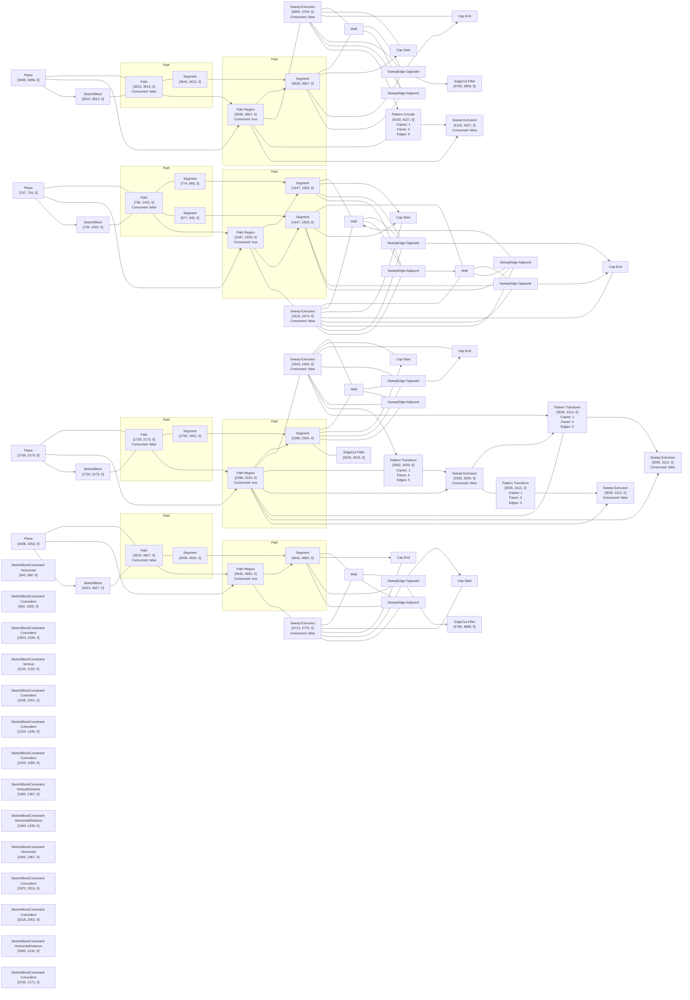

```mermaid
flowchart LR
  subgraph path2 [Path]
    2["Path<br>[739, 1432, 0]<br>Consumed: false"]
      %% [ProgramBodyItem { index: 6 }, VariableDeclarationDeclaration, VariableDeclarationInit]
    3["Segment<br>[774, 866, 0]"]
      %% [ProgramBodyItem { index: 6 }, VariableDeclarationDeclaration, VariableDeclarationInit, SketchBlockBody, SketchBlockBodyItem { index: 0 }, VariableDeclarationDeclaration, VariableDeclarationInit]
    4["Segment<br>[877, 940, 0]"]
      %% [ProgramBodyItem { index: 6 }, VariableDeclarationDeclaration, VariableDeclarationInit, SketchBlockBody, SketchBlockBodyItem { index: 1 }, VariableDeclarationDeclaration, VariableDeclarationInit]
  end
  subgraph path5 [Path]
    5["Path Region<br>[1447, 1503, 0]<br>Consumed: true"]
      %% [ProgramBodyItem { index: 7 }, VariableDeclarationDeclaration, VariableDeclarationInit]
    6["Segment<br>[1447, 1503, 0]"]
      %% [ProgramBodyItem { index: 7 }, VariableDeclarationDeclaration, VariableDeclarationInit]
    7["Segment<br>[1447, 1503, 0]"]
      %% [ProgramBodyItem { index: 7 }, VariableDeclarationDeclaration, VariableDeclarationInit]
  end
  subgraph path18 [Path]
    18["Path<br>[1739, 2173, 0]<br>Consumed: false"]
      %% [ProgramBodyItem { index: 11 }, VariableDeclarationDeclaration, VariableDeclarationInit]
    19["Segment<br>[1769, 1841, 0]"]
      %% [ProgramBodyItem { index: 11 }, VariableDeclarationDeclaration, VariableDeclarationInit, SketchBlockBody, SketchBlockBodyItem { index: 0 }, VariableDeclarationDeclaration, VariableDeclarationInit]
  end
  subgraph path20 [Path]
    20["Path Region<br>[2286, 2324, 0]<br>Consumed: true"]
      %% [ProgramBodyItem { index: 13 }, VariableDeclarationDeclaration, VariableDeclarationInit]
    21["Segment<br>[2286, 2324, 0]"]
      %% [ProgramBodyItem { index: 13 }, VariableDeclarationDeclaration, VariableDeclarationInit]
  end
  subgraph path36 [Path]
    36["Path<br>[3510, 3614, 0]<br>Consumed: false"]
      %% [ProgramBodyItem { index: 30 }, VariableDeclarationDeclaration, VariableDeclarationInit]
    37["Segment<br>[3546, 3612, 0]"]
      %% [ProgramBodyItem { index: 30 }, VariableDeclarationDeclaration, VariableDeclarationInit, SketchBlockBody, SketchBlockBodyItem { index: 0 }, VariableDeclarationDeclaration, VariableDeclarationInit]
  end
  subgraph path38 [Path]
    38["Path Region<br>[3628, 3667, 0]<br>Consumed: true"]
      %% [ProgramBodyItem { index: 31 }, VariableDeclarationDeclaration, VariableDeclarationInit]
    39["Segment<br>[3628, 3667, 0]"]
      %% [ProgramBodyItem { index: 31 }, VariableDeclarationDeclaration, VariableDeclarationInit]
  end
  subgraph path50 [Path]
    50["Path<br>[4522, 4627, 0]<br>Consumed: false"]
      %% [ProgramBodyItem { index: 40 }, VariableDeclarationDeclaration, VariableDeclarationInit]
    51["Segment<br>[4559, 4625, 0]"]
      %% [ProgramBodyItem { index: 40 }, VariableDeclarationDeclaration, VariableDeclarationInit, SketchBlockBody, SketchBlockBodyItem { index: 0 }, VariableDeclarationDeclaration, VariableDeclarationInit]
  end
  subgraph path52 [Path]
    52["Path Region<br>[4642, 4682, 0]<br>Consumed: true"]
      %% [ProgramBodyItem { index: 41 }, VariableDeclarationDeclaration, VariableDeclarationInit]
    53["Segment<br>[4642, 4682, 0]"]
      %% [ProgramBodyItem { index: 41 }, VariableDeclarationDeclaration, VariableDeclarationInit]
  end
  1["Plane<br>[707, 724, 0]"]
    %% [ProgramBodyItem { index: 5 }, VariableDeclarationDeclaration, VariableDeclarationInit]
  8["Sweep Extrusion<br>[1515, 1574, 0]<br>Consumed: false"]
    %% [ProgramBodyItem { index: 8 }, VariableDeclarationDeclaration, VariableDeclarationInit]
  9[Wall]
    %% face_code_ref=Missing NodePath
  10[Wall]
    %% face_code_ref=Missing NodePath
  11["Cap Start"]
    %% face_code_ref=Missing NodePath
  12["Cap End"]
    %% face_code_ref=Missing NodePath
  13["SweepEdge Opposite"]
  14["SweepEdge Adjacent"]
  15["SweepEdge Opposite"]
  16["SweepEdge Adjacent"]
  17["Plane<br>[1739, 2173, 0]"]
    %% [ProgramBodyItem { index: 11 }, VariableDeclarationDeclaration, VariableDeclarationInit]
  22["Sweep Extrusion<br>[2343, 2406, 0]<br>Consumed: false"]
    %% [ProgramBodyItem { index: 14 }, VariableDeclarationDeclaration, VariableDeclarationInit]
  23[Wall]
    %% face_code_ref=Missing NodePath
  24["Cap Start"]
    %% face_code_ref=Missing NodePath
  25["Cap End"]
    %% face_code_ref=Missing NodePath
  26["SweepEdge Opposite"]
  27["SweepEdge Adjacent"]
  28["EdgeCut Fillet<br>[2525, 2643, 0]"]
    %% [ProgramBodyItem { index: 16 }, VariableDeclarationDeclaration, VariableDeclarationInit]
  29["Pattern Transform<br>[2932, 3029, 0]<br>Copies: 1<br>Faces: 4<br>Edges: 5"]
    %% [ProgramBodyItem { index: 21 }, VariableDeclarationDeclaration, VariableDeclarationInit, PipeBodyItem { index: 0 }]
  30["Sweep Extrusion<br>[2932, 3029, 0]<br>Consumed: false"]
    %% [ProgramBodyItem { index: 21 }, VariableDeclarationDeclaration, VariableDeclarationInit, PipeBodyItem { index: 0 }]
  31["Pattern Transform<br>[3035, 3112, 0]<br>Copies: 1<br>Faces: 4<br>Edges: 5"]
    %% [ProgramBodyItem { index: 21 }, VariableDeclarationDeclaration, VariableDeclarationInit, PipeBodyItem { index: 1 }]
  32["Sweep Extrusion<br>[3035, 3112, 0]<br>Consumed: false"]
    %% [ProgramBodyItem { index: 21 }, VariableDeclarationDeclaration, VariableDeclarationInit, PipeBodyItem { index: 1 }]
  33["Pattern Transform<br>[3035, 3112, 0]<br>Copies: 1<br>Faces: 4<br>Edges: 5"]
    %% [ProgramBodyItem { index: 21 }, VariableDeclarationDeclaration, VariableDeclarationInit, PipeBodyItem { index: 1 }]
  34["Sweep Extrusion<br>[3035, 3112, 0]<br>Consumed: false"]
    %% [ProgramBodyItem { index: 21 }, VariableDeclarationDeclaration, VariableDeclarationInit, PipeBodyItem { index: 1 }]
  35["Plane<br>[3469, 3496, 0]"]
    %% [ProgramBodyItem { index: 29 }, VariableDeclarationDeclaration, VariableDeclarationInit]
  40["Sweep Extrusion<br>[3695, 3754, 0]<br>Consumed: false"]
    %% [ProgramBodyItem { index: 33 }, VariableDeclarationDeclaration, VariableDeclarationInit, PipeBodyItem { index: 0 }]
  41[Wall]
    %% face_code_ref=Missing NodePath
  42["Cap Start"]
    %% face_code_ref=Missing NodePath
  43["Cap End"]
    %% face_code_ref=Missing NodePath
  44["SweepEdge Opposite"]
  45["SweepEdge Adjacent"]
  46["EdgeCut Fillet<br>[3760, 3859, 0]"]
    %% [ProgramBodyItem { index: 33 }, VariableDeclarationDeclaration, VariableDeclarationInit, PipeBodyItem { index: 1 }]
  47["Pattern Circular<br>[4103, 4227, 0]<br>Copies: 1<br>Faces: 4<br>Edges: 5"]
    %% [ProgramBodyItem { index: 34 }, VariableDeclarationDeclaration, VariableDeclarationInit]
  48["Sweep Extrusion<br>[4103, 4227, 0]<br>Consumed: false"]
    %% [ProgramBodyItem { index: 34 }, VariableDeclarationDeclaration, VariableDeclarationInit]
  49["Plane<br>[4308, 4353, 0]"]
    %% [ProgramBodyItem { index: 35 }, VariableDeclarationDeclaration, VariableDeclarationInit]
  54["Sweep Extrusion<br>[4712, 4779, 0]<br>Consumed: false"]
    %% [ProgramBodyItem { index: 43 }, VariableDeclarationDeclaration, VariableDeclarationInit, PipeBodyItem { index: 0 }]
  55[Wall]
    %% face_code_ref=Missing NodePath
  56["Cap Start"]
    %% face_code_ref=Missing NodePath
  57["Cap End"]
    %% face_code_ref=Missing NodePath
  58["SweepEdge Opposite"]
  59["SweepEdge Adjacent"]
  60["EdgeCut Fillet<br>[4785, 4889, 0]"]
    %% [ProgramBodyItem { index: 43 }, VariableDeclarationDeclaration, VariableDeclarationInit, PipeBodyItem { index: 1 }]
  61["SketchBlock<br>[739, 1432, 0]"]
    %% [ProgramBodyItem { index: 6 }, VariableDeclarationDeclaration, VariableDeclarationInit]
  62["SketchBlockConstraint Horizontal<br>[943, 960, 0]"]
    %% [ProgramBodyItem { index: 6 }, VariableDeclarationDeclaration, VariableDeclarationInit, SketchBlockBody, SketchBlockBodyItem { index: 2 }, ExpressionStatementExpr]
  63["SketchBlockConstraint Coincident<br>[963, 1000, 0]"]
    %% [ProgramBodyItem { index: 6 }, VariableDeclarationDeclaration, VariableDeclarationInit, SketchBlockBody, SketchBlockBodyItem { index: 3 }, ExpressionStatementExpr]
  64["SketchBlockConstraint Coincident<br>[1003, 1036, 0]"]
    %% [ProgramBodyItem { index: 6 }, VariableDeclarationDeclaration, VariableDeclarationInit, SketchBlockBody, SketchBlockBodyItem { index: 4 }, ExpressionStatementExpr]
  65["SketchBlockConstraint Vertical<br>[1135, 1155, 0]"]
    %% [ProgramBodyItem { index: 6 }, VariableDeclarationDeclaration, VariableDeclarationInit, SketchBlockBody, SketchBlockBodyItem { index: 6 }, ExpressionStatementExpr]
  66["SketchBlockConstraint Coincident<br>[1158, 1201, 0]"]
    %% [ProgramBodyItem { index: 6 }, VariableDeclarationDeclaration, VariableDeclarationInit, SketchBlockBody, SketchBlockBodyItem { index: 7 }, ExpressionStatementExpr]
  67["SketchBlockConstraint Coincident<br>[1204, 1240, 0]"]
    %% [ProgramBodyItem { index: 6 }, VariableDeclarationDeclaration, VariableDeclarationInit, SketchBlockBody, SketchBlockBodyItem { index: 8 }, ExpressionStatementExpr]
  68["SketchBlockConstraint Coincident<br>[1243, 1280, 0]"]
    %% [ProgramBodyItem { index: 6 }, VariableDeclarationDeclaration, VariableDeclarationInit, SketchBlockBody, SketchBlockBodyItem { index: 9 }, ExpressionStatementExpr]
  69["SketchBlockConstraint VerticalDistance<br>[1283, 1357, 0]"]
    %% [ProgramBodyItem { index: 6 }, VariableDeclarationDeclaration, VariableDeclarationInit, SketchBlockBody, SketchBlockBodyItem { index: 10 }, ExpressionStatementExpr]
  70["SketchBlockConstraint HorizontalDistance<br>[1360, 1430, 0]"]
    %% [ProgramBodyItem { index: 6 }, VariableDeclarationDeclaration, VariableDeclarationInit, SketchBlockBody, SketchBlockBodyItem { index: 11 }, ExpressionStatementExpr]
  71["SketchBlock<br>[1739, 2173, 0]"]
    %% [ProgramBodyItem { index: 11 }, VariableDeclarationDeclaration, VariableDeclarationInit]
  72["SketchBlockConstraint Horizontal<br>[1945, 1967, 0]"]
    %% [ProgramBodyItem { index: 11 }, VariableDeclarationDeclaration, VariableDeclarationInit, SketchBlockBody, SketchBlockBodyItem { index: 2 }, ExpressionStatementExpr]
  73["SketchBlockConstraint Coincident<br>[1970, 2015, 0]"]
    %% [ProgramBodyItem { index: 11 }, VariableDeclarationDeclaration, VariableDeclarationInit, SketchBlockBody, SketchBlockBodyItem { index: 3 }, ExpressionStatementExpr]
  74["SketchBlockConstraint Coincident<br>[2018, 2062, 0]"]
    %% [ProgramBodyItem { index: 11 }, VariableDeclarationDeclaration, VariableDeclarationInit, SketchBlockBody, SketchBlockBodyItem { index: 4 }, ExpressionStatementExpr]
  75["SketchBlockConstraint HorizontalDistance<br>[2065, 2132, 0]"]
    %% [ProgramBodyItem { index: 11 }, VariableDeclarationDeclaration, VariableDeclarationInit, SketchBlockBody, SketchBlockBodyItem { index: 5 }, ExpressionStatementExpr]
  76["SketchBlockConstraint Coincident<br>[2135, 2171, 0]"]
    %% [ProgramBodyItem { index: 11 }, VariableDeclarationDeclaration, VariableDeclarationInit, SketchBlockBody, SketchBlockBodyItem { index: 6 }, ExpressionStatementExpr]
  77["SketchBlock<br>[3510, 3614, 0]"]
    %% [ProgramBodyItem { index: 30 }, VariableDeclarationDeclaration, VariableDeclarationInit]
  78["SketchBlock<br>[4522, 4627, 0]"]
    %% [ProgramBodyItem { index: 40 }, VariableDeclarationDeclaration, VariableDeclarationInit]
  1 --- 2
  1 <--x 5
  1 <--x 61
  2 --- 3
  2 --- 4
  2 <--x 5
  61 --- 2
  3 <--x 6
  4 <--x 7
  5 <--x 6
  5 <--x 7
  5 ---- 8
  6 --- 10
  6 x--> 11
  6 --- 15
  6 --- 16
  7 --- 9
  7 x--> 11
  7 --- 13
  7 --- 14
  8 --- 9
  8 --- 10
  8 --- 11
  8 --- 12
  8 --- 13
  8 --- 14
  8 --- 15
  8 --- 16
  9 --- 13
  9 --- 14
  16 <--x 9
  14 <--x 10
  10 --- 15
  10 --- 16
  13 <--x 12
  15 <--x 12
  17 --- 18
  17 <--x 20
  17 <--x 71
  18 --- 19
  18 <--x 20
  71 --- 18
  19 <--x 21
  20 <--x 21
  20 ---- 22
  20 --- 29
  20 <---x 30
  20 --- 31
  20 <---x 32
  20 <---x 34
  21 --- 23
  21 x--> 24
  21 --- 26
  21 --- 27
  21 --- 28
  22 --- 23
  22 --- 24
  22 --- 25
  22 --- 26
  22 --- 27
  22 x--> 29
  22 x--> 31
  23 --- 26
  23 --- 27
  26 <--x 25
  29 x--> 30
  30 x--> 31
  30 --- 33
  31 x--> 32
  33 x--> 34
  35 --- 36
  35 <--x 38
  35 <--x 77
  36 --- 37
  36 <--x 38
  77 --- 36
  37 <--x 39
  38 <--x 39
  38 ---- 40
  38 --- 47
  38 <---x 48
  39 --- 41
  39 x--> 42
  39 --- 44
  39 --- 45
  40 --- 41
  40 --- 42
  40 --- 43
  40 --- 44
  40 --- 45
  40 x--> 47
  41 --- 44
  41 --- 45
  44 <--x 43
  44 <--x 46
  47 x--> 48
  49 --- 50
  49 <--x 52
  49 <--x 78
  50 --- 51
  50 <--x 52
  78 --- 50
  51 <--x 53
  52 <--x 53
  52 ---- 54
  53 --- 55
  53 x--> 57
  53 --- 58
  53 --- 59
  54 --- 55
  54 --- 56
  54 --- 57
  54 --- 58
  54 --- 59
  55 --- 58
  55 --- 59
  58 <--x 56
  58 <--x 60
```
