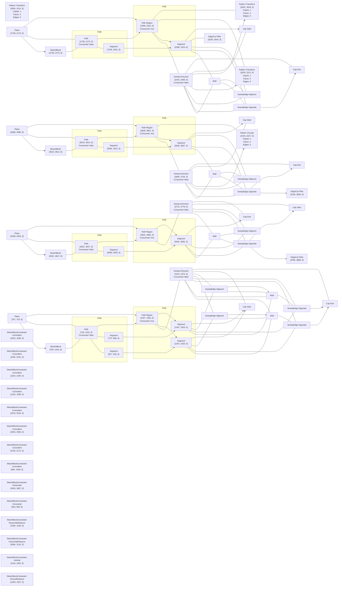

```mermaid
flowchart LR
  subgraph path12 [Path]
    12["Path Region<br>[1447, 1503, 0]<br>Consumed: true"]
      %% [ProgramBodyItem { index: 7 }, VariableDeclarationDeclaration, VariableDeclarationInit]
    28["Segment<br>[1447, 1503, 0]"]
      %% [ProgramBodyItem { index: 7 }, VariableDeclarationDeclaration, VariableDeclarationInit]
    29["Segment<br>[1447, 1503, 0]"]
      %% [ProgramBodyItem { index: 7 }, VariableDeclarationDeclaration, VariableDeclarationInit]
  end
  subgraph path13 [Path]
    13["Path Region<br>[2286, 2324, 0]<br>Consumed: true"]
      %% [ProgramBodyItem { index: 13 }, VariableDeclarationDeclaration, VariableDeclarationInit]
    31["Segment<br>[2286, 2324, 0]"]
      %% [ProgramBodyItem { index: 13 }, VariableDeclarationDeclaration, VariableDeclarationInit]
  end
  subgraph path14 [Path]
    14["Path Region<br>[3628, 3667, 0]<br>Consumed: true"]
      %% [ProgramBodyItem { index: 31 }, VariableDeclarationDeclaration, VariableDeclarationInit]
    33["Segment<br>[3628, 3667, 0]"]
      %% [ProgramBodyItem { index: 31 }, VariableDeclarationDeclaration, VariableDeclarationInit]
  end
  subgraph path15 [Path]
    15["Path Region<br>[4642, 4682, 0]<br>Consumed: true"]
      %% [ProgramBodyItem { index: 41 }, VariableDeclarationDeclaration, VariableDeclarationInit]
    35["Segment<br>[4642, 4682, 0]"]
      %% [ProgramBodyItem { index: 41 }, VariableDeclarationDeclaration, VariableDeclarationInit]
  end
  subgraph path16 [Path]
    16["Path<br>[1739, 2173, 0]<br>Consumed: false"]
      %% [ProgramBodyItem { index: 11 }, VariableDeclarationDeclaration, VariableDeclarationInit]
    30["Segment<br>[1769, 1841, 0]"]
      %% [ProgramBodyItem { index: 11 }, VariableDeclarationDeclaration, VariableDeclarationInit, SketchBlockBody, SketchBlockBodyItem { index: 0 }, VariableDeclarationDeclaration, VariableDeclarationInit]
  end
  subgraph path17 [Path]
    17["Path<br>[3510, 3614, 0]<br>Consumed: false"]
      %% [ProgramBodyItem { index: 30 }, VariableDeclarationDeclaration, VariableDeclarationInit]
    32["Segment<br>[3546, 3612, 0]"]
      %% [ProgramBodyItem { index: 30 }, VariableDeclarationDeclaration, VariableDeclarationInit, SketchBlockBody, SketchBlockBodyItem { index: 0 }, VariableDeclarationDeclaration, VariableDeclarationInit]
  end
  subgraph path18 [Path]
    18["Path<br>[4522, 4627, 0]<br>Consumed: false"]
      %% [ProgramBodyItem { index: 40 }, VariableDeclarationDeclaration, VariableDeclarationInit]
    34["Segment<br>[4559, 4625, 0]"]
      %% [ProgramBodyItem { index: 40 }, VariableDeclarationDeclaration, VariableDeclarationInit, SketchBlockBody, SketchBlockBodyItem { index: 0 }, VariableDeclarationDeclaration, VariableDeclarationInit]
  end
  subgraph path19 [Path]
    19["Path<br>[739, 1432, 0]<br>Consumed: false"]
      %% [ProgramBodyItem { index: 6 }, VariableDeclarationDeclaration, VariableDeclarationInit]
    36["Segment<br>[774, 866, 0]"]
      %% [ProgramBodyItem { index: 6 }, VariableDeclarationDeclaration, VariableDeclarationInit, SketchBlockBody, SketchBlockBodyItem { index: 0 }, VariableDeclarationDeclaration, VariableDeclarationInit]
    37["Segment<br>[877, 940, 0]"]
      %% [ProgramBodyItem { index: 6 }, VariableDeclarationDeclaration, VariableDeclarationInit, SketchBlockBody, SketchBlockBodyItem { index: 1 }, VariableDeclarationDeclaration, VariableDeclarationInit]
  end
  1["Cap End"]
    %% face_code_ref=Missing NodePath
  2["Cap End"]
    %% face_code_ref=Missing NodePath
  3["Cap End"]
    %% face_code_ref=Missing NodePath
  4["Cap End"]
    %% face_code_ref=Missing NodePath
  5["Cap Start"]
    %% face_code_ref=Missing NodePath
  6["Cap Start"]
    %% face_code_ref=Missing NodePath
  7["Cap Start"]
    %% face_code_ref=Missing NodePath
  8["Cap Start"]
    %% face_code_ref=Missing NodePath
  9["EdgeCut Fillet<br>[2525, 2643, 0]"]
    %% [ProgramBodyItem { index: 16 }, VariableDeclarationDeclaration, VariableDeclarationInit]
  10["EdgeCut Fillet<br>[3760, 3859, 0]"]
    %% [ProgramBodyItem { index: 33 }, VariableDeclarationDeclaration, VariableDeclarationInit, PipeBodyItem { index: 1 }]
  11["EdgeCut Fillet<br>[4785, 4889, 0]"]
    %% [ProgramBodyItem { index: 43 }, VariableDeclarationDeclaration, VariableDeclarationInit, PipeBodyItem { index: 1 }]
  20["Pattern Circular<br>[4103, 4227, 0]<br>Copies: 1<br>Faces: 4<br>Edges: 5"]
    %% [ProgramBodyItem { index: 34 }, VariableDeclarationDeclaration, VariableDeclarationInit]
  21["Pattern Transform<br>[2932, 3029, 0]<br>Copies: 1<br>Faces: 4<br>Edges: 5"]
    %% [ProgramBodyItem { index: 21 }, VariableDeclarationDeclaration, VariableDeclarationInit, PipeBodyItem { index: 0 }]
  22["Pattern Transform<br>[3035, 3112, 0]<br>Copies: 1<br>Faces: 4<br>Edges: 5"]
    %% [ProgramBodyItem { index: 21 }, VariableDeclarationDeclaration, VariableDeclarationInit, PipeBodyItem { index: 1 }]
  23["Pattern Transform<br>[3035, 3112, 0]<br>Copies: 1<br>Faces: 4<br>Edges: 5"]
    %% [ProgramBodyItem { index: 21 }, VariableDeclarationDeclaration, VariableDeclarationInit, PipeBodyItem { index: 1 }]
  24["Plane<br>[1739, 2173, 0]"]
    %% [ProgramBodyItem { index: 11 }, VariableDeclarationDeclaration, VariableDeclarationInit]
  25["Plane<br>[3469, 3496, 0]"]
    %% [ProgramBodyItem { index: 29 }, VariableDeclarationDeclaration, VariableDeclarationInit]
  26["Plane<br>[4308, 4353, 0]"]
    %% [ProgramBodyItem { index: 35 }, VariableDeclarationDeclaration, VariableDeclarationInit]
  27["Plane<br>[707, 724, 0]"]
    %% [ProgramBodyItem { index: 5 }, VariableDeclarationDeclaration, VariableDeclarationInit]
  38["SketchBlock<br>[1739, 2173, 0]"]
    %% [ProgramBodyItem { index: 11 }, VariableDeclarationDeclaration, VariableDeclarationInit]
  39["SketchBlock<br>[3510, 3614, 0]"]
    %% [ProgramBodyItem { index: 30 }, VariableDeclarationDeclaration, VariableDeclarationInit]
  40["SketchBlock<br>[4522, 4627, 0]"]
    %% [ProgramBodyItem { index: 40 }, VariableDeclarationDeclaration, VariableDeclarationInit]
  41["SketchBlock<br>[739, 1432, 0]"]
    %% [ProgramBodyItem { index: 6 }, VariableDeclarationDeclaration, VariableDeclarationInit]
  42["SketchBlockConstraint Coincident<br>[1003, 1036, 0]"]
    %% [ProgramBodyItem { index: 6 }, VariableDeclarationDeclaration, VariableDeclarationInit, SketchBlockBody, SketchBlockBodyItem { index: 4 }, ExpressionStatementExpr]
  43["SketchBlockConstraint Coincident<br>[1158, 1201, 0]"]
    %% [ProgramBodyItem { index: 6 }, VariableDeclarationDeclaration, VariableDeclarationInit, SketchBlockBody, SketchBlockBodyItem { index: 7 }, ExpressionStatementExpr]
  44["SketchBlockConstraint Coincident<br>[1204, 1240, 0]"]
    %% [ProgramBodyItem { index: 6 }, VariableDeclarationDeclaration, VariableDeclarationInit, SketchBlockBody, SketchBlockBodyItem { index: 8 }, ExpressionStatementExpr]
  45["SketchBlockConstraint Coincident<br>[1243, 1280, 0]"]
    %% [ProgramBodyItem { index: 6 }, VariableDeclarationDeclaration, VariableDeclarationInit, SketchBlockBody, SketchBlockBodyItem { index: 9 }, ExpressionStatementExpr]
  46["SketchBlockConstraint Coincident<br>[1970, 2015, 0]"]
    %% [ProgramBodyItem { index: 11 }, VariableDeclarationDeclaration, VariableDeclarationInit, SketchBlockBody, SketchBlockBodyItem { index: 3 }, ExpressionStatementExpr]
  47["SketchBlockConstraint Coincident<br>[2018, 2062, 0]"]
    %% [ProgramBodyItem { index: 11 }, VariableDeclarationDeclaration, VariableDeclarationInit, SketchBlockBody, SketchBlockBodyItem { index: 4 }, ExpressionStatementExpr]
  48["SketchBlockConstraint Coincident<br>[2135, 2171, 0]"]
    %% [ProgramBodyItem { index: 11 }, VariableDeclarationDeclaration, VariableDeclarationInit, SketchBlockBody, SketchBlockBodyItem { index: 6 }, ExpressionStatementExpr]
  49["SketchBlockConstraint Coincident<br>[963, 1000, 0]"]
    %% [ProgramBodyItem { index: 6 }, VariableDeclarationDeclaration, VariableDeclarationInit, SketchBlockBody, SketchBlockBodyItem { index: 3 }, ExpressionStatementExpr]
  50["SketchBlockConstraint Horizontal<br>[1945, 1967, 0]"]
    %% [ProgramBodyItem { index: 11 }, VariableDeclarationDeclaration, VariableDeclarationInit, SketchBlockBody, SketchBlockBodyItem { index: 2 }, ExpressionStatementExpr]
  51["SketchBlockConstraint Horizontal<br>[943, 960, 0]"]
    %% [ProgramBodyItem { index: 6 }, VariableDeclarationDeclaration, VariableDeclarationInit, SketchBlockBody, SketchBlockBodyItem { index: 2 }, ExpressionStatementExpr]
  52["SketchBlockConstraint HorizontalDistance<br>[1360, 1430, 0]"]
    %% [ProgramBodyItem { index: 6 }, VariableDeclarationDeclaration, VariableDeclarationInit, SketchBlockBody, SketchBlockBodyItem { index: 11 }, ExpressionStatementExpr]
  53["SketchBlockConstraint HorizontalDistance<br>[2065, 2132, 0]"]
    %% [ProgramBodyItem { index: 11 }, VariableDeclarationDeclaration, VariableDeclarationInit, SketchBlockBody, SketchBlockBodyItem { index: 5 }, ExpressionStatementExpr]
  54["SketchBlockConstraint Vertical<br>[1135, 1155, 0]"]
    %% [ProgramBodyItem { index: 6 }, VariableDeclarationDeclaration, VariableDeclarationInit, SketchBlockBody, SketchBlockBodyItem { index: 6 }, ExpressionStatementExpr]
  55["SketchBlockConstraint VerticalDistance<br>[1283, 1357, 0]"]
    %% [ProgramBodyItem { index: 6 }, VariableDeclarationDeclaration, VariableDeclarationInit, SketchBlockBody, SketchBlockBodyItem { index: 10 }, ExpressionStatementExpr]
  56["Sweep Extrusion<br>[1515, 1574, 0]<br>Consumed: false"]
    %% [ProgramBodyItem { index: 8 }, VariableDeclarationDeclaration, VariableDeclarationInit]
  57["Sweep Extrusion<br>[2343, 2406, 0]<br>Consumed: false"]
    %% [ProgramBodyItem { index: 14 }, VariableDeclarationDeclaration, VariableDeclarationInit]
  58["Sweep Extrusion<br>[3695, 3754, 0]<br>Consumed: false"]
    %% [ProgramBodyItem { index: 33 }, VariableDeclarationDeclaration, VariableDeclarationInit, PipeBodyItem { index: 0 }]
  59["Sweep Extrusion<br>[4712, 4779, 0]<br>Consumed: false"]
    %% [ProgramBodyItem { index: 43 }, VariableDeclarationDeclaration, VariableDeclarationInit, PipeBodyItem { index: 0 }]
  60["SweepEdge Adjacent"]
  61["SweepEdge Adjacent"]
  62["SweepEdge Adjacent"]
  63["SweepEdge Adjacent"]
  64["SweepEdge Adjacent"]
  65["SweepEdge Opposite"]
  66["SweepEdge Opposite"]
  67["SweepEdge Opposite"]
  68["SweepEdge Opposite"]
  69["SweepEdge Opposite"]
  70[Wall]
    %% face_code_ref=Missing NodePath
  71[Wall]
    %% face_code_ref=Missing NodePath
  72[Wall]
    %% face_code_ref=Missing NodePath
  73[Wall]
    %% face_code_ref=Missing NodePath
  74[Wall]
    %% face_code_ref=Missing NodePath
  56 --- 1
  65 <--x 1
  66 <--x 1
  57 --- 2
  67 <--x 2
  58 --- 3
  68 <--x 3
  35 <--x 4
  59 --- 4
  28 <--x 5
  29 <--x 5
  56 --- 5
  31 <--x 6
  57 --- 6
  33 <--x 7
  58 --- 7
  59 --- 8
  69 <--x 8
  31 --- 9
  68 x--> 10
  69 x--> 11
  19 x--> 12
  27 x--> 12
  12 <--x 28
  12 <--x 29
  12 ---- 56
  16 x--> 13
  13 --- 21
  13 --- 23
  24 x--> 13
  13 <--x 31
  13 ---- 57
  17 x--> 14
  14 --- 20
  25 x--> 14
  14 <--x 33
  14 ---- 58
  18 x--> 15
  26 x--> 15
  15 <--x 35
  15 ---- 59
  24 --- 16
  16 --- 30
  38 --- 16
  25 --- 17
  17 --- 32
  39 --- 17
  26 --- 18
  18 --- 34
  40 --- 18
  27 --- 19
  19 --- 36
  19 --- 37
  41 --- 19
  58 <--x 20
  57 <--x 21
  57 <--x 23
  24 <--x 38
  25 <--x 39
  26 <--x 40
  27 <--x 41
  36 x--> 28
  28 --- 60
  28 --- 65
  28 --- 70
  37 x--> 29
  29 --- 61
  29 --- 66
  29 --- 71
  30 <--x 31
  31 --- 62
  31 --- 67
  31 --- 72
  32 <--x 33
  33 --- 63
  33 --- 68
  33 --- 73
  34 <--x 35
  35 --- 64
  35 --- 69
  35 --- 74
  56 --- 60
  56 --- 61
  56 --- 65
  56 --- 66
  56 --- 70
  56 --- 71
  57 --- 62
  57 --- 67
  57 --- 72
  58 --- 63
  58 --- 68
  58 --- 73
  59 --- 64
  59 --- 69
  59 --- 74
  70 --- 60
  60 x--> 70
  61 x--> 71
  71 --- 61
  72 --- 62
  73 --- 63
  74 --- 64
  70 --- 65
  71 --- 66
  72 --- 67
  73 --- 68
  74 --- 69
```
