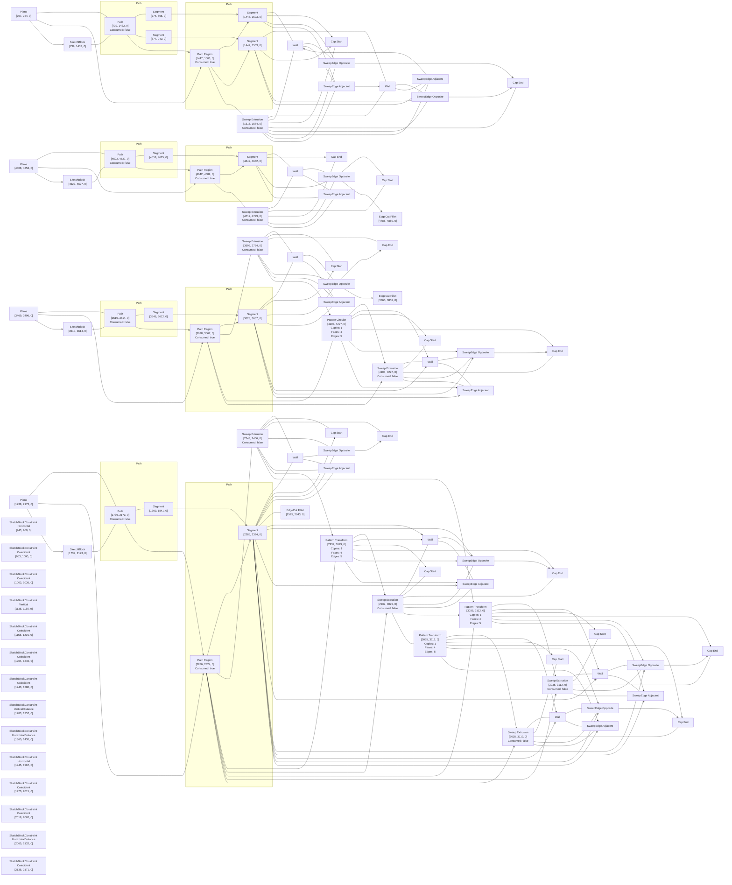

```mermaid
flowchart LR
  subgraph path2 [Path]
    2["Path<br>[739, 1432, 0]<br>Consumed: false"]
      %% [ProgramBodyItem { index: 6 }, VariableDeclarationDeclaration, VariableDeclarationInit]
    3["Segment<br>[774, 866, 0]"]
      %% [ProgramBodyItem { index: 6 }, VariableDeclarationDeclaration, VariableDeclarationInit, SketchBlockBody, SketchBlockBodyItem { index: 0 }, VariableDeclarationDeclaration, VariableDeclarationInit]
    4["Segment<br>[877, 940, 0]"]
      %% [ProgramBodyItem { index: 6 }, VariableDeclarationDeclaration, VariableDeclarationInit, SketchBlockBody, SketchBlockBodyItem { index: 1 }, VariableDeclarationDeclaration, VariableDeclarationInit]
  end
  subgraph path5 [Path]
    5["Path Region<br>[1447, 1503, 0]<br>Consumed: true"]
      %% [ProgramBodyItem { index: 7 }, VariableDeclarationDeclaration, VariableDeclarationInit]
    6["Segment<br>[1447, 1503, 0]"]
      %% [ProgramBodyItem { index: 7 }, VariableDeclarationDeclaration, VariableDeclarationInit]
    7["Segment<br>[1447, 1503, 0]"]
      %% [ProgramBodyItem { index: 7 }, VariableDeclarationDeclaration, VariableDeclarationInit]
  end
  subgraph path18 [Path]
    18["Path<br>[1739, 2173, 0]<br>Consumed: false"]
      %% [ProgramBodyItem { index: 11 }, VariableDeclarationDeclaration, VariableDeclarationInit]
    19["Segment<br>[1769, 1841, 0]"]
      %% [ProgramBodyItem { index: 11 }, VariableDeclarationDeclaration, VariableDeclarationInit, SketchBlockBody, SketchBlockBodyItem { index: 0 }, VariableDeclarationDeclaration, VariableDeclarationInit]
  end
  subgraph path20 [Path]
    20["Path Region<br>[2286, 2324, 0]<br>Consumed: true"]
      %% [ProgramBodyItem { index: 13 }, VariableDeclarationDeclaration, VariableDeclarationInit]
    21["Segment<br>[2286, 2324, 0]"]
      %% [ProgramBodyItem { index: 13 }, VariableDeclarationDeclaration, VariableDeclarationInit]
  end
  subgraph path51 [Path]
    51["Path<br>[3510, 3614, 0]<br>Consumed: false"]
      %% [ProgramBodyItem { index: 30 }, VariableDeclarationDeclaration, VariableDeclarationInit]
    52["Segment<br>[3546, 3612, 0]"]
      %% [ProgramBodyItem { index: 30 }, VariableDeclarationDeclaration, VariableDeclarationInit, SketchBlockBody, SketchBlockBodyItem { index: 0 }, VariableDeclarationDeclaration, VariableDeclarationInit]
  end
  subgraph path53 [Path]
    53["Path Region<br>[3628, 3667, 0]<br>Consumed: true"]
      %% [ProgramBodyItem { index: 31 }, VariableDeclarationDeclaration, VariableDeclarationInit]
    54["Segment<br>[3628, 3667, 0]"]
      %% [ProgramBodyItem { index: 31 }, VariableDeclarationDeclaration, VariableDeclarationInit]
  end
  subgraph path70 [Path]
    70["Path<br>[4522, 4627, 0]<br>Consumed: false"]
      %% [ProgramBodyItem { index: 40 }, VariableDeclarationDeclaration, VariableDeclarationInit]
    71["Segment<br>[4559, 4625, 0]"]
      %% [ProgramBodyItem { index: 40 }, VariableDeclarationDeclaration, VariableDeclarationInit, SketchBlockBody, SketchBlockBodyItem { index: 0 }, VariableDeclarationDeclaration, VariableDeclarationInit]
  end
  subgraph path72 [Path]
    72["Path Region<br>[4642, 4682, 0]<br>Consumed: true"]
      %% [ProgramBodyItem { index: 41 }, VariableDeclarationDeclaration, VariableDeclarationInit]
    73["Segment<br>[4642, 4682, 0]"]
      %% [ProgramBodyItem { index: 41 }, VariableDeclarationDeclaration, VariableDeclarationInit]
  end
  1["Plane<br>[707, 724, 0]"]
    %% [ProgramBodyItem { index: 5 }, VariableDeclarationDeclaration, VariableDeclarationInit]
  8["Sweep Extrusion<br>[1515, 1574, 0]<br>Consumed: false"]
    %% [ProgramBodyItem { index: 8 }, VariableDeclarationDeclaration, VariableDeclarationInit]
  9[Wall]
    %% face_code_ref=Missing NodePath
  10[Wall]
    %% face_code_ref=Missing NodePath
  11["Cap Start"]
    %% face_code_ref=Missing NodePath
  12["Cap End"]
    %% face_code_ref=Missing NodePath
  13["SweepEdge Opposite"]
  14["SweepEdge Adjacent"]
  15["SweepEdge Opposite"]
  16["SweepEdge Adjacent"]
  17["Plane<br>[1739, 2173, 0]"]
    %% [ProgramBodyItem { index: 11 }, VariableDeclarationDeclaration, VariableDeclarationInit]
  22["Sweep Extrusion<br>[2343, 2406, 0]<br>Consumed: false"]
    %% [ProgramBodyItem { index: 14 }, VariableDeclarationDeclaration, VariableDeclarationInit]
  23[Wall]
    %% face_code_ref=Missing NodePath
  24["Cap Start"]
    %% face_code_ref=Missing NodePath
  25["Cap End"]
    %% face_code_ref=Missing NodePath
  26["SweepEdge Opposite"]
  27["SweepEdge Adjacent"]
  28["EdgeCut Fillet<br>[2525, 2643, 0]"]
    %% [ProgramBodyItem { index: 16 }, VariableDeclarationDeclaration, VariableDeclarationInit]
  29["Pattern Transform<br>[2932, 3029, 0]<br>Copies: 1<br>Faces: 4<br>Edges: 5"]
    %% [ProgramBodyItem { index: 21 }, VariableDeclarationDeclaration, VariableDeclarationInit, PipeBodyItem { index: 0 }]
  30["Sweep Extrusion<br>[2932, 3029, 0]<br>Consumed: false"]
    %% [ProgramBodyItem { index: 21 }, VariableDeclarationDeclaration, VariableDeclarationInit, PipeBodyItem { index: 0 }]
  31[Wall]
    %% face_code_ref=Missing NodePath
  32["Cap Start"]
    %% face_code_ref=Missing NodePath
  33["Cap End"]
    %% face_code_ref=Missing NodePath
  34["SweepEdge Opposite"]
  35["SweepEdge Adjacent"]
  36["Pattern Transform<br>[3035, 3112, 0]<br>Copies: 1<br>Faces: 4<br>Edges: 5"]
    %% [ProgramBodyItem { index: 21 }, VariableDeclarationDeclaration, VariableDeclarationInit, PipeBodyItem { index: 1 }]
  37["Sweep Extrusion<br>[3035, 3112, 0]<br>Consumed: false"]
    %% [ProgramBodyItem { index: 21 }, VariableDeclarationDeclaration, VariableDeclarationInit, PipeBodyItem { index: 1 }]
  38[Wall]
    %% face_code_ref=Missing NodePath
  39["Cap Start"]
    %% face_code_ref=Missing NodePath
  40["Cap End"]
    %% face_code_ref=Missing NodePath
  41["SweepEdge Opposite"]
  42["SweepEdge Adjacent"]
  43["Pattern Transform<br>[3035, 3112, 0]<br>Copies: 1<br>Faces: 4<br>Edges: 5"]
    %% [ProgramBodyItem { index: 21 }, VariableDeclarationDeclaration, VariableDeclarationInit, PipeBodyItem { index: 1 }]
  44["Sweep Extrusion<br>[3035, 3112, 0]<br>Consumed: false"]
    %% [ProgramBodyItem { index: 21 }, VariableDeclarationDeclaration, VariableDeclarationInit, PipeBodyItem { index: 1 }]
  45[Wall]
    %% face_code_ref=Missing NodePath
  46["Cap Start"]
    %% face_code_ref=Missing NodePath
  47["Cap End"]
    %% face_code_ref=Missing NodePath
  48["SweepEdge Opposite"]
  49["SweepEdge Adjacent"]
  50["Plane<br>[3469, 3496, 0]"]
    %% [ProgramBodyItem { index: 29 }, VariableDeclarationDeclaration, VariableDeclarationInit]
  55["Sweep Extrusion<br>[3695, 3754, 0]<br>Consumed: false"]
    %% [ProgramBodyItem { index: 33 }, VariableDeclarationDeclaration, VariableDeclarationInit, PipeBodyItem { index: 0 }]
  56[Wall]
    %% face_code_ref=Missing NodePath
  57["Cap Start"]
    %% face_code_ref=Missing NodePath
  58["Cap End"]
    %% face_code_ref=Missing NodePath
  59["SweepEdge Opposite"]
  60["SweepEdge Adjacent"]
  61["EdgeCut Fillet<br>[3760, 3859, 0]"]
    %% [ProgramBodyItem { index: 33 }, VariableDeclarationDeclaration, VariableDeclarationInit, PipeBodyItem { index: 1 }]
  62["Pattern Circular<br>[4103, 4227, 0]<br>Copies: 1<br>Faces: 4<br>Edges: 5"]
    %% [ProgramBodyItem { index: 34 }, VariableDeclarationDeclaration, VariableDeclarationInit]
  63["Sweep Extrusion<br>[4103, 4227, 0]<br>Consumed: false"]
    %% [ProgramBodyItem { index: 34 }, VariableDeclarationDeclaration, VariableDeclarationInit]
  64[Wall]
    %% face_code_ref=Missing NodePath
  65["Cap Start"]
    %% face_code_ref=Missing NodePath
  66["Cap End"]
    %% face_code_ref=Missing NodePath
  67["SweepEdge Opposite"]
  68["SweepEdge Adjacent"]
  69["Plane<br>[4308, 4353, 0]"]
    %% [ProgramBodyItem { index: 35 }, VariableDeclarationDeclaration, VariableDeclarationInit]
  74["Sweep Extrusion<br>[4712, 4779, 0]<br>Consumed: false"]
    %% [ProgramBodyItem { index: 43 }, VariableDeclarationDeclaration, VariableDeclarationInit, PipeBodyItem { index: 0 }]
  75[Wall]
    %% face_code_ref=Missing NodePath
  76["Cap Start"]
    %% face_code_ref=Missing NodePath
  77["Cap End"]
    %% face_code_ref=Missing NodePath
  78["SweepEdge Opposite"]
  79["SweepEdge Adjacent"]
  80["EdgeCut Fillet<br>[4785, 4889, 0]"]
    %% [ProgramBodyItem { index: 43 }, VariableDeclarationDeclaration, VariableDeclarationInit, PipeBodyItem { index: 1 }]
  81["SketchBlock<br>[739, 1432, 0]"]
    %% [ProgramBodyItem { index: 6 }, VariableDeclarationDeclaration, VariableDeclarationInit]
  82["SketchBlockConstraint Horizontal<br>[943, 960, 0]"]
    %% [ProgramBodyItem { index: 6 }, VariableDeclarationDeclaration, VariableDeclarationInit, SketchBlockBody, SketchBlockBodyItem { index: 2 }, ExpressionStatementExpr]
  83["SketchBlockConstraint Coincident<br>[963, 1000, 0]"]
    %% [ProgramBodyItem { index: 6 }, VariableDeclarationDeclaration, VariableDeclarationInit, SketchBlockBody, SketchBlockBodyItem { index: 3 }, ExpressionStatementExpr]
  84["SketchBlockConstraint Coincident<br>[1003, 1036, 0]"]
    %% [ProgramBodyItem { index: 6 }, VariableDeclarationDeclaration, VariableDeclarationInit, SketchBlockBody, SketchBlockBodyItem { index: 4 }, ExpressionStatementExpr]
  85["SketchBlockConstraint Vertical<br>[1135, 1155, 0]"]
    %% [ProgramBodyItem { index: 6 }, VariableDeclarationDeclaration, VariableDeclarationInit, SketchBlockBody, SketchBlockBodyItem { index: 6 }, ExpressionStatementExpr]
  86["SketchBlockConstraint Coincident<br>[1158, 1201, 0]"]
    %% [ProgramBodyItem { index: 6 }, VariableDeclarationDeclaration, VariableDeclarationInit, SketchBlockBody, SketchBlockBodyItem { index: 7 }, ExpressionStatementExpr]
  87["SketchBlockConstraint Coincident<br>[1204, 1240, 0]"]
    %% [ProgramBodyItem { index: 6 }, VariableDeclarationDeclaration, VariableDeclarationInit, SketchBlockBody, SketchBlockBodyItem { index: 8 }, ExpressionStatementExpr]
  88["SketchBlockConstraint Coincident<br>[1243, 1280, 0]"]
    %% [ProgramBodyItem { index: 6 }, VariableDeclarationDeclaration, VariableDeclarationInit, SketchBlockBody, SketchBlockBodyItem { index: 9 }, ExpressionStatementExpr]
  89["SketchBlockConstraint VerticalDistance<br>[1283, 1357, 0]"]
    %% [ProgramBodyItem { index: 6 }, VariableDeclarationDeclaration, VariableDeclarationInit, SketchBlockBody, SketchBlockBodyItem { index: 10 }, ExpressionStatementExpr]
  90["SketchBlockConstraint HorizontalDistance<br>[1360, 1430, 0]"]
    %% [ProgramBodyItem { index: 6 }, VariableDeclarationDeclaration, VariableDeclarationInit, SketchBlockBody, SketchBlockBodyItem { index: 11 }, ExpressionStatementExpr]
  91["SketchBlock<br>[1739, 2173, 0]"]
    %% [ProgramBodyItem { index: 11 }, VariableDeclarationDeclaration, VariableDeclarationInit]
  92["SketchBlockConstraint Horizontal<br>[1945, 1967, 0]"]
    %% [ProgramBodyItem { index: 11 }, VariableDeclarationDeclaration, VariableDeclarationInit, SketchBlockBody, SketchBlockBodyItem { index: 2 }, ExpressionStatementExpr]
  93["SketchBlockConstraint Coincident<br>[1970, 2015, 0]"]
    %% [ProgramBodyItem { index: 11 }, VariableDeclarationDeclaration, VariableDeclarationInit, SketchBlockBody, SketchBlockBodyItem { index: 3 }, ExpressionStatementExpr]
  94["SketchBlockConstraint Coincident<br>[2018, 2062, 0]"]
    %% [ProgramBodyItem { index: 11 }, VariableDeclarationDeclaration, VariableDeclarationInit, SketchBlockBody, SketchBlockBodyItem { index: 4 }, ExpressionStatementExpr]
  95["SketchBlockConstraint HorizontalDistance<br>[2065, 2132, 0]"]
    %% [ProgramBodyItem { index: 11 }, VariableDeclarationDeclaration, VariableDeclarationInit, SketchBlockBody, SketchBlockBodyItem { index: 5 }, ExpressionStatementExpr]
  96["SketchBlockConstraint Coincident<br>[2135, 2171, 0]"]
    %% [ProgramBodyItem { index: 11 }, VariableDeclarationDeclaration, VariableDeclarationInit, SketchBlockBody, SketchBlockBodyItem { index: 6 }, ExpressionStatementExpr]
  97["SketchBlock<br>[3510, 3614, 0]"]
    %% [ProgramBodyItem { index: 30 }, VariableDeclarationDeclaration, VariableDeclarationInit]
  98["SketchBlock<br>[4522, 4627, 0]"]
    %% [ProgramBodyItem { index: 40 }, VariableDeclarationDeclaration, VariableDeclarationInit]
  1 --- 2
  1 <--x 5
  1 <--x 81
  2 --- 3
  2 --- 4
  2 <--x 5
  81 --- 2
  3 <--x 6
  4 <--x 7
  5 <--x 6
  5 <--x 7
  5 ---- 8
  6 --- 10
  6 x--> 11
  6 --- 15
  6 --- 16
  7 --- 9
  7 x--> 11
  7 --- 13
  7 --- 14
  8 --- 9
  8 --- 10
  8 --- 11
  8 --- 12
  8 --- 13
  8 --- 14
  8 --- 15
  8 --- 16
  9 --- 13
  9 --- 14
  16 <--x 9
  14 <--x 10
  10 --- 15
  10 --- 16
  13 <--x 12
  15 <--x 12
  17 --- 18
  17 <--x 20
  17 <--x 91
  18 --- 19
  18 <--x 20
  91 --- 18
  19 <--x 21
  20 <--x 21
  20 ---- 22
  20 --- 29
  20 <---x 30
  20 --- 36
  20 <---x 37
  20 <---x 44
  21 --- 23
  21 x--> 24
  21 --- 26
  21 --- 27
  21 --- 28
  21 <--x 31
  21 <--x 34
  21 <--x 35
  21 <--x 38
  21 <--x 41
  21 <--x 42
  21 <--x 45
  21 <--x 48
  21 <--x 49
  22 --- 23
  22 --- 24
  22 --- 25
  22 --- 26
  22 --- 27
  22 x--> 29
  22 x--> 36
  23 --- 26
  23 --- 27
  26 <--x 25
  29 x--> 30
  29 x--> 31
  29 x--> 32
  29 x--> 33
  29 x--> 34
  29 x--> 35
  30 --- 31
  30 --- 32
  30 --- 33
  30 --- 34
  30 --- 35
  30 x--> 36
  30 --- 43
  31 --- 34
  31 --- 35
  34 <--x 33
  36 x--> 37
  36 x--> 38
  36 x--> 39
  36 x--> 40
  36 x--> 41
  36 x--> 42
  37 --- 38
  37 --- 39
  37 --- 40
  37 --- 41
  37 --- 42
  38 --- 41
  38 --- 42
  41 <--x 40
  43 x--> 44
  43 x--> 45
  43 x--> 46
  43 x--> 47
  43 x--> 48
  43 x--> 49
  44 --- 45
  44 --- 46
  44 --- 47
  44 --- 48
  44 --- 49
  45 --- 48
  45 --- 49
  48 <--x 47
  50 --- 51
  50 <--x 53
  50 <--x 97
  51 --- 52
  51 <--x 53
  97 --- 51
  52 <--x 54
  53 <--x 54
  53 ---- 55
  53 --- 62
  53 <---x 63
  54 --- 56
  54 x--> 57
  54 --- 59
  54 --- 60
  54 <--x 64
  54 <--x 67
  54 <--x 68
  55 --- 56
  55 --- 57
  55 --- 58
  55 --- 59
  55 --- 60
  55 x--> 62
  56 --- 59
  56 --- 60
  59 <--x 58
  59 <--x 61
  62 x--> 63
  62 x--> 64
  62 x--> 65
  62 x--> 66
  62 x--> 67
  62 x--> 68
  63 --- 64
  63 --- 65
  63 --- 66
  63 --- 67
  63 --- 68
  64 --- 67
  64 --- 68
  67 <--x 66
  69 --- 70
  69 <--x 72
  69 <--x 98
  70 --- 71
  70 <--x 72
  98 --- 70
  71 <--x 73
  72 <--x 73
  72 ---- 74
  73 --- 75
  73 x--> 77
  73 --- 78
  73 --- 79
  74 --- 75
  74 --- 76
  74 --- 77
  74 --- 78
  74 --- 79
  75 --- 78
  75 --- 79
  78 <--x 76
  78 <--x 80
```
