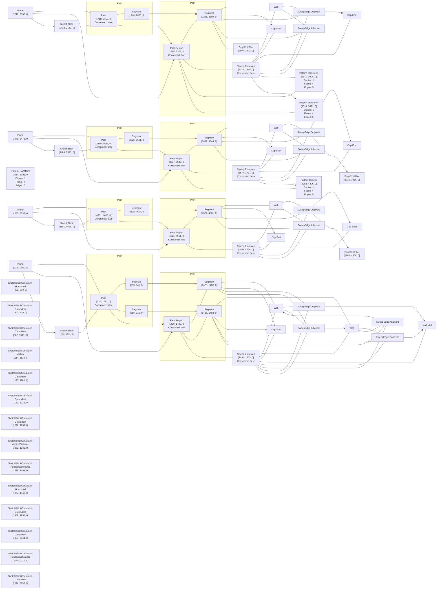

```mermaid
flowchart LR
  subgraph path2 [Path]
    2["Path<br>[726, 1411, 0]<br>Consumed: false"]
      %% [ProgramBodyItem { index: 5 }, VariableDeclarationDeclaration, VariableDeclarationInit]
    3["Segment<br>[753, 845, 0]"]
      %% [ProgramBodyItem { index: 5 }, VariableDeclarationDeclaration, VariableDeclarationInit, SketchBlockBody, SketchBlockBodyItem { index: 0 }, VariableDeclarationDeclaration, VariableDeclarationInit]
    4["Segment<br>[856, 919, 0]"]
      %% [ProgramBodyItem { index: 5 }, VariableDeclarationDeclaration, VariableDeclarationInit, SketchBlockBody, SketchBlockBodyItem { index: 1 }, VariableDeclarationDeclaration, VariableDeclarationInit]
  end
  subgraph path5 [Path]
    5["Path Region<br>[1426, 1482, 0]<br>Consumed: true"]
      %% [ProgramBodyItem { index: 6 }, VariableDeclarationDeclaration, VariableDeclarationInit]
    6["Segment<br>[1426, 1482, 0]"]
      %% [ProgramBodyItem { index: 6 }, VariableDeclarationDeclaration, VariableDeclarationInit]
    7["Segment<br>[1426, 1482, 0]"]
      %% [ProgramBodyItem { index: 6 }, VariableDeclarationDeclaration, VariableDeclarationInit]
  end
  subgraph path18 [Path]
    18["Path<br>[1718, 2152, 0]<br>Consumed: false"]
      %% [ProgramBodyItem { index: 10 }, VariableDeclarationDeclaration, VariableDeclarationInit]
    19["Segment<br>[1748, 1820, 0]"]
      %% [ProgramBodyItem { index: 10 }, VariableDeclarationDeclaration, VariableDeclarationInit, SketchBlockBody, SketchBlockBodyItem { index: 0 }, VariableDeclarationDeclaration, VariableDeclarationInit]
  end
  subgraph path20 [Path]
    20["Path Region<br>[2265, 2303, 0]<br>Consumed: true"]
      %% [ProgramBodyItem { index: 12 }, VariableDeclarationDeclaration, VariableDeclarationInit]
    21["Segment<br>[2265, 2303, 0]"]
      %% [ProgramBodyItem { index: 12 }, VariableDeclarationDeclaration, VariableDeclarationInit]
  end
  subgraph path33 [Path]
    33["Path<br>[3489, 3593, 0]<br>Consumed: false"]
      %% [ProgramBodyItem { index: 29 }, VariableDeclarationDeclaration, VariableDeclarationInit]
    34["Segment<br>[3525, 3591, 0]"]
      %% [ProgramBodyItem { index: 29 }, VariableDeclarationDeclaration, VariableDeclarationInit, SketchBlockBody, SketchBlockBodyItem { index: 0 }, VariableDeclarationDeclaration, VariableDeclarationInit]
  end
  subgraph path35 [Path]
    35["Path Region<br>[3607, 3646, 0]<br>Consumed: true"]
      %% [ProgramBodyItem { index: 30 }, VariableDeclarationDeclaration, VariableDeclarationInit]
    36["Segment<br>[3607, 3646, 0]"]
      %% [ProgramBodyItem { index: 30 }, VariableDeclarationDeclaration, VariableDeclarationInit]
  end
  subgraph path46 [Path]
    46["Path<br>[4501, 4606, 0]<br>Consumed: false"]
      %% [ProgramBodyItem { index: 39 }, VariableDeclarationDeclaration, VariableDeclarationInit]
    47["Segment<br>[4538, 4604, 0]"]
      %% [ProgramBodyItem { index: 39 }, VariableDeclarationDeclaration, VariableDeclarationInit, SketchBlockBody, SketchBlockBodyItem { index: 0 }, VariableDeclarationDeclaration, VariableDeclarationInit]
  end
  subgraph path48 [Path]
    48["Path Region<br>[4621, 4661, 0]<br>Consumed: true"]
      %% [ProgramBodyItem { index: 40 }, VariableDeclarationDeclaration, VariableDeclarationInit]
    49["Segment<br>[4621, 4661, 0]"]
      %% [ProgramBodyItem { index: 40 }, VariableDeclarationDeclaration, VariableDeclarationInit]
  end
  1["Plane<br>[726, 1411, 0]"]
    %% [ProgramBodyItem { index: 5 }, VariableDeclarationDeclaration, VariableDeclarationInit]
  8["Sweep Extrusion<br>[1494, 1553, 0]<br>Consumed: false"]
    %% [ProgramBodyItem { index: 7 }, VariableDeclarationDeclaration, VariableDeclarationInit]
  9[Wall]
    %% face_code_ref=Missing NodePath
  10[Wall]
    %% face_code_ref=Missing NodePath
  11["Cap Start"]
    %% face_code_ref=Missing NodePath
  12["Cap End"]
    %% face_code_ref=Missing NodePath
  13["SweepEdge Opposite"]
  14["SweepEdge Adjacent"]
  15["SweepEdge Opposite"]
  16["SweepEdge Adjacent"]
  17["Plane<br>[1718, 2152, 0]"]
    %% [ProgramBodyItem { index: 10 }, VariableDeclarationDeclaration, VariableDeclarationInit]
  22["Sweep Extrusion<br>[2322, 2385, 0]<br>Consumed: false"]
    %% [ProgramBodyItem { index: 13 }, VariableDeclarationDeclaration, VariableDeclarationInit]
  23[Wall]
    %% face_code_ref=Missing NodePath
  24["Cap Start"]
    %% face_code_ref=Missing NodePath
  25["Cap End"]
    %% face_code_ref=Missing NodePath
  26["SweepEdge Opposite"]
  27["SweepEdge Adjacent"]
  28["EdgeCut Fillet<br>[2504, 2622, 0]"]
    %% [ProgramBodyItem { index: 15 }, VariableDeclarationDeclaration, VariableDeclarationInit]
  29["Pattern Transform<br>[2911, 3008, 0]<br>Copies: 1<br>Faces: 4<br>Edges: 5"]
    %% [ProgramBodyItem { index: 20 }, VariableDeclarationDeclaration, VariableDeclarationInit, PipeBodyItem { index: 0 }]
  30["Pattern Transform<br>[3014, 3091, 0]<br>Copies: 1<br>Faces: 4<br>Edges: 5"]
    %% [ProgramBodyItem { index: 20 }, VariableDeclarationDeclaration, VariableDeclarationInit, PipeBodyItem { index: 1 }]
  31["Pattern Transform<br>[3014, 3091, 0]<br>Copies: 1<br>Faces: 4<br>Edges: 5"]
    %% [ProgramBodyItem { index: 20 }, VariableDeclarationDeclaration, VariableDeclarationInit, PipeBodyItem { index: 1 }]
  32["Plane<br>[3448, 3475, 0]"]
    %% [ProgramBodyItem { index: 28 }, VariableDeclarationDeclaration, VariableDeclarationInit]
  37["Sweep Extrusion<br>[3674, 3733, 0]<br>Consumed: false"]
    %% [ProgramBodyItem { index: 32 }, VariableDeclarationDeclaration, VariableDeclarationInit, PipeBodyItem { index: 0 }]
  38[Wall]
    %% face_code_ref=Missing NodePath
  39["Cap Start"]
    %% face_code_ref=Missing NodePath
  40["Cap End"]
    %% face_code_ref=Missing NodePath
  41["SweepEdge Opposite"]
  42["SweepEdge Adjacent"]
  43["EdgeCut Fillet<br>[3739, 3838, 0]"]
    %% [ProgramBodyItem { index: 32 }, VariableDeclarationDeclaration, VariableDeclarationInit, PipeBodyItem { index: 1 }]
  44["Pattern Circular<br>[4082, 4206, 0]<br>Copies: 1<br>Faces: 4<br>Edges: 5"]
    %% [ProgramBodyItem { index: 33 }, VariableDeclarationDeclaration, VariableDeclarationInit]
  45["Plane<br>[4287, 4332, 0]"]
    %% [ProgramBodyItem { index: 34 }, VariableDeclarationDeclaration, VariableDeclarationInit]
  50["Sweep Extrusion<br>[4691, 4758, 0]<br>Consumed: false"]
    %% [ProgramBodyItem { index: 42 }, VariableDeclarationDeclaration, VariableDeclarationInit, PipeBodyItem { index: 0 }]
  51[Wall]
    %% face_code_ref=Missing NodePath
  52["Cap Start"]
    %% face_code_ref=Missing NodePath
  53["Cap End"]
    %% face_code_ref=Missing NodePath
  54["SweepEdge Opposite"]
  55["SweepEdge Adjacent"]
  56["EdgeCut Fillet<br>[4764, 4868, 0]"]
    %% [ProgramBodyItem { index: 42 }, VariableDeclarationDeclaration, VariableDeclarationInit, PipeBodyItem { index: 1 }]
  57["SketchBlock<br>[726, 1411, 0]"]
    %% [ProgramBodyItem { index: 5 }, VariableDeclarationDeclaration, VariableDeclarationInit]
  58["SketchBlockConstraint Horizontal<br>[922, 939, 0]"]
    %% [ProgramBodyItem { index: 5 }, VariableDeclarationDeclaration, VariableDeclarationInit, SketchBlockBody, SketchBlockBodyItem { index: 2 }, ExpressionStatementExpr]
  59["SketchBlockConstraint Coincident<br>[942, 979, 0]"]
    %% [ProgramBodyItem { index: 5 }, VariableDeclarationDeclaration, VariableDeclarationInit, SketchBlockBody, SketchBlockBodyItem { index: 3 }, ExpressionStatementExpr]
  60["SketchBlockConstraint Coincident<br>[982, 1015, 0]"]
    %% [ProgramBodyItem { index: 5 }, VariableDeclarationDeclaration, VariableDeclarationInit, SketchBlockBody, SketchBlockBodyItem { index: 4 }, ExpressionStatementExpr]
  61["SketchBlockConstraint Vertical<br>[1114, 1134, 0]"]
    %% [ProgramBodyItem { index: 5 }, VariableDeclarationDeclaration, VariableDeclarationInit, SketchBlockBody, SketchBlockBodyItem { index: 6 }, ExpressionStatementExpr]
  62["SketchBlockConstraint Coincident<br>[1137, 1180, 0]"]
    %% [ProgramBodyItem { index: 5 }, VariableDeclarationDeclaration, VariableDeclarationInit, SketchBlockBody, SketchBlockBodyItem { index: 7 }, ExpressionStatementExpr]
  63["SketchBlockConstraint Coincident<br>[1183, 1219, 0]"]
    %% [ProgramBodyItem { index: 5 }, VariableDeclarationDeclaration, VariableDeclarationInit, SketchBlockBody, SketchBlockBodyItem { index: 8 }, ExpressionStatementExpr]
  64["SketchBlockConstraint Coincident<br>[1222, 1259, 0]"]
    %% [ProgramBodyItem { index: 5 }, VariableDeclarationDeclaration, VariableDeclarationInit, SketchBlockBody, SketchBlockBodyItem { index: 9 }, ExpressionStatementExpr]
  65["SketchBlockConstraint VerticalDistance<br>[1262, 1336, 0]"]
    %% [ProgramBodyItem { index: 5 }, VariableDeclarationDeclaration, VariableDeclarationInit, SketchBlockBody, SketchBlockBodyItem { index: 10 }, ExpressionStatementExpr]
  66["SketchBlockConstraint HorizontalDistance<br>[1339, 1409, 0]"]
    %% [ProgramBodyItem { index: 5 }, VariableDeclarationDeclaration, VariableDeclarationInit, SketchBlockBody, SketchBlockBodyItem { index: 11 }, ExpressionStatementExpr]
  67["SketchBlock<br>[1718, 2152, 0]"]
    %% [ProgramBodyItem { index: 10 }, VariableDeclarationDeclaration, VariableDeclarationInit]
  68["SketchBlockConstraint Horizontal<br>[1924, 1946, 0]"]
    %% [ProgramBodyItem { index: 10 }, VariableDeclarationDeclaration, VariableDeclarationInit, SketchBlockBody, SketchBlockBodyItem { index: 2 }, ExpressionStatementExpr]
  69["SketchBlockConstraint Coincident<br>[1949, 1994, 0]"]
    %% [ProgramBodyItem { index: 10 }, VariableDeclarationDeclaration, VariableDeclarationInit, SketchBlockBody, SketchBlockBodyItem { index: 3 }, ExpressionStatementExpr]
  70["SketchBlockConstraint Coincident<br>[1997, 2041, 0]"]
    %% [ProgramBodyItem { index: 10 }, VariableDeclarationDeclaration, VariableDeclarationInit, SketchBlockBody, SketchBlockBodyItem { index: 4 }, ExpressionStatementExpr]
  71["SketchBlockConstraint HorizontalDistance<br>[2044, 2111, 0]"]
    %% [ProgramBodyItem { index: 10 }, VariableDeclarationDeclaration, VariableDeclarationInit, SketchBlockBody, SketchBlockBodyItem { index: 5 }, ExpressionStatementExpr]
  72["SketchBlockConstraint Coincident<br>[2114, 2150, 0]"]
    %% [ProgramBodyItem { index: 10 }, VariableDeclarationDeclaration, VariableDeclarationInit, SketchBlockBody, SketchBlockBodyItem { index: 6 }, ExpressionStatementExpr]
  73["SketchBlock<br>[3489, 3593, 0]"]
    %% [ProgramBodyItem { index: 29 }, VariableDeclarationDeclaration, VariableDeclarationInit]
  74["SketchBlock<br>[4501, 4606, 0]"]
    %% [ProgramBodyItem { index: 39 }, VariableDeclarationDeclaration, VariableDeclarationInit]
  1 --- 2
  1 <--x 5
  1 <--x 57
  2 --- 3
  2 --- 4
  2 <--x 5
  57 --- 2
  3 <--x 6
  4 <--x 7
  5 --- 6
  5 --- 7
  5 ---- 8
  6 --- 10
  6 x--> 11
  6 --- 15
  6 --- 16
  7 --- 9
  7 x--> 11
  7 --- 13
  7 --- 14
  8 --- 9
  8 --- 10
  8 --- 11
  8 --- 12
  8 --- 13
  8 --- 14
  8 --- 15
  8 --- 16
  9 --- 13
  9 --- 14
  16 <--x 9
  14 <--x 10
  10 --- 15
  10 --- 16
  13 <--x 12
  15 <--x 12
  17 --- 18
  17 <--x 20
  17 <--x 67
  18 --- 19
  18 <--x 20
  67 --- 18
  19 <--x 21
  20 --- 21
  20 ---- 22
  20 --- 29
  20 --- 30
  21 --- 23
  21 x--> 24
  21 --- 26
  21 --- 27
  21 --- 28
  22 --- 23
  22 --- 24
  22 --- 25
  22 --- 26
  22 --- 27
  22 x--> 29
  22 x--> 30
  23 --- 26
  23 --- 27
  26 <--x 25
  32 --- 33
  32 <--x 35
  32 <--x 73
  33 --- 34
  33 <--x 35
  73 --- 33
  34 <--x 36
  35 --- 36
  35 ---- 37
  35 --- 44
  36 --- 38
  36 x--> 39
  36 --- 41
  36 --- 42
  37 --- 38
  37 --- 39
  37 --- 40
  37 --- 41
  37 --- 42
  37 x--> 44
  38 --- 41
  38 --- 42
  41 <--x 40
  41 <--x 43
  45 --- 46
  45 <--x 48
  45 <--x 74
  46 --- 47
  46 <--x 48
  74 --- 46
  47 <--x 49
  48 --- 49
  48 ---- 50
  49 --- 51
  49 x--> 53
  49 --- 54
  49 --- 55
  50 --- 51
  50 --- 52
  50 --- 53
  50 --- 54
  50 --- 55
  51 --- 54
  51 --- 55
  54 <--x 52
  54 <--x 56
```
