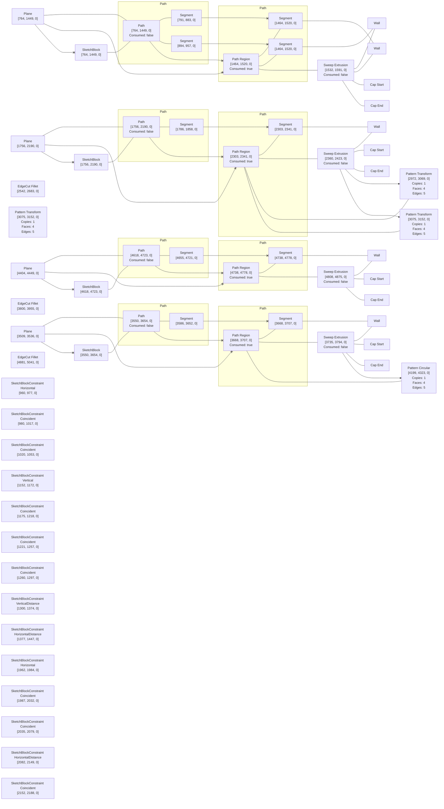

```mermaid
flowchart LR
  subgraph path2 [Path]
    2["Path<br>[764, 1449, 0]<br>Consumed: false"]
      %% [ProgramBodyItem { index: 5 }, VariableDeclarationDeclaration, VariableDeclarationInit]
    3["Segment<br>[791, 883, 0]"]
      %% [ProgramBodyItem { index: 5 }, VariableDeclarationDeclaration, VariableDeclarationInit, SketchBlockBody, SketchBlockBodyItem { index: 0 }, VariableDeclarationDeclaration, VariableDeclarationInit]
    4["Segment<br>[894, 957, 0]"]
      %% [ProgramBodyItem { index: 5 }, VariableDeclarationDeclaration, VariableDeclarationInit, SketchBlockBody, SketchBlockBodyItem { index: 1 }, VariableDeclarationDeclaration, VariableDeclarationInit]
  end
  subgraph path5 [Path]
    5["Path Region<br>[1464, 1520, 0]<br>Consumed: true"]
      %% [ProgramBodyItem { index: 6 }, VariableDeclarationDeclaration, VariableDeclarationInit]
    6["Segment<br>[1464, 1520, 0]"]
      %% [ProgramBodyItem { index: 6 }, VariableDeclarationDeclaration, VariableDeclarationInit]
    7["Segment<br>[1464, 1520, 0]"]
      %% [ProgramBodyItem { index: 6 }, VariableDeclarationDeclaration, VariableDeclarationInit]
  end
  subgraph path14 [Path]
    14["Path<br>[1756, 2190, 0]<br>Consumed: false"]
      %% [ProgramBodyItem { index: 10 }, VariableDeclarationDeclaration, VariableDeclarationInit]
    15["Segment<br>[1786, 1858, 0]"]
      %% [ProgramBodyItem { index: 10 }, VariableDeclarationDeclaration, VariableDeclarationInit, SketchBlockBody, SketchBlockBodyItem { index: 0 }, VariableDeclarationDeclaration, VariableDeclarationInit]
  end
  subgraph path16 [Path]
    16["Path Region<br>[2303, 2341, 0]<br>Consumed: true"]
      %% [ProgramBodyItem { index: 12 }, VariableDeclarationDeclaration, VariableDeclarationInit]
    17["Segment<br>[2303, 2341, 0]"]
      %% [ProgramBodyItem { index: 12 }, VariableDeclarationDeclaration, VariableDeclarationInit]
  end
  subgraph path27 [Path]
    27["Path<br>[3550, 3654, 0]<br>Consumed: false"]
      %% [ProgramBodyItem { index: 29 }, VariableDeclarationDeclaration, VariableDeclarationInit]
    28["Segment<br>[3586, 3652, 0]"]
      %% [ProgramBodyItem { index: 29 }, VariableDeclarationDeclaration, VariableDeclarationInit, SketchBlockBody, SketchBlockBodyItem { index: 0 }, VariableDeclarationDeclaration, VariableDeclarationInit]
  end
  subgraph path29 [Path]
    29["Path Region<br>[3668, 3707, 0]<br>Consumed: true"]
      %% [ProgramBodyItem { index: 30 }, VariableDeclarationDeclaration, VariableDeclarationInit]
    30["Segment<br>[3668, 3707, 0]"]
      %% [ProgramBodyItem { index: 30 }, VariableDeclarationDeclaration, VariableDeclarationInit]
  end
  subgraph path38 [Path]
    38["Path<br>[4618, 4723, 0]<br>Consumed: false"]
      %% [ProgramBodyItem { index: 39 }, VariableDeclarationDeclaration, VariableDeclarationInit]
    39["Segment<br>[4655, 4721, 0]"]
      %% [ProgramBodyItem { index: 39 }, VariableDeclarationDeclaration, VariableDeclarationInit, SketchBlockBody, SketchBlockBodyItem { index: 0 }, VariableDeclarationDeclaration, VariableDeclarationInit]
  end
  subgraph path40 [Path]
    40["Path Region<br>[4738, 4778, 0]<br>Consumed: true"]
      %% [ProgramBodyItem { index: 40 }, VariableDeclarationDeclaration, VariableDeclarationInit]
    41["Segment<br>[4738, 4778, 0]"]
      %% [ProgramBodyItem { index: 40 }, VariableDeclarationDeclaration, VariableDeclarationInit]
  end
  1["Plane<br>[764, 1449, 0]"]
    %% [ProgramBodyItem { index: 5 }, VariableDeclarationDeclaration, VariableDeclarationInit]
  8["Sweep Extrusion<br>[1532, 1591, 0]<br>Consumed: false"]
    %% [ProgramBodyItem { index: 7 }, VariableDeclarationDeclaration, VariableDeclarationInit]
  9[Wall]
    %% face_code_ref=Missing NodePath
  10[Wall]
    %% face_code_ref=Missing NodePath
  11["Cap Start"]
    %% face_code_ref=Missing NodePath
  12["Cap End"]
    %% face_code_ref=Missing NodePath
  13["Plane<br>[1756, 2190, 0]"]
    %% [ProgramBodyItem { index: 10 }, VariableDeclarationDeclaration, VariableDeclarationInit]
  18["Sweep Extrusion<br>[2360, 2423, 0]<br>Consumed: false"]
    %% [ProgramBodyItem { index: 13 }, VariableDeclarationDeclaration, VariableDeclarationInit]
  19[Wall]
    %% face_code_ref=Missing NodePath
  20["Cap Start"]
    %% face_code_ref=Missing NodePath
  21["Cap End"]
    %% face_code_ref=Missing NodePath
  22["EdgeCut Fillet<br>[2542, 2683, 0]"]
    %% [ProgramBodyItem { index: 15 }, VariableDeclarationDeclaration, VariableDeclarationInit]
  23["Pattern Transform<br>[2972, 3069, 0]<br>Copies: 1<br>Faces: 4<br>Edges: 5"]
    %% [ProgramBodyItem { index: 20 }, VariableDeclarationDeclaration, VariableDeclarationInit, PipeBodyItem { index: 0 }]
  24["Pattern Transform<br>[3075, 3152, 0]<br>Copies: 1<br>Faces: 4<br>Edges: 5"]
    %% [ProgramBodyItem { index: 20 }, VariableDeclarationDeclaration, VariableDeclarationInit, PipeBodyItem { index: 1 }]
  25["Pattern Transform<br>[3075, 3152, 0]<br>Copies: 1<br>Faces: 4<br>Edges: 5"]
    %% [ProgramBodyItem { index: 20 }, VariableDeclarationDeclaration, VariableDeclarationInit, PipeBodyItem { index: 1 }]
  26["Plane<br>[3509, 3536, 0]"]
    %% [ProgramBodyItem { index: 28 }, VariableDeclarationDeclaration, VariableDeclarationInit]
  31["Sweep Extrusion<br>[3735, 3794, 0]<br>Consumed: false"]
    %% [ProgramBodyItem { index: 32 }, VariableDeclarationDeclaration, VariableDeclarationInit, PipeBodyItem { index: 0 }]
  32[Wall]
    %% face_code_ref=Missing NodePath
  33["Cap Start"]
    %% face_code_ref=Missing NodePath
  34["Cap End"]
    %% face_code_ref=Missing NodePath
  35["EdgeCut Fillet<br>[3800, 3955, 0]"]
    %% [ProgramBodyItem { index: 32 }, VariableDeclarationDeclaration, VariableDeclarationInit, PipeBodyItem { index: 1 }]
  36["Pattern Circular<br>[4199, 4323, 0]<br>Copies: 1<br>Faces: 4<br>Edges: 5"]
    %% [ProgramBodyItem { index: 33 }, VariableDeclarationDeclaration, VariableDeclarationInit]
  37["Plane<br>[4404, 4449, 0]"]
    %% [ProgramBodyItem { index: 34 }, VariableDeclarationDeclaration, VariableDeclarationInit]
  42["Sweep Extrusion<br>[4808, 4875, 0]<br>Consumed: false"]
    %% [ProgramBodyItem { index: 42 }, VariableDeclarationDeclaration, VariableDeclarationInit, PipeBodyItem { index: 0 }]
  43[Wall]
    %% face_code_ref=Missing NodePath
  44["Cap Start"]
    %% face_code_ref=Missing NodePath
  45["Cap End"]
    %% face_code_ref=Missing NodePath
  46["EdgeCut Fillet<br>[4881, 5041, 0]"]
    %% [ProgramBodyItem { index: 42 }, VariableDeclarationDeclaration, VariableDeclarationInit, PipeBodyItem { index: 1 }]
  47["SketchBlock<br>[764, 1449, 0]"]
    %% [ProgramBodyItem { index: 5 }, VariableDeclarationDeclaration, VariableDeclarationInit]
  48["SketchBlockConstraint Horizontal<br>[960, 977, 0]"]
    %% [ProgramBodyItem { index: 5 }, VariableDeclarationDeclaration, VariableDeclarationInit, SketchBlockBody, SketchBlockBodyItem { index: 2 }, ExpressionStatementExpr]
  49["SketchBlockConstraint Coincident<br>[980, 1017, 0]"]
    %% [ProgramBodyItem { index: 5 }, VariableDeclarationDeclaration, VariableDeclarationInit, SketchBlockBody, SketchBlockBodyItem { index: 3 }, ExpressionStatementExpr]
  50["SketchBlockConstraint Coincident<br>[1020, 1053, 0]"]
    %% [ProgramBodyItem { index: 5 }, VariableDeclarationDeclaration, VariableDeclarationInit, SketchBlockBody, SketchBlockBodyItem { index: 4 }, ExpressionStatementExpr]
  51["SketchBlockConstraint Vertical<br>[1152, 1172, 0]"]
    %% [ProgramBodyItem { index: 5 }, VariableDeclarationDeclaration, VariableDeclarationInit, SketchBlockBody, SketchBlockBodyItem { index: 6 }, ExpressionStatementExpr]
  52["SketchBlockConstraint Coincident<br>[1175, 1218, 0]"]
    %% [ProgramBodyItem { index: 5 }, VariableDeclarationDeclaration, VariableDeclarationInit, SketchBlockBody, SketchBlockBodyItem { index: 7 }, ExpressionStatementExpr]
  53["SketchBlockConstraint Coincident<br>[1221, 1257, 0]"]
    %% [ProgramBodyItem { index: 5 }, VariableDeclarationDeclaration, VariableDeclarationInit, SketchBlockBody, SketchBlockBodyItem { index: 8 }, ExpressionStatementExpr]
  54["SketchBlockConstraint Coincident<br>[1260, 1297, 0]"]
    %% [ProgramBodyItem { index: 5 }, VariableDeclarationDeclaration, VariableDeclarationInit, SketchBlockBody, SketchBlockBodyItem { index: 9 }, ExpressionStatementExpr]
  55["SketchBlockConstraint VerticalDistance<br>[1300, 1374, 0]"]
    %% [ProgramBodyItem { index: 5 }, VariableDeclarationDeclaration, VariableDeclarationInit, SketchBlockBody, SketchBlockBodyItem { index: 10 }, ExpressionStatementExpr]
  56["SketchBlockConstraint HorizontalDistance<br>[1377, 1447, 0]"]
    %% [ProgramBodyItem { index: 5 }, VariableDeclarationDeclaration, VariableDeclarationInit, SketchBlockBody, SketchBlockBodyItem { index: 11 }, ExpressionStatementExpr]
  57["SketchBlock<br>[1756, 2190, 0]"]
    %% [ProgramBodyItem { index: 10 }, VariableDeclarationDeclaration, VariableDeclarationInit]
  58["SketchBlockConstraint Horizontal<br>[1962, 1984, 0]"]
    %% [ProgramBodyItem { index: 10 }, VariableDeclarationDeclaration, VariableDeclarationInit, SketchBlockBody, SketchBlockBodyItem { index: 2 }, ExpressionStatementExpr]
  59["SketchBlockConstraint Coincident<br>[1987, 2032, 0]"]
    %% [ProgramBodyItem { index: 10 }, VariableDeclarationDeclaration, VariableDeclarationInit, SketchBlockBody, SketchBlockBodyItem { index: 3 }, ExpressionStatementExpr]
  60["SketchBlockConstraint Coincident<br>[2035, 2079, 0]"]
    %% [ProgramBodyItem { index: 10 }, VariableDeclarationDeclaration, VariableDeclarationInit, SketchBlockBody, SketchBlockBodyItem { index: 4 }, ExpressionStatementExpr]
  61["SketchBlockConstraint HorizontalDistance<br>[2082, 2149, 0]"]
    %% [ProgramBodyItem { index: 10 }, VariableDeclarationDeclaration, VariableDeclarationInit, SketchBlockBody, SketchBlockBodyItem { index: 5 }, ExpressionStatementExpr]
  62["SketchBlockConstraint Coincident<br>[2152, 2188, 0]"]
    %% [ProgramBodyItem { index: 10 }, VariableDeclarationDeclaration, VariableDeclarationInit, SketchBlockBody, SketchBlockBodyItem { index: 6 }, ExpressionStatementExpr]
  63["SketchBlock<br>[3550, 3654, 0]"]
    %% [ProgramBodyItem { index: 29 }, VariableDeclarationDeclaration, VariableDeclarationInit]
  64["SketchBlock<br>[4618, 4723, 0]"]
    %% [ProgramBodyItem { index: 39 }, VariableDeclarationDeclaration, VariableDeclarationInit]
  1 --- 2
  1 <--x 5
  1 <--x 47
  2 --- 3
  2 --- 4
  2 <--x 5
  47 --- 2
  3 <--x 6
  4 <--x 7
  5 --- 6
  5 --- 7
  5 ---- 8
  6 --- 10
  7 --- 9
  8 --- 9
  8 --- 10
  8 --- 11
  8 --- 12
  13 --- 14
  13 <--x 16
  13 <--x 57
  14 --- 15
  14 <--x 16
  57 --- 14
  15 <--x 17
  16 --- 17
  16 ---- 18
  16 --- 23
  16 --- 24
  17 --- 19
  18 --- 19
  18 --- 20
  18 --- 21
  18 x--> 23
  18 x--> 24
  26 --- 27
  26 <--x 29
  26 <--x 63
  27 --- 28
  27 <--x 29
  63 --- 27
  28 <--x 30
  29 --- 30
  29 ---- 31
  29 --- 36
  30 --- 32
  31 --- 32
  31 --- 33
  31 --- 34
  31 x--> 36
  37 --- 38
  37 <--x 40
  37 <--x 64
  38 --- 39
  38 <--x 40
  64 --- 38
  39 <--x 41
  40 --- 41
  40 ---- 42
  41 --- 43
  42 --- 43
  42 --- 44
  42 --- 45
```
