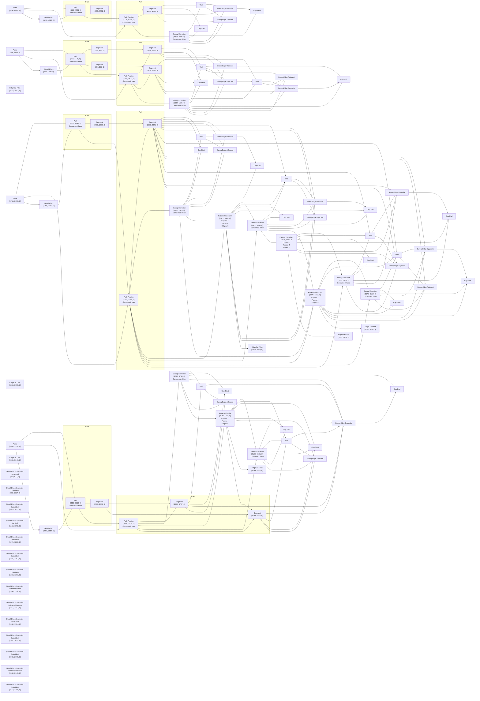

```mermaid
flowchart LR
  subgraph path2 [Path]
    2["Path<br>[764, 1449, 0]<br>Consumed: false"]
      %% [ProgramBodyItem { index: 5 }, VariableDeclarationDeclaration, VariableDeclarationInit]
    3["Segment<br>[791, 883, 0]"]
      %% [ProgramBodyItem { index: 5 }, VariableDeclarationDeclaration, VariableDeclarationInit, SketchBlockBody, SketchBlockBodyItem { index: 0 }, VariableDeclarationDeclaration, VariableDeclarationInit]
    4["Segment<br>[894, 957, 0]"]
      %% [ProgramBodyItem { index: 5 }, VariableDeclarationDeclaration, VariableDeclarationInit, SketchBlockBody, SketchBlockBodyItem { index: 1 }, VariableDeclarationDeclaration, VariableDeclarationInit]
  end
  subgraph path5 [Path]
    5["Path Region<br>[1464, 1520, 0]<br>Consumed: true"]
      %% [ProgramBodyItem { index: 6 }, VariableDeclarationDeclaration, VariableDeclarationInit]
    6["Segment<br>[1464, 1520, 0]"]
      %% [ProgramBodyItem { index: 6 }, VariableDeclarationDeclaration, VariableDeclarationInit]
    7["Segment<br>[1464, 1520, 0]"]
      %% [ProgramBodyItem { index: 6 }, VariableDeclarationDeclaration, VariableDeclarationInit]
  end
  subgraph path18 [Path]
    18["Path<br>[1756, 2190, 0]<br>Consumed: false"]
      %% [ProgramBodyItem { index: 10 }, VariableDeclarationDeclaration, VariableDeclarationInit]
    19["Segment<br>[1786, 1858, 0]"]
      %% [ProgramBodyItem { index: 10 }, VariableDeclarationDeclaration, VariableDeclarationInit, SketchBlockBody, SketchBlockBodyItem { index: 0 }, VariableDeclarationDeclaration, VariableDeclarationInit]
  end
  subgraph path20 [Path]
    20["Path Region<br>[2303, 2341, 0]<br>Consumed: true"]
      %% [ProgramBodyItem { index: 12 }, VariableDeclarationDeclaration, VariableDeclarationInit]
    21["Segment<br>[2303, 2341, 0]"]
      %% [ProgramBodyItem { index: 12 }, VariableDeclarationDeclaration, VariableDeclarationInit]
  end
  subgraph path54 [Path]
    54["Path<br>[3550, 3654, 0]<br>Consumed: false"]
      %% [ProgramBodyItem { index: 29 }, VariableDeclarationDeclaration, VariableDeclarationInit]
    55["Segment<br>[3586, 3652, 0]"]
      %% [ProgramBodyItem { index: 29 }, VariableDeclarationDeclaration, VariableDeclarationInit, SketchBlockBody, SketchBlockBodyItem { index: 0 }, VariableDeclarationDeclaration, VariableDeclarationInit]
  end
  subgraph path56 [Path]
    56["Path Region<br>[3668, 3707, 0]<br>Consumed: true"]
      %% [ProgramBodyItem { index: 30 }, VariableDeclarationDeclaration, VariableDeclarationInit]
    57["Segment<br>[3668, 3707, 0]"]
      %% [ProgramBodyItem { index: 30 }, VariableDeclarationDeclaration, VariableDeclarationInit]
    67["Segment<br>[4199, 4323, 0]"]
      %% [ProgramBodyItem { index: 33 }, VariableDeclarationDeclaration, VariableDeclarationInit]
  end
  subgraph path74 [Path]
    74["Path<br>[4618, 4723, 0]<br>Consumed: false"]
      %% [ProgramBodyItem { index: 39 }, VariableDeclarationDeclaration, VariableDeclarationInit]
    75["Segment<br>[4655, 4721, 0]"]
      %% [ProgramBodyItem { index: 39 }, VariableDeclarationDeclaration, VariableDeclarationInit, SketchBlockBody, SketchBlockBodyItem { index: 0 }, VariableDeclarationDeclaration, VariableDeclarationInit]
  end
  subgraph path76 [Path]
    76["Path Region<br>[4738, 4778, 0]<br>Consumed: true"]
      %% [ProgramBodyItem { index: 40 }, VariableDeclarationDeclaration, VariableDeclarationInit]
    77["Segment<br>[4738, 4778, 0]"]
      %% [ProgramBodyItem { index: 40 }, VariableDeclarationDeclaration, VariableDeclarationInit]
  end
  1["Plane<br>[764, 1449, 0]"]
    %% [ProgramBodyItem { index: 5 }, VariableDeclarationDeclaration, VariableDeclarationInit]
  8["Sweep Extrusion<br>[1532, 1591, 0]<br>Consumed: false"]
    %% [ProgramBodyItem { index: 7 }, VariableDeclarationDeclaration, VariableDeclarationInit]
  9[Wall]
    %% face_code_ref=Missing NodePath
  10[Wall]
    %% face_code_ref=Missing NodePath
  11["Cap Start"]
    %% face_code_ref=Missing NodePath
  12["Cap End"]
    %% face_code_ref=Missing NodePath
  13["SweepEdge Opposite"]
  14["SweepEdge Adjacent"]
  15["SweepEdge Opposite"]
  16["SweepEdge Adjacent"]
  17["Plane<br>[1756, 2190, 0]"]
    %% [ProgramBodyItem { index: 10 }, VariableDeclarationDeclaration, VariableDeclarationInit]
  22["Sweep Extrusion<br>[2360, 2423, 0]<br>Consumed: false"]
    %% [ProgramBodyItem { index: 13 }, VariableDeclarationDeclaration, VariableDeclarationInit]
  23[Wall]
    %% face_code_ref=Missing NodePath
  24["Cap Start"]
    %% face_code_ref=Missing NodePath
  25["Cap End"]
    %% face_code_ref=Missing NodePath
  26["SweepEdge Opposite"]
  27["SweepEdge Adjacent"]
  28["EdgeCut Fillet<br>[2542, 2683, 0]"]
    %% [ProgramBodyItem { index: 15 }, VariableDeclarationDeclaration, VariableDeclarationInit]
  29["Pattern Transform<br>[2972, 3069, 0]<br>Copies: 1<br>Faces: 4<br>Edges: 5"]
    %% [ProgramBodyItem { index: 20 }, VariableDeclarationDeclaration, VariableDeclarationInit, PipeBodyItem { index: 0 }]
  30["Sweep Extrusion<br>[2972, 3069, 0]<br>Consumed: false"]
    %% [ProgramBodyItem { index: 20 }, VariableDeclarationDeclaration, VariableDeclarationInit, PipeBodyItem { index: 0 }]
  31[Wall]
    %% face_code_ref=Missing NodePath
  32["Cap Start"]
    %% face_code_ref=Missing NodePath
  33["Cap End"]
    %% face_code_ref=Missing NodePath
  34["SweepEdge Opposite"]
  35["SweepEdge Adjacent"]
  36["EdgeCut Fillet<br>[2972, 3069, 0]"]
    %% [ProgramBodyItem { index: 20 }, VariableDeclarationDeclaration, VariableDeclarationInit, PipeBodyItem { index: 0 }]
  37["Pattern Transform<br>[3075, 3152, 0]<br>Copies: 1<br>Faces: 4<br>Edges: 5"]
    %% [ProgramBodyItem { index: 20 }, VariableDeclarationDeclaration, VariableDeclarationInit, PipeBodyItem { index: 1 }]
  38["Sweep Extrusion<br>[3075, 3152, 0]<br>Consumed: false"]
    %% [ProgramBodyItem { index: 20 }, VariableDeclarationDeclaration, VariableDeclarationInit, PipeBodyItem { index: 1 }]
  39[Wall]
    %% face_code_ref=Missing NodePath
  40["Cap Start"]
    %% face_code_ref=Missing NodePath
  41["Cap End"]
    %% face_code_ref=Missing NodePath
  42["SweepEdge Opposite"]
  43["SweepEdge Adjacent"]
  44["EdgeCut Fillet<br>[3075, 3152, 0]"]
    %% [ProgramBodyItem { index: 20 }, VariableDeclarationDeclaration, VariableDeclarationInit, PipeBodyItem { index: 1 }]
  45["Pattern Transform<br>[3075, 3152, 0]<br>Copies: 1<br>Faces: 4<br>Edges: 5"]
    %% [ProgramBodyItem { index: 20 }, VariableDeclarationDeclaration, VariableDeclarationInit, PipeBodyItem { index: 1 }]
  46["Sweep Extrusion<br>[3075, 3152, 0]<br>Consumed: false"]
    %% [ProgramBodyItem { index: 20 }, VariableDeclarationDeclaration, VariableDeclarationInit, PipeBodyItem { index: 1 }]
  47[Wall]
    %% face_code_ref=Missing NodePath
  48["Cap Start"]
    %% face_code_ref=Missing NodePath
  49["Cap End"]
    %% face_code_ref=Missing NodePath
  50["SweepEdge Opposite"]
  51["SweepEdge Adjacent"]
  52["EdgeCut Fillet<br>[3075, 3152, 0]"]
    %% [ProgramBodyItem { index: 20 }, VariableDeclarationDeclaration, VariableDeclarationInit, PipeBodyItem { index: 1 }]
  53["Plane<br>[3509, 3536, 0]"]
    %% [ProgramBodyItem { index: 28 }, VariableDeclarationDeclaration, VariableDeclarationInit]
  58["Sweep Extrusion<br>[3735, 3794, 0]<br>Consumed: false"]
    %% [ProgramBodyItem { index: 32 }, VariableDeclarationDeclaration, VariableDeclarationInit, PipeBodyItem { index: 0 }]
  59[Wall]
    %% face_code_ref=Missing NodePath
  60["Cap Start"]
    %% face_code_ref=Missing NodePath
  61["Cap End"]
    %% face_code_ref=Missing NodePath
  62["SweepEdge Opposite"]
  63["SweepEdge Adjacent"]
  64["EdgeCut Fillet<br>[3800, 3955, 0]"]
    %% [ProgramBodyItem { index: 32 }, VariableDeclarationDeclaration, VariableDeclarationInit, PipeBodyItem { index: 1 }]
  65["Pattern Circular<br>[4199, 4323, 0]<br>Copies: 1<br>Faces: 4<br>Edges: 5"]
    %% [ProgramBodyItem { index: 33 }, VariableDeclarationDeclaration, VariableDeclarationInit]
  66["Sweep Extrusion<br>[4199, 4323, 0]<br>Consumed: false"]
    %% [ProgramBodyItem { index: 33 }, VariableDeclarationDeclaration, VariableDeclarationInit]
  68[Wall]
    %% face_code_ref=Missing NodePath
  69["Cap Start"]
    %% face_code_ref=Missing NodePath
  70["Cap End"]
    %% face_code_ref=Missing NodePath
  71["SweepEdge Adjacent"]
  72["EdgeCut Fillet<br>[4199, 4323, 0]"]
    %% [ProgramBodyItem { index: 33 }, VariableDeclarationDeclaration, VariableDeclarationInit]
  73["Plane<br>[4404, 4449, 0]"]
    %% [ProgramBodyItem { index: 34 }, VariableDeclarationDeclaration, VariableDeclarationInit]
  78["Sweep Extrusion<br>[4808, 4875, 0]<br>Consumed: false"]
    %% [ProgramBodyItem { index: 42 }, VariableDeclarationDeclaration, VariableDeclarationInit, PipeBodyItem { index: 0 }]
  79[Wall]
    %% face_code_ref=Missing NodePath
  80["Cap Start"]
    %% face_code_ref=Missing NodePath
  81["Cap End"]
    %% face_code_ref=Missing NodePath
  82["SweepEdge Opposite"]
  83["SweepEdge Adjacent"]
  84["EdgeCut Fillet<br>[4881, 5041, 0]"]
    %% [ProgramBodyItem { index: 42 }, VariableDeclarationDeclaration, VariableDeclarationInit, PipeBodyItem { index: 1 }]
  85["SketchBlock<br>[764, 1449, 0]"]
    %% [ProgramBodyItem { index: 5 }, VariableDeclarationDeclaration, VariableDeclarationInit]
  86["SketchBlockConstraint Horizontal<br>[960, 977, 0]"]
    %% [ProgramBodyItem { index: 5 }, VariableDeclarationDeclaration, VariableDeclarationInit, SketchBlockBody, SketchBlockBodyItem { index: 2 }, ExpressionStatementExpr]
  87["SketchBlockConstraint Coincident<br>[980, 1017, 0]"]
    %% [ProgramBodyItem { index: 5 }, VariableDeclarationDeclaration, VariableDeclarationInit, SketchBlockBody, SketchBlockBodyItem { index: 3 }, ExpressionStatementExpr]
  88["SketchBlockConstraint Coincident<br>[1020, 1053, 0]"]
    %% [ProgramBodyItem { index: 5 }, VariableDeclarationDeclaration, VariableDeclarationInit, SketchBlockBody, SketchBlockBodyItem { index: 4 }, ExpressionStatementExpr]
  89["SketchBlockConstraint Vertical<br>[1152, 1172, 0]"]
    %% [ProgramBodyItem { index: 5 }, VariableDeclarationDeclaration, VariableDeclarationInit, SketchBlockBody, SketchBlockBodyItem { index: 6 }, ExpressionStatementExpr]
  90["SketchBlockConstraint Coincident<br>[1175, 1218, 0]"]
    %% [ProgramBodyItem { index: 5 }, VariableDeclarationDeclaration, VariableDeclarationInit, SketchBlockBody, SketchBlockBodyItem { index: 7 }, ExpressionStatementExpr]
  91["SketchBlockConstraint Coincident<br>[1221, 1257, 0]"]
    %% [ProgramBodyItem { index: 5 }, VariableDeclarationDeclaration, VariableDeclarationInit, SketchBlockBody, SketchBlockBodyItem { index: 8 }, ExpressionStatementExpr]
  92["SketchBlockConstraint Coincident<br>[1260, 1297, 0]"]
    %% [ProgramBodyItem { index: 5 }, VariableDeclarationDeclaration, VariableDeclarationInit, SketchBlockBody, SketchBlockBodyItem { index: 9 }, ExpressionStatementExpr]
  93["SketchBlockConstraint VerticalDistance<br>[1300, 1374, 0]"]
    %% [ProgramBodyItem { index: 5 }, VariableDeclarationDeclaration, VariableDeclarationInit, SketchBlockBody, SketchBlockBodyItem { index: 10 }, ExpressionStatementExpr]
  94["SketchBlockConstraint HorizontalDistance<br>[1377, 1447, 0]"]
    %% [ProgramBodyItem { index: 5 }, VariableDeclarationDeclaration, VariableDeclarationInit, SketchBlockBody, SketchBlockBodyItem { index: 11 }, ExpressionStatementExpr]
  95["SketchBlock<br>[1756, 2190, 0]"]
    %% [ProgramBodyItem { index: 10 }, VariableDeclarationDeclaration, VariableDeclarationInit]
  96["SketchBlockConstraint Horizontal<br>[1962, 1984, 0]"]
    %% [ProgramBodyItem { index: 10 }, VariableDeclarationDeclaration, VariableDeclarationInit, SketchBlockBody, SketchBlockBodyItem { index: 2 }, ExpressionStatementExpr]
  97["SketchBlockConstraint Coincident<br>[1987, 2032, 0]"]
    %% [ProgramBodyItem { index: 10 }, VariableDeclarationDeclaration, VariableDeclarationInit, SketchBlockBody, SketchBlockBodyItem { index: 3 }, ExpressionStatementExpr]
  98["SketchBlockConstraint Coincident<br>[2035, 2079, 0]"]
    %% [ProgramBodyItem { index: 10 }, VariableDeclarationDeclaration, VariableDeclarationInit, SketchBlockBody, SketchBlockBodyItem { index: 4 }, ExpressionStatementExpr]
  99["SketchBlockConstraint HorizontalDistance<br>[2082, 2149, 0]"]
    %% [ProgramBodyItem { index: 10 }, VariableDeclarationDeclaration, VariableDeclarationInit, SketchBlockBody, SketchBlockBodyItem { index: 5 }, ExpressionStatementExpr]
  100["SketchBlockConstraint Coincident<br>[2152, 2188, 0]"]
    %% [ProgramBodyItem { index: 10 }, VariableDeclarationDeclaration, VariableDeclarationInit, SketchBlockBody, SketchBlockBodyItem { index: 6 }, ExpressionStatementExpr]
  101["SketchBlock<br>[3550, 3654, 0]"]
    %% [ProgramBodyItem { index: 29 }, VariableDeclarationDeclaration, VariableDeclarationInit]
  102["SketchBlock<br>[4618, 4723, 0]"]
    %% [ProgramBodyItem { index: 39 }, VariableDeclarationDeclaration, VariableDeclarationInit]
  1 --- 2
  1 <--x 5
  1 <--x 85
  2 --- 3
  2 --- 4
  2 <--x 5
  85 --- 2
  3 <--x 6
  4 <--x 7
  5 --- 6
  5 --- 7
  5 ---- 8
  6 --- 10
  6 x--> 11
  6 --- 15
  6 --- 16
  7 --- 9
  7 x--> 11
  7 --- 13
  7 --- 14
  8 --- 9
  8 --- 10
  8 --- 11
  8 --- 12
  8 --- 13
  8 --- 14
  8 --- 15
  8 --- 16
  9 --- 13
  9 --- 14
  16 <--x 9
  14 <--x 10
  10 --- 15
  10 --- 16
  13 <--x 12
  15 <--x 12
  17 --- 18
  17 <--x 20
  17 <--x 95
  18 --- 19
  18 <--x 20
  95 --- 18
  19 <--x 21
  20 --- 21
  20 ---- 22
  20 --- 29
  20 <---x 30
  20 --- 37
  20 <---x 38
  20 <---x 46
  21 --- 23
  21 x--> 24
  21 --- 26
  21 --- 27
  21 <--x 31
  21 <--x 34
  21 <--x 35
  21 <--x 39
  21 <--x 42
  21 <--x 43
  21 <--x 47
  21 <--x 50
  21 <--x 51
  22 --- 23
  22 --- 24
  22 --- 25
  22 --- 26
  22 --- 27
  22 x--> 29
  22 x--> 37
  23 --- 26
  23 --- 27
  26 <--x 25
  29 x--> 30
  29 x--> 31
  29 x--> 32
  29 x--> 33
  29 x--> 34
  29 x--> 35
  29 x--> 36
  30 --- 31
  30 --- 32
  30 --- 33
  30 --- 34
  30 --- 35
  30 x--> 37
  30 --- 45
  31 --- 34
  31 --- 35
  34 <--x 33
  37 x--> 38
  37 x--> 39
  37 x--> 40
  37 x--> 41
  37 x--> 42
  37 x--> 43
  37 x--> 44
  38 --- 39
  38 --- 40
  38 --- 41
  38 --- 42
  38 --- 43
  39 --- 42
  39 --- 43
  42 <--x 41
  45 x--> 46
  45 x--> 47
  45 x--> 48
  45 x--> 49
  45 x--> 50
  45 x--> 51
  45 x--> 52
  46 --- 47
  46 --- 48
  46 --- 49
  46 --- 50
  46 --- 51
  47 --- 50
  47 --- 51
  50 <--x 49
  53 --- 54
  53 <--x 56
  53 <--x 101
  54 --- 55
  54 <--x 56
  101 --- 54
  55 <--x 57
  55 <--x 67
  56 --- 57
  56 ---- 58
  56 --- 65
  56 <---x 66
  56 <--x 67
  57 --- 59
  57 x--> 60
  57 --- 62
  57 --- 63
  58 --- 59
  58 --- 60
  58 --- 61
  58 --- 62
  58 --- 63
  58 x--> 65
  59 --- 62
  59 --- 63
  62 <--x 61
  66 <--x 62
  67 <--x 62
  68 <--x 62
  65 x--> 66
  65 x--> 67
  65 x--> 68
  65 x--> 69
  65 x--> 70
  65 x--> 71
  65 x--> 72
  66 --- 68
  66 --- 69
  66 --- 70
  66 --- 71
  67 --- 68
  67 x--> 69
  67 --- 71
  68 --- 71
  73 --- 74
  73 <--x 76
  73 <--x 102
  74 --- 75
  74 <--x 76
  102 --- 74
  75 <--x 77
  76 --- 77
  76 ---- 78
  77 --- 79
  77 x--> 81
  77 --- 82
  77 --- 83
  78 --- 79
  78 --- 80
  78 --- 81
  78 --- 82
  78 --- 83
  79 --- 82
  79 --- 83
  82 <--x 80
```
