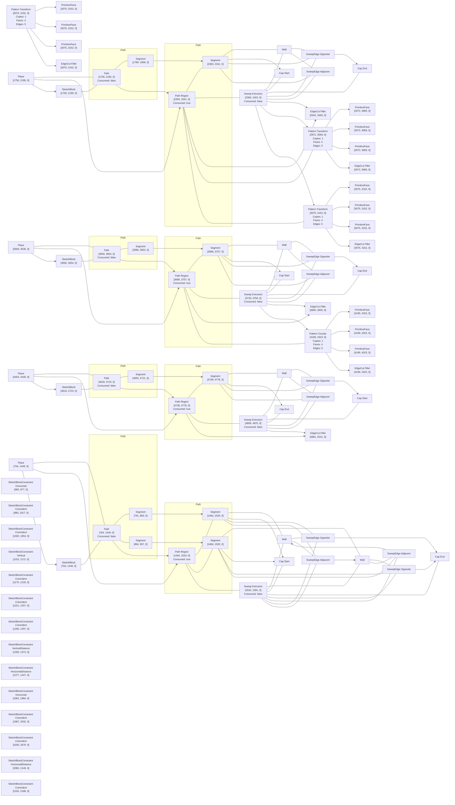

```mermaid
flowchart LR
  subgraph path2 [Path]
    2["Path<br>[764, 1449, 0]<br>Consumed: false"]
      %% [ProgramBodyItem { index: 5 }, VariableDeclarationDeclaration, VariableDeclarationInit]
    3["Segment<br>[791, 883, 0]"]
      %% [ProgramBodyItem { index: 5 }, VariableDeclarationDeclaration, VariableDeclarationInit, SketchBlockBody, SketchBlockBodyItem { index: 0 }, VariableDeclarationDeclaration, VariableDeclarationInit]
    4["Segment<br>[894, 957, 0]"]
      %% [ProgramBodyItem { index: 5 }, VariableDeclarationDeclaration, VariableDeclarationInit, SketchBlockBody, SketchBlockBodyItem { index: 1 }, VariableDeclarationDeclaration, VariableDeclarationInit]
  end
  subgraph path5 [Path]
    5["Path Region<br>[1464, 1520, 0]<br>Consumed: true"]
      %% [ProgramBodyItem { index: 6 }, VariableDeclarationDeclaration, VariableDeclarationInit]
    6["Segment<br>[1464, 1520, 0]"]
      %% [ProgramBodyItem { index: 6 }, VariableDeclarationDeclaration, VariableDeclarationInit]
    7["Segment<br>[1464, 1520, 0]"]
      %% [ProgramBodyItem { index: 6 }, VariableDeclarationDeclaration, VariableDeclarationInit]
  end
  subgraph path18 [Path]
    18["Path<br>[1756, 2190, 0]<br>Consumed: false"]
      %% [ProgramBodyItem { index: 10 }, VariableDeclarationDeclaration, VariableDeclarationInit]
    19["Segment<br>[1786, 1858, 0]"]
      %% [ProgramBodyItem { index: 10 }, VariableDeclarationDeclaration, VariableDeclarationInit, SketchBlockBody, SketchBlockBodyItem { index: 0 }, VariableDeclarationDeclaration, VariableDeclarationInit]
  end
  subgraph path20 [Path]
    20["Path Region<br>[2303, 2341, 0]<br>Consumed: true"]
      %% [ProgramBodyItem { index: 12 }, VariableDeclarationDeclaration, VariableDeclarationInit]
    21["Segment<br>[2303, 2341, 0]"]
      %% [ProgramBodyItem { index: 12 }, VariableDeclarationDeclaration, VariableDeclarationInit]
  end
  subgraph path45 [Path]
    45["Path<br>[3550, 3654, 0]<br>Consumed: false"]
      %% [ProgramBodyItem { index: 29 }, VariableDeclarationDeclaration, VariableDeclarationInit]
    46["Segment<br>[3586, 3652, 0]"]
      %% [ProgramBodyItem { index: 29 }, VariableDeclarationDeclaration, VariableDeclarationInit, SketchBlockBody, SketchBlockBodyItem { index: 0 }, VariableDeclarationDeclaration, VariableDeclarationInit]
  end
  subgraph path47 [Path]
    47["Path Region<br>[3668, 3707, 0]<br>Consumed: true"]
      %% [ProgramBodyItem { index: 30 }, VariableDeclarationDeclaration, VariableDeclarationInit]
    48["Segment<br>[3668, 3707, 0]"]
      %% [ProgramBodyItem { index: 30 }, VariableDeclarationDeclaration, VariableDeclarationInit]
  end
  subgraph path62 [Path]
    62["Path<br>[4618, 4723, 0]<br>Consumed: false"]
      %% [ProgramBodyItem { index: 39 }, VariableDeclarationDeclaration, VariableDeclarationInit]
    63["Segment<br>[4655, 4721, 0]"]
      %% [ProgramBodyItem { index: 39 }, VariableDeclarationDeclaration, VariableDeclarationInit, SketchBlockBody, SketchBlockBodyItem { index: 0 }, VariableDeclarationDeclaration, VariableDeclarationInit]
  end
  subgraph path64 [Path]
    64["Path Region<br>[4738, 4778, 0]<br>Consumed: true"]
      %% [ProgramBodyItem { index: 40 }, VariableDeclarationDeclaration, VariableDeclarationInit]
    65["Segment<br>[4738, 4778, 0]"]
      %% [ProgramBodyItem { index: 40 }, VariableDeclarationDeclaration, VariableDeclarationInit]
  end
  1["Plane<br>[764, 1449, 0]"]
    %% [ProgramBodyItem { index: 5 }, VariableDeclarationDeclaration, VariableDeclarationInit]
  8["Sweep Extrusion<br>[1532, 1591, 0]<br>Consumed: false"]
    %% [ProgramBodyItem { index: 7 }, VariableDeclarationDeclaration, VariableDeclarationInit]
  9[Wall]
    %% face_code_ref=Missing NodePath
  10[Wall]
    %% face_code_ref=Missing NodePath
  11["Cap Start"]
    %% face_code_ref=Missing NodePath
  12["Cap End"]
    %% face_code_ref=Missing NodePath
  13["SweepEdge Opposite"]
  14["SweepEdge Adjacent"]
  15["SweepEdge Opposite"]
  16["SweepEdge Adjacent"]
  17["Plane<br>[1756, 2190, 0]"]
    %% [ProgramBodyItem { index: 10 }, VariableDeclarationDeclaration, VariableDeclarationInit]
  22["Sweep Extrusion<br>[2360, 2423, 0]<br>Consumed: false"]
    %% [ProgramBodyItem { index: 13 }, VariableDeclarationDeclaration, VariableDeclarationInit]
  23[Wall]
    %% face_code_ref=Missing NodePath
  24["Cap Start"]
    %% face_code_ref=Missing NodePath
  25["Cap End"]
    %% face_code_ref=Missing NodePath
  26["SweepEdge Opposite"]
  27["SweepEdge Adjacent"]
  28["EdgeCut Fillet<br>[2542, 2683, 0]"]
    %% [ProgramBodyItem { index: 15 }, VariableDeclarationDeclaration, VariableDeclarationInit]
  29["Pattern Transform<br>[2972, 3069, 0]<br>Copies: 1<br>Faces: 4<br>Edges: 5"]
    %% [ProgramBodyItem { index: 20 }, VariableDeclarationDeclaration, VariableDeclarationInit, PipeBodyItem { index: 0 }]
  30["PrimitiveFace<br>[2972, 3069, 0]"]
    %% [ProgramBodyItem { index: 20 }, VariableDeclarationDeclaration, VariableDeclarationInit, PipeBodyItem { index: 0 }]
  31["PrimitiveFace<br>[2972, 3069, 0]"]
    %% [ProgramBodyItem { index: 20 }, VariableDeclarationDeclaration, VariableDeclarationInit, PipeBodyItem { index: 0 }]
  32["PrimitiveFace<br>[2972, 3069, 0]"]
    %% [ProgramBodyItem { index: 20 }, VariableDeclarationDeclaration, VariableDeclarationInit, PipeBodyItem { index: 0 }]
  33["EdgeCut Fillet<br>[2972, 3069, 0]"]
    %% [ProgramBodyItem { index: 20 }, VariableDeclarationDeclaration, VariableDeclarationInit, PipeBodyItem { index: 0 }]
  34["Pattern Transform<br>[3075, 3152, 0]<br>Copies: 1<br>Faces: 4<br>Edges: 5"]
    %% [ProgramBodyItem { index: 20 }, VariableDeclarationDeclaration, VariableDeclarationInit, PipeBodyItem { index: 1 }]
  35["PrimitiveFace<br>[3075, 3152, 0]"]
    %% [ProgramBodyItem { index: 20 }, VariableDeclarationDeclaration, VariableDeclarationInit, PipeBodyItem { index: 1 }]
  36["PrimitiveFace<br>[3075, 3152, 0]"]
    %% [ProgramBodyItem { index: 20 }, VariableDeclarationDeclaration, VariableDeclarationInit, PipeBodyItem { index: 1 }]
  37["PrimitiveFace<br>[3075, 3152, 0]"]
    %% [ProgramBodyItem { index: 20 }, VariableDeclarationDeclaration, VariableDeclarationInit, PipeBodyItem { index: 1 }]
  38["EdgeCut Fillet<br>[3075, 3152, 0]"]
    %% [ProgramBodyItem { index: 20 }, VariableDeclarationDeclaration, VariableDeclarationInit, PipeBodyItem { index: 1 }]
  39["Pattern Transform<br>[3075, 3152, 0]<br>Copies: 1<br>Faces: 4<br>Edges: 5"]
    %% [ProgramBodyItem { index: 20 }, VariableDeclarationDeclaration, VariableDeclarationInit, PipeBodyItem { index: 1 }]
  40["PrimitiveFace<br>[3075, 3152, 0]"]
    %% [ProgramBodyItem { index: 20 }, VariableDeclarationDeclaration, VariableDeclarationInit, PipeBodyItem { index: 1 }]
  41["PrimitiveFace<br>[3075, 3152, 0]"]
    %% [ProgramBodyItem { index: 20 }, VariableDeclarationDeclaration, VariableDeclarationInit, PipeBodyItem { index: 1 }]
  42["PrimitiveFace<br>[3075, 3152, 0]"]
    %% [ProgramBodyItem { index: 20 }, VariableDeclarationDeclaration, VariableDeclarationInit, PipeBodyItem { index: 1 }]
  43["EdgeCut Fillet<br>[3075, 3152, 0]"]
    %% [ProgramBodyItem { index: 20 }, VariableDeclarationDeclaration, VariableDeclarationInit, PipeBodyItem { index: 1 }]
  44["Plane<br>[3509, 3536, 0]"]
    %% [ProgramBodyItem { index: 28 }, VariableDeclarationDeclaration, VariableDeclarationInit]
  49["Sweep Extrusion<br>[3735, 3794, 0]<br>Consumed: false"]
    %% [ProgramBodyItem { index: 32 }, VariableDeclarationDeclaration, VariableDeclarationInit, PipeBodyItem { index: 0 }]
  50[Wall]
    %% face_code_ref=Missing NodePath
  51["Cap Start"]
    %% face_code_ref=Missing NodePath
  52["Cap End"]
    %% face_code_ref=Missing NodePath
  53["SweepEdge Opposite"]
  54["SweepEdge Adjacent"]
  55["EdgeCut Fillet<br>[3800, 3955, 0]"]
    %% [ProgramBodyItem { index: 32 }, VariableDeclarationDeclaration, VariableDeclarationInit, PipeBodyItem { index: 1 }]
  56["Pattern Circular<br>[4199, 4323, 0]<br>Copies: 1<br>Faces: 4<br>Edges: 5"]
    %% [ProgramBodyItem { index: 33 }, VariableDeclarationDeclaration, VariableDeclarationInit]
  57["PrimitiveFace<br>[4199, 4323, 0]"]
    %% [ProgramBodyItem { index: 33 }, VariableDeclarationDeclaration, VariableDeclarationInit]
  58["PrimitiveFace<br>[4199, 4323, 0]"]
    %% [ProgramBodyItem { index: 33 }, VariableDeclarationDeclaration, VariableDeclarationInit]
  59["PrimitiveFace<br>[4199, 4323, 0]"]
    %% [ProgramBodyItem { index: 33 }, VariableDeclarationDeclaration, VariableDeclarationInit]
  60["EdgeCut Fillet<br>[4199, 4323, 0]"]
    %% [ProgramBodyItem { index: 33 }, VariableDeclarationDeclaration, VariableDeclarationInit]
  61["Plane<br>[4404, 4449, 0]"]
    %% [ProgramBodyItem { index: 34 }, VariableDeclarationDeclaration, VariableDeclarationInit]
  66["Sweep Extrusion<br>[4808, 4875, 0]<br>Consumed: false"]
    %% [ProgramBodyItem { index: 42 }, VariableDeclarationDeclaration, VariableDeclarationInit, PipeBodyItem { index: 0 }]
  67[Wall]
    %% face_code_ref=Missing NodePath
  68["Cap Start"]
    %% face_code_ref=Missing NodePath
  69["Cap End"]
    %% face_code_ref=Missing NodePath
  70["SweepEdge Opposite"]
  71["SweepEdge Adjacent"]
  72["EdgeCut Fillet<br>[4881, 5041, 0]"]
    %% [ProgramBodyItem { index: 42 }, VariableDeclarationDeclaration, VariableDeclarationInit, PipeBodyItem { index: 1 }]
  73["SketchBlock<br>[764, 1449, 0]"]
    %% [ProgramBodyItem { index: 5 }, VariableDeclarationDeclaration, VariableDeclarationInit]
  74["SketchBlockConstraint Horizontal<br>[960, 977, 0]"]
    %% [ProgramBodyItem { index: 5 }, VariableDeclarationDeclaration, VariableDeclarationInit, SketchBlockBody, SketchBlockBodyItem { index: 2 }, ExpressionStatementExpr]
  75["SketchBlockConstraint Coincident<br>[980, 1017, 0]"]
    %% [ProgramBodyItem { index: 5 }, VariableDeclarationDeclaration, VariableDeclarationInit, SketchBlockBody, SketchBlockBodyItem { index: 3 }, ExpressionStatementExpr]
  76["SketchBlockConstraint Coincident<br>[1020, 1053, 0]"]
    %% [ProgramBodyItem { index: 5 }, VariableDeclarationDeclaration, VariableDeclarationInit, SketchBlockBody, SketchBlockBodyItem { index: 4 }, ExpressionStatementExpr]
  77["SketchBlockConstraint Vertical<br>[1152, 1172, 0]"]
    %% [ProgramBodyItem { index: 5 }, VariableDeclarationDeclaration, VariableDeclarationInit, SketchBlockBody, SketchBlockBodyItem { index: 6 }, ExpressionStatementExpr]
  78["SketchBlockConstraint Coincident<br>[1175, 1218, 0]"]
    %% [ProgramBodyItem { index: 5 }, VariableDeclarationDeclaration, VariableDeclarationInit, SketchBlockBody, SketchBlockBodyItem { index: 7 }, ExpressionStatementExpr]
  79["SketchBlockConstraint Coincident<br>[1221, 1257, 0]"]
    %% [ProgramBodyItem { index: 5 }, VariableDeclarationDeclaration, VariableDeclarationInit, SketchBlockBody, SketchBlockBodyItem { index: 8 }, ExpressionStatementExpr]
  80["SketchBlockConstraint Coincident<br>[1260, 1297, 0]"]
    %% [ProgramBodyItem { index: 5 }, VariableDeclarationDeclaration, VariableDeclarationInit, SketchBlockBody, SketchBlockBodyItem { index: 9 }, ExpressionStatementExpr]
  81["SketchBlockConstraint VerticalDistance<br>[1300, 1374, 0]"]
    %% [ProgramBodyItem { index: 5 }, VariableDeclarationDeclaration, VariableDeclarationInit, SketchBlockBody, SketchBlockBodyItem { index: 10 }, ExpressionStatementExpr]
  82["SketchBlockConstraint HorizontalDistance<br>[1377, 1447, 0]"]
    %% [ProgramBodyItem { index: 5 }, VariableDeclarationDeclaration, VariableDeclarationInit, SketchBlockBody, SketchBlockBodyItem { index: 11 }, ExpressionStatementExpr]
  83["SketchBlock<br>[1756, 2190, 0]"]
    %% [ProgramBodyItem { index: 10 }, VariableDeclarationDeclaration, VariableDeclarationInit]
  84["SketchBlockConstraint Horizontal<br>[1962, 1984, 0]"]
    %% [ProgramBodyItem { index: 10 }, VariableDeclarationDeclaration, VariableDeclarationInit, SketchBlockBody, SketchBlockBodyItem { index: 2 }, ExpressionStatementExpr]
  85["SketchBlockConstraint Coincident<br>[1987, 2032, 0]"]
    %% [ProgramBodyItem { index: 10 }, VariableDeclarationDeclaration, VariableDeclarationInit, SketchBlockBody, SketchBlockBodyItem { index: 3 }, ExpressionStatementExpr]
  86["SketchBlockConstraint Coincident<br>[2035, 2079, 0]"]
    %% [ProgramBodyItem { index: 10 }, VariableDeclarationDeclaration, VariableDeclarationInit, SketchBlockBody, SketchBlockBodyItem { index: 4 }, ExpressionStatementExpr]
  87["SketchBlockConstraint HorizontalDistance<br>[2082, 2149, 0]"]
    %% [ProgramBodyItem { index: 10 }, VariableDeclarationDeclaration, VariableDeclarationInit, SketchBlockBody, SketchBlockBodyItem { index: 5 }, ExpressionStatementExpr]
  88["SketchBlockConstraint Coincident<br>[2152, 2188, 0]"]
    %% [ProgramBodyItem { index: 10 }, VariableDeclarationDeclaration, VariableDeclarationInit, SketchBlockBody, SketchBlockBodyItem { index: 6 }, ExpressionStatementExpr]
  89["SketchBlock<br>[3550, 3654, 0]"]
    %% [ProgramBodyItem { index: 29 }, VariableDeclarationDeclaration, VariableDeclarationInit]
  90["SketchBlock<br>[4618, 4723, 0]"]
    %% [ProgramBodyItem { index: 39 }, VariableDeclarationDeclaration, VariableDeclarationInit]
  1 --- 2
  1 <--x 5
  1 <--x 73
  2 --- 3
  2 --- 4
  2 <--x 5
  73 --- 2
  3 <--x 6
  4 <--x 7
  5 --- 6
  5 --- 7
  5 ---- 8
  6 --- 10
  6 x--> 11
  6 --- 15
  6 --- 16
  7 --- 9
  7 x--> 11
  7 --- 13
  7 --- 14
  8 --- 9
  8 --- 10
  8 --- 11
  8 --- 12
  8 --- 13
  8 --- 14
  8 --- 15
  8 --- 16
  9 --- 13
  9 --- 14
  16 <--x 9
  14 <--x 10
  10 --- 15
  10 --- 16
  13 <--x 12
  15 <--x 12
  17 --- 18
  17 <--x 20
  17 <--x 83
  18 --- 19
  18 <--x 20
  83 --- 18
  19 <--x 21
  20 --- 21
  20 ---- 22
  20 <--x 28
  20 --- 29
  20 --- 34
  21 --- 23
  21 x--> 24
  21 --- 26
  21 --- 27
  22 --- 23
  22 --- 24
  22 --- 25
  22 --- 26
  22 --- 27
  22 x--> 28
  22 x--> 29
  22 x--> 34
  23 --- 26
  23 --- 27
  26 <--x 25
  29 x--> 30
  29 x--> 31
  29 x--> 32
  29 x--> 33
  34 x--> 35
  34 x--> 36
  34 x--> 37
  34 x--> 38
  39 x--> 40
  39 x--> 41
  39 x--> 42
  39 x--> 43
  44 --- 45
  44 <--x 47
  44 <--x 89
  45 --- 46
  45 <--x 47
  89 --- 45
  46 <--x 48
  47 --- 48
  47 ---- 49
  47 <--x 55
  47 --- 56
  48 --- 50
  48 x--> 51
  48 --- 53
  48 --- 54
  49 --- 50
  49 --- 51
  49 --- 52
  49 --- 53
  49 --- 54
  49 x--> 55
  49 x--> 56
  50 --- 53
  50 --- 54
  53 <--x 52
  56 x--> 57
  56 x--> 58
  56 x--> 59
  56 x--> 60
  61 --- 62
  61 <--x 64
  61 <--x 90
  62 --- 63
  62 <--x 64
  90 --- 62
  63 <--x 65
  64 --- 65
  64 ---- 66
  64 <--x 72
  65 --- 67
  65 x--> 69
  65 --- 70
  65 --- 71
  66 --- 67
  66 --- 68
  66 --- 69
  66 --- 70
  66 --- 71
  66 x--> 72
  67 --- 70
  67 --- 71
  70 <--x 68
```
