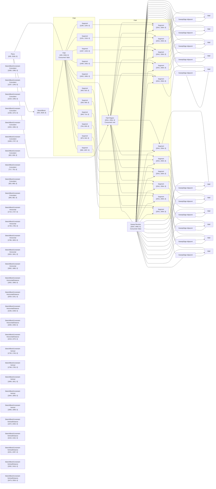

```mermaid
flowchart LR
  subgraph path2 [Path]
    2["Path<br>[435, 2528, 0]<br>Consumed: false"]
      %% [ProgramBodyItem { index: 13 }, VariableDeclarationDeclaration, VariableDeclarationInit]
    20["Segment<br>[463, 525, 0]"]
      %% [ProgramBodyItem { index: 13 }, VariableDeclarationDeclaration, VariableDeclarationInit, SketchBlockBody, SketchBlockBodyItem { index: 0 }, VariableDeclarationDeclaration, VariableDeclarationInit]
    21["Segment<br>[536, 599, 0]"]
      %% [ProgramBodyItem { index: 13 }, VariableDeclarationDeclaration, VariableDeclarationInit, SketchBlockBody, SketchBlockBodyItem { index: 1 }, VariableDeclarationDeclaration, VariableDeclarationInit]
    22["Segment<br>[649, 714, 0]"]
      %% [ProgramBodyItem { index: 13 }, VariableDeclarationDeclaration, VariableDeclarationInit, SketchBlockBody, SketchBlockBodyItem { index: 3 }, VariableDeclarationDeclaration, VariableDeclarationInit]
    23["Segment<br>[764, 829, 0]"]
      %% [ProgramBodyItem { index: 13 }, VariableDeclarationDeclaration, VariableDeclarationInit, SketchBlockBody, SketchBlockBodyItem { index: 5 }, VariableDeclarationDeclaration, VariableDeclarationInit]
    24["Segment<br>[879, 943, 0]"]
      %% [ProgramBodyItem { index: 13 }, VariableDeclarationDeclaration, VariableDeclarationInit, SketchBlockBody, SketchBlockBodyItem { index: 7 }, VariableDeclarationDeclaration, VariableDeclarationInit]
    25["Segment<br>[993, 1057, 0]"]
      %% [ProgramBodyItem { index: 13 }, VariableDeclarationDeclaration, VariableDeclarationInit, SketchBlockBody, SketchBlockBodyItem { index: 9 }, VariableDeclarationDeclaration, VariableDeclarationInit]
    4["Segment<br>[1106, 1204, 0]"]
      %% [ProgramBodyItem { index: 13 }, VariableDeclarationDeclaration, VariableDeclarationInit, SketchBlockBody, SketchBlockBodyItem { index: 11 }, VariableDeclarationDeclaration, VariableDeclarationInit]
    5["Segment<br>[1251, 1316, 0]"]
      %% [ProgramBodyItem { index: 13 }, VariableDeclarationDeclaration, VariableDeclarationInit, SketchBlockBody, SketchBlockBodyItem { index: 13 }, VariableDeclarationDeclaration, VariableDeclarationInit]
    6["Segment<br>[1367, 1433, 0]"]
      %% [ProgramBodyItem { index: 13 }, VariableDeclarationDeclaration, VariableDeclarationInit, SketchBlockBody, SketchBlockBodyItem { index: 15 }, VariableDeclarationDeclaration, VariableDeclarationInit]
    7["Segment<br>[1484, 1550, 0]"]
      %% [ProgramBodyItem { index: 13 }, VariableDeclarationDeclaration, VariableDeclarationInit, SketchBlockBody, SketchBlockBodyItem { index: 17 }, VariableDeclarationDeclaration, VariableDeclarationInit]
    8["Segment<br>[1602, 1666, 0]"]
      %% [ProgramBodyItem { index: 13 }, VariableDeclarationDeclaration, VariableDeclarationInit, SketchBlockBody, SketchBlockBodyItem { index: 19 }, VariableDeclarationDeclaration, VariableDeclarationInit]
  end
  subgraph path1 [Path]
    1["Path Region<br>[2541, 2594, 0]<br>Consumed: true"]
      %% [ProgramBodyItem { index: 14 }, VariableDeclarationDeclaration, VariableDeclarationInit]
    14["Segment<br>[2541, 2594, 0]"]
      %% [ProgramBodyItem { index: 14 }, VariableDeclarationDeclaration, VariableDeclarationInit]
    15["Segment<br>[2541, 2594, 0]"]
      %% [ProgramBodyItem { index: 14 }, VariableDeclarationDeclaration, VariableDeclarationInit]
    16["Segment<br>[2541, 2594, 0]"]
      %% [ProgramBodyItem { index: 14 }, VariableDeclarationDeclaration, VariableDeclarationInit]
    17["Segment<br>[2541, 2594, 0]"]
      %% [ProgramBodyItem { index: 14 }, VariableDeclarationDeclaration, VariableDeclarationInit]
    18["Segment<br>[2541, 2594, 0]"]
      %% [ProgramBodyItem { index: 14 }, VariableDeclarationDeclaration, VariableDeclarationInit]
    19["Segment<br>[2541, 2594, 0]"]
      %% [ProgramBodyItem { index: 14 }, VariableDeclarationDeclaration, VariableDeclarationInit]
    9["Segment<br>[2541, 2594, 0]"]
      %% [ProgramBodyItem { index: 14 }, VariableDeclarationDeclaration, VariableDeclarationInit]
    10["Segment<br>[2541, 2594, 0]"]
      %% [ProgramBodyItem { index: 14 }, VariableDeclarationDeclaration, VariableDeclarationInit]
    11["Segment<br>[2541, 2594, 0]"]
      %% [ProgramBodyItem { index: 14 }, VariableDeclarationDeclaration, VariableDeclarationInit]
    12["Segment<br>[2541, 2594, 0]"]
      %% [ProgramBodyItem { index: 14 }, VariableDeclarationDeclaration, VariableDeclarationInit]
    13["Segment<br>[2541, 2594, 0]"]
      %% [ProgramBodyItem { index: 14 }, VariableDeclarationDeclaration, VariableDeclarationInit]
  end
  3["Plane<br>[435, 2528, 0]"]
    %% [ProgramBodyItem { index: 13 }, VariableDeclarationDeclaration, VariableDeclarationInit]
  57["Sweep Revolve<br>[2624, 2668, 0]<br>Consumed: false"]
    %% [ProgramBodyItem { index: 16 }, VariableDeclarationDeclaration, VariableDeclarationInit]
  69[Wall]
    %% face_code_ref=Missing NodePath
  70[Wall]
    %% face_code_ref=Missing NodePath
  71[Wall]
    %% face_code_ref=Missing NodePath
  72[Wall]
    %% face_code_ref=Missing NodePath
  73[Wall]
    %% face_code_ref=Missing NodePath
  74[Wall]
    %% face_code_ref=Missing NodePath
  75[Wall]
    %% face_code_ref=Missing NodePath
  76[Wall]
    %% face_code_ref=Missing NodePath
  77[Wall]
    %% face_code_ref=Missing NodePath
  78[Wall]
    %% face_code_ref=Missing NodePath
  79[Wall]
    %% face_code_ref=Missing NodePath
  58["SweepEdge Adjacent"]
  59["SweepEdge Adjacent"]
  60["SweepEdge Adjacent"]
  61["SweepEdge Adjacent"]
  62["SweepEdge Adjacent"]
  63["SweepEdge Adjacent"]
  64["SweepEdge Adjacent"]
  65["SweepEdge Adjacent"]
  66["SweepEdge Adjacent"]
  67["SweepEdge Adjacent"]
  68["SweepEdge Adjacent"]
  26["SketchBlock<br>[435, 2528, 0]"]
    %% [ProgramBodyItem { index: 13 }, VariableDeclarationDeclaration, VariableDeclarationInit]
  33["SketchBlockConstraint Coincident<br>[602, 638, 0]"]
    %% [ProgramBodyItem { index: 13 }, VariableDeclarationDeclaration, VariableDeclarationInit, SketchBlockBody, SketchBlockBodyItem { index: 2 }, ExpressionStatementExpr]
  34["SketchBlockConstraint Coincident<br>[717, 753, 0]"]
    %% [ProgramBodyItem { index: 13 }, VariableDeclarationDeclaration, VariableDeclarationInit, SketchBlockBody, SketchBlockBodyItem { index: 4 }, ExpressionStatementExpr]
  35["SketchBlockConstraint Coincident<br>[832, 868, 0]"]
    %% [ProgramBodyItem { index: 13 }, VariableDeclarationDeclaration, VariableDeclarationInit, SketchBlockBody, SketchBlockBodyItem { index: 6 }, ExpressionStatementExpr]
  36["SketchBlockConstraint Coincident<br>[946, 982, 0]"]
    %% [ProgramBodyItem { index: 13 }, VariableDeclarationDeclaration, VariableDeclarationInit, SketchBlockBody, SketchBlockBodyItem { index: 8 }, ExpressionStatementExpr]
  27["SketchBlockConstraint Coincident<br>[1060, 1096, 0]"]
    %% [ProgramBodyItem { index: 13 }, VariableDeclarationDeclaration, VariableDeclarationInit, SketchBlockBody, SketchBlockBodyItem { index: 10 }, ExpressionStatementExpr]
  28["SketchBlockConstraint Coincident<br>[1207, 1240, 0]"]
    %% [ProgramBodyItem { index: 13 }, VariableDeclarationDeclaration, VariableDeclarationInit, SketchBlockBody, SketchBlockBodyItem { index: 12 }, ExpressionStatementExpr]
  29["SketchBlockConstraint Coincident<br>[1319, 1356, 0]"]
    %% [ProgramBodyItem { index: 13 }, VariableDeclarationDeclaration, VariableDeclarationInit, SketchBlockBody, SketchBlockBodyItem { index: 14 }, ExpressionStatementExpr]
  30["SketchBlockConstraint Coincident<br>[1436, 1472, 0]"]
    %% [ProgramBodyItem { index: 13 }, VariableDeclarationDeclaration, VariableDeclarationInit, SketchBlockBody, SketchBlockBodyItem { index: 16 }, ExpressionStatementExpr]
  31["SketchBlockConstraint Coincident<br>[1553, 1590, 0]"]
    %% [ProgramBodyItem { index: 13 }, VariableDeclarationDeclaration, VariableDeclarationInit, SketchBlockBody, SketchBlockBodyItem { index: 18 }, ExpressionStatementExpr]
  32["SketchBlockConstraint Coincident<br>[1669, 1707, 0]"]
    %% [ProgramBodyItem { index: 13 }, VariableDeclarationDeclaration, VariableDeclarationInit, SketchBlockBody, SketchBlockBodyItem { index: 20 }, ExpressionStatementExpr]
  37["SketchBlockConstraint Horizontal<br>[1710, 1727, 0]"]
    %% [ProgramBodyItem { index: 13 }, VariableDeclarationDeclaration, VariableDeclarationInit, SketchBlockBody, SketchBlockBodyItem { index: 21 }, ExpressionStatementExpr]
  47["SketchBlockConstraint Vertical<br>[1730, 1745, 0]"]
    %% [ProgramBodyItem { index: 13 }, VariableDeclarationDeclaration, VariableDeclarationInit, SketchBlockBody, SketchBlockBodyItem { index: 22 }, ExpressionStatementExpr]
  38["SketchBlockConstraint Horizontal<br>[1748, 1765, 0]"]
    %% [ProgramBodyItem { index: 13 }, VariableDeclarationDeclaration, VariableDeclarationInit, SketchBlockBody, SketchBlockBodyItem { index: 23 }, ExpressionStatementExpr]
  48["SketchBlockConstraint Vertical<br>[1768, 1783, 0]"]
    %% [ProgramBodyItem { index: 13 }, VariableDeclarationDeclaration, VariableDeclarationInit, SketchBlockBody, SketchBlockBodyItem { index: 24 }, ExpressionStatementExpr]
  39["SketchBlockConstraint Horizontal<br>[1786, 1803, 0]"]
    %% [ProgramBodyItem { index: 13 }, VariableDeclarationDeclaration, VariableDeclarationInit, SketchBlockBody, SketchBlockBodyItem { index: 25 }, ExpressionStatementExpr]
  49["SketchBlockConstraint Vertical<br>[1806, 1821, 0]"]
    %% [ProgramBodyItem { index: 13 }, VariableDeclarationDeclaration, VariableDeclarationInit, SketchBlockBody, SketchBlockBodyItem { index: 26 }, ExpressionStatementExpr]
  40["SketchBlockConstraint Horizontal<br>[1824, 1841, 0]"]
    %% [ProgramBodyItem { index: 13 }, VariableDeclarationDeclaration, VariableDeclarationInit, SketchBlockBody, SketchBlockBodyItem { index: 27 }, ExpressionStatementExpr]
  50["SketchBlockConstraint Vertical<br>[1844, 1859, 0]"]
    %% [ProgramBodyItem { index: 13 }, VariableDeclarationDeclaration, VariableDeclarationInit, SketchBlockBody, SketchBlockBodyItem { index: 28 }, ExpressionStatementExpr]
  41["SketchBlockConstraint Horizontal<br>[1862, 1880, 0]"]
    %% [ProgramBodyItem { index: 13 }, VariableDeclarationDeclaration, VariableDeclarationInit, SketchBlockBody, SketchBlockBodyItem { index: 29 }, ExpressionStatementExpr]
  51["SketchBlockConstraint Vertical<br>[1883, 1899, 0]"]
    %% [ProgramBodyItem { index: 13 }, VariableDeclarationDeclaration, VariableDeclarationInit, SketchBlockBody, SketchBlockBodyItem { index: 30 }, ExpressionStatementExpr]
  42["SketchBlockConstraint HorizontalDistance<br>[1902, 1969, 0]"]
    %% [ProgramBodyItem { index: 13 }, VariableDeclarationDeclaration, VariableDeclarationInit, SketchBlockBody, SketchBlockBodyItem { index: 31 }, ExpressionStatementExpr]
  52["SketchBlockConstraint VerticalDistance<br>[1972, 2030, 0]"]
    %% [ProgramBodyItem { index: 13 }, VariableDeclarationDeclaration, VariableDeclarationInit, SketchBlockBody, SketchBlockBodyItem { index: 32 }, ExpressionStatementExpr]
  43["SketchBlockConstraint HorizontalDistance<br>[2033, 2101, 0]"]
    %% [ProgramBodyItem { index: 13 }, VariableDeclarationDeclaration, VariableDeclarationInit, SketchBlockBody, SketchBlockBodyItem { index: 33 }, ExpressionStatementExpr]
  53["SketchBlockConstraint VerticalDistance<br>[2104, 2162, 0]"]
    %% [ProgramBodyItem { index: 13 }, VariableDeclarationDeclaration, VariableDeclarationInit, SketchBlockBody, SketchBlockBodyItem { index: 34 }, ExpressionStatementExpr]
  44["SketchBlockConstraint HorizontalDistance<br>[2165, 2238, 0]"]
    %% [ProgramBodyItem { index: 13 }, VariableDeclarationDeclaration, VariableDeclarationInit, SketchBlockBody, SketchBlockBodyItem { index: 35 }, ExpressionStatementExpr]
  54["SketchBlockConstraint VerticalDistance<br>[2241, 2297, 0]"]
    %% [ProgramBodyItem { index: 13 }, VariableDeclarationDeclaration, VariableDeclarationInit, SketchBlockBody, SketchBlockBodyItem { index: 36 }, ExpressionStatementExpr]
  45["SketchBlockConstraint HorizontalDistance<br>[2300, 2359, 0]"]
    %% [ProgramBodyItem { index: 13 }, VariableDeclarationDeclaration, VariableDeclarationInit, SketchBlockBody, SketchBlockBodyItem { index: 37 }, ExpressionStatementExpr]
  55["SketchBlockConstraint VerticalDistance<br>[2362, 2416, 0]"]
    %% [ProgramBodyItem { index: 13 }, VariableDeclarationDeclaration, VariableDeclarationInit, SketchBlockBody, SketchBlockBodyItem { index: 38 }, ExpressionStatementExpr]
  46["SketchBlockConstraint HorizontalDistance<br>[2419, 2470, 0]"]
    %% [ProgramBodyItem { index: 13 }, VariableDeclarationDeclaration, VariableDeclarationInit, SketchBlockBody, SketchBlockBodyItem { index: 39 }, ExpressionStatementExpr]
  56["SketchBlockConstraint VerticalDistance<br>[2473, 2526, 0]"]
    %% [ProgramBodyItem { index: 13 }, VariableDeclarationDeclaration, VariableDeclarationInit, SketchBlockBody, SketchBlockBodyItem { index: 40 }, ExpressionStatementExpr]
  2 x--> 1
  3 x--> 1
  1 <--x 9
  1 <--x 10
  1 <--x 11
  1 <--x 12
  1 <--x 13
  1 <--x 14
  1 <--x 15
  1 <--x 16
  1 <--x 17
  1 <--x 18
  1 <--x 19
  1 ---- 57
  3 --- 2
  2 --- 4
  2 --- 5
  2 --- 6
  2 --- 7
  2 --- 8
  2 --- 20
  2 --- 21
  2 --- 22
  2 --- 23
  2 --- 24
  2 --- 25
  26 --- 2
  3 <--x 26
  4 <--x 9
  5 <--x 10
  6 <--x 11
  7 <--x 12
  8 <--x 13
  57 <--x 9
  9 --- 58
  9 --- 69
  57 <--x 10
  10 --- 59
  10 --- 70
  57 <--x 11
  11 --- 60
  11 --- 71
  57 <--x 12
  12 --- 61
  12 --- 72
  57 <--x 13
  13 --- 62
  13 --- 73
  20 x--> 14
  57 <--x 14
  14 --- 63
  14 --- 74
  21 x--> 15
  57 <--x 15
  15 --- 64
  15 --- 75
  22 x--> 16
  57 <--x 16
  16 --- 65
  16 --- 76
  23 x--> 17
  57 <--x 17
  17 --- 66
  17 --- 77
  24 x--> 18
  57 <--x 18
  18 --- 67
  18 --- 78
  25 x--> 19
  57 <--x 19
  19 --- 68
  19 --- 79
  57 --- 58
  57 --- 59
  57 --- 60
  57 --- 61
  57 --- 62
  57 --- 63
  57 --- 64
  57 --- 65
  57 --- 66
  57 --- 67
  57 --- 68
  57 --- 69
  57 --- 70
  57 --- 71
  57 --- 72
  57 --- 73
  57 --- 74
  57 --- 75
  57 --- 76
  57 --- 77
  57 --- 78
  57 --- 79
  69 --- 58
  58 x--> 69
  70 --- 59
  59 x--> 70
  71 --- 60
  60 x--> 71
  72 --- 61
  61 x--> 72
  73 --- 62
  62 x--> 73
  74 --- 63
  63 x--> 74
  75 --- 64
  64 x--> 75
  76 --- 65
  65 x--> 76
  77 --- 66
  66 x--> 77
  78 --- 67
  67 x--> 78
  79 --- 68
  68 x--> 79
```
