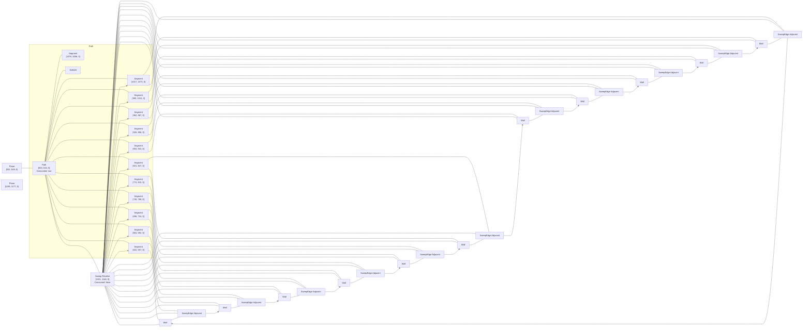

```mermaid
flowchart LR
  subgraph path2 [Path]
    2["Path<br>[563, 616, 0]<br>Consumed: true"]
      %% [ProgramBodyItem { index: 15 }, VariableDeclarationDeclaration, VariableDeclarationInit, PipeBodyItem { index: 0 }]
    3["Segment<br>[622, 657, 0]"]
      %% [ProgramBodyItem { index: 15 }, VariableDeclarationDeclaration, VariableDeclarationInit, PipeBodyItem { index: 1 }]
    4["Segment<br>[663, 692, 0]"]
      %% [ProgramBodyItem { index: 15 }, VariableDeclarationDeclaration, VariableDeclarationInit, PipeBodyItem { index: 2 }]
    5["Segment<br>[698, 734, 0]"]
      %% [ProgramBodyItem { index: 15 }, VariableDeclarationDeclaration, VariableDeclarationInit, PipeBodyItem { index: 3 }]
    6["Segment<br>[740, 768, 0]"]
      %% [ProgramBodyItem { index: 15 }, VariableDeclarationDeclaration, VariableDeclarationInit, PipeBodyItem { index: 4 }]
    7["Segment<br>[774, 815, 0]"]
      %% [ProgramBodyItem { index: 15 }, VariableDeclarationDeclaration, VariableDeclarationInit, PipeBodyItem { index: 5 }]
    8["Segment<br>[821, 847, 0]"]
      %% [ProgramBodyItem { index: 15 }, VariableDeclarationDeclaration, VariableDeclarationInit, PipeBodyItem { index: 6 }]
    9["Segment<br>[853, 922, 0]"]
      %% [ProgramBodyItem { index: 15 }, VariableDeclarationDeclaration, VariableDeclarationInit, PipeBodyItem { index: 7 }]
    10["Segment<br>[928, 956, 0]"]
      %% [ProgramBodyItem { index: 15 }, VariableDeclarationDeclaration, VariableDeclarationInit, PipeBodyItem { index: 8 }]
    11["Segment<br>[962, 987, 0]"]
      %% [ProgramBodyItem { index: 15 }, VariableDeclarationDeclaration, VariableDeclarationInit, PipeBodyItem { index: 9 }]
    12["Segment<br>[993, 1011, 0]"]
      %% [ProgramBodyItem { index: 15 }, VariableDeclarationDeclaration, VariableDeclarationInit, PipeBodyItem { index: 10 }]
    13["Segment<br>[1017, 1073, 0]"]
      %% [ProgramBodyItem { index: 15 }, VariableDeclarationDeclaration, VariableDeclarationInit, PipeBodyItem { index: 11 }]
    14["Segment<br>[1079, 1086, 0]"]
      %% [ProgramBodyItem { index: 15 }, VariableDeclarationDeclaration, VariableDeclarationInit, PipeBodyItem { index: 12 }]
    15[Solid2d]
  end
  1["Plane<br>[532, 549, 0]"]
    %% [ProgramBodyItem { index: 14 }, VariableDeclarationDeclaration, VariableDeclarationInit]
  16["Sweep Revolve<br>[1101, 1146, 0]<br>Consumed: false"]
    %% [ProgramBodyItem { index: 16 }, VariableDeclarationDeclaration, VariableDeclarationInit]
  17[Wall]
    %% face_code_ref=Missing NodePath
  18[Wall]
    %% face_code_ref=Missing NodePath
  19[Wall]
    %% face_code_ref=Missing NodePath
  20[Wall]
    %% face_code_ref=Missing NodePath
  21[Wall]
    %% face_code_ref=Missing NodePath
  22[Wall]
    %% face_code_ref=Missing NodePath
  23[Wall]
    %% face_code_ref=Missing NodePath
  24[Wall]
    %% face_code_ref=Missing NodePath
  25[Wall]
    %% face_code_ref=Missing NodePath
  26[Wall]
    %% face_code_ref=Missing NodePath
  27[Wall]
    %% face_code_ref=Missing NodePath
  28["SweepEdge Adjacent"]
  29["SweepEdge Adjacent"]
  30["SweepEdge Adjacent"]
  31["SweepEdge Adjacent"]
  32["SweepEdge Adjacent"]
  33["SweepEdge Adjacent"]
  34["SweepEdge Adjacent"]
  35["SweepEdge Adjacent"]
  36["SweepEdge Adjacent"]
  37["SweepEdge Adjacent"]
  38["SweepEdge Adjacent"]
  39["Plane<br>[1159, 1177, 0]"]
    %% [ProgramBodyItem { index: 17 }, VariableDeclarationDeclaration, VariableDeclarationInit]
  1 --- 2
  2 --- 3
  2 --- 4
  2 --- 5
  2 --- 6
  2 --- 7
  2 --- 8
  2 --- 9
  2 --- 10
  2 --- 11
  2 --- 12
  2 --- 13
  2 --- 14
  2 --- 15
  2 ---- 16
  16 <--x 3
  3 --- 17
  3 --- 28
  16 <--x 4
  4 --- 18
  4 --- 29
  16 <--x 5
  5 --- 19
  5 --- 30
  16 <--x 6
  6 --- 20
  6 --- 31
  16 <--x 7
  7 --- 21
  7 --- 32
  16 <--x 8
  8 --- 22
  8 --- 33
  16 <--x 9
  9 --- 23
  9 --- 34
  16 <--x 10
  10 --- 24
  10 --- 35
  16 <--x 11
  11 --- 25
  11 --- 36
  16 <--x 12
  12 --- 26
  12 --- 37
  16 <--x 13
  13 --- 27
  13 --- 38
  16 --- 17
  16 --- 18
  16 --- 19
  16 --- 20
  16 --- 21
  16 --- 22
  16 --- 23
  16 --- 24
  16 --- 25
  16 --- 26
  16 --- 27
  16 --- 28
  16 --- 29
  16 --- 30
  16 --- 31
  16 --- 32
  16 --- 33
  16 --- 34
  16 --- 35
  16 --- 36
  16 --- 37
  16 --- 38
  17 --- 28
  38 <--x 17
  28 <--x 18
  18 --- 29
  29 <--x 19
  19 --- 30
  30 <--x 20
  20 --- 31
  31 <--x 21
  21 --- 32
  32 <--x 22
  22 --- 33
  33 <--x 23
  23 --- 34
  34 <--x 24
  24 --- 35
  35 <--x 25
  25 --- 36
  36 <--x 26
  26 --- 37
  37 <--x 27
  27 --- 38
```
