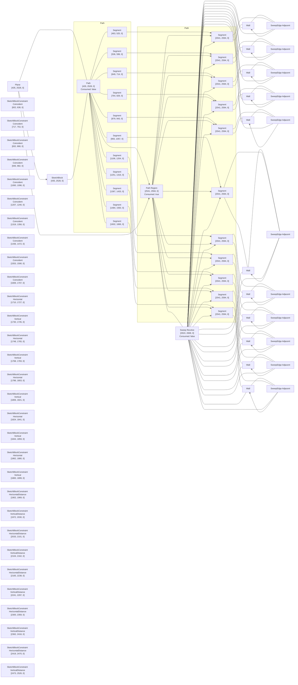

```mermaid
flowchart LR
  subgraph path12 [Path]
    12["Path<br>[435, 2528, 0]<br>Consumed: false"]
      %% [ProgramBodyItem { index: 13 }, VariableDeclarationDeclaration, VariableDeclarationInit]
    15["Segment<br>[463, 525, 0]"]
      %% [ProgramBodyItem { index: 13 }, VariableDeclarationDeclaration, VariableDeclarationInit, SketchBlockBody, SketchBlockBodyItem { index: 0 }, VariableDeclarationDeclaration, VariableDeclarationInit]
    16["Segment<br>[536, 599, 0]"]
      %% [ProgramBodyItem { index: 13 }, VariableDeclarationDeclaration, VariableDeclarationInit, SketchBlockBody, SketchBlockBodyItem { index: 1 }, VariableDeclarationDeclaration, VariableDeclarationInit]
    18["Segment<br>[649, 714, 0]"]
      %% [ProgramBodyItem { index: 13 }, VariableDeclarationDeclaration, VariableDeclarationInit, SketchBlockBody, SketchBlockBodyItem { index: 3 }, VariableDeclarationDeclaration, VariableDeclarationInit]
    20["Segment<br>[764, 829, 0]"]
      %% [ProgramBodyItem { index: 13 }, VariableDeclarationDeclaration, VariableDeclarationInit, SketchBlockBody, SketchBlockBodyItem { index: 5 }, VariableDeclarationDeclaration, VariableDeclarationInit]
    22["Segment<br>[879, 943, 0]"]
      %% [ProgramBodyItem { index: 13 }, VariableDeclarationDeclaration, VariableDeclarationInit, SketchBlockBody, SketchBlockBodyItem { index: 7 }, VariableDeclarationDeclaration, VariableDeclarationInit]
    24["Segment<br>[993, 1057, 0]"]
      %% [ProgramBodyItem { index: 13 }, VariableDeclarationDeclaration, VariableDeclarationInit, SketchBlockBody, SketchBlockBodyItem { index: 9 }, VariableDeclarationDeclaration, VariableDeclarationInit]
    26["Segment<br>[1106, 1204, 0]"]
      %% [ProgramBodyItem { index: 13 }, VariableDeclarationDeclaration, VariableDeclarationInit, SketchBlockBody, SketchBlockBodyItem { index: 11 }, VariableDeclarationDeclaration, VariableDeclarationInit]
    28["Segment<br>[1251, 1316, 0]"]
      %% [ProgramBodyItem { index: 13 }, VariableDeclarationDeclaration, VariableDeclarationInit, SketchBlockBody, SketchBlockBodyItem { index: 13 }, VariableDeclarationDeclaration, VariableDeclarationInit]
    30["Segment<br>[1367, 1433, 0]"]
      %% [ProgramBodyItem { index: 13 }, VariableDeclarationDeclaration, VariableDeclarationInit, SketchBlockBody, SketchBlockBodyItem { index: 15 }, VariableDeclarationDeclaration, VariableDeclarationInit]
    32["Segment<br>[1484, 1550, 0]"]
      %% [ProgramBodyItem { index: 13 }, VariableDeclarationDeclaration, VariableDeclarationInit, SketchBlockBody, SketchBlockBodyItem { index: 17 }, VariableDeclarationDeclaration, VariableDeclarationInit]
    34["Segment<br>[1602, 1666, 0]"]
      %% [ProgramBodyItem { index: 13 }, VariableDeclarationDeclaration, VariableDeclarationInit, SketchBlockBody, SketchBlockBodyItem { index: 19 }, VariableDeclarationDeclaration, VariableDeclarationInit]
  end
  subgraph path56 [Path]
    56["Path Region<br>[2541, 2594, 0]<br>Consumed: true"]
      %% [ProgramBodyItem { index: 14 }, VariableDeclarationDeclaration, VariableDeclarationInit]
    57["Segment<br>[2541, 2594, 0]"]
      %% [ProgramBodyItem { index: 14 }, VariableDeclarationDeclaration, VariableDeclarationInit]
    58["Segment<br>[2541, 2594, 0]"]
      %% [ProgramBodyItem { index: 14 }, VariableDeclarationDeclaration, VariableDeclarationInit]
    59["Segment<br>[2541, 2594, 0]"]
      %% [ProgramBodyItem { index: 14 }, VariableDeclarationDeclaration, VariableDeclarationInit]
    60["Segment<br>[2541, 2594, 0]"]
      %% [ProgramBodyItem { index: 14 }, VariableDeclarationDeclaration, VariableDeclarationInit]
    61["Segment<br>[2541, 2594, 0]"]
      %% [ProgramBodyItem { index: 14 }, VariableDeclarationDeclaration, VariableDeclarationInit]
    62["Segment<br>[2541, 2594, 0]"]
      %% [ProgramBodyItem { index: 14 }, VariableDeclarationDeclaration, VariableDeclarationInit]
    63["Segment<br>[2541, 2594, 0]"]
      %% [ProgramBodyItem { index: 14 }, VariableDeclarationDeclaration, VariableDeclarationInit]
    64["Segment<br>[2541, 2594, 0]"]
      %% [ProgramBodyItem { index: 14 }, VariableDeclarationDeclaration, VariableDeclarationInit]
    65["Segment<br>[2541, 2594, 0]"]
      %% [ProgramBodyItem { index: 14 }, VariableDeclarationDeclaration, VariableDeclarationInit]
    66["Segment<br>[2541, 2594, 0]"]
      %% [ProgramBodyItem { index: 14 }, VariableDeclarationDeclaration, VariableDeclarationInit]
    67["Segment<br>[2541, 2594, 0]"]
      %% [ProgramBodyItem { index: 14 }, VariableDeclarationDeclaration, VariableDeclarationInit]
  end
  1[Wall]
    %% face_code_ref=Missing NodePath
  2[Wall]
    %% face_code_ref=Missing NodePath
  3[Wall]
    %% face_code_ref=Missing NodePath
  4[Wall]
    %% face_code_ref=Missing NodePath
  5[Wall]
    %% face_code_ref=Missing NodePath
  6[Wall]
    %% face_code_ref=Missing NodePath
  7[Wall]
    %% face_code_ref=Missing NodePath
  8[Wall]
    %% face_code_ref=Missing NodePath
  9[Wall]
    %% face_code_ref=Missing NodePath
  10[Wall]
    %% face_code_ref=Missing NodePath
  11[Wall]
    %% face_code_ref=Missing NodePath
  13["Plane<br>[435, 2528, 0]"]
    %% [ProgramBodyItem { index: 13 }, VariableDeclarationDeclaration, VariableDeclarationInit]
  14["SketchBlock<br>[435, 2528, 0]"]
    %% [ProgramBodyItem { index: 13 }, VariableDeclarationDeclaration, VariableDeclarationInit]
  17["SketchBlockConstraint Coincident<br>[602, 638, 0]"]
    %% [ProgramBodyItem { index: 13 }, VariableDeclarationDeclaration, VariableDeclarationInit, SketchBlockBody, SketchBlockBodyItem { index: 2 }, ExpressionStatementExpr]
  19["SketchBlockConstraint Coincident<br>[717, 753, 0]"]
    %% [ProgramBodyItem { index: 13 }, VariableDeclarationDeclaration, VariableDeclarationInit, SketchBlockBody, SketchBlockBodyItem { index: 4 }, ExpressionStatementExpr]
  21["SketchBlockConstraint Coincident<br>[832, 868, 0]"]
    %% [ProgramBodyItem { index: 13 }, VariableDeclarationDeclaration, VariableDeclarationInit, SketchBlockBody, SketchBlockBodyItem { index: 6 }, ExpressionStatementExpr]
  23["SketchBlockConstraint Coincident<br>[946, 982, 0]"]
    %% [ProgramBodyItem { index: 13 }, VariableDeclarationDeclaration, VariableDeclarationInit, SketchBlockBody, SketchBlockBodyItem { index: 8 }, ExpressionStatementExpr]
  25["SketchBlockConstraint Coincident<br>[1060, 1096, 0]"]
    %% [ProgramBodyItem { index: 13 }, VariableDeclarationDeclaration, VariableDeclarationInit, SketchBlockBody, SketchBlockBodyItem { index: 10 }, ExpressionStatementExpr]
  27["SketchBlockConstraint Coincident<br>[1207, 1240, 0]"]
    %% [ProgramBodyItem { index: 13 }, VariableDeclarationDeclaration, VariableDeclarationInit, SketchBlockBody, SketchBlockBodyItem { index: 12 }, ExpressionStatementExpr]
  29["SketchBlockConstraint Coincident<br>[1319, 1356, 0]"]
    %% [ProgramBodyItem { index: 13 }, VariableDeclarationDeclaration, VariableDeclarationInit, SketchBlockBody, SketchBlockBodyItem { index: 14 }, ExpressionStatementExpr]
  31["SketchBlockConstraint Coincident<br>[1436, 1472, 0]"]
    %% [ProgramBodyItem { index: 13 }, VariableDeclarationDeclaration, VariableDeclarationInit, SketchBlockBody, SketchBlockBodyItem { index: 16 }, ExpressionStatementExpr]
  33["SketchBlockConstraint Coincident<br>[1553, 1590, 0]"]
    %% [ProgramBodyItem { index: 13 }, VariableDeclarationDeclaration, VariableDeclarationInit, SketchBlockBody, SketchBlockBodyItem { index: 18 }, ExpressionStatementExpr]
  35["SketchBlockConstraint Coincident<br>[1669, 1707, 0]"]
    %% [ProgramBodyItem { index: 13 }, VariableDeclarationDeclaration, VariableDeclarationInit, SketchBlockBody, SketchBlockBodyItem { index: 20 }, ExpressionStatementExpr]
  36["SketchBlockConstraint Horizontal<br>[1710, 1727, 0]"]
    %% [ProgramBodyItem { index: 13 }, VariableDeclarationDeclaration, VariableDeclarationInit, SketchBlockBody, SketchBlockBodyItem { index: 21 }, ExpressionStatementExpr]
  37["SketchBlockConstraint Vertical<br>[1730, 1745, 0]"]
    %% [ProgramBodyItem { index: 13 }, VariableDeclarationDeclaration, VariableDeclarationInit, SketchBlockBody, SketchBlockBodyItem { index: 22 }, ExpressionStatementExpr]
  38["SketchBlockConstraint Horizontal<br>[1748, 1765, 0]"]
    %% [ProgramBodyItem { index: 13 }, VariableDeclarationDeclaration, VariableDeclarationInit, SketchBlockBody, SketchBlockBodyItem { index: 23 }, ExpressionStatementExpr]
  39["SketchBlockConstraint Vertical<br>[1768, 1783, 0]"]
    %% [ProgramBodyItem { index: 13 }, VariableDeclarationDeclaration, VariableDeclarationInit, SketchBlockBody, SketchBlockBodyItem { index: 24 }, ExpressionStatementExpr]
  40["SketchBlockConstraint Horizontal<br>[1786, 1803, 0]"]
    %% [ProgramBodyItem { index: 13 }, VariableDeclarationDeclaration, VariableDeclarationInit, SketchBlockBody, SketchBlockBodyItem { index: 25 }, ExpressionStatementExpr]
  41["SketchBlockConstraint Vertical<br>[1806, 1821, 0]"]
    %% [ProgramBodyItem { index: 13 }, VariableDeclarationDeclaration, VariableDeclarationInit, SketchBlockBody, SketchBlockBodyItem { index: 26 }, ExpressionStatementExpr]
  42["SketchBlockConstraint Horizontal<br>[1824, 1841, 0]"]
    %% [ProgramBodyItem { index: 13 }, VariableDeclarationDeclaration, VariableDeclarationInit, SketchBlockBody, SketchBlockBodyItem { index: 27 }, ExpressionStatementExpr]
  43["SketchBlockConstraint Vertical<br>[1844, 1859, 0]"]
    %% [ProgramBodyItem { index: 13 }, VariableDeclarationDeclaration, VariableDeclarationInit, SketchBlockBody, SketchBlockBodyItem { index: 28 }, ExpressionStatementExpr]
  44["SketchBlockConstraint Horizontal<br>[1862, 1880, 0]"]
    %% [ProgramBodyItem { index: 13 }, VariableDeclarationDeclaration, VariableDeclarationInit, SketchBlockBody, SketchBlockBodyItem { index: 29 }, ExpressionStatementExpr]
  45["SketchBlockConstraint Vertical<br>[1883, 1899, 0]"]
    %% [ProgramBodyItem { index: 13 }, VariableDeclarationDeclaration, VariableDeclarationInit, SketchBlockBody, SketchBlockBodyItem { index: 30 }, ExpressionStatementExpr]
  46["SketchBlockConstraint HorizontalDistance<br>[1902, 1969, 0]"]
    %% [ProgramBodyItem { index: 13 }, VariableDeclarationDeclaration, VariableDeclarationInit, SketchBlockBody, SketchBlockBodyItem { index: 31 }, ExpressionStatementExpr]
  47["SketchBlockConstraint VerticalDistance<br>[1972, 2030, 0]"]
    %% [ProgramBodyItem { index: 13 }, VariableDeclarationDeclaration, VariableDeclarationInit, SketchBlockBody, SketchBlockBodyItem { index: 32 }, ExpressionStatementExpr]
  48["SketchBlockConstraint HorizontalDistance<br>[2033, 2101, 0]"]
    %% [ProgramBodyItem { index: 13 }, VariableDeclarationDeclaration, VariableDeclarationInit, SketchBlockBody, SketchBlockBodyItem { index: 33 }, ExpressionStatementExpr]
  49["SketchBlockConstraint VerticalDistance<br>[2104, 2162, 0]"]
    %% [ProgramBodyItem { index: 13 }, VariableDeclarationDeclaration, VariableDeclarationInit, SketchBlockBody, SketchBlockBodyItem { index: 34 }, ExpressionStatementExpr]
  50["SketchBlockConstraint HorizontalDistance<br>[2165, 2238, 0]"]
    %% [ProgramBodyItem { index: 13 }, VariableDeclarationDeclaration, VariableDeclarationInit, SketchBlockBody, SketchBlockBodyItem { index: 35 }, ExpressionStatementExpr]
  51["SketchBlockConstraint VerticalDistance<br>[2241, 2297, 0]"]
    %% [ProgramBodyItem { index: 13 }, VariableDeclarationDeclaration, VariableDeclarationInit, SketchBlockBody, SketchBlockBodyItem { index: 36 }, ExpressionStatementExpr]
  52["SketchBlockConstraint HorizontalDistance<br>[2300, 2359, 0]"]
    %% [ProgramBodyItem { index: 13 }, VariableDeclarationDeclaration, VariableDeclarationInit, SketchBlockBody, SketchBlockBodyItem { index: 37 }, ExpressionStatementExpr]
  53["SketchBlockConstraint VerticalDistance<br>[2362, 2416, 0]"]
    %% [ProgramBodyItem { index: 13 }, VariableDeclarationDeclaration, VariableDeclarationInit, SketchBlockBody, SketchBlockBodyItem { index: 38 }, ExpressionStatementExpr]
  54["SketchBlockConstraint HorizontalDistance<br>[2419, 2470, 0]"]
    %% [ProgramBodyItem { index: 13 }, VariableDeclarationDeclaration, VariableDeclarationInit, SketchBlockBody, SketchBlockBodyItem { index: 39 }, ExpressionStatementExpr]
  55["SketchBlockConstraint VerticalDistance<br>[2473, 2526, 0]"]
    %% [ProgramBodyItem { index: 13 }, VariableDeclarationDeclaration, VariableDeclarationInit, SketchBlockBody, SketchBlockBodyItem { index: 40 }, ExpressionStatementExpr]
  68["Sweep Revolve<br>[2624, 2668, 0]<br>Consumed: false"]
    %% [ProgramBodyItem { index: 16 }, VariableDeclarationDeclaration, VariableDeclarationInit]
  69["SweepEdge Adjacent"]
  70["SweepEdge Adjacent"]
  71["SweepEdge Adjacent"]
  72["SweepEdge Adjacent"]
  73["SweepEdge Adjacent"]
  74["SweepEdge Adjacent"]
  75["SweepEdge Adjacent"]
  76["SweepEdge Adjacent"]
  77["SweepEdge Adjacent"]
  78["SweepEdge Adjacent"]
  79["SweepEdge Adjacent"]
  57 --- 1
  68 --- 1
  1 --- 69
  69 <--x 1
  58 --- 2
  68 --- 2
  2 --- 70
  70 <--x 2
  59 --- 3
  68 --- 3
  3 --- 71
  71 <--x 3
  60 --- 4
  68 --- 4
  4 --- 72
  72 <--x 4
  61 --- 5
  68 --- 5
  5 --- 73
  73 <--x 5
  62 --- 6
  68 --- 6
  6 --- 74
  74 <--x 6
  63 --- 7
  68 --- 7
  7 --- 75
  75 <--x 7
  64 --- 8
  68 --- 8
  8 --- 76
  76 <--x 8
  65 --- 9
  68 --- 9
  9 --- 77
  77 <--x 9
  66 --- 10
  68 --- 10
  10 --- 78
  78 <--x 10
  67 --- 11
  68 --- 11
  11 --- 79
  79 <--x 11
  13 --- 12
  14 --- 12
  12 --- 15
  12 --- 16
  12 --- 18
  12 --- 20
  12 --- 22
  12 --- 24
  12 --- 26
  12 --- 28
  12 --- 30
  12 --- 32
  12 --- 34
  12 <--x 56
  13 <--x 14
  13 <--x 56
  15 <--x 62
  16 <--x 63
  18 <--x 64
  20 <--x 65
  22 <--x 66
  24 <--x 67
  26 <--x 57
  28 <--x 58
  30 <--x 59
  32 <--x 60
  34 <--x 61
  56 <--x 57
  56 <--x 58
  56 <--x 59
  56 <--x 60
  56 <--x 61
  56 <--x 62
  56 <--x 63
  56 <--x 64
  56 <--x 65
  56 <--x 66
  56 <--x 67
  56 ---- 68
  68 <--x 57
  57 --- 69
  68 <--x 58
  58 --- 70
  68 <--x 59
  59 --- 71
  68 <--x 60
  60 --- 72
  68 <--x 61
  61 --- 73
  68 <--x 62
  62 --- 74
  68 <--x 63
  63 --- 75
  68 <--x 64
  64 --- 76
  68 <--x 65
  65 --- 77
  68 <--x 66
  66 --- 78
  68 <--x 67
  67 --- 79
  68 --- 69
  68 --- 70
  68 --- 71
  68 --- 72
  68 --- 73
  68 --- 74
  68 --- 75
  68 --- 76
  68 --- 77
  68 --- 78
  68 --- 79
```
