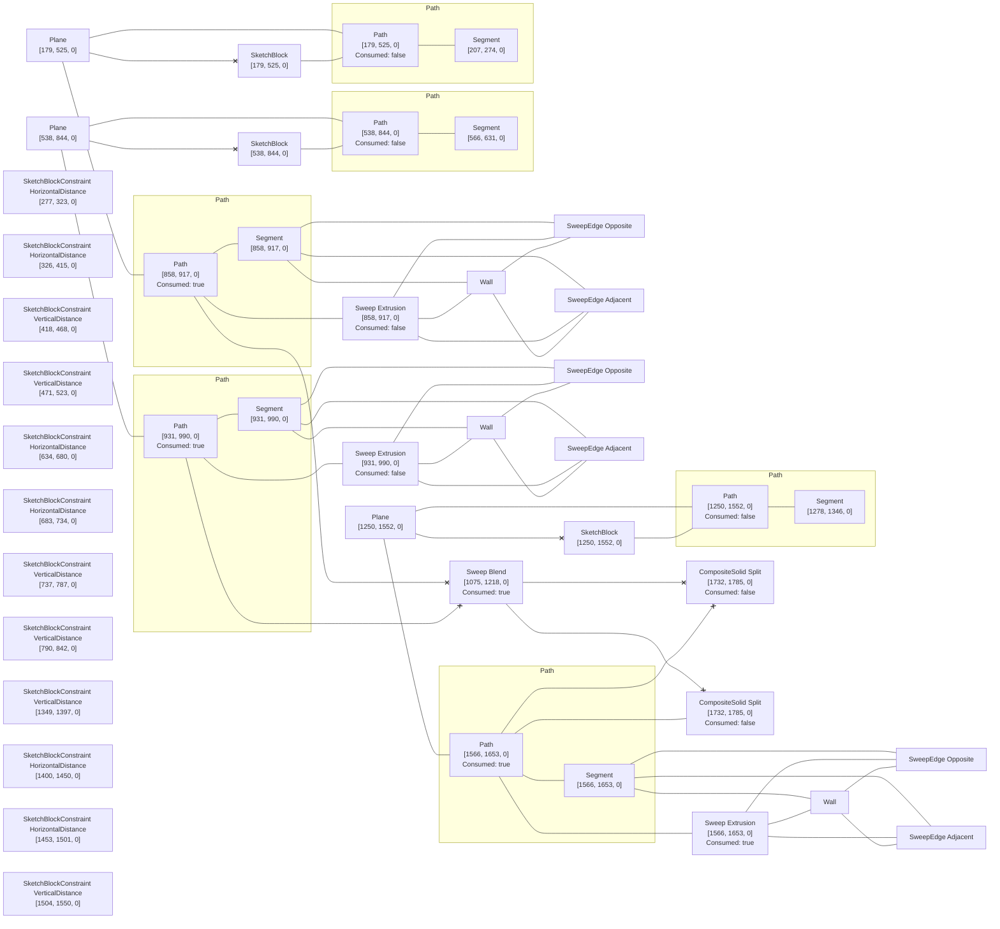

```mermaid
flowchart LR
  subgraph path2 [Path]
    2["Path<br>[179, 525, 0]<br>Consumed: false"]
      %% [ProgramBodyItem { index: 1 }, VariableDeclarationDeclaration, VariableDeclarationInit]
    3["Segment<br>[207, 274, 0]"]
      %% [ProgramBodyItem { index: 1 }, VariableDeclarationDeclaration, VariableDeclarationInit, SketchBlockBody, SketchBlockBodyItem { index: 0 }, VariableDeclarationDeclaration, VariableDeclarationInit]
  end
  subgraph path5 [Path]
    5["Path<br>[538, 844, 0]<br>Consumed: false"]
      %% [ProgramBodyItem { index: 2 }, VariableDeclarationDeclaration, VariableDeclarationInit]
    6["Segment<br>[566, 631, 0]"]
      %% [ProgramBodyItem { index: 2 }, VariableDeclarationDeclaration, VariableDeclarationInit, SketchBlockBody, SketchBlockBodyItem { index: 0 }, VariableDeclarationDeclaration, VariableDeclarationInit]
  end
  subgraph path7 [Path]
    7["Path<br>[858, 917, 0]<br>Consumed: true"]
      %% [ProgramBodyItem { index: 3 }, VariableDeclarationDeclaration, VariableDeclarationInit]
    8["Segment<br>[858, 917, 0]"]
      %% [ProgramBodyItem { index: 3 }, VariableDeclarationDeclaration, VariableDeclarationInit]
  end
  subgraph path13 [Path]
    13["Path<br>[931, 990, 0]<br>Consumed: true"]
      %% [ProgramBodyItem { index: 4 }, VariableDeclarationDeclaration, VariableDeclarationInit]
    14["Segment<br>[931, 990, 0]"]
      %% [ProgramBodyItem { index: 4 }, VariableDeclarationDeclaration, VariableDeclarationInit]
  end
  subgraph path21 [Path]
    21["Path<br>[1250, 1552, 0]<br>Consumed: false"]
      %% [ProgramBodyItem { index: 8 }, VariableDeclarationDeclaration, VariableDeclarationInit]
    22["Segment<br>[1278, 1346, 0]"]
      %% [ProgramBodyItem { index: 8 }, VariableDeclarationDeclaration, VariableDeclarationInit, SketchBlockBody, SketchBlockBodyItem { index: 0 }, VariableDeclarationDeclaration, VariableDeclarationInit]
  end
  subgraph path23 [Path]
    23["Path<br>[1566, 1653, 0]<br>Consumed: true"]
      %% [ProgramBodyItem { index: 9 }, VariableDeclarationDeclaration, VariableDeclarationInit]
    24["Segment<br>[1566, 1653, 0]"]
      %% [ProgramBodyItem { index: 9 }, VariableDeclarationDeclaration, VariableDeclarationInit]
  end
  1["Plane<br>[179, 525, 0]"]
    %% [ProgramBodyItem { index: 1 }, VariableDeclarationDeclaration, VariableDeclarationInit]
  4["Plane<br>[538, 844, 0]"]
    %% [ProgramBodyItem { index: 2 }, VariableDeclarationDeclaration, VariableDeclarationInit]
  9["Sweep Extrusion<br>[858, 917, 0]<br>Consumed: false"]
    %% [ProgramBodyItem { index: 3 }, VariableDeclarationDeclaration, VariableDeclarationInit]
  10[Wall]
    %% face_code_ref=Missing NodePath
  11["SweepEdge Opposite"]
  12["SweepEdge Adjacent"]
  15["Sweep Extrusion<br>[931, 990, 0]<br>Consumed: false"]
    %% [ProgramBodyItem { index: 4 }, VariableDeclarationDeclaration, VariableDeclarationInit]
  16[Wall]
    %% face_code_ref=Missing NodePath
  17["SweepEdge Opposite"]
  18["SweepEdge Adjacent"]
  19["Sweep Blend<br>[1075, 1218, 0]<br>Consumed: true"]
    %% [ProgramBodyItem { index: 7 }, VariableDeclarationDeclaration, VariableDeclarationInit]
  20["Plane<br>[1250, 1552, 0]"]
    %% [ProgramBodyItem { index: 8 }, VariableDeclarationDeclaration, VariableDeclarationInit]
  25["Sweep Extrusion<br>[1566, 1653, 0]<br>Consumed: true"]
    %% [ProgramBodyItem { index: 9 }, VariableDeclarationDeclaration, VariableDeclarationInit]
  26[Wall]
    %% face_code_ref=Missing NodePath
  27["SweepEdge Opposite"]
  28["SweepEdge Adjacent"]
  29["CompositeSolid Split<br>[1732, 1785, 0]<br>Consumed: false"]
    %% [ProgramBodyItem { index: 11 }, VariableDeclarationDeclaration, VariableDeclarationInit]
  30["CompositeSolid Split<br>[1732, 1785, 0]<br>Consumed: false"]
    %% [ProgramBodyItem { index: 11 }, VariableDeclarationDeclaration, VariableDeclarationInit]
  31["SketchBlock<br>[179, 525, 0]"]
    %% [ProgramBodyItem { index: 1 }, VariableDeclarationDeclaration, VariableDeclarationInit]
  32["SketchBlockConstraint HorizontalDistance<br>[277, 323, 0]"]
    %% [ProgramBodyItem { index: 1 }, VariableDeclarationDeclaration, VariableDeclarationInit, SketchBlockBody, SketchBlockBodyItem { index: 1 }, ExpressionStatementExpr]
  33["SketchBlockConstraint HorizontalDistance<br>[326, 415, 0]"]
    %% [ProgramBodyItem { index: 1 }, VariableDeclarationDeclaration, VariableDeclarationInit, SketchBlockBody, SketchBlockBodyItem { index: 2 }, ExpressionStatementExpr]
  34["SketchBlockConstraint VerticalDistance<br>[418, 468, 0]"]
    %% [ProgramBodyItem { index: 1 }, VariableDeclarationDeclaration, VariableDeclarationInit, SketchBlockBody, SketchBlockBodyItem { index: 3 }, ExpressionStatementExpr]
  35["SketchBlockConstraint VerticalDistance<br>[471, 523, 0]"]
    %% [ProgramBodyItem { index: 1 }, VariableDeclarationDeclaration, VariableDeclarationInit, SketchBlockBody, SketchBlockBodyItem { index: 4 }, ExpressionStatementExpr]
  36["SketchBlock<br>[538, 844, 0]"]
    %% [ProgramBodyItem { index: 2 }, VariableDeclarationDeclaration, VariableDeclarationInit]
  37["SketchBlockConstraint HorizontalDistance<br>[634, 680, 0]"]
    %% [ProgramBodyItem { index: 2 }, VariableDeclarationDeclaration, VariableDeclarationInit, SketchBlockBody, SketchBlockBodyItem { index: 1 }, ExpressionStatementExpr]
  38["SketchBlockConstraint HorizontalDistance<br>[683, 734, 0]"]
    %% [ProgramBodyItem { index: 2 }, VariableDeclarationDeclaration, VariableDeclarationInit, SketchBlockBody, SketchBlockBodyItem { index: 2 }, ExpressionStatementExpr]
  39["SketchBlockConstraint VerticalDistance<br>[737, 787, 0]"]
    %% [ProgramBodyItem { index: 2 }, VariableDeclarationDeclaration, VariableDeclarationInit, SketchBlockBody, SketchBlockBodyItem { index: 3 }, ExpressionStatementExpr]
  40["SketchBlockConstraint VerticalDistance<br>[790, 842, 0]"]
    %% [ProgramBodyItem { index: 2 }, VariableDeclarationDeclaration, VariableDeclarationInit, SketchBlockBody, SketchBlockBodyItem { index: 4 }, ExpressionStatementExpr]
  41["SketchBlock<br>[1250, 1552, 0]"]
    %% [ProgramBodyItem { index: 8 }, VariableDeclarationDeclaration, VariableDeclarationInit]
  42["SketchBlockConstraint VerticalDistance<br>[1349, 1397, 0]"]
    %% [ProgramBodyItem { index: 8 }, VariableDeclarationDeclaration, VariableDeclarationInit, SketchBlockBody, SketchBlockBodyItem { index: 1 }, ExpressionStatementExpr]
  43["SketchBlockConstraint HorizontalDistance<br>[1400, 1450, 0]"]
    %% [ProgramBodyItem { index: 8 }, VariableDeclarationDeclaration, VariableDeclarationInit, SketchBlockBody, SketchBlockBodyItem { index: 2 }, ExpressionStatementExpr]
  44["SketchBlockConstraint HorizontalDistance<br>[1453, 1501, 0]"]
    %% [ProgramBodyItem { index: 8 }, VariableDeclarationDeclaration, VariableDeclarationInit, SketchBlockBody, SketchBlockBodyItem { index: 3 }, ExpressionStatementExpr]
  45["SketchBlockConstraint VerticalDistance<br>[1504, 1550, 0]"]
    %% [ProgramBodyItem { index: 8 }, VariableDeclarationDeclaration, VariableDeclarationInit, SketchBlockBody, SketchBlockBodyItem { index: 4 }, ExpressionStatementExpr]
  1 --- 2
  1 --- 7
  1 <--x 31
  2 --- 3
  31 --- 2
  4 --- 5
  4 --- 13
  4 <--x 36
  5 --- 6
  36 --- 5
  7 --- 8
  7 ---- 9
  7 <---x 19
  8 --- 10
  8 --- 11
  8 --- 12
  9 --- 10
  9 --- 11
  9 --- 12
  10 --- 11
  10 --- 12
  13 --- 14
  13 ---- 15
  13 <---x 19
  14 --- 16
  14 --- 17
  14 --- 18
  15 --- 16
  15 --- 17
  15 --- 18
  16 --- 17
  16 --- 18
  19 <--x 29
  19 <--x 30
  20 --- 21
  20 --- 23
  20 <--x 41
  21 --- 22
  41 --- 21
  23 --- 24
  23 ---- 25
  23 <--x 29
  23 --- 30
  24 --- 26
  24 --- 27
  24 --- 28
  25 --- 26
  25 --- 27
  25 --- 28
  26 --- 27
  26 --- 28
```
