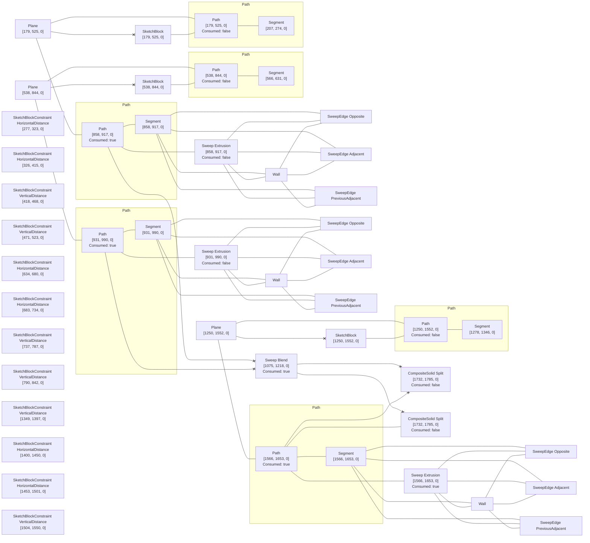

```mermaid
flowchart LR
  subgraph path2 [Path]
    2["Path<br>[179, 525, 0]<br>Consumed: false"]
      %% [ProgramBodyItem { index: 1 }, VariableDeclarationDeclaration, VariableDeclarationInit]
    3["Segment<br>[207, 274, 0]"]
      %% [ProgramBodyItem { index: 1 }, VariableDeclarationDeclaration, VariableDeclarationInit, SketchBlockBody, SketchBlockBodyItem { index: 0 }, VariableDeclarationDeclaration, VariableDeclarationInit]
  end
  subgraph path5 [Path]
    5["Path<br>[538, 844, 0]<br>Consumed: false"]
      %% [ProgramBodyItem { index: 2 }, VariableDeclarationDeclaration, VariableDeclarationInit]
    6["Segment<br>[566, 631, 0]"]
      %% [ProgramBodyItem { index: 2 }, VariableDeclarationDeclaration, VariableDeclarationInit, SketchBlockBody, SketchBlockBodyItem { index: 0 }, VariableDeclarationDeclaration, VariableDeclarationInit]
  end
  subgraph path7 [Path]
    7["Path<br>[858, 917, 0]<br>Consumed: true"]
      %% [ProgramBodyItem { index: 3 }, VariableDeclarationDeclaration, VariableDeclarationInit]
    8["Segment<br>[858, 917, 0]"]
      %% [ProgramBodyItem { index: 3 }, VariableDeclarationDeclaration, VariableDeclarationInit]
  end
  subgraph path14 [Path]
    14["Path<br>[931, 990, 0]<br>Consumed: true"]
      %% [ProgramBodyItem { index: 4 }, VariableDeclarationDeclaration, VariableDeclarationInit]
    15["Segment<br>[931, 990, 0]"]
      %% [ProgramBodyItem { index: 4 }, VariableDeclarationDeclaration, VariableDeclarationInit]
  end
  subgraph path23 [Path]
    23["Path<br>[1250, 1552, 0]<br>Consumed: false"]
      %% [ProgramBodyItem { index: 8 }, VariableDeclarationDeclaration, VariableDeclarationInit]
    24["Segment<br>[1278, 1346, 0]"]
      %% [ProgramBodyItem { index: 8 }, VariableDeclarationDeclaration, VariableDeclarationInit, SketchBlockBody, SketchBlockBodyItem { index: 0 }, VariableDeclarationDeclaration, VariableDeclarationInit]
  end
  subgraph path25 [Path]
    25["Path<br>[1566, 1653, 0]<br>Consumed: true"]
      %% [ProgramBodyItem { index: 9 }, VariableDeclarationDeclaration, VariableDeclarationInit]
    26["Segment<br>[1566, 1653, 0]"]
      %% [ProgramBodyItem { index: 9 }, VariableDeclarationDeclaration, VariableDeclarationInit]
  end
  1["Plane<br>[179, 525, 0]"]
    %% [ProgramBodyItem { index: 1 }, VariableDeclarationDeclaration, VariableDeclarationInit]
  4["Plane<br>[538, 844, 0]"]
    %% [ProgramBodyItem { index: 2 }, VariableDeclarationDeclaration, VariableDeclarationInit]
  9["Sweep Extrusion<br>[858, 917, 0]<br>Consumed: false"]
    %% [ProgramBodyItem { index: 3 }, VariableDeclarationDeclaration, VariableDeclarationInit]
  10[Wall]
    %% face_code_ref=Missing NodePath
  11["SweepEdge Opposite"]
  12["SweepEdge Adjacent"]
  13["SweepEdge PreviousAdjacent"]
  16["Sweep Extrusion<br>[931, 990, 0]<br>Consumed: false"]
    %% [ProgramBodyItem { index: 4 }, VariableDeclarationDeclaration, VariableDeclarationInit]
  17[Wall]
    %% face_code_ref=Missing NodePath
  18["SweepEdge Opposite"]
  19["SweepEdge Adjacent"]
  20["SweepEdge PreviousAdjacent"]
  21["Sweep Blend<br>[1075, 1218, 0]<br>Consumed: true"]
    %% [ProgramBodyItem { index: 7 }, VariableDeclarationDeclaration, VariableDeclarationInit]
  22["Plane<br>[1250, 1552, 0]"]
    %% [ProgramBodyItem { index: 8 }, VariableDeclarationDeclaration, VariableDeclarationInit]
  27["Sweep Extrusion<br>[1566, 1653, 0]<br>Consumed: true"]
    %% [ProgramBodyItem { index: 9 }, VariableDeclarationDeclaration, VariableDeclarationInit]
  28[Wall]
    %% face_code_ref=Missing NodePath
  29["SweepEdge Opposite"]
  30["SweepEdge Adjacent"]
  31["SweepEdge PreviousAdjacent"]
  32["CompositeSolid Split<br>[1732, 1785, 0]<br>Consumed: false"]
    %% [ProgramBodyItem { index: 11 }, VariableDeclarationDeclaration, VariableDeclarationInit]
  33["CompositeSolid Split<br>[1732, 1785, 0]<br>Consumed: false"]
    %% [ProgramBodyItem { index: 11 }, VariableDeclarationDeclaration, VariableDeclarationInit]
  34["SketchBlock<br>[179, 525, 0]"]
    %% [ProgramBodyItem { index: 1 }, VariableDeclarationDeclaration, VariableDeclarationInit]
  35["SketchBlockConstraint HorizontalDistance<br>[277, 323, 0]"]
    %% [ProgramBodyItem { index: 1 }, VariableDeclarationDeclaration, VariableDeclarationInit, SketchBlockBody, SketchBlockBodyItem { index: 1 }, ExpressionStatementExpr]
  36["SketchBlockConstraint HorizontalDistance<br>[326, 415, 0]"]
    %% [ProgramBodyItem { index: 1 }, VariableDeclarationDeclaration, VariableDeclarationInit, SketchBlockBody, SketchBlockBodyItem { index: 2 }, ExpressionStatementExpr]
  37["SketchBlockConstraint VerticalDistance<br>[418, 468, 0]"]
    %% [ProgramBodyItem { index: 1 }, VariableDeclarationDeclaration, VariableDeclarationInit, SketchBlockBody, SketchBlockBodyItem { index: 3 }, ExpressionStatementExpr]
  38["SketchBlockConstraint VerticalDistance<br>[471, 523, 0]"]
    %% [ProgramBodyItem { index: 1 }, VariableDeclarationDeclaration, VariableDeclarationInit, SketchBlockBody, SketchBlockBodyItem { index: 4 }, ExpressionStatementExpr]
  39["SketchBlock<br>[538, 844, 0]"]
    %% [ProgramBodyItem { index: 2 }, VariableDeclarationDeclaration, VariableDeclarationInit]
  40["SketchBlockConstraint HorizontalDistance<br>[634, 680, 0]"]
    %% [ProgramBodyItem { index: 2 }, VariableDeclarationDeclaration, VariableDeclarationInit, SketchBlockBody, SketchBlockBodyItem { index: 1 }, ExpressionStatementExpr]
  41["SketchBlockConstraint HorizontalDistance<br>[683, 734, 0]"]
    %% [ProgramBodyItem { index: 2 }, VariableDeclarationDeclaration, VariableDeclarationInit, SketchBlockBody, SketchBlockBodyItem { index: 2 }, ExpressionStatementExpr]
  42["SketchBlockConstraint VerticalDistance<br>[737, 787, 0]"]
    %% [ProgramBodyItem { index: 2 }, VariableDeclarationDeclaration, VariableDeclarationInit, SketchBlockBody, SketchBlockBodyItem { index: 3 }, ExpressionStatementExpr]
  43["SketchBlockConstraint VerticalDistance<br>[790, 842, 0]"]
    %% [ProgramBodyItem { index: 2 }, VariableDeclarationDeclaration, VariableDeclarationInit, SketchBlockBody, SketchBlockBodyItem { index: 4 }, ExpressionStatementExpr]
  44["SketchBlock<br>[1250, 1552, 0]"]
    %% [ProgramBodyItem { index: 8 }, VariableDeclarationDeclaration, VariableDeclarationInit]
  45["SketchBlockConstraint VerticalDistance<br>[1349, 1397, 0]"]
    %% [ProgramBodyItem { index: 8 }, VariableDeclarationDeclaration, VariableDeclarationInit, SketchBlockBody, SketchBlockBodyItem { index: 1 }, ExpressionStatementExpr]
  46["SketchBlockConstraint HorizontalDistance<br>[1400, 1450, 0]"]
    %% [ProgramBodyItem { index: 8 }, VariableDeclarationDeclaration, VariableDeclarationInit, SketchBlockBody, SketchBlockBodyItem { index: 2 }, ExpressionStatementExpr]
  47["SketchBlockConstraint HorizontalDistance<br>[1453, 1501, 0]"]
    %% [ProgramBodyItem { index: 8 }, VariableDeclarationDeclaration, VariableDeclarationInit, SketchBlockBody, SketchBlockBodyItem { index: 3 }, ExpressionStatementExpr]
  48["SketchBlockConstraint VerticalDistance<br>[1504, 1550, 0]"]
    %% [ProgramBodyItem { index: 8 }, VariableDeclarationDeclaration, VariableDeclarationInit, SketchBlockBody, SketchBlockBodyItem { index: 4 }, ExpressionStatementExpr]
  1 --- 2
  1 --- 7
  1 <--x 34
  2 --- 3
  34 --- 2
  4 --- 5
  4 --- 14
  4 <--x 39
  5 --- 6
  39 --- 5
  7 --- 8
  7 ---- 9
  7 <---x 21
  8 --- 10
  8 --- 11
  8 --- 12
  8 --- 13
  9 --- 10
  9 --- 11
  9 --- 12
  9 --- 13
  10 --- 11
  10 --- 12
  10 --- 13
  14 --- 15
  14 ---- 16
  14 <---x 21
  15 --- 17
  15 --- 18
  15 --- 19
  15 --- 20
  16 --- 17
  16 --- 18
  16 --- 19
  16 --- 20
  17 --- 18
  17 --- 19
  17 --- 20
  21 <--x 32
  21 <--x 33
  22 --- 23
  22 --- 25
  22 <--x 44
  23 --- 24
  44 --- 23
  25 --- 26
  25 ---- 27
  25 <--x 32
  25 --- 33
  26 --- 28
  26 --- 29
  26 --- 30
  26 --- 31
  27 --- 28
  27 --- 29
  27 --- 30
  27 --- 31
  28 --- 29
  28 --- 30
  28 --- 31
```
