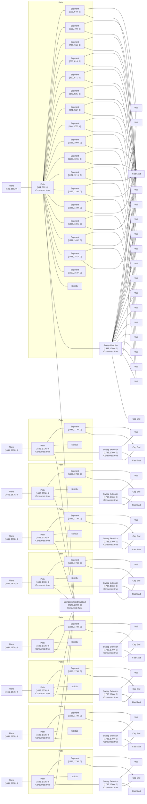

```mermaid
flowchart LR
  subgraph path2 [Path]
    2["Path<br>[564, 592, 0]<br>Consumed: true"]
      %% [ProgramBodyItem { index: 1 }, VariableDeclarationDeclaration, VariableDeclarationInit, PipeBodyItem { index: 1 }]
    3["Segment<br>[598, 649, 0]"]
      %% [ProgramBodyItem { index: 1 }, VariableDeclarationDeclaration, VariableDeclarationInit, PipeBodyItem { index: 2 }]
    4["Segment<br>[655, 703, 0]"]
      %% [ProgramBodyItem { index: 1 }, VariableDeclarationDeclaration, VariableDeclarationInit, PipeBodyItem { index: 3 }]
    5["Segment<br>[709, 760, 0]"]
      %% [ProgramBodyItem { index: 1 }, VariableDeclarationDeclaration, VariableDeclarationInit, PipeBodyItem { index: 4 }]
    6["Segment<br>[766, 814, 0]"]
      %% [ProgramBodyItem { index: 1 }, VariableDeclarationDeclaration, VariableDeclarationInit, PipeBodyItem { index: 5 }]
    7["Segment<br>[820, 871, 0]"]
      %% [ProgramBodyItem { index: 1 }, VariableDeclarationDeclaration, VariableDeclarationInit, PipeBodyItem { index: 6 }]
    8["Segment<br>[877, 925, 0]"]
      %% [ProgramBodyItem { index: 1 }, VariableDeclarationDeclaration, VariableDeclarationInit, PipeBodyItem { index: 7 }]
    9["Segment<br>[931, 982, 0]"]
      %% [ProgramBodyItem { index: 1 }, VariableDeclarationDeclaration, VariableDeclarationInit, PipeBodyItem { index: 8 }]
    10["Segment<br>[988, 1030, 0]"]
      %% [ProgramBodyItem { index: 1 }, VariableDeclarationDeclaration, VariableDeclarationInit, PipeBodyItem { index: 9 }]
    11["Segment<br>[1036, 1094, 0]"]
      %% [ProgramBodyItem { index: 1 }, VariableDeclarationDeclaration, VariableDeclarationInit, PipeBodyItem { index: 10 }]
    12["Segment<br>[1100, 1155, 0]"]
      %% [ProgramBodyItem { index: 1 }, VariableDeclarationDeclaration, VariableDeclarationInit, PipeBodyItem { index: 11 }]
    13["Segment<br>[1161, 1219, 0]"]
      %% [ProgramBodyItem { index: 1 }, VariableDeclarationDeclaration, VariableDeclarationInit, PipeBodyItem { index: 12 }]
    14["Segment<br>[1225, 1280, 0]"]
      %% [ProgramBodyItem { index: 1 }, VariableDeclarationDeclaration, VariableDeclarationInit, PipeBodyItem { index: 13 }]
    15["Segment<br>[1286, 1329, 0]"]
      %% [ProgramBodyItem { index: 1 }, VariableDeclarationDeclaration, VariableDeclarationInit, PipeBodyItem { index: 14 }]
    16["Segment<br>[1335, 1391, 0]"]
      %% [ProgramBodyItem { index: 1 }, VariableDeclarationDeclaration, VariableDeclarationInit, PipeBodyItem { index: 15 }]
    17["Segment<br>[1397, 1452, 0]"]
      %% [ProgramBodyItem { index: 1 }, VariableDeclarationDeclaration, VariableDeclarationInit, PipeBodyItem { index: 16 }]
    18["Segment<br>[1458, 1514, 0]"]
      %% [ProgramBodyItem { index: 1 }, VariableDeclarationDeclaration, VariableDeclarationInit, PipeBodyItem { index: 17 }]
    19["Segment<br>[1520, 1527, 0]"]
      %% [ProgramBodyItem { index: 1 }, VariableDeclarationDeclaration, VariableDeclarationInit, PipeBodyItem { index: 18 }]
    20[Solid2d]
  end
  subgraph path41 [Path]
    41["Path<br>[1686, 1730, 0]<br>Consumed: true"]
      %% [ProgramBodyItem { index: 2 }, VariableDeclarationDeclaration, VariableDeclarationInit, FunctionExpressionBody, FunctionExpressionBodyItem { index: 0 }, ReturnStatementArg, PipeBodyItem { index: 1 }]
    42["Segment<br>[1686, 1730, 0]"]
      %% [ProgramBodyItem { index: 2 }, VariableDeclarationDeclaration, VariableDeclarationInit, FunctionExpressionBody, FunctionExpressionBodyItem { index: 0 }, ReturnStatementArg, PipeBodyItem { index: 1 }]
    43[Solid2d]
  end
  subgraph path49 [Path]
    49["Path<br>[1686, 1730, 0]<br>Consumed: true"]
      %% [ProgramBodyItem { index: 2 }, VariableDeclarationDeclaration, VariableDeclarationInit, FunctionExpressionBody, FunctionExpressionBodyItem { index: 0 }, ReturnStatementArg, PipeBodyItem { index: 1 }]
    50["Segment<br>[1686, 1730, 0]"]
      %% [ProgramBodyItem { index: 2 }, VariableDeclarationDeclaration, VariableDeclarationInit, FunctionExpressionBody, FunctionExpressionBodyItem { index: 0 }, ReturnStatementArg, PipeBodyItem { index: 1 }]
    51[Solid2d]
  end
  subgraph path57 [Path]
    57["Path<br>[1686, 1730, 0]<br>Consumed: true"]
      %% [ProgramBodyItem { index: 2 }, VariableDeclarationDeclaration, VariableDeclarationInit, FunctionExpressionBody, FunctionExpressionBodyItem { index: 0 }, ReturnStatementArg, PipeBodyItem { index: 1 }]
    58["Segment<br>[1686, 1730, 0]"]
      %% [ProgramBodyItem { index: 2 }, VariableDeclarationDeclaration, VariableDeclarationInit, FunctionExpressionBody, FunctionExpressionBodyItem { index: 0 }, ReturnStatementArg, PipeBodyItem { index: 1 }]
    59[Solid2d]
  end
  subgraph path65 [Path]
    65["Path<br>[1686, 1730, 0]<br>Consumed: true"]
      %% [ProgramBodyItem { index: 2 }, VariableDeclarationDeclaration, VariableDeclarationInit, FunctionExpressionBody, FunctionExpressionBodyItem { index: 0 }, ReturnStatementArg, PipeBodyItem { index: 1 }]
    66["Segment<br>[1686, 1730, 0]"]
      %% [ProgramBodyItem { index: 2 }, VariableDeclarationDeclaration, VariableDeclarationInit, FunctionExpressionBody, FunctionExpressionBodyItem { index: 0 }, ReturnStatementArg, PipeBodyItem { index: 1 }]
    67[Solid2d]
  end
  subgraph path73 [Path]
    73["Path<br>[1686, 1730, 0]<br>Consumed: true"]
      %% [ProgramBodyItem { index: 2 }, VariableDeclarationDeclaration, VariableDeclarationInit, FunctionExpressionBody, FunctionExpressionBodyItem { index: 0 }, ReturnStatementArg, PipeBodyItem { index: 1 }]
    74["Segment<br>[1686, 1730, 0]"]
      %% [ProgramBodyItem { index: 2 }, VariableDeclarationDeclaration, VariableDeclarationInit, FunctionExpressionBody, FunctionExpressionBodyItem { index: 0 }, ReturnStatementArg, PipeBodyItem { index: 1 }]
    75[Solid2d]
  end
  subgraph path81 [Path]
    81["Path<br>[1686, 1730, 0]<br>Consumed: true"]
      %% [ProgramBodyItem { index: 2 }, VariableDeclarationDeclaration, VariableDeclarationInit, FunctionExpressionBody, FunctionExpressionBodyItem { index: 0 }, ReturnStatementArg, PipeBodyItem { index: 1 }]
    82["Segment<br>[1686, 1730, 0]"]
      %% [ProgramBodyItem { index: 2 }, VariableDeclarationDeclaration, VariableDeclarationInit, FunctionExpressionBody, FunctionExpressionBodyItem { index: 0 }, ReturnStatementArg, PipeBodyItem { index: 1 }]
    83[Solid2d]
  end
  subgraph path89 [Path]
    89["Path<br>[1686, 1730, 0]<br>Consumed: true"]
      %% [ProgramBodyItem { index: 2 }, VariableDeclarationDeclaration, VariableDeclarationInit, FunctionExpressionBody, FunctionExpressionBodyItem { index: 0 }, ReturnStatementArg, PipeBodyItem { index: 1 }]
    90["Segment<br>[1686, 1730, 0]"]
      %% [ProgramBodyItem { index: 2 }, VariableDeclarationDeclaration, VariableDeclarationInit, FunctionExpressionBody, FunctionExpressionBodyItem { index: 0 }, ReturnStatementArg, PipeBodyItem { index: 1 }]
    91[Solid2d]
  end
  subgraph path97 [Path]
    97["Path<br>[1686, 1730, 0]<br>Consumed: true"]
      %% [ProgramBodyItem { index: 2 }, VariableDeclarationDeclaration, VariableDeclarationInit, FunctionExpressionBody, FunctionExpressionBodyItem { index: 0 }, ReturnStatementArg, PipeBodyItem { index: 1 }]
    98["Segment<br>[1686, 1730, 0]"]
      %% [ProgramBodyItem { index: 2 }, VariableDeclarationDeclaration, VariableDeclarationInit, FunctionExpressionBody, FunctionExpressionBodyItem { index: 0 }, ReturnStatementArg, PipeBodyItem { index: 1 }]
    99[Solid2d]
  end
  1["Plane<br>[541, 558, 0]"]
    %% [ProgramBodyItem { index: 1 }, VariableDeclarationDeclaration, VariableDeclarationInit, PipeBodyItem { index: 0 }]
  21["Sweep Revolve<br>[1533, 1580, 0]<br>Consumed: true"]
    %% [ProgramBodyItem { index: 1 }, VariableDeclarationDeclaration, VariableDeclarationInit, PipeBodyItem { index: 19 }]
  22[Wall]
    %% face_code_ref=Missing NodePath
  23[Wall]
    %% face_code_ref=Missing NodePath
  24[Wall]
    %% face_code_ref=Missing NodePath
  25[Wall]
    %% face_code_ref=Missing NodePath
  26[Wall]
    %% face_code_ref=Missing NodePath
  27[Wall]
    %% face_code_ref=Missing NodePath
  28[Wall]
    %% face_code_ref=Missing NodePath
  29[Wall]
    %% face_code_ref=Missing NodePath
  30[Wall]
    %% face_code_ref=Missing NodePath
  31[Wall]
    %% face_code_ref=Missing NodePath
  32[Wall]
    %% face_code_ref=Missing NodePath
  33[Wall]
    %% face_code_ref=Missing NodePath
  34[Wall]
    %% face_code_ref=Missing NodePath
  35[Wall]
    %% face_code_ref=Missing NodePath
  36[Wall]
    %% face_code_ref=Missing NodePath
  37[Wall]
    %% face_code_ref=Missing NodePath
  38["Cap Start"]
    %% face_code_ref=Missing NodePath
  39["Cap End"]
    %% face_code_ref=Missing NodePath
  40["Plane<br>[1661, 1678, 0]"]
    %% [ProgramBodyItem { index: 2 }, VariableDeclarationDeclaration, VariableDeclarationInit, FunctionExpressionBody, FunctionExpressionBodyItem { index: 0 }, ReturnStatementArg, PipeBodyItem { index: 0 }]
  44["Sweep Extrusion<br>[1738, 1760, 0]<br>Consumed: true"]
    %% [ProgramBodyItem { index: 2 }, VariableDeclarationDeclaration, VariableDeclarationInit, FunctionExpressionBody, FunctionExpressionBodyItem { index: 0 }, ReturnStatementArg, PipeBodyItem { index: 2 }]
  45[Wall]
    %% face_code_ref=Missing NodePath
  46["Cap Start"]
    %% face_code_ref=Missing NodePath
  47["Cap End"]
    %% face_code_ref=Missing NodePath
  48["Plane<br>[1661, 1678, 0]"]
    %% [ProgramBodyItem { index: 2 }, VariableDeclarationDeclaration, VariableDeclarationInit, FunctionExpressionBody, FunctionExpressionBodyItem { index: 0 }, ReturnStatementArg, PipeBodyItem { index: 0 }]
  52["Sweep Extrusion<br>[1738, 1760, 0]<br>Consumed: true"]
    %% [ProgramBodyItem { index: 2 }, VariableDeclarationDeclaration, VariableDeclarationInit, FunctionExpressionBody, FunctionExpressionBodyItem { index: 0 }, ReturnStatementArg, PipeBodyItem { index: 2 }]
  53[Wall]
    %% face_code_ref=Missing NodePath
  54["Cap Start"]
    %% face_code_ref=Missing NodePath
  55["Cap End"]
    %% face_code_ref=Missing NodePath
  56["Plane<br>[1661, 1678, 0]"]
    %% [ProgramBodyItem { index: 2 }, VariableDeclarationDeclaration, VariableDeclarationInit, FunctionExpressionBody, FunctionExpressionBodyItem { index: 0 }, ReturnStatementArg, PipeBodyItem { index: 0 }]
  60["Sweep Extrusion<br>[1738, 1760, 0]<br>Consumed: true"]
    %% [ProgramBodyItem { index: 2 }, VariableDeclarationDeclaration, VariableDeclarationInit, FunctionExpressionBody, FunctionExpressionBodyItem { index: 0 }, ReturnStatementArg, PipeBodyItem { index: 2 }]
  61[Wall]
    %% face_code_ref=Missing NodePath
  62["Cap Start"]
    %% face_code_ref=Missing NodePath
  63["Cap End"]
    %% face_code_ref=Missing NodePath
  64["Plane<br>[1661, 1678, 0]"]
    %% [ProgramBodyItem { index: 2 }, VariableDeclarationDeclaration, VariableDeclarationInit, FunctionExpressionBody, FunctionExpressionBodyItem { index: 0 }, ReturnStatementArg, PipeBodyItem { index: 0 }]
  68["Sweep Extrusion<br>[1738, 1760, 0]<br>Consumed: true"]
    %% [ProgramBodyItem { index: 2 }, VariableDeclarationDeclaration, VariableDeclarationInit, FunctionExpressionBody, FunctionExpressionBodyItem { index: 0 }, ReturnStatementArg, PipeBodyItem { index: 2 }]
  69[Wall]
    %% face_code_ref=Missing NodePath
  70["Cap Start"]
    %% face_code_ref=Missing NodePath
  71["Cap End"]
    %% face_code_ref=Missing NodePath
  72["Plane<br>[1661, 1678, 0]"]
    %% [ProgramBodyItem { index: 2 }, VariableDeclarationDeclaration, VariableDeclarationInit, FunctionExpressionBody, FunctionExpressionBodyItem { index: 0 }, ReturnStatementArg, PipeBodyItem { index: 0 }]
  76["Sweep Extrusion<br>[1738, 1760, 0]<br>Consumed: true"]
    %% [ProgramBodyItem { index: 2 }, VariableDeclarationDeclaration, VariableDeclarationInit, FunctionExpressionBody, FunctionExpressionBodyItem { index: 0 }, ReturnStatementArg, PipeBodyItem { index: 2 }]
  77[Wall]
    %% face_code_ref=Missing NodePath
  78["Cap Start"]
    %% face_code_ref=Missing NodePath
  79["Cap End"]
    %% face_code_ref=Missing NodePath
  80["Plane<br>[1661, 1678, 0]"]
    %% [ProgramBodyItem { index: 2 }, VariableDeclarationDeclaration, VariableDeclarationInit, FunctionExpressionBody, FunctionExpressionBodyItem { index: 0 }, ReturnStatementArg, PipeBodyItem { index: 0 }]
  84["Sweep Extrusion<br>[1738, 1760, 0]<br>Consumed: true"]
    %% [ProgramBodyItem { index: 2 }, VariableDeclarationDeclaration, VariableDeclarationInit, FunctionExpressionBody, FunctionExpressionBodyItem { index: 0 }, ReturnStatementArg, PipeBodyItem { index: 2 }]
  85[Wall]
    %% face_code_ref=Missing NodePath
  86["Cap Start"]
    %% face_code_ref=Missing NodePath
  87["Cap End"]
    %% face_code_ref=Missing NodePath
  88["Plane<br>[1661, 1678, 0]"]
    %% [ProgramBodyItem { index: 2 }, VariableDeclarationDeclaration, VariableDeclarationInit, FunctionExpressionBody, FunctionExpressionBodyItem { index: 0 }, ReturnStatementArg, PipeBodyItem { index: 0 }]
  92["Sweep Extrusion<br>[1738, 1760, 0]<br>Consumed: true"]
    %% [ProgramBodyItem { index: 2 }, VariableDeclarationDeclaration, VariableDeclarationInit, FunctionExpressionBody, FunctionExpressionBodyItem { index: 0 }, ReturnStatementArg, PipeBodyItem { index: 2 }]
  93[Wall]
    %% face_code_ref=Missing NodePath
  94["Cap Start"]
    %% face_code_ref=Missing NodePath
  95["Cap End"]
    %% face_code_ref=Missing NodePath
  96["Plane<br>[1661, 1678, 0]"]
    %% [ProgramBodyItem { index: 2 }, VariableDeclarationDeclaration, VariableDeclarationInit, FunctionExpressionBody, FunctionExpressionBodyItem { index: 0 }, ReturnStatementArg, PipeBodyItem { index: 0 }]
  100["Sweep Extrusion<br>[1738, 1760, 0]<br>Consumed: true"]
    %% [ProgramBodyItem { index: 2 }, VariableDeclarationDeclaration, VariableDeclarationInit, FunctionExpressionBody, FunctionExpressionBodyItem { index: 0 }, ReturnStatementArg, PipeBodyItem { index: 2 }]
  101[Wall]
    %% face_code_ref=Missing NodePath
  102["Cap Start"]
    %% face_code_ref=Missing NodePath
  103["Cap End"]
    %% face_code_ref=Missing NodePath
  104["CompositeSolid Subtract<br>[2170, 2209, 0]<br>Consumed: false"]
    %% [ProgramBodyItem { index: 5 }, VariableDeclarationDeclaration, VariableDeclarationInit]
  1 --- 2
  2 --- 3
  2 --- 4
  2 --- 5
  2 --- 6
  2 --- 7
  2 --- 8
  2 --- 9
  2 --- 10
  2 --- 11
  2 --- 12
  2 --- 13
  2 --- 14
  2 --- 15
  2 --- 16
  2 --- 17
  2 --- 18
  2 --- 19
  2 --- 20
  2 ---- 21
  2 --- 104
  3 --- 22
  3 x--> 38
  4 --- 23
  4 x--> 38
  5 --- 24
  5 x--> 38
  6 --- 25
  6 x--> 38
  7 --- 26
  7 x--> 38
  8 --- 27
  8 x--> 38
  9 --- 28
  9 x--> 38
  10 --- 29
  10 x--> 38
  11 --- 30
  11 x--> 38
  12 --- 31
  12 x--> 38
  13 --- 32
  13 x--> 38
  14 --- 33
  14 x--> 38
  15 --- 34
  15 x--> 38
  16 --- 35
  16 x--> 38
  17 --- 36
  17 x--> 38
  18 --- 37
  18 x--> 38
  21 --- 22
  21 --- 23
  21 --- 24
  21 --- 25
  21 --- 26
  21 --- 27
  21 --- 28
  21 --- 29
  21 --- 30
  21 --- 31
  21 --- 32
  21 --- 33
  21 --- 34
  21 --- 35
  21 --- 36
  21 --- 37
  21 --- 38
  21 --- 39
  40 --- 41
  41 --- 42
  41 --- 43
  41 ---- 44
  41 --- 104
  42 --- 45
  42 x--> 47
  44 --- 45
  44 --- 46
  44 --- 47
  48 --- 49
  49 --- 50
  49 --- 51
  49 ---- 52
  49 --- 104
  50 --- 53
  50 x--> 55
  52 --- 53
  52 --- 54
  52 --- 55
  56 --- 57
  57 --- 58
  57 --- 59
  57 ---- 60
  57 --- 104
  58 --- 61
  58 x--> 63
  60 --- 61
  60 --- 62
  60 --- 63
  64 --- 65
  65 --- 66
  65 --- 67
  65 ---- 68
  65 --- 104
  66 --- 69
  66 x--> 71
  68 --- 69
  68 --- 70
  68 --- 71
  72 --- 73
  73 --- 74
  73 --- 75
  73 ---- 76
  73 --- 104
  74 --- 77
  74 x--> 79
  76 --- 77
  76 --- 78
  76 --- 79
  80 --- 81
  81 --- 82
  81 --- 83
  81 ---- 84
  81 --- 104
  82 --- 85
  82 x--> 87
  84 --- 85
  84 --- 86
  84 --- 87
  88 --- 89
  89 --- 90
  89 --- 91
  89 ---- 92
  89 --- 104
  90 --- 93
  90 x--> 95
  92 --- 93
  92 --- 94
  92 --- 95
  96 --- 97
  97 --- 98
  97 --- 99
  97 ---- 100
  97 --- 104
  98 --- 101
  98 x--> 103
  100 --- 101
  100 --- 102
  100 --- 103
```
