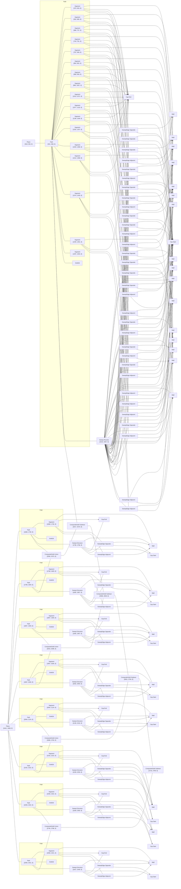

```mermaid
flowchart LR
  subgraph path3 [Path]
    3["Path<br>[541, 569, 0]"]
    12["Segment<br>[575, 626, 0]"]
    13["Segment<br>[632, 680, 0]"]
    14["Segment<br>[686, 737, 0]"]
    15["Segment<br>[743, 791, 0]"]
    16["Segment<br>[797, 848, 0]"]
    17["Segment<br>[854, 902, 0]"]
    18["Segment<br>[908, 959, 0]"]
    19["Segment<br>[965, 1007, 0]"]
    20["Segment<br>[1013, 1071, 0]"]
    21["Segment<br>[1077, 1132, 0]"]
    22["Segment<br>[1138, 1196, 0]"]
    23["Segment<br>[1202, 1257, 0]"]
    24["Segment<br>[1263, 1306, 0]"]
    25["Segment<br>[1312, 1368, 0]"]
    26["Segment<br>[1374, 1429, 0]"]
    27["Segment<br>[1435, 1491, 0]"]
    28["Segment<br>[1497, 1504, 0]"]
    45[Solid2d]
  end
  subgraph path4 [Path]
    4["Path<br>[1668, 1730, 0]"]
    29["Segment<br>[1668, 1730, 0]"]
    44[Solid2d]
  end
  subgraph path5 [Path]
    5["Path<br>[1768, 1829, 0]"]
    30["Segment<br>[1768, 1829, 0]"]
    40[Solid2d]
  end
  subgraph path6 [Path]
    6["Path<br>[1867, 1929, 0]"]
    31["Segment<br>[1867, 1929, 0]"]
    41[Solid2d]
  end
  subgraph path7 [Path]
    7["Path<br>[1967, 2026, 0]"]
    32["Segment<br>[1967, 2026, 0]"]
    42[Solid2d]
  end
  subgraph path8 [Path]
    8["Path<br>[2064, 2124, 0]"]
    33["Segment<br>[2064, 2124, 0]"]
    37[Solid2d]
  end
  subgraph path9 [Path]
    9["Path<br>[2162, 2222, 0]"]
    34["Segment<br>[2162, 2222, 0]"]
    38[Solid2d]
  end
  subgraph path10 [Path]
    10["Path<br>[2260, 2322, 0]"]
    35["Segment<br>[2260, 2322, 0]"]
    39[Solid2d]
  end
  subgraph path11 [Path]
    11["Path<br>[2360, 2421, 0]"]
    36["Segment<br>[2360, 2421, 0]"]
    43[Solid2d]
  end
  1["Plane<br>[518, 535, 0]"]
  2["Plane<br>[1641, 1658, 0]"]
  46["Sweep Revolve<br>[1510, 1557, 0]"]
  47["Sweep Extrusion<br>[1736, 1758, 0]"]
  48["Sweep Extrusion<br>[1835, 1857, 0]"]
  49["Sweep Extrusion<br>[1935, 1957, 0]"]
  50["Sweep Extrusion<br>[2032, 2054, 0]"]
  51["Sweep Extrusion<br>[2130, 2152, 0]"]
  52["Sweep Extrusion<br>[2228, 2250, 0]"]
  53["Sweep Extrusion<br>[2328, 2350, 0]"]
  54["Sweep Extrusion<br>[2427, 2449, 0]"]
  55["CompositeSolid Subtract<br>[2517, 2574, 0]"]
  56["CompositeSolid Union<br>[2550, 2573, 0]"]
  57["CompositeSolid Union<br>[2680, 2703, 0]"]
  58["CompositeSolid Union<br>[2615, 2638, 0]"]
  59["CompositeSolid Subtract<br>[2651, 2704, 0]"]
  60["CompositeSolid Subtract<br>[2716, 2769, 0]"]
  61["CompositeSolid Union<br>[2745, 2768, 0]"]
  62["CompositeSolid Subtract<br>[2586, 2639, 0]"]
  63[Wall]
  64[Wall]
  65[Wall]
  66[Wall]
  67[Wall]
  68[Wall]
  69[Wall]
  70[Wall]
  71[Wall]
  72[Wall]
  73[Wall]
  74[Wall]
  75[Wall]
  76[Wall]
  77[Wall]
  78[Wall]
  79[Wall]
  80[Wall]
  81[Wall]
  82[Wall]
  83[Wall]
  84[Wall]
  85[Wall]
  86[Wall]
  87["Cap Start"]
  88["Cap Start"]
  89["Cap Start"]
  90["Cap Start"]
  91["Cap Start"]
  92["Cap Start"]
  93["Cap Start"]
  94["Cap Start"]
  95["Cap Start"]
  96["Cap End"]
  97["Cap End"]
  98["Cap End"]
  99["Cap End"]
  100["Cap End"]
  101["Cap End"]
  102["Cap End"]
  103["Cap End"]
  104["Cap End"]
  105["SweepEdge Opposite"]
  106["SweepEdge Opposite"]
  107["SweepEdge Opposite"]
  108["SweepEdge Opposite"]
  109["SweepEdge Opposite"]
  110["SweepEdge Opposite"]
  111["SweepEdge Opposite"]
  112["SweepEdge Opposite"]
  113["SweepEdge Opposite"]
  114["SweepEdge Opposite"]
  115["SweepEdge Opposite"]
  116["SweepEdge Opposite"]
  117["SweepEdge Opposite"]
  118["SweepEdge Opposite"]
  119["SweepEdge Opposite"]
  120["SweepEdge Opposite"]
  121["SweepEdge Opposite"]
  122["SweepEdge Opposite"]
  123["SweepEdge Opposite"]
  124["SweepEdge Opposite"]
  125["SweepEdge Opposite"]
  126["SweepEdge Opposite"]
  127["SweepEdge Opposite"]
  128["SweepEdge Opposite"]
  129["SweepEdge Adjacent"]
  130["SweepEdge Adjacent"]
  131["SweepEdge Adjacent"]
  132["SweepEdge Adjacent"]
  133["SweepEdge Adjacent"]
  134["SweepEdge Adjacent"]
  135["SweepEdge Adjacent"]
  136["SweepEdge Adjacent"]
  137["SweepEdge Adjacent"]
  138["SweepEdge Adjacent"]
  139["SweepEdge Adjacent"]
  140["SweepEdge Adjacent"]
  141["SweepEdge Adjacent"]
  142["SweepEdge Adjacent"]
  143["SweepEdge Adjacent"]
  144["SweepEdge Adjacent"]
  145["SweepEdge Adjacent"]
  146["SweepEdge Adjacent"]
  147["SweepEdge Adjacent"]
  148["SweepEdge Adjacent"]
  149["SweepEdge Adjacent"]
  150["SweepEdge Adjacent"]
  151["SweepEdge Adjacent"]
  152["SweepEdge Adjacent"]
  1 --- 3
  2 --- 4
  2 --- 5
  2 --- 6
  2 --- 7
  2 --- 8
  2 --- 9
  2 --- 10
  2 --- 11
  3 --- 12
  3 --- 13
  3 --- 14
  3 --- 15
  3 --- 16
  3 --- 17
  3 --- 18
  3 --- 19
  3 --- 20
  3 --- 21
  3 --- 22
  3 --- 23
  3 --- 24
  3 --- 25
  3 --- 26
  3 --- 27
  3 --- 28
  3 --- 45
  3 ---- 46
  3 --- 55
  4 --- 29
  4 --- 44
  4 ---- 47
  4 --- 56
  5 --- 30
  5 --- 40
  5 ---- 48
  5 --- 56
  6 --- 31
  6 --- 41
  6 ---- 49
  6 --- 58
  7 --- 32
  7 --- 42
  7 ---- 50
  7 --- 58
  8 --- 33
  8 --- 37
  8 ---- 51
  8 --- 57
  9 --- 34
  9 --- 38
  9 ---- 52
  9 --- 57
  10 --- 35
  10 --- 39
  10 ---- 53
  10 --- 61
  11 --- 36
  11 --- 43
  11 ---- 54
  11 --- 61
  12 --- 81
  12 x--> 97
  12 --- 121
  12 --- 144
  13 --- 76
  13 x--> 97
  13 --- 115
  13 --- 135
  14 --- 75
  14 x--> 97
  14 --- 116
  14 --- 142
  15 --- 77
  15 x--> 97
  15 --- 123
  15 --- 145
  16 --- 73
  16 x--> 97
  16 --- 126
  16 --- 138
  17 --- 72
  17 x--> 97
  17 --- 125
  17 --- 147
  18 --- 80
  18 x--> 97
  18 --- 114
  18 --- 143
  19 --- 83
  19 x--> 97
  19 --- 119
  19 --- 141
  20 --- 82
  20 x--> 97
  20 --- 124
  20 --- 146
  21 --- 70
  21 x--> 97
  21 --- 118
  21 --- 139
  22 --- 71
  22 x--> 97
  22 --- 120
  22 --- 148
  23 --- 84
  23 x--> 97
  23 --- 111
  23 --- 140
  24 --- 78
  24 x--> 97
  24 --- 113
  24 --- 137
  25 --- 74
  25 x--> 97
  25 --- 117
  25 --- 150
  26 --- 69
  26 x--> 97
  26 --- 112
  26 --- 136
  27 --- 79
  27 x--> 97
  27 --- 122
  27 --- 149
  29 --- 68
  29 x--> 103
  29 --- 110
  29 --- 134
  30 --- 63
  30 x--> 102
  30 --- 105
  30 --- 129
  31 --- 85
  31 x--> 101
  31 --- 127
  31 --- 151
  32 --- 65
  32 x--> 100
  32 --- 107
  32 --- 131
  33 --- 67
  33 x--> 98
  33 --- 109
  33 --- 133
  34 --- 86
  34 x--> 104
  34 --- 128
  34 --- 152
  35 --- 64
  35 x--> 99
  35 --- 106
  35 --- 130
  36 --- 66
  36 x--> 96
  36 --- 108
  36 --- 132
  46 --- 69
  46 --- 70
  46 --- 71
  46 --- 72
  46 --- 73
  46 --- 74
  46 --- 75
  46 --- 76
  46 --- 77
  46 --- 78
  46 --- 79
  46 --- 80
  46 --- 81
  46 --- 82
  46 --- 83
  46 --- 84
  46 --- 88
  46 --- 97
  46 --- 111
  46 --- 112
  46 --- 113
  46 --- 114
  46 --- 115
  46 --- 116
  46 --- 117
  46 --- 118
  46 --- 119
  46 --- 120
  46 --- 121
  46 --- 122
  46 --- 123
  46 --- 124
  46 --- 125
  46 --- 126
  46 --- 135
  46 --- 136
  46 --- 137
  46 --- 138
  46 --- 139
  46 --- 140
  46 --- 141
  46 --- 142
  46 --- 143
  46 --- 144
  46 --- 145
  46 --- 146
  46 --- 147
  46 --- 148
  46 --- 149
  46 --- 150
  47 --- 68
  47 --- 94
  47 --- 103
  47 --- 110
  47 --- 134
  48 --- 63
  48 --- 93
  48 --- 102
  48 --- 105
  48 --- 129
  49 --- 85
  49 --- 92
  49 --- 101
  49 --- 127
  49 --- 151
  50 --- 65
  50 --- 91
  50 --- 100
  50 --- 107
  50 --- 131
  51 --- 67
  51 --- 89
  51 --- 98
  51 --- 109
  51 --- 133
  52 --- 86
  52 --- 95
  52 --- 104
  52 --- 128
  52 --- 152
  53 --- 64
  53 --- 90
  53 --- 99
  53 --- 106
  53 --- 130
  54 --- 66
  54 --- 87
  54 --- 96
  54 --- 108
  54 --- 132
  56 --- 55
  55 --- 62
  57 --- 59
  58 --- 62
  59 --- 60
  62 --- 59
  61 --- 60
  105 <--x 63
  129 <--x 63
  106 <--x 64
  130 <--x 64
  107 <--x 65
  131 <--x 65
  108 <--x 66
  132 <--x 66
  109 <--x 67
  133 <--x 67
  110 <--x 68
  134 <--x 68
  112 <--x 69
  136 <--x 69
  150 <--x 69
  118 <--x 70
  139 <--x 70
  146 <--x 70
  120 <--x 71
  139 <--x 71
  148 <--x 71
  125 <--x 72
  138 <--x 72
  147 <--x 72
  126 <--x 73
  138 <--x 73
  145 <--x 73
  117 <--x 74
  137 <--x 74
  150 <--x 74
  116 <--x 75
  135 <--x 75
  142 <--x 75
  115 <--x 76
  135 <--x 76
  144 <--x 76
  123 <--x 77
  142 <--x 77
  145 <--x 77
  113 <--x 78
  137 <--x 78
  140 <--x 78
  122 <--x 79
  136 <--x 79
  149 <--x 79
  114 <--x 80
  143 <--x 80
  147 <--x 80
  121 <--x 81
  144 <--x 81
  149 <--x 81
  124 <--x 82
  141 <--x 82
  146 <--x 82
  119 <--x 83
  141 <--x 83
  143 <--x 83
  111 <--x 84
  140 <--x 84
  148 <--x 84
  127 <--x 85
  151 <--x 85
  128 <--x 86
  152 <--x 86
  108 <--x 87
  111 <--x 88
  112 <--x 88
  113 <--x 88
  114 <--x 88
  115 <--x 88
  116 <--x 88
  117 <--x 88
  118 <--x 88
  119 <--x 88
  120 <--x 88
  121 <--x 88
  122 <--x 88
  123 <--x 88
  124 <--x 88
  125 <--x 88
  126 <--x 88
  109 <--x 89
  106 <--x 90
  107 <--x 91
  127 <--x 92
  105 <--x 93
  110 <--x 94
  128 <--x 95
```
