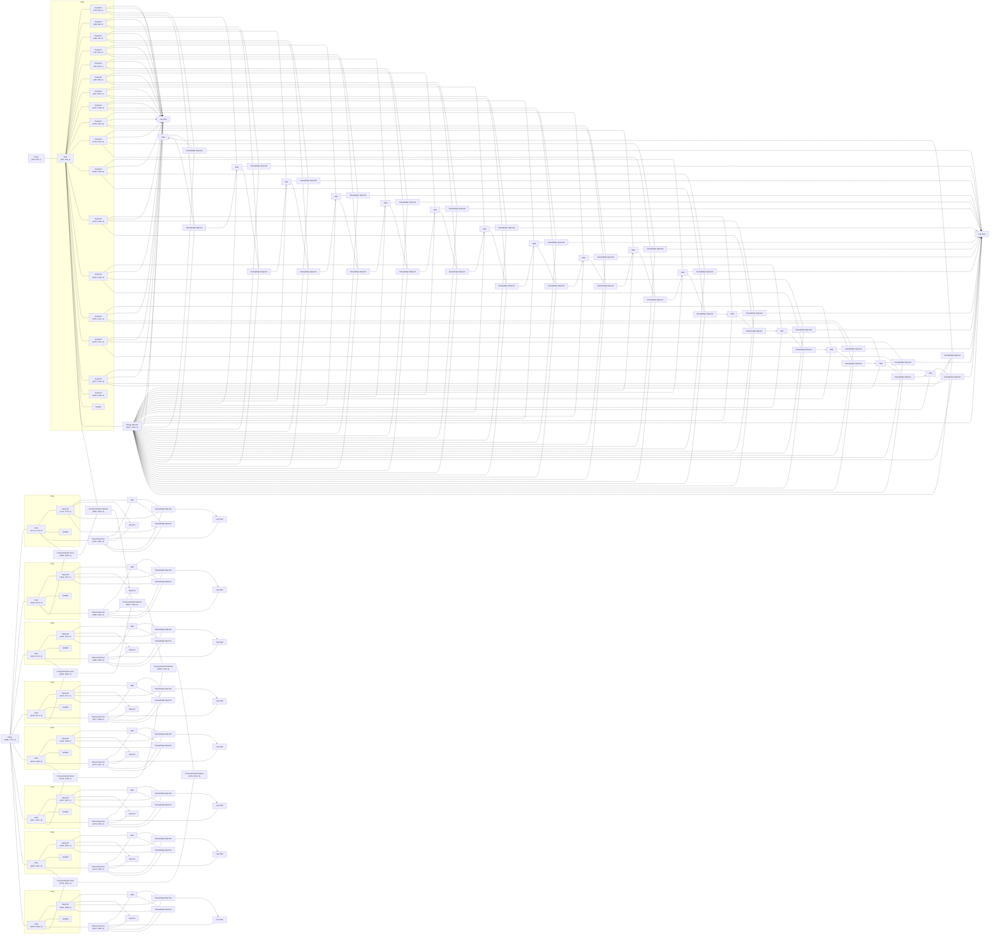

```mermaid
flowchart LR
  subgraph path3 [Path]
    3["Path<br>[541, 569, 0]"]
      %% [ProgramBodyItem { index: 1 }, VariableDeclarationDeclaration, VariableDeclarationInit, PipeBodyItem { index: 1 }]
    12["Segment<br>[575, 632, 0]"]
      %% [ProgramBodyItem { index: 1 }, VariableDeclarationDeclaration, VariableDeclarationInit, PipeBodyItem { index: 2 }]
    13["Segment<br>[638, 692, 0]"]
      %% [ProgramBodyItem { index: 1 }, VariableDeclarationDeclaration, VariableDeclarationInit, PipeBodyItem { index: 3 }]
    14["Segment<br>[698, 755, 0]"]
      %% [ProgramBodyItem { index: 1 }, VariableDeclarationDeclaration, VariableDeclarationInit, PipeBodyItem { index: 4 }]
    15["Segment<br>[761, 815, 0]"]
      %% [ProgramBodyItem { index: 1 }, VariableDeclarationDeclaration, VariableDeclarationInit, PipeBodyItem { index: 5 }]
    16["Segment<br>[821, 878, 0]"]
      %% [ProgramBodyItem { index: 1 }, VariableDeclarationDeclaration, VariableDeclarationInit, PipeBodyItem { index: 6 }]
    17["Segment<br>[884, 938, 0]"]
      %% [ProgramBodyItem { index: 1 }, VariableDeclarationDeclaration, VariableDeclarationInit, PipeBodyItem { index: 7 }]
    18["Segment<br>[944, 1001, 0]"]
      %% [ProgramBodyItem { index: 1 }, VariableDeclarationDeclaration, VariableDeclarationInit, PipeBodyItem { index: 8 }]
    19["Segment<br>[1007, 1049, 0]"]
      %% [ProgramBodyItem { index: 1 }, VariableDeclarationDeclaration, VariableDeclarationInit, PipeBodyItem { index: 9 }]
    20["Segment<br>[1055, 1113, 0]"]
      %% [ProgramBodyItem { index: 1 }, VariableDeclarationDeclaration, VariableDeclarationInit, PipeBodyItem { index: 10 }]
    21["Segment<br>[1119, 1174, 0]"]
      %% [ProgramBodyItem { index: 1 }, VariableDeclarationDeclaration, VariableDeclarationInit, PipeBodyItem { index: 11 }]
    22["Segment<br>[1180, 1238, 0]"]
      %% [ProgramBodyItem { index: 1 }, VariableDeclarationDeclaration, VariableDeclarationInit, PipeBodyItem { index: 12 }]
    23["Segment<br>[1244, 1299, 0]"]
      %% [ProgramBodyItem { index: 1 }, VariableDeclarationDeclaration, VariableDeclarationInit, PipeBodyItem { index: 13 }]
    24["Segment<br>[1305, 1348, 0]"]
      %% [ProgramBodyItem { index: 1 }, VariableDeclarationDeclaration, VariableDeclarationInit, PipeBodyItem { index: 14 }]
    25["Segment<br>[1354, 1410, 0]"]
      %% [ProgramBodyItem { index: 1 }, VariableDeclarationDeclaration, VariableDeclarationInit, PipeBodyItem { index: 15 }]
    26["Segment<br>[1416, 1471, 0]"]
      %% [ProgramBodyItem { index: 1 }, VariableDeclarationDeclaration, VariableDeclarationInit, PipeBodyItem { index: 16 }]
    27["Segment<br>[1477, 1533, 0]"]
      %% [ProgramBodyItem { index: 1 }, VariableDeclarationDeclaration, VariableDeclarationInit, PipeBodyItem { index: 17 }]
    28["Segment<br>[1539, 1546, 0]"]
      %% [ProgramBodyItem { index: 1 }, VariableDeclarationDeclaration, VariableDeclarationInit, PipeBodyItem { index: 18 }]
    42[Solid2d]
  end
  subgraph path4 [Path]
    4["Path<br>[1713, 1775, 0]"]
      %% [ProgramBodyItem { index: 3 }, VariableDeclarationDeclaration, VariableDeclarationInit, PipeBodyItem { index: 0 }]
    29["Segment<br>[1713, 1775, 0]"]
      %% [ProgramBodyItem { index: 3 }, VariableDeclarationDeclaration, VariableDeclarationInit, PipeBodyItem { index: 0 }]
    41[Solid2d]
  end
  subgraph path5 [Path]
    5["Path<br>[1813, 1874, 0]"]
      %% [ProgramBodyItem { index: 4 }, VariableDeclarationDeclaration, VariableDeclarationInit, PipeBodyItem { index: 0 }]
    30["Segment<br>[1813, 1874, 0]"]
      %% [ProgramBodyItem { index: 4 }, VariableDeclarationDeclaration, VariableDeclarationInit, PipeBodyItem { index: 0 }]
    44[Solid2d]
  end
  subgraph path6 [Path]
    6["Path<br>[1912, 1974, 0]"]
      %% [ProgramBodyItem { index: 5 }, VariableDeclarationDeclaration, VariableDeclarationInit, PipeBodyItem { index: 0 }]
    31["Segment<br>[1912, 1974, 0]"]
      %% [ProgramBodyItem { index: 5 }, VariableDeclarationDeclaration, VariableDeclarationInit, PipeBodyItem { index: 0 }]
    45[Solid2d]
  end
  subgraph path7 [Path]
    7["Path<br>[2012, 2071, 0]"]
      %% [ProgramBodyItem { index: 6 }, VariableDeclarationDeclaration, VariableDeclarationInit, PipeBodyItem { index: 0 }]
    32["Segment<br>[2012, 2071, 0]"]
      %% [ProgramBodyItem { index: 6 }, VariableDeclarationDeclaration, VariableDeclarationInit, PipeBodyItem { index: 0 }]
    39[Solid2d]
  end
  subgraph path8 [Path]
    8["Path<br>[2109, 2169, 0]"]
      %% [ProgramBodyItem { index: 7 }, VariableDeclarationDeclaration, VariableDeclarationInit, PipeBodyItem { index: 0 }]
    33["Segment<br>[2109, 2169, 0]"]
      %% [ProgramBodyItem { index: 7 }, VariableDeclarationDeclaration, VariableDeclarationInit, PipeBodyItem { index: 0 }]
    37[Solid2d]
  end
  subgraph path9 [Path]
    9["Path<br>[2207, 2267, 0]"]
      %% [ProgramBodyItem { index: 8 }, VariableDeclarationDeclaration, VariableDeclarationInit, PipeBodyItem { index: 0 }]
    34["Segment<br>[2207, 2267, 0]"]
      %% [ProgramBodyItem { index: 8 }, VariableDeclarationDeclaration, VariableDeclarationInit, PipeBodyItem { index: 0 }]
    38[Solid2d]
  end
  subgraph path10 [Path]
    10["Path<br>[2305, 2367, 0]"]
      %% [ProgramBodyItem { index: 9 }, VariableDeclarationDeclaration, VariableDeclarationInit, PipeBodyItem { index: 0 }]
    35["Segment<br>[2305, 2367, 0]"]
      %% [ProgramBodyItem { index: 9 }, VariableDeclarationDeclaration, VariableDeclarationInit, PipeBodyItem { index: 0 }]
    40[Solid2d]
  end
  subgraph path11 [Path]
    11["Path<br>[2405, 2466, 0]"]
      %% [ProgramBodyItem { index: 10 }, VariableDeclarationDeclaration, VariableDeclarationInit, PipeBodyItem { index: 0 }]
    36["Segment<br>[2405, 2466, 0]"]
      %% [ProgramBodyItem { index: 10 }, VariableDeclarationDeclaration, VariableDeclarationInit, PipeBodyItem { index: 0 }]
    43[Solid2d]
  end
  1["Plane<br>[518, 535, 0]"]
    %% [ProgramBodyItem { index: 1 }, VariableDeclarationDeclaration, VariableDeclarationInit, PipeBodyItem { index: 0 }]
  2["Plane<br>[1686, 1703, 0]"]
    %% [ProgramBodyItem { index: 2 }, VariableDeclarationDeclaration, VariableDeclarationInit]
  46["Sweep Revolve<br>[1552, 1602, 0]"]
    %% [ProgramBodyItem { index: 1 }, VariableDeclarationDeclaration, VariableDeclarationInit, PipeBodyItem { index: 19 }]
  47["Sweep Extrusion<br>[1781, 1803, 0]"]
    %% [ProgramBodyItem { index: 3 }, VariableDeclarationDeclaration, VariableDeclarationInit, PipeBodyItem { index: 1 }]
  48["Sweep Extrusion<br>[1880, 1902, 0]"]
    %% [ProgramBodyItem { index: 4 }, VariableDeclarationDeclaration, VariableDeclarationInit, PipeBodyItem { index: 1 }]
  49["Sweep Extrusion<br>[1980, 2002, 0]"]
    %% [ProgramBodyItem { index: 5 }, VariableDeclarationDeclaration, VariableDeclarationInit, PipeBodyItem { index: 1 }]
  50["Sweep Extrusion<br>[2077, 2099, 0]"]
    %% [ProgramBodyItem { index: 6 }, VariableDeclarationDeclaration, VariableDeclarationInit, PipeBodyItem { index: 1 }]
  51["Sweep Extrusion<br>[2175, 2197, 0]"]
    %% [ProgramBodyItem { index: 7 }, VariableDeclarationDeclaration, VariableDeclarationInit, PipeBodyItem { index: 1 }]
  52["Sweep Extrusion<br>[2273, 2295, 0]"]
    %% [ProgramBodyItem { index: 8 }, VariableDeclarationDeclaration, VariableDeclarationInit, PipeBodyItem { index: 1 }]
  53["Sweep Extrusion<br>[2373, 2395, 0]"]
    %% [ProgramBodyItem { index: 9 }, VariableDeclarationDeclaration, VariableDeclarationInit, PipeBodyItem { index: 1 }]
  54["Sweep Extrusion<br>[2472, 2494, 0]"]
    %% [ProgramBodyItem { index: 10 }, VariableDeclarationDeclaration, VariableDeclarationInit, PipeBodyItem { index: 1 }]
  55["CompositeSolid Subtract<br>[2761, 2814, 0]"]
    %% [ProgramBodyItem { index: 14 }, VariableDeclarationDeclaration, VariableDeclarationInit]
  56["CompositeSolid Union<br>[2725, 2748, 0]"]
    %% [ProgramBodyItem { index: 13 }, VariableDeclarationDeclaration, VariableDeclarationInit, CallKwArg { index: 0 }]
  57["CompositeSolid Union<br>[2660, 2683, 0]"]
    %% [ProgramBodyItem { index: 12 }, VariableDeclarationDeclaration, VariableDeclarationInit, CallKwArg { index: 0 }]
  58["CompositeSolid Subtract<br>[2562, 2619, 0]"]
    %% [ProgramBodyItem { index: 11 }, VariableDeclarationDeclaration, VariableDeclarationInit]
  59["CompositeSolid Subtract<br>[2631, 2684, 0]"]
    %% [ProgramBodyItem { index: 12 }, VariableDeclarationDeclaration, VariableDeclarationInit]
  60["CompositeSolid Union<br>[2595, 2618, 0]"]
    %% [ProgramBodyItem { index: 11 }, VariableDeclarationDeclaration, VariableDeclarationInit, CallKwArg { index: 0 }]
  61["CompositeSolid Subtract<br>[2696, 2749, 0]"]
    %% [ProgramBodyItem { index: 13 }, VariableDeclarationDeclaration, VariableDeclarationInit]
  62["CompositeSolid Union<br>[2790, 2813, 0]"]
    %% [ProgramBodyItem { index: 14 }, VariableDeclarationDeclaration, VariableDeclarationInit, CallKwArg { index: 0 }]
  63[Wall]
  64[Wall]
  65[Wall]
  66[Wall]
  67[Wall]
  68[Wall]
  69[Wall]
  70[Wall]
  71[Wall]
  72[Wall]
  73[Wall]
  74[Wall]
  75[Wall]
  76[Wall]
  77[Wall]
  78[Wall]
  79[Wall]
  80[Wall]
  81[Wall]
  82[Wall]
  83[Wall]
  84[Wall]
  85[Wall]
  86[Wall]
  87["Cap Start"]
  88["Cap Start"]
  89["Cap Start"]
  90["Cap Start"]
  91["Cap Start"]
  92["Cap Start"]
  93["Cap Start"]
  94["Cap Start"]
  95["Cap Start"]
  96["Cap End"]
  97["Cap End"]
  98["Cap End"]
  99["Cap End"]
  100["Cap End"]
  101["Cap End"]
  102["Cap End"]
  103["Cap End"]
  104["Cap End"]
  105["SweepEdge Opposite"]
  106["SweepEdge Opposite"]
  107["SweepEdge Opposite"]
  108["SweepEdge Opposite"]
  109["SweepEdge Opposite"]
  110["SweepEdge Opposite"]
  111["SweepEdge Opposite"]
  112["SweepEdge Opposite"]
  113["SweepEdge Opposite"]
  114["SweepEdge Opposite"]
  115["SweepEdge Opposite"]
  116["SweepEdge Opposite"]
  117["SweepEdge Opposite"]
  118["SweepEdge Opposite"]
  119["SweepEdge Opposite"]
  120["SweepEdge Opposite"]
  121["SweepEdge Opposite"]
  122["SweepEdge Opposite"]
  123["SweepEdge Opposite"]
  124["SweepEdge Opposite"]
  125["SweepEdge Opposite"]
  126["SweepEdge Opposite"]
  127["SweepEdge Opposite"]
  128["SweepEdge Opposite"]
  129["SweepEdge Adjacent"]
  130["SweepEdge Adjacent"]
  131["SweepEdge Adjacent"]
  132["SweepEdge Adjacent"]
  133["SweepEdge Adjacent"]
  134["SweepEdge Adjacent"]
  135["SweepEdge Adjacent"]
  136["SweepEdge Adjacent"]
  137["SweepEdge Adjacent"]
  138["SweepEdge Adjacent"]
  139["SweepEdge Adjacent"]
  140["SweepEdge Adjacent"]
  141["SweepEdge Adjacent"]
  142["SweepEdge Adjacent"]
  143["SweepEdge Adjacent"]
  144["SweepEdge Adjacent"]
  145["SweepEdge Adjacent"]
  146["SweepEdge Adjacent"]
  147["SweepEdge Adjacent"]
  148["SweepEdge Adjacent"]
  149["SweepEdge Adjacent"]
  150["SweepEdge Adjacent"]
  151["SweepEdge Adjacent"]
  152["SweepEdge Adjacent"]
  1 --- 3
  2 --- 4
  2 --- 5
  2 --- 6
  2 --- 7
  2 --- 8
  2 --- 9
  2 --- 10
  2 --- 11
  3 --- 12
  3 --- 13
  3 --- 14
  3 --- 15
  3 --- 16
  3 --- 17
  3 --- 18
  3 --- 19
  3 --- 20
  3 --- 21
  3 --- 22
  3 --- 23
  3 --- 24
  3 --- 25
  3 --- 26
  3 --- 27
  3 --- 28
  3 --- 42
  3 ---- 46
  3 --- 58
  4 --- 29
  4 --- 41
  4 ---- 47
  4 --- 60
  5 --- 30
  5 --- 44
  5 ---- 48
  5 --- 60
  6 --- 31
  6 --- 45
  6 ---- 49
  6 --- 57
  7 --- 32
  7 --- 39
  7 ---- 50
  7 --- 57
  8 --- 33
  8 --- 37
  8 ---- 51
  8 --- 56
  9 --- 34
  9 --- 38
  9 ---- 52
  9 --- 56
  10 --- 35
  10 --- 40
  10 ---- 53
  10 --- 62
  11 --- 36
  11 --- 43
  11 ---- 54
  11 --- 62
  12 --- 83
  12 x--> 100
  12 --- 113
  12 --- 137
  13 --- 78
  13 x--> 100
  13 --- 114
  13 --- 138
  14 --- 77
  14 x--> 100
  14 --- 115
  14 --- 139
  15 --- 79
  15 x--> 100
  15 --- 116
  15 --- 140
  16 --- 75
  16 x--> 100
  16 --- 117
  16 --- 141
  17 --- 74
  17 x--> 100
  17 --- 118
  17 --- 142
  18 --- 82
  18 x--> 100
  18 --- 119
  18 --- 143
  19 --- 85
  19 x--> 100
  19 --- 120
  19 --- 144
  20 --- 84
  20 x--> 100
  20 --- 121
  20 --- 145
  21 --- 72
  21 x--> 100
  21 --- 122
  21 --- 146
  22 --- 73
  22 x--> 100
  22 --- 123
  22 --- 147
  23 --- 86
  23 x--> 100
  23 --- 124
  23 --- 148
  24 --- 80
  24 x--> 100
  24 --- 125
  24 --- 149
  25 --- 76
  25 x--> 100
  25 --- 126
  25 --- 150
  26 --- 71
  26 x--> 100
  26 --- 127
  26 --- 151
  27 --- 81
  27 x--> 100
  27 --- 128
  27 --- 152
  29 --- 70
  29 x--> 98
  29 --- 112
  29 --- 136
  30 --- 64
  30 x--> 102
  30 --- 106
  30 --- 130
  31 --- 65
  31 x--> 104
  31 --- 107
  31 --- 131
  32 --- 68
  32 x--> 97
  32 --- 110
  32 --- 134
  33 --- 67
  33 x--> 96
  33 --- 109
  33 --- 133
  34 --- 63
  34 x--> 103
  34 --- 105
  34 --- 129
  35 --- 66
  35 x--> 99
  35 --- 108
  35 --- 132
  36 --- 69
  36 x--> 101
  36 --- 111
  36 --- 135
  46 --- 71
  46 --- 72
  46 --- 73
  46 --- 74
  46 --- 75
  46 --- 76
  46 --- 77
  46 --- 78
  46 --- 79
  46 --- 80
  46 --- 81
  46 --- 82
  46 --- 83
  46 --- 84
  46 --- 85
  46 --- 86
  46 --- 91
  46 --- 100
  46 --- 113
  46 --- 114
  46 --- 115
  46 --- 116
  46 --- 117
  46 --- 118
  46 --- 119
  46 --- 120
  46 --- 121
  46 --- 122
  46 --- 123
  46 --- 124
  46 --- 125
  46 --- 126
  46 --- 127
  46 --- 128
  46 --- 137
  46 --- 138
  46 --- 139
  46 --- 140
  46 --- 141
  46 --- 142
  46 --- 143
  46 --- 144
  46 --- 145
  46 --- 146
  46 --- 147
  46 --- 148
  46 --- 149
  46 --- 150
  46 --- 151
  46 --- 152
  47 --- 70
  47 --- 89
  47 --- 98
  47 --- 112
  47 --- 136
  48 --- 64
  48 --- 93
  48 --- 102
  48 --- 106
  48 --- 130
  49 --- 65
  49 --- 95
  49 --- 104
  49 --- 107
  49 --- 131
  50 --- 68
  50 --- 88
  50 --- 97
  50 --- 110
  50 --- 134
  51 --- 67
  51 --- 87
  51 --- 96
  51 --- 109
  51 --- 133
  52 --- 63
  52 --- 94
  52 --- 103
  52 --- 105
  52 --- 129
  53 --- 66
  53 --- 90
  53 --- 99
  53 --- 108
  53 --- 132
  54 --- 69
  54 --- 92
  54 --- 101
  54 --- 111
  54 --- 135
  61 --- 55
  62 --- 55
  56 --- 61
  57 --- 59
  58 --- 59
  60 --- 58
  59 --- 61
  63 --- 105
  63 --- 129
  64 --- 106
  64 --- 130
  65 --- 107
  65 --- 131
  66 --- 108
  66 --- 132
  67 --- 109
  67 --- 133
  68 --- 110
  68 --- 134
  69 --- 111
  69 --- 135
  70 --- 112
  70 --- 136
  71 --- 127
  150 <--x 71
  71 --- 151
  72 --- 122
  145 <--x 72
  72 --- 146
  73 --- 123
  146 <--x 73
  73 --- 147
  74 --- 118
  141 <--x 74
  74 --- 142
  75 --- 117
  140 <--x 75
  75 --- 141
  76 --- 126
  149 <--x 76
  76 --- 150
  77 --- 115
  138 <--x 77
  77 --- 139
  78 --- 114
  137 <--x 78
  78 --- 138
  79 --- 116
  139 <--x 79
  79 --- 140
  80 --- 125
  148 <--x 80
  80 --- 149
  81 --- 128
  151 <--x 81
  81 --- 152
  82 --- 119
  142 <--x 82
  82 --- 143
  83 --- 113
  83 --- 137
  152 <--x 83
  84 --- 121
  144 <--x 84
  84 --- 145
  85 --- 120
  143 <--x 85
  85 --- 144
  86 --- 124
  147 <--x 86
  86 --- 148
  109 <--x 87
  110 <--x 88
  112 <--x 89
  108 <--x 90
  113 <--x 91
  114 <--x 91
  115 <--x 91
  116 <--x 91
  117 <--x 91
  118 <--x 91
  119 <--x 91
  120 <--x 91
  121 <--x 91
  122 <--x 91
  123 <--x 91
  124 <--x 91
  125 <--x 91
  126 <--x 91
  127 <--x 91
  128 <--x 91
  111 <--x 92
  106 <--x 93
  105 <--x 94
  107 <--x 95
```
