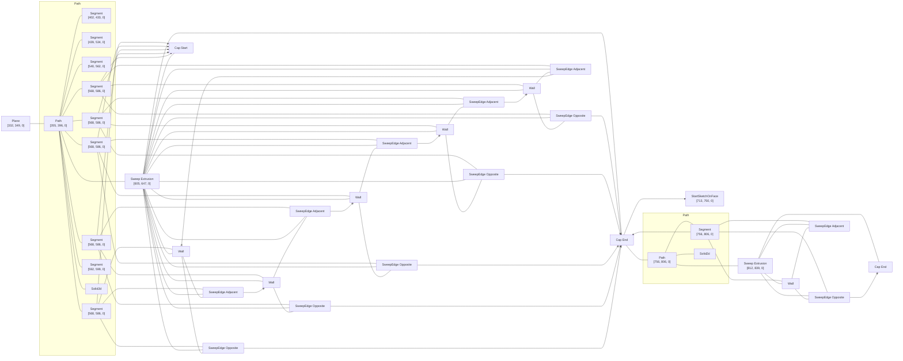

```mermaid
flowchart LR
  subgraph path3 [Path]
    3["Path<br>[355, 396, 0]"]
      %% [ProgramBodyItem { index: 6 }, VariableDeclarationDeclaration, VariableDeclarationInit, PipeBodyItem { index: 1 }]
    5["Segment<br>[402, 433, 0]"]
      %% [ProgramBodyItem { index: 6 }, VariableDeclarationDeclaration, VariableDeclarationInit, PipeBodyItem { index: 2 }]
    6["Segment<br>[439, 534, 0]"]
      %% [ProgramBodyItem { index: 6 }, VariableDeclarationDeclaration, VariableDeclarationInit, PipeBodyItem { index: 3 }]
    7["Segment<br>[540, 562, 0]"]
      %% [ProgramBodyItem { index: 6 }, VariableDeclarationDeclaration, VariableDeclarationInit, PipeBodyItem { index: 4 }]
    8["Segment<br>[568, 586, 0]"]
      %% [ProgramBodyItem { index: 6 }, VariableDeclarationDeclaration, VariableDeclarationInit, PipeBodyItem { index: 5 }]
    9["Segment<br>[568, 586, 0]"]
      %% [ProgramBodyItem { index: 6 }, VariableDeclarationDeclaration, VariableDeclarationInit, PipeBodyItem { index: 5 }]
    10["Segment<br>[568, 586, 0]"]
      %% [ProgramBodyItem { index: 6 }, VariableDeclarationDeclaration, VariableDeclarationInit, PipeBodyItem { index: 5 }]
    11["Segment<br>[568, 586, 0]"]
      %% [ProgramBodyItem { index: 6 }, VariableDeclarationDeclaration, VariableDeclarationInit, PipeBodyItem { index: 5 }]
    12["Segment<br>[568, 586, 0]"]
      %% [ProgramBodyItem { index: 6 }, VariableDeclarationDeclaration, VariableDeclarationInit, PipeBodyItem { index: 5 }]
    13["Segment<br>[592, 599, 0]"]
      %% [ProgramBodyItem { index: 6 }, VariableDeclarationDeclaration, VariableDeclarationInit, PipeBodyItem { index: 6 }]
    15[Solid2d]
  end
  subgraph path4 [Path]
    4["Path<br>[756, 806, 0]"]
      %% [ProgramBodyItem { index: 7 }, VariableDeclarationDeclaration, VariableDeclarationInit, PipeBodyItem { index: 1 }]
    14["Segment<br>[756, 806, 0]"]
      %% [ProgramBodyItem { index: 7 }, VariableDeclarationDeclaration, VariableDeclarationInit, PipeBodyItem { index: 1 }]
    16[Solid2d]
  end
  1["Plane<br>[332, 349, 0]"]
    %% [ProgramBodyItem { index: 6 }, VariableDeclarationDeclaration, VariableDeclarationInit, PipeBodyItem { index: 0 }]
  2["StartSketchOnFace<br>[713, 750, 0]"]
    %% [ProgramBodyItem { index: 7 }, VariableDeclarationDeclaration, VariableDeclarationInit, PipeBodyItem { index: 0 }]
  17["Sweep Extrusion<br>[605, 647, 0]"]
    %% [ProgramBodyItem { index: 6 }, VariableDeclarationDeclaration, VariableDeclarationInit, PipeBodyItem { index: 7 }]
  18["Sweep Extrusion<br>[812, 839, 0]"]
    %% [ProgramBodyItem { index: 7 }, VariableDeclarationDeclaration, VariableDeclarationInit, PipeBodyItem { index: 2 }]
  19[Wall]
    %% face_code_ref=Missing NodePath
  20[Wall]
    %% face_code_ref=Missing NodePath
  21[Wall]
    %% face_code_ref=Missing NodePath
  22[Wall]
    %% face_code_ref=Missing NodePath
  23[Wall]
    %% face_code_ref=Missing NodePath
  24[Wall]
    %% face_code_ref=Missing NodePath
  25["Cap Start"]
    %% face_code_ref=Missing NodePath
  26["Cap End"]
    %% face_code_ref=Missing NodePath
  27["Cap End"]
    %% face_code_ref=[ProgramBodyItem { index: 7 }, VariableDeclarationDeclaration, VariableDeclarationInit, PipeBodyItem { index: 0 }]
  28["SweepEdge Opposite"]
  29["SweepEdge Opposite"]
  30["SweepEdge Opposite"]
  31["SweepEdge Opposite"]
  32["SweepEdge Opposite"]
  33["SweepEdge Opposite"]
  34["SweepEdge Adjacent"]
  35["SweepEdge Adjacent"]
  36["SweepEdge Adjacent"]
  37["SweepEdge Adjacent"]
  38["SweepEdge Adjacent"]
  39["SweepEdge Adjacent"]
  1 --- 3
  27 x--> 2
  3 --- 5
  3 --- 6
  3 --- 7
  3 --- 8
  3 --- 9
  3 --- 10
  3 --- 11
  3 --- 12
  3 --- 13
  3 --- 15
  3 ---- 17
  4 --- 14
  4 --- 16
  4 ---- 18
  27 --- 4
  8 --- 20
  8 x--> 25
  8 --- 33
  8 --- 39
  9 --- 21
  9 x--> 25
  9 --- 31
  9 --- 37
  10 --- 22
  10 x--> 25
  10 --- 32
  10 --- 38
  11 --- 23
  11 x--> 25
  11 --- 30
  11 --- 36
  12 --- 24
  12 x--> 25
  12 --- 29
  12 --- 35
  14 --- 19
  14 x--> 27
  14 --- 28
  14 --- 34
  17 --- 20
  17 --- 21
  17 --- 22
  17 --- 23
  17 --- 24
  17 --- 25
  17 --- 27
  17 --- 29
  17 --- 30
  17 --- 31
  17 --- 32
  17 --- 33
  17 --- 35
  17 --- 36
  17 --- 37
  17 --- 38
  17 --- 39
  18 --- 19
  18 --- 26
  18 --- 28
  18 --- 34
  19 --- 28
  19 --- 34
  20 --- 33
  35 <--x 20
  20 --- 39
  21 --- 31
  21 --- 37
  38 <--x 21
  22 --- 32
  22 --- 38
  39 <--x 22
  23 --- 30
  23 --- 36
  37 <--x 23
  24 --- 29
  24 --- 35
  36 <--x 24
  28 <--x 26
  29 <--x 27
  30 <--x 27
  31 <--x 27
  32 <--x 27
  33 <--x 27
```
