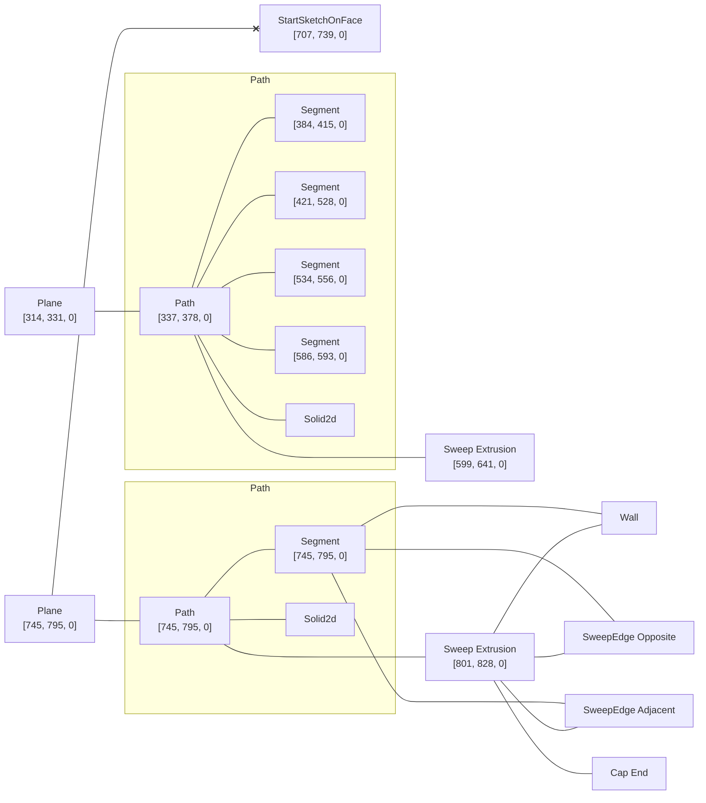

```mermaid
flowchart LR
  subgraph path2 [Path]
    2["Path<br>[337, 378, 0]"]
    3["Segment<br>[384, 415, 0]"]
    4["Segment<br>[421, 528, 0]"]
    5["Segment<br>[534, 556, 0]"]
    6["Segment<br>[586, 593, 0]"]
    7[Solid2d]
  end
  subgraph path10 [Path]
    10["Path<br>[745, 795, 0]"]
    11["Segment<br>[745, 795, 0]"]
    12[Solid2d]
  end
  1["Plane<br>[314, 331, 0]"]
  8["Sweep Extrusion<br>[599, 641, 0]"]
  9["Plane<br>[745, 795, 0]"]
  13["Sweep Extrusion<br>[801, 828, 0]"]
  14[Wall]
  15["Cap End"]
  16["SweepEdge Opposite"]
  17["SweepEdge Adjacent"]
  18["StartSketchOnFace<br>[707, 739, 0]"]
  1 --- 2
  2 --- 3
  2 --- 4
  2 --- 5
  2 --- 6
  2 ---- 8
  2 --- 7
  9 --- 10
  10 --- 11
  10 ---- 13
  10 --- 12
  11 --- 14
  11 --- 16
  11 --- 17
  13 --- 14
  13 --- 15
  13 --- 16
  13 --- 17
  9 <--x 18
```
