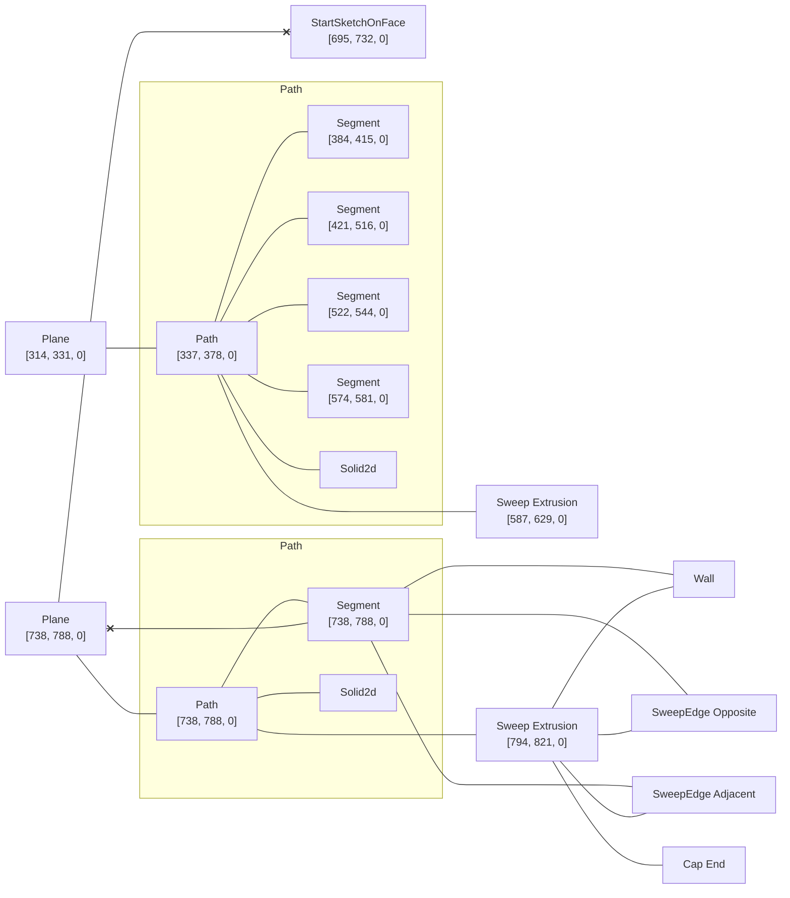

```mermaid
flowchart LR
  subgraph path4 [Path]
    4["Path<br>[337, 378, 0]"]
    6["Segment<br>[384, 415, 0]"]
    7["Segment<br>[421, 516, 0]"]
    8["Segment<br>[522, 544, 0]"]
    9["Segment<br>[574, 581, 0]"]
    11[Solid2d]
  end
  subgraph path5 [Path]
    5["Path<br>[738, 788, 0]"]
    10["Segment<br>[738, 788, 0]"]
    12[Solid2d]
  end
  1["Plane<br>[314, 331, 0]"]
  2["Plane<br>[738, 788, 0]"]
  3["StartSketchOnFace<br>[695, 732, 0]"]
  13["Sweep Extrusion<br>[587, 629, 0]"]
  14["Sweep Extrusion<br>[794, 821, 0]"]
  15[Wall]
  16["Cap End"]
  17["SweepEdge Opposite"]
  18["SweepEdge Adjacent"]
  1 --- 4
  2 <--x 3
  2 --- 5
  10 <--x 2
  4 --- 6
  4 --- 7
  4 --- 8
  4 --- 9
  4 --- 11
  4 ---- 13
  5 --- 10
  5 --- 12
  5 ---- 14
  10 --- 15
  10 --- 17
  10 --- 18
  14 --- 15
  14 --- 16
  14 --- 17
  14 --- 18
```
