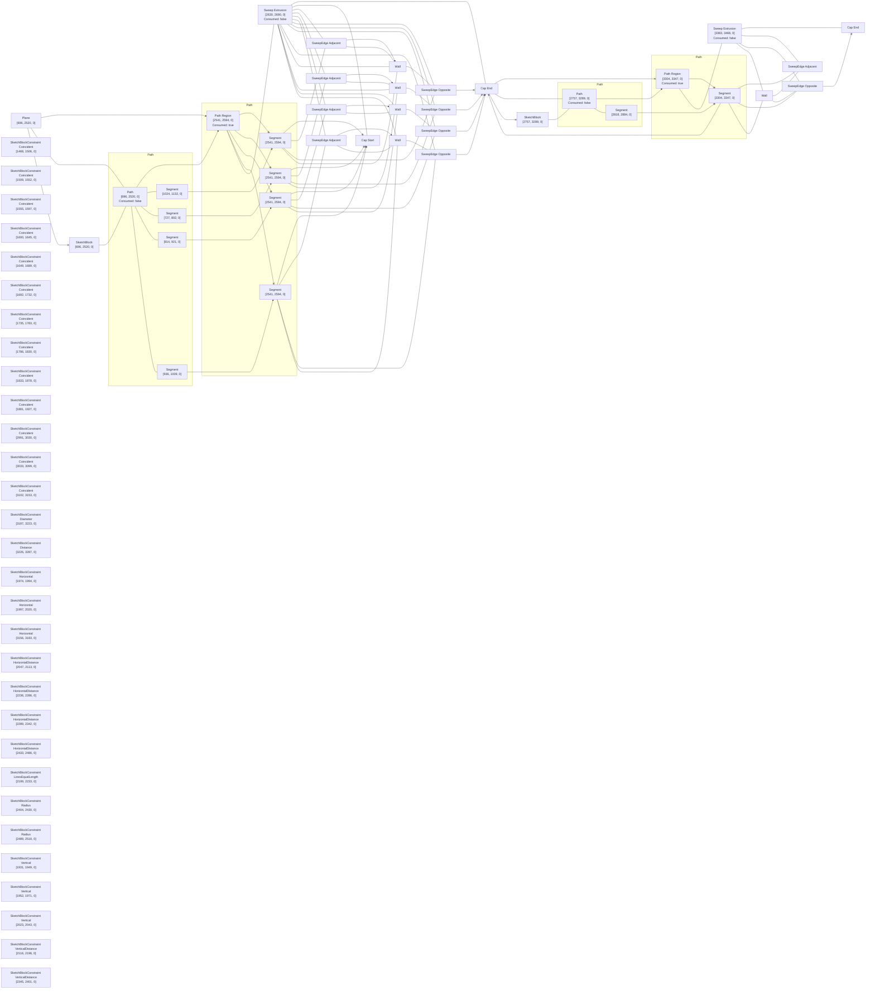

```mermaid
flowchart LR
  subgraph path7 [Path]
    7["Path<br>[696, 2520, 0]<br>Consumed: false"]
      %% [ProgramBodyItem { index: 13 }, VariableDeclarationDeclaration, VariableDeclarationInit]
    16["Segment<br>[727, 802, 0]"]
      %% [ProgramBodyItem { index: 13 }, VariableDeclarationDeclaration, VariableDeclarationInit, SketchBlockBody, SketchBlockBodyItem { index: 0 }, VariableDeclarationDeclaration, VariableDeclarationInit]
    17["Segment<br>[814, 921, 0]"]
      %% [ProgramBodyItem { index: 13 }, VariableDeclarationDeclaration, VariableDeclarationInit, SketchBlockBody, SketchBlockBodyItem { index: 1 }, VariableDeclarationDeclaration, VariableDeclarationInit]
    18["Segment<br>[936, 1009, 0]"]
      %% [ProgramBodyItem { index: 13 }, VariableDeclarationDeclaration, VariableDeclarationInit, SketchBlockBody, SketchBlockBodyItem { index: 2 }, VariableDeclarationDeclaration, VariableDeclarationInit]
    9["Segment<br>[1024, 1132, 0]"]
      %% [ProgramBodyItem { index: 13 }, VariableDeclarationDeclaration, VariableDeclarationInit, SketchBlockBody, SketchBlockBodyItem { index: 3 }, VariableDeclarationDeclaration, VariableDeclarationInit]
  end
  subgraph path4 [Path]
    4["Path Region<br>[2541, 2594, 0]<br>Consumed: true"]
      %% [ProgramBodyItem { index: 14 }, VariableDeclarationDeclaration, VariableDeclarationInit]
    11["Segment<br>[2541, 2594, 0]"]
      %% [ProgramBodyItem { index: 14 }, VariableDeclarationDeclaration, VariableDeclarationInit]
    12["Segment<br>[2541, 2594, 0]"]
      %% [ProgramBodyItem { index: 14 }, VariableDeclarationDeclaration, VariableDeclarationInit]
    13["Segment<br>[2541, 2594, 0]"]
      %% [ProgramBodyItem { index: 14 }, VariableDeclarationDeclaration, VariableDeclarationInit]
    10["Segment<br>[2541, 2594, 0]"]
      %% [ProgramBodyItem { index: 14 }, VariableDeclarationDeclaration, VariableDeclarationInit]
  end
  subgraph path6 [Path]
    6["Path<br>[2757, 3289, 0]<br>Consumed: false"]
      %% [ProgramBodyItem { index: 17 }, VariableDeclarationDeclaration, VariableDeclarationInit]
    14["Segment<br>[2818, 2884, 0]"]
      %% [ProgramBodyItem { index: 17 }, VariableDeclarationDeclaration, VariableDeclarationInit, SketchBlockBody, SketchBlockBodyItem { index: 0 }, VariableDeclarationDeclaration, VariableDeclarationInit]
  end
  subgraph path5 [Path]
    5["Path Region<br>[3304, 3347, 0]<br>Consumed: true"]
      %% [ProgramBodyItem { index: 18 }, VariableDeclarationDeclaration, VariableDeclarationInit]
    15["Segment<br>[3304, 3347, 0]"]
      %% [ProgramBodyItem { index: 18 }, VariableDeclarationDeclaration, VariableDeclarationInit]
  end
  8["Plane<br>[696, 2520, 0]"]
    %% [ProgramBodyItem { index: 13 }, VariableDeclarationDeclaration, VariableDeclarationInit]
  51["Sweep Extrusion<br>[2630, 2690, 0]<br>Consumed: false"]
    %% [ProgramBodyItem { index: 16 }, VariableDeclarationDeclaration, VariableDeclarationInit]
  63[Wall]
    %% face_code_ref=Missing NodePath
  64[Wall]
    %% face_code_ref=Missing NodePath
  65[Wall]
    %% face_code_ref=Missing NodePath
  66[Wall]
    %% face_code_ref=Missing NodePath
  3["Cap Start"]
    %% face_code_ref=Missing NodePath
  1["Cap End"]
    %% face_code_ref=Missing NodePath
  58["SweepEdge Opposite"]
  53["SweepEdge Adjacent"]
  59["SweepEdge Opposite"]
  54["SweepEdge Adjacent"]
  60["SweepEdge Opposite"]
  55["SweepEdge Adjacent"]
  61["SweepEdge Opposite"]
  56["SweepEdge Adjacent"]
  52["Sweep Extrusion<br>[3383, 3468, 0]<br>Consumed: false"]
    %% [ProgramBodyItem { index: 20 }, VariableDeclarationDeclaration, VariableDeclarationInit]
  67[Wall]
    %% face_code_ref=Missing NodePath
  2["Cap End"]
    %% face_code_ref=Missing NodePath
  62["SweepEdge Opposite"]
  57["SweepEdge Adjacent"]
  20["SketchBlock<br>[696, 2520, 0]"]
    %% [ProgramBodyItem { index: 13 }, VariableDeclarationDeclaration, VariableDeclarationInit]
  21["SketchBlockConstraint Coincident<br>[1468, 1506, 0]"]
    %% [ProgramBodyItem { index: 13 }, VariableDeclarationDeclaration, VariableDeclarationInit, SketchBlockBody, SketchBlockBodyItem { index: 7 }, ExpressionStatementExpr]
  22["SketchBlockConstraint Coincident<br>[1509, 1552, 0]"]
    %% [ProgramBodyItem { index: 13 }, VariableDeclarationDeclaration, VariableDeclarationInit, SketchBlockBody, SketchBlockBodyItem { index: 8 }, ExpressionStatementExpr]
  23["SketchBlockConstraint Coincident<br>[1555, 1597, 0]"]
    %% [ProgramBodyItem { index: 13 }, VariableDeclarationDeclaration, VariableDeclarationInit, SketchBlockBody, SketchBlockBodyItem { index: 9 }, ExpressionStatementExpr]
  24["SketchBlockConstraint Coincident<br>[1600, 1645, 0]"]
    %% [ProgramBodyItem { index: 13 }, VariableDeclarationDeclaration, VariableDeclarationInit, SketchBlockBody, SketchBlockBodyItem { index: 10 }, ExpressionStatementExpr]
  25["SketchBlockConstraint Coincident<br>[1649, 1689, 0]"]
    %% [ProgramBodyItem { index: 13 }, VariableDeclarationDeclaration, VariableDeclarationInit, SketchBlockBody, SketchBlockBodyItem { index: 11 }, ExpressionStatementExpr]
  26["SketchBlockConstraint Coincident<br>[1692, 1732, 0]"]
    %% [ProgramBodyItem { index: 13 }, VariableDeclarationDeclaration, VariableDeclarationInit, SketchBlockBody, SketchBlockBodyItem { index: 12 }, ExpressionStatementExpr]
  27["SketchBlockConstraint Coincident<br>[1735, 1783, 0]"]
    %% [ProgramBodyItem { index: 13 }, VariableDeclarationDeclaration, VariableDeclarationInit, SketchBlockBody, SketchBlockBodyItem { index: 13 }, ExpressionStatementExpr]
  28["SketchBlockConstraint Coincident<br>[1786, 1830, 0]"]
    %% [ProgramBodyItem { index: 13 }, VariableDeclarationDeclaration, VariableDeclarationInit, SketchBlockBody, SketchBlockBodyItem { index: 14 }, ExpressionStatementExpr]
  29["SketchBlockConstraint Coincident<br>[1833, 1878, 0]"]
    %% [ProgramBodyItem { index: 13 }, VariableDeclarationDeclaration, VariableDeclarationInit, SketchBlockBody, SketchBlockBodyItem { index: 15 }, ExpressionStatementExpr]
  30["SketchBlockConstraint Coincident<br>[1881, 1927, 0]"]
    %% [ProgramBodyItem { index: 13 }, VariableDeclarationDeclaration, VariableDeclarationInit, SketchBlockBody, SketchBlockBodyItem { index: 16 }, ExpressionStatementExpr]
  46["SketchBlockConstraint Vertical<br>[1931, 1949, 0]"]
    %% [ProgramBodyItem { index: 13 }, VariableDeclarationDeclaration, VariableDeclarationInit, SketchBlockBody, SketchBlockBodyItem { index: 17 }, ExpressionStatementExpr]
  47["SketchBlockConstraint Vertical<br>[1952, 1971, 0]"]
    %% [ProgramBodyItem { index: 13 }, VariableDeclarationDeclaration, VariableDeclarationInit, SketchBlockBody, SketchBlockBodyItem { index: 18 }, ExpressionStatementExpr]
  36["SketchBlockConstraint Horizontal<br>[1974, 1994, 0]"]
    %% [ProgramBodyItem { index: 13 }, VariableDeclarationDeclaration, VariableDeclarationInit, SketchBlockBody, SketchBlockBodyItem { index: 19 }, ExpressionStatementExpr]
  37["SketchBlockConstraint Horizontal<br>[1997, 2020, 0]"]
    %% [ProgramBodyItem { index: 13 }, VariableDeclarationDeclaration, VariableDeclarationInit, SketchBlockBody, SketchBlockBodyItem { index: 20 }, ExpressionStatementExpr]
  48["SketchBlockConstraint Vertical<br>[2023, 2043, 0]"]
    %% [ProgramBodyItem { index: 13 }, VariableDeclarationDeclaration, VariableDeclarationInit, SketchBlockBody, SketchBlockBodyItem { index: 21 }, ExpressionStatementExpr]
  39["SketchBlockConstraint HorizontalDistance<br>[2047, 2113, 0]"]
    %% [ProgramBodyItem { index: 13 }, VariableDeclarationDeclaration, VariableDeclarationInit, SketchBlockBody, SketchBlockBodyItem { index: 22 }, ExpressionStatementExpr]
  49["SketchBlockConstraint VerticalDistance<br>[2116, 2196, 0]"]
    %% [ProgramBodyItem { index: 13 }, VariableDeclarationDeclaration, VariableDeclarationInit, SketchBlockBody, SketchBlockBodyItem { index: 23 }, ExpressionStatementExpr]
  43["SketchBlockConstraint LinesEqualLength<br>[2199, 2233, 0]"]
    %% [ProgramBodyItem { index: 13 }, VariableDeclarationDeclaration, VariableDeclarationInit, SketchBlockBody, SketchBlockBodyItem { index: 24 }, ExpressionStatementExpr]
  40["SketchBlockConstraint HorizontalDistance<br>[2236, 2286, 0]"]
    %% [ProgramBodyItem { index: 13 }, VariableDeclarationDeclaration, VariableDeclarationInit, SketchBlockBody, SketchBlockBodyItem { index: 25 }, ExpressionStatementExpr]
  41["SketchBlockConstraint HorizontalDistance<br>[2289, 2342, 0]"]
    %% [ProgramBodyItem { index: 13 }, VariableDeclarationDeclaration, VariableDeclarationInit, SketchBlockBody, SketchBlockBodyItem { index: 26 }, ExpressionStatementExpr]
  50["SketchBlockConstraint VerticalDistance<br>[2345, 2401, 0]"]
    %% [ProgramBodyItem { index: 13 }, VariableDeclarationDeclaration, VariableDeclarationInit, SketchBlockBody, SketchBlockBodyItem { index: 27 }, ExpressionStatementExpr]
  44["SketchBlockConstraint Radius<br>[2404, 2430, 0]"]
    %% [ProgramBodyItem { index: 13 }, VariableDeclarationDeclaration, VariableDeclarationInit, SketchBlockBody, SketchBlockBodyItem { index: 28 }, ExpressionStatementExpr]
  42["SketchBlockConstraint HorizontalDistance<br>[2433, 2486, 0]"]
    %% [ProgramBodyItem { index: 13 }, VariableDeclarationDeclaration, VariableDeclarationInit, SketchBlockBody, SketchBlockBodyItem { index: 29 }, ExpressionStatementExpr]
  45["SketchBlockConstraint Radius<br>[2489, 2518, 0]"]
    %% [ProgramBodyItem { index: 13 }, VariableDeclarationDeclaration, VariableDeclarationInit, SketchBlockBody, SketchBlockBodyItem { index: 30 }, ExpressionStatementExpr]
  19["SketchBlock<br>[2757, 3289, 0]"]
    %% [ProgramBodyItem { index: 17 }, VariableDeclarationDeclaration, VariableDeclarationInit]
  31["SketchBlockConstraint Coincident<br>[2991, 3030, 0]"]
    %% [ProgramBodyItem { index: 17 }, VariableDeclarationDeclaration, VariableDeclarationInit, SketchBlockBody, SketchBlockBodyItem { index: 2 }, ExpressionStatementExpr]
  32["SketchBlockConstraint Coincident<br>[3033, 3099, 0]"]
    %% [ProgramBodyItem { index: 17 }, VariableDeclarationDeclaration, VariableDeclarationInit, SketchBlockBody, SketchBlockBodyItem { index: 3 }, ExpressionStatementExpr]
  33["SketchBlockConstraint Coincident<br>[3102, 3153, 0]"]
    %% [ProgramBodyItem { index: 17 }, VariableDeclarationDeclaration, VariableDeclarationInit, SketchBlockBody, SketchBlockBodyItem { index: 4 }, ExpressionStatementExpr]
  38["SketchBlockConstraint Horizontal<br>[3156, 3183, 0]"]
    %% [ProgramBodyItem { index: 17 }, VariableDeclarationDeclaration, VariableDeclarationInit, SketchBlockBody, SketchBlockBodyItem { index: 5 }, ExpressionStatementExpr]
  34["SketchBlockConstraint Diameter<br>[3187, 3223, 0]"]
    %% [ProgramBodyItem { index: 17 }, VariableDeclarationDeclaration, VariableDeclarationInit, SketchBlockBody, SketchBlockBodyItem { index: 6 }, ExpressionStatementExpr]
  35["SketchBlockConstraint Distance<br>[3226, 3287, 0]"]
    %% [ProgramBodyItem { index: 17 }, VariableDeclarationDeclaration, VariableDeclarationInit, SketchBlockBody, SketchBlockBodyItem { index: 7 }, ExpressionStatementExpr]
  1 <--x 5
  1 --- 6
  15 <--x 1
  1 <--x 19
  51 --- 1
  58 <--x 1
  59 <--x 1
  60 <--x 1
  61 <--x 1
  52 --- 2
  62 <--x 2
  10 <--x 3
  11 <--x 3
  12 <--x 3
  13 <--x 3
  51 --- 3
  7 x--> 4
  8 x--> 4
  4 <--x 10
  4 <--x 11
  4 <--x 12
  4 <--x 13
  4 ---- 51
  6 x--> 5
  5 <--x 15
  5 ---- 52
  6 --- 14
  19 --- 6
  8 --- 7
  7 --- 9
  7 --- 16
  7 --- 17
  7 --- 18
  20 --- 7
  8 <--x 20
  9 <--x 10
  10 --- 53
  10 --- 58
  10 --- 63
  16 x--> 11
  11 --- 54
  11 --- 59
  11 --- 64
  17 x--> 12
  12 --- 55
  12 --- 60
  12 --- 65
  18 x--> 13
  13 --- 56
  13 --- 61
  13 --- 66
  14 <--x 15
  15 --- 57
  15 --- 62
  15 --- 67
  51 --- 53
  51 --- 54
  51 --- 55
  51 --- 56
  51 --- 58
  51 --- 59
  51 --- 60
  51 --- 61
  51 --- 63
  51 --- 64
  51 --- 65
  51 --- 66
  52 --- 57
  52 --- 62
  52 --- 67
  63 --- 53
  53 x--> 63
  64 --- 54
  54 x--> 64
  65 --- 55
  55 x--> 65
  66 --- 56
  56 x--> 66
  67 --- 57
  63 --- 58
  64 --- 59
  65 --- 60
  66 --- 61
  67 --- 62
```
