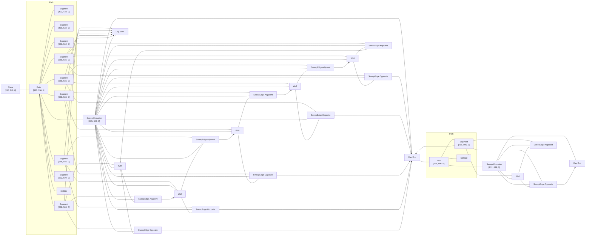

```mermaid
flowchart LR
  subgraph path2 [Path]
    2["Path<br>[355, 396, 0]"]
      %% [ProgramBodyItem { index: 6 }, VariableDeclarationDeclaration, VariableDeclarationInit, PipeBodyItem { index: 1 }]
    3["Segment<br>[402, 433, 0]"]
      %% [ProgramBodyItem { index: 6 }, VariableDeclarationDeclaration, VariableDeclarationInit, PipeBodyItem { index: 2 }]
    4["Segment<br>[439, 534, 0]"]
      %% [ProgramBodyItem { index: 6 }, VariableDeclarationDeclaration, VariableDeclarationInit, PipeBodyItem { index: 3 }]
    5["Segment<br>[540, 562, 0]"]
      %% [ProgramBodyItem { index: 6 }, VariableDeclarationDeclaration, VariableDeclarationInit, PipeBodyItem { index: 4 }]
    6["Segment<br>[568, 586, 0]"]
      %% [ProgramBodyItem { index: 6 }, VariableDeclarationDeclaration, VariableDeclarationInit, PipeBodyItem { index: 5 }]
    7["Segment<br>[568, 586, 0]"]
      %% [ProgramBodyItem { index: 6 }, VariableDeclarationDeclaration, VariableDeclarationInit, PipeBodyItem { index: 5 }]
    8["Segment<br>[568, 586, 0]"]
      %% [ProgramBodyItem { index: 6 }, VariableDeclarationDeclaration, VariableDeclarationInit, PipeBodyItem { index: 5 }]
    9["Segment<br>[568, 586, 0]"]
      %% [ProgramBodyItem { index: 6 }, VariableDeclarationDeclaration, VariableDeclarationInit, PipeBodyItem { index: 5 }]
    10["Segment<br>[568, 586, 0]"]
      %% [ProgramBodyItem { index: 6 }, VariableDeclarationDeclaration, VariableDeclarationInit, PipeBodyItem { index: 5 }]
    11["Segment<br>[592, 599, 0]"]
      %% [ProgramBodyItem { index: 6 }, VariableDeclarationDeclaration, VariableDeclarationInit, PipeBodyItem { index: 6 }]
    12[Solid2d]
  end
  subgraph path31 [Path]
    31["Path<br>[756, 806, 0]"]
      %% [ProgramBodyItem { index: 7 }, VariableDeclarationDeclaration, VariableDeclarationInit, PipeBodyItem { index: 1 }]
    32["Segment<br>[756, 806, 0]"]
      %% [ProgramBodyItem { index: 7 }, VariableDeclarationDeclaration, VariableDeclarationInit, PipeBodyItem { index: 1 }]
    33[Solid2d]
  end
  1["Plane<br>[332, 349, 0]"]
    %% [ProgramBodyItem { index: 6 }, VariableDeclarationDeclaration, VariableDeclarationInit, PipeBodyItem { index: 0 }]
  13["Sweep Extrusion<br>[605, 647, 0]"]
    %% [ProgramBodyItem { index: 6 }, VariableDeclarationDeclaration, VariableDeclarationInit, PipeBodyItem { index: 7 }]
  14[Wall]
    %% face_code_ref=Missing NodePath
  15[Wall]
    %% face_code_ref=Missing NodePath
  16[Wall]
    %% face_code_ref=Missing NodePath
  17[Wall]
    %% face_code_ref=Missing NodePath
  18[Wall]
    %% face_code_ref=Missing NodePath
  19["Cap Start"]
    %% face_code_ref=Missing NodePath
  20["Cap End"]
    %% face_code_ref=Missing NodePath
  21["SweepEdge Opposite"]
  22["SweepEdge Adjacent"]
  23["SweepEdge Opposite"]
  24["SweepEdge Adjacent"]
  25["SweepEdge Opposite"]
  26["SweepEdge Adjacent"]
  27["SweepEdge Opposite"]
  28["SweepEdge Adjacent"]
  29["SweepEdge Opposite"]
  30["SweepEdge Adjacent"]
  34["Sweep Extrusion<br>[812, 839, 0]"]
    %% [ProgramBodyItem { index: 7 }, VariableDeclarationDeclaration, VariableDeclarationInit, PipeBodyItem { index: 2 }]
  35[Wall]
    %% face_code_ref=Missing NodePath
  36["Cap End"]
    %% face_code_ref=Missing NodePath
  37["SweepEdge Opposite"]
  38["SweepEdge Adjacent"]
  1 --- 2
  2 --- 3
  2 --- 4
  2 --- 5
  2 --- 6
  2 --- 7
  2 --- 8
  2 --- 9
  2 --- 10
  2 --- 11
  2 --- 12
  2 ---- 13
  6 --- 18
  6 x--> 19
  6 --- 29
  6 --- 30
  7 --- 17
  7 x--> 19
  7 --- 27
  7 --- 28
  8 --- 16
  8 x--> 19
  8 --- 25
  8 --- 26
  9 --- 15
  9 x--> 19
  9 --- 23
  9 --- 24
  10 --- 14
  10 x--> 19
  10 --- 21
  10 --- 22
  13 --- 14
  13 --- 15
  13 --- 16
  13 --- 17
  13 --- 18
  13 --- 19
  13 --- 20
  13 --- 21
  13 --- 22
  13 --- 23
  13 --- 24
  13 --- 25
  13 --- 26
  13 --- 27
  13 --- 28
  13 --- 29
  13 --- 30
  14 --- 21
  14 --- 22
  24 <--x 14
  15 --- 23
  15 --- 24
  26 <--x 15
  16 --- 25
  16 --- 26
  28 <--x 16
  17 --- 27
  17 --- 28
  30 <--x 17
  22 <--x 18
  18 --- 29
  18 --- 30
  21 <--x 20
  23 <--x 20
  25 <--x 20
  27 <--x 20
  29 <--x 20
  20 --- 31
  32 <--x 20
  31 --- 32
  31 --- 33
  31 ---- 34
  32 --- 35
  32 --- 37
  32 --- 38
  34 --- 35
  34 --- 36
  34 --- 37
  34 --- 38
  35 --- 37
  35 --- 38
  37 <--x 36
```
