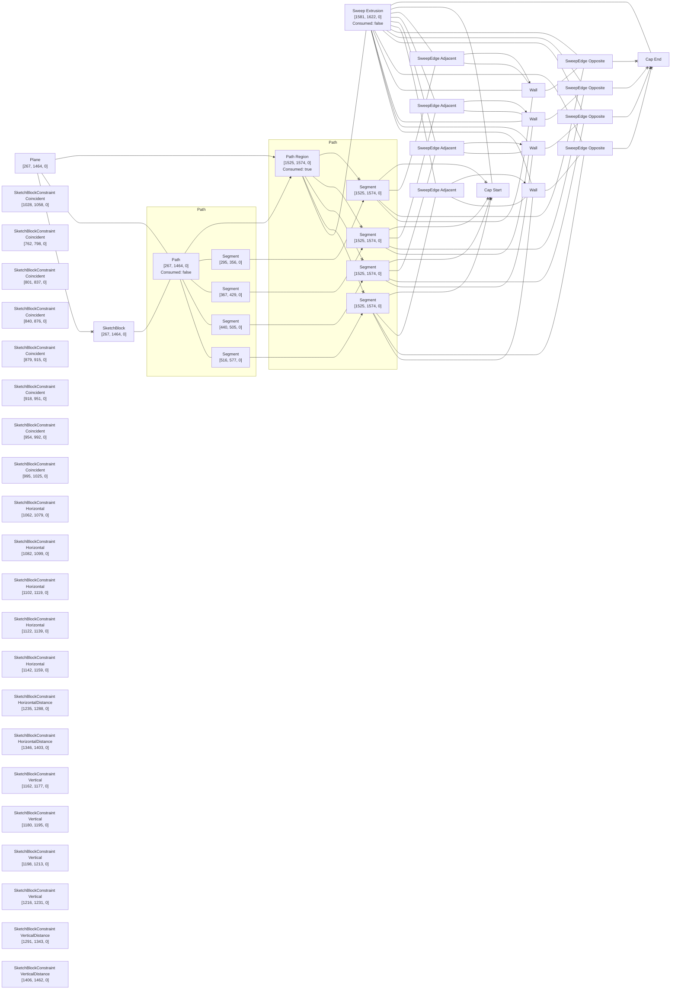

```mermaid
flowchart LR
  subgraph path4 [Path]
    4["Path<br>[267, 1464, 0]<br>Consumed: false"]
      %% [ProgramBodyItem { index: 3 }, VariableDeclarationDeclaration, VariableDeclarationInit]
    10["Segment<br>[295, 356, 0]"]
      %% [ProgramBodyItem { index: 3 }, VariableDeclarationDeclaration, VariableDeclarationInit, SketchBlockBody, SketchBlockBodyItem { index: 0 }, VariableDeclarationDeclaration, VariableDeclarationInit]
    11["Segment<br>[367, 429, 0]"]
      %% [ProgramBodyItem { index: 3 }, VariableDeclarationDeclaration, VariableDeclarationInit, SketchBlockBody, SketchBlockBodyItem { index: 1 }, VariableDeclarationDeclaration, VariableDeclarationInit]
    12["Segment<br>[440, 505, 0]"]
      %% [ProgramBodyItem { index: 3 }, VariableDeclarationDeclaration, VariableDeclarationInit, SketchBlockBody, SketchBlockBodyItem { index: 2 }, VariableDeclarationDeclaration, VariableDeclarationInit]
    13["Segment<br>[516, 577, 0]"]
      %% [ProgramBodyItem { index: 3 }, VariableDeclarationDeclaration, VariableDeclarationInit, SketchBlockBody, SketchBlockBodyItem { index: 3 }, VariableDeclarationDeclaration, VariableDeclarationInit]
  end
  subgraph path3 [Path]
    3["Path Region<br>[1525, 1574, 0]<br>Consumed: true"]
      %% [ProgramBodyItem { index: 4 }, VariableDeclarationDeclaration, VariableDeclarationInit]
    6["Segment<br>[1525, 1574, 0]"]
      %% [ProgramBodyItem { index: 4 }, VariableDeclarationDeclaration, VariableDeclarationInit]
    7["Segment<br>[1525, 1574, 0]"]
      %% [ProgramBodyItem { index: 4 }, VariableDeclarationDeclaration, VariableDeclarationInit]
    8["Segment<br>[1525, 1574, 0]"]
      %% [ProgramBodyItem { index: 4 }, VariableDeclarationDeclaration, VariableDeclarationInit]
    9["Segment<br>[1525, 1574, 0]"]
      %% [ProgramBodyItem { index: 4 }, VariableDeclarationDeclaration, VariableDeclarationInit]
  end
  5["Plane<br>[267, 1464, 0]"]
    %% [ProgramBodyItem { index: 3 }, VariableDeclarationDeclaration, VariableDeclarationInit]
  36["Sweep Extrusion<br>[1581, 1622, 0]<br>Consumed: false"]
    %% [ProgramBodyItem { index: 5 }, VariableDeclarationDeclaration, VariableDeclarationInit]
  45[Wall]
    %% face_code_ref=Missing NodePath
  46[Wall]
    %% face_code_ref=Missing NodePath
  47[Wall]
    %% face_code_ref=Missing NodePath
  48[Wall]
    %% face_code_ref=Missing NodePath
  2["Cap Start"]
    %% face_code_ref=Missing NodePath
  1["Cap End"]
    %% face_code_ref=Missing NodePath
  41["SweepEdge Opposite"]
  37["SweepEdge Adjacent"]
  42["SweepEdge Opposite"]
  38["SweepEdge Adjacent"]
  43["SweepEdge Opposite"]
  39["SweepEdge Adjacent"]
  44["SweepEdge Opposite"]
  40["SweepEdge Adjacent"]
  14["SketchBlock<br>[267, 1464, 0]"]
    %% [ProgramBodyItem { index: 3 }, VariableDeclarationDeclaration, VariableDeclarationInit]
  16["SketchBlockConstraint Coincident<br>[762, 798, 0]"]
    %% [ProgramBodyItem { index: 3 }, VariableDeclarationDeclaration, VariableDeclarationInit, SketchBlockBody, SketchBlockBodyItem { index: 6 }, ExpressionStatementExpr]
  17["SketchBlockConstraint Coincident<br>[801, 837, 0]"]
    %% [ProgramBodyItem { index: 3 }, VariableDeclarationDeclaration, VariableDeclarationInit, SketchBlockBody, SketchBlockBodyItem { index: 7 }, ExpressionStatementExpr]
  18["SketchBlockConstraint Coincident<br>[840, 876, 0]"]
    %% [ProgramBodyItem { index: 3 }, VariableDeclarationDeclaration, VariableDeclarationInit, SketchBlockBody, SketchBlockBodyItem { index: 8 }, ExpressionStatementExpr]
  19["SketchBlockConstraint Coincident<br>[879, 915, 0]"]
    %% [ProgramBodyItem { index: 3 }, VariableDeclarationDeclaration, VariableDeclarationInit, SketchBlockBody, SketchBlockBodyItem { index: 9 }, ExpressionStatementExpr]
  20["SketchBlockConstraint Coincident<br>[918, 951, 0]"]
    %% [ProgramBodyItem { index: 3 }, VariableDeclarationDeclaration, VariableDeclarationInit, SketchBlockBody, SketchBlockBodyItem { index: 10 }, ExpressionStatementExpr]
  21["SketchBlockConstraint Coincident<br>[954, 992, 0]"]
    %% [ProgramBodyItem { index: 3 }, VariableDeclarationDeclaration, VariableDeclarationInit, SketchBlockBody, SketchBlockBodyItem { index: 11 }, ExpressionStatementExpr]
  22["SketchBlockConstraint Coincident<br>[995, 1025, 0]"]
    %% [ProgramBodyItem { index: 3 }, VariableDeclarationDeclaration, VariableDeclarationInit, SketchBlockBody, SketchBlockBodyItem { index: 12 }, ExpressionStatementExpr]
  15["SketchBlockConstraint Coincident<br>[1028, 1058, 0]"]
    %% [ProgramBodyItem { index: 3 }, VariableDeclarationDeclaration, VariableDeclarationInit, SketchBlockBody, SketchBlockBodyItem { index: 13 }, ExpressionStatementExpr]
  23["SketchBlockConstraint Horizontal<br>[1062, 1079, 0]"]
    %% [ProgramBodyItem { index: 3 }, VariableDeclarationDeclaration, VariableDeclarationInit, SketchBlockBody, SketchBlockBodyItem { index: 14 }, ExpressionStatementExpr]
  24["SketchBlockConstraint Horizontal<br>[1082, 1099, 0]"]
    %% [ProgramBodyItem { index: 3 }, VariableDeclarationDeclaration, VariableDeclarationInit, SketchBlockBody, SketchBlockBodyItem { index: 15 }, ExpressionStatementExpr]
  25["SketchBlockConstraint Horizontal<br>[1102, 1119, 0]"]
    %% [ProgramBodyItem { index: 3 }, VariableDeclarationDeclaration, VariableDeclarationInit, SketchBlockBody, SketchBlockBodyItem { index: 16 }, ExpressionStatementExpr]
  26["SketchBlockConstraint Horizontal<br>[1122, 1139, 0]"]
    %% [ProgramBodyItem { index: 3 }, VariableDeclarationDeclaration, VariableDeclarationInit, SketchBlockBody, SketchBlockBodyItem { index: 17 }, ExpressionStatementExpr]
  27["SketchBlockConstraint Horizontal<br>[1142, 1159, 0]"]
    %% [ProgramBodyItem { index: 3 }, VariableDeclarationDeclaration, VariableDeclarationInit, SketchBlockBody, SketchBlockBodyItem { index: 18 }, ExpressionStatementExpr]
  30["SketchBlockConstraint Vertical<br>[1162, 1177, 0]"]
    %% [ProgramBodyItem { index: 3 }, VariableDeclarationDeclaration, VariableDeclarationInit, SketchBlockBody, SketchBlockBodyItem { index: 19 }, ExpressionStatementExpr]
  31["SketchBlockConstraint Vertical<br>[1180, 1195, 0]"]
    %% [ProgramBodyItem { index: 3 }, VariableDeclarationDeclaration, VariableDeclarationInit, SketchBlockBody, SketchBlockBodyItem { index: 20 }, ExpressionStatementExpr]
  32["SketchBlockConstraint Vertical<br>[1198, 1213, 0]"]
    %% [ProgramBodyItem { index: 3 }, VariableDeclarationDeclaration, VariableDeclarationInit, SketchBlockBody, SketchBlockBodyItem { index: 21 }, ExpressionStatementExpr]
  33["SketchBlockConstraint Vertical<br>[1216, 1231, 0]"]
    %% [ProgramBodyItem { index: 3 }, VariableDeclarationDeclaration, VariableDeclarationInit, SketchBlockBody, SketchBlockBodyItem { index: 22 }, ExpressionStatementExpr]
  28["SketchBlockConstraint HorizontalDistance<br>[1235, 1288, 0]"]
    %% [ProgramBodyItem { index: 3 }, VariableDeclarationDeclaration, VariableDeclarationInit, SketchBlockBody, SketchBlockBodyItem { index: 23 }, ExpressionStatementExpr]
  34["SketchBlockConstraint VerticalDistance<br>[1291, 1343, 0]"]
    %% [ProgramBodyItem { index: 3 }, VariableDeclarationDeclaration, VariableDeclarationInit, SketchBlockBody, SketchBlockBodyItem { index: 24 }, ExpressionStatementExpr]
  29["SketchBlockConstraint HorizontalDistance<br>[1346, 1403, 0]"]
    %% [ProgramBodyItem { index: 3 }, VariableDeclarationDeclaration, VariableDeclarationInit, SketchBlockBody, SketchBlockBodyItem { index: 25 }, ExpressionStatementExpr]
  35["SketchBlockConstraint VerticalDistance<br>[1406, 1462, 0]"]
    %% [ProgramBodyItem { index: 3 }, VariableDeclarationDeclaration, VariableDeclarationInit, SketchBlockBody, SketchBlockBodyItem { index: 26 }, ExpressionStatementExpr]
  36 --- 1
  41 <--x 1
  42 <--x 1
  43 <--x 1
  44 <--x 1
  6 <--x 2
  7 <--x 2
  8 <--x 2
  9 <--x 2
  36 --- 2
  4 x--> 3
  5 x--> 3
  3 <--x 6
  3 <--x 7
  3 <--x 8
  3 <--x 9
  3 ---- 36
  5 --- 4
  4 --- 10
  4 --- 11
  4 --- 12
  4 --- 13
  14 --- 4
  5 <--x 14
  10 x--> 6
  6 --- 37
  6 --- 41
  6 --- 45
  11 x--> 7
  7 --- 38
  7 --- 42
  7 --- 46
  12 x--> 8
  8 --- 39
  8 --- 43
  8 --- 47
  13 x--> 9
  9 --- 40
  9 --- 44
  9 --- 48
  36 --- 37
  36 --- 38
  36 --- 39
  36 --- 40
  36 --- 41
  36 --- 42
  36 --- 43
  36 --- 44
  36 --- 45
  36 --- 46
  36 --- 47
  36 --- 48
  45 --- 37
  37 x--> 45
  46 --- 38
  38 x--> 46
  47 --- 39
  39 x--> 47
  48 --- 40
  40 x--> 48
  45 --- 41
  46 --- 42
  47 --- 43
  48 --- 44
```
