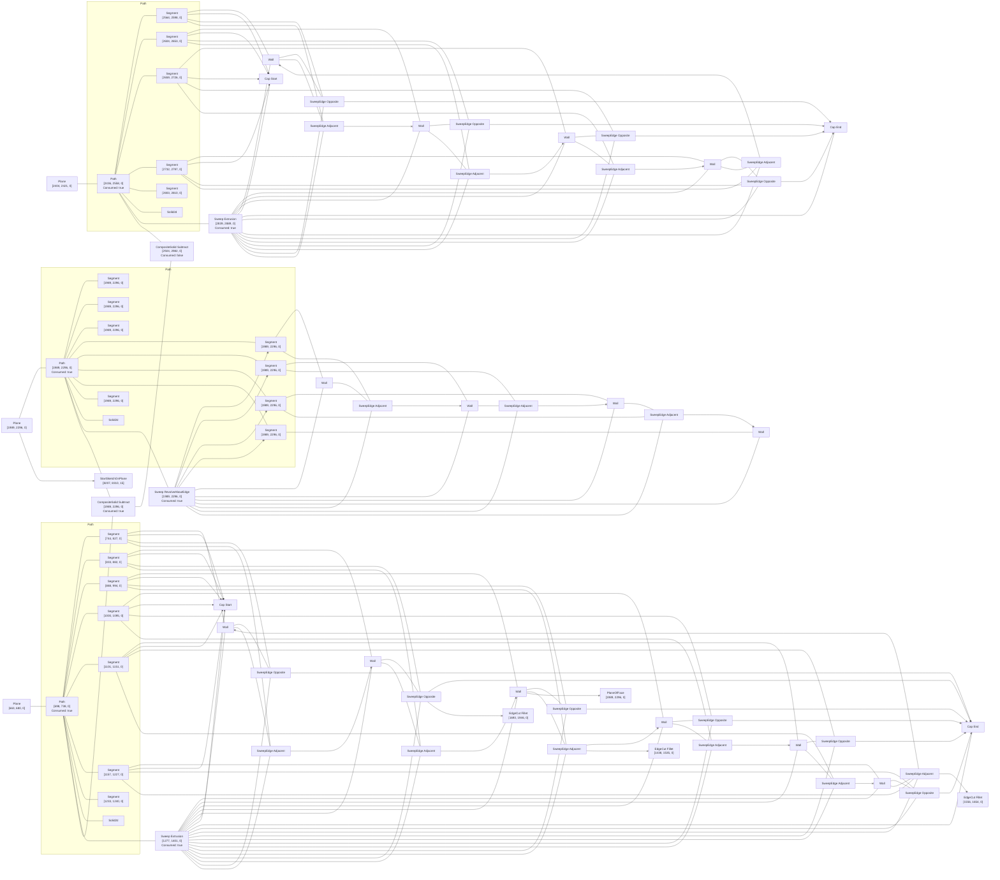

```mermaid
flowchart LR
  subgraph path2 [Path]
    2["Path<br>[698, 738, 0]<br>Consumed: true"]
      %% [ProgramBodyItem { index: 10 }, VariableDeclarationDeclaration, VariableDeclarationInit, PipeBodyItem { index: 0 }]
    3["Segment<br>[744, 827, 0]"]
      %% [ProgramBodyItem { index: 10 }, VariableDeclarationDeclaration, VariableDeclarationInit, PipeBodyItem { index: 1 }]
    4["Segment<br>[833, 882, 0]"]
      %% [ProgramBodyItem { index: 10 }, VariableDeclarationDeclaration, VariableDeclarationInit, PipeBodyItem { index: 2 }]
    5["Segment<br>[888, 994, 0]"]
      %% [ProgramBodyItem { index: 10 }, VariableDeclarationDeclaration, VariableDeclarationInit, PipeBodyItem { index: 3 }]
    6["Segment<br>[1000, 1095, 0]"]
      %% [ProgramBodyItem { index: 10 }, VariableDeclarationDeclaration, VariableDeclarationInit, PipeBodyItem { index: 4 }]
    7["Segment<br>[1101, 1151, 0]"]
      %% [ProgramBodyItem { index: 10 }, VariableDeclarationDeclaration, VariableDeclarationInit, PipeBodyItem { index: 5 }]
    8["Segment<br>[1157, 1227, 0]"]
      %% [ProgramBodyItem { index: 10 }, VariableDeclarationDeclaration, VariableDeclarationInit, PipeBodyItem { index: 6 }]
    9["Segment<br>[1233, 1240, 0]"]
      %% [ProgramBodyItem { index: 10 }, VariableDeclarationDeclaration, VariableDeclarationInit, PipeBodyItem { index: 7 }]
    10[Solid2d]
  end
  subgraph path37 [Path]
    37["Path<br>[1989, 2296, 0]<br>Consumed: true"]
      %% [ProgramBodyItem { index: 15 }, VariableDeclarationDeclaration, VariableDeclarationInit]
    38["Segment<br>[1989, 2296, 0]"]
      %% [ProgramBodyItem { index: 15 }, VariableDeclarationDeclaration, VariableDeclarationInit]
    39["Segment<br>[1989, 2296, 0]"]
      %% [ProgramBodyItem { index: 15 }, VariableDeclarationDeclaration, VariableDeclarationInit]
    40["Segment<br>[1989, 2296, 0]"]
      %% [ProgramBodyItem { index: 15 }, VariableDeclarationDeclaration, VariableDeclarationInit]
    41["Segment<br>[1989, 2296, 0]"]
      %% [ProgramBodyItem { index: 15 }, VariableDeclarationDeclaration, VariableDeclarationInit]
    42["Segment<br>[1989, 2296, 0]"]
      %% [ProgramBodyItem { index: 15 }, VariableDeclarationDeclaration, VariableDeclarationInit]
    43["Segment<br>[1989, 2296, 0]"]
      %% [ProgramBodyItem { index: 15 }, VariableDeclarationDeclaration, VariableDeclarationInit]
    44["Segment<br>[1989, 2296, 0]"]
      %% [ProgramBodyItem { index: 15 }, VariableDeclarationDeclaration, VariableDeclarationInit]
    45["Segment<br>[1989, 2296, 0]"]
      %% [ProgramBodyItem { index: 15 }, VariableDeclarationDeclaration, VariableDeclarationInit]
    46[Solid2d]
  end
  subgraph path57 [Path]
    57["Path<br>[2436, 2558, 0]<br>Consumed: true"]
      %% [ProgramBodyItem { index: 19 }, VariableDeclarationDeclaration, VariableDeclarationInit, PipeBodyItem { index: 0 }]
    58["Segment<br>[2564, 2598, 0]"]
      %% [ProgramBodyItem { index: 19 }, VariableDeclarationDeclaration, VariableDeclarationInit, PipeBodyItem { index: 1 }]
    59["Segment<br>[2604, 2653, 0]"]
      %% [ProgramBodyItem { index: 19 }, VariableDeclarationDeclaration, VariableDeclarationInit, PipeBodyItem { index: 2 }]
    60["Segment<br>[2659, 2726, 0]"]
      %% [ProgramBodyItem { index: 19 }, VariableDeclarationDeclaration, VariableDeclarationInit, PipeBodyItem { index: 3 }]
    61["Segment<br>[2732, 2797, 0]"]
      %% [ProgramBodyItem { index: 19 }, VariableDeclarationDeclaration, VariableDeclarationInit, PipeBodyItem { index: 4 }]
    62["Segment<br>[2803, 2810, 0]"]
      %% [ProgramBodyItem { index: 19 }, VariableDeclarationDeclaration, VariableDeclarationInit, PipeBodyItem { index: 5 }]
    63[Solid2d]
  end
  1["Plane<br>[663, 680, 0]"]
    %% [ProgramBodyItem { index: 9 }, VariableDeclarationDeclaration, VariableDeclarationInit]
  11["Sweep Extrusion<br>[1277, 1401, 0]<br>Consumed: true"]
    %% [ProgramBodyItem { index: 11 }, VariableDeclarationDeclaration, VariableDeclarationInit]
  12[Wall]
    %% face_code_ref=Missing NodePath
  13[Wall]
    %% face_code_ref=Missing NodePath
  14[Wall]
    %% face_code_ref=Missing NodePath
  15[Wall]
    %% face_code_ref=Missing NodePath
  16[Wall]
    %% face_code_ref=Missing NodePath
  17[Wall]
    %% face_code_ref=Missing NodePath
  18["Cap Start"]
    %% face_code_ref=Missing NodePath
  19["Cap End"]
    %% face_code_ref=Missing NodePath
  20["SweepEdge Opposite"]
  21["SweepEdge Adjacent"]
  22["SweepEdge Opposite"]
  23["SweepEdge Adjacent"]
  24["SweepEdge Opposite"]
  25["SweepEdge Adjacent"]
  26["SweepEdge Opposite"]
  27["SweepEdge Adjacent"]
  28["SweepEdge Opposite"]
  29["SweepEdge Adjacent"]
  30["SweepEdge Opposite"]
  31["SweepEdge Adjacent"]
  32["EdgeCut Fillet<br>[1438, 1535, 0]"]
    %% [ProgramBodyItem { index: 12 }, VariableDeclarationDeclaration, VariableDeclarationInit]
  33["EdgeCut Fillet<br>[1556, 1654, 0]"]
    %% [ProgramBodyItem { index: 13 }, VariableDeclarationDeclaration, VariableDeclarationInit]
  34["EdgeCut Fillet<br>[1693, 1946, 0]"]
    %% [ProgramBodyItem { index: 14 }, VariableDeclarationDeclaration, VariableDeclarationInit]
  35["PlaneOfFace<br>[1989, 2296, 0]"]
    %% [ProgramBodyItem { index: 15 }, VariableDeclarationDeclaration, VariableDeclarationInit]
  36["Plane<br>[1989, 2296, 0]"]
    %% [ProgramBodyItem { index: 15 }, VariableDeclarationDeclaration, VariableDeclarationInit]
  47["Sweep RevolveAboutEdge<br>[1989, 2296, 0]<br>Consumed: true"]
    %% [ProgramBodyItem { index: 15 }, VariableDeclarationDeclaration, VariableDeclarationInit]
  48[Wall]
    %% face_code_ref=Missing NodePath
  49[Wall]
    %% face_code_ref=Missing NodePath
  50[Wall]
    %% face_code_ref=Missing NodePath
  51[Wall]
    %% face_code_ref=Missing NodePath
  52["SweepEdge Adjacent"]
  53["SweepEdge Adjacent"]
  54["SweepEdge Adjacent"]
  55["CompositeSolid Subtract<br>[1989, 2296, 0]<br>Consumed: true"]
    %% [ProgramBodyItem { index: 15 }, VariableDeclarationDeclaration, VariableDeclarationInit]
  56["Plane<br>[2404, 2421, 0]"]
    %% [ProgramBodyItem { index: 18 }, VariableDeclarationDeclaration, VariableDeclarationInit]
  64["Sweep Extrusion<br>[2839, 2889, 0]<br>Consumed: true"]
    %% [ProgramBodyItem { index: 20 }, VariableDeclarationDeclaration, VariableDeclarationInit]
  65[Wall]
    %% face_code_ref=Missing NodePath
  66[Wall]
    %% face_code_ref=Missing NodePath
  67[Wall]
    %% face_code_ref=Missing NodePath
  68[Wall]
    %% face_code_ref=Missing NodePath
  69["Cap Start"]
    %% face_code_ref=Missing NodePath
  70["Cap End"]
    %% face_code_ref=Missing NodePath
  71["SweepEdge Opposite"]
  72["SweepEdge Adjacent"]
  73["SweepEdge Opposite"]
  74["SweepEdge Adjacent"]
  75["SweepEdge Opposite"]
  76["SweepEdge Adjacent"]
  77["SweepEdge Opposite"]
  78["SweepEdge Adjacent"]
  79["CompositeSolid Subtract<br>[2924, 2982, 0]<br>Consumed: false"]
    %% [ProgramBodyItem { index: 21 }, VariableDeclarationDeclaration, VariableDeclarationInit]
  80["StartSketchOnPlane<br>[8207, 8310, 15]"]
    %% [ProgramBodyItem { index: 13 }, VariableDeclarationDeclaration, VariableDeclarationInit, FunctionExpressionBody, FunctionExpressionBodyItem { index: 0 }, VariableDeclarationDeclaration, VariableDeclarationInit]
  1 --- 2
  2 --- 3
  2 --- 4
  2 --- 5
  2 --- 6
  2 --- 7
  2 --- 8
  2 --- 9
  2 --- 10
  2 ---- 11
  2 --- 55
  3 --- 17
  3 x--> 18
  3 --- 30
  3 --- 31
  4 --- 16
  4 x--> 18
  4 --- 28
  4 --- 29
  5 --- 15
  5 x--> 18
  5 --- 26
  5 --- 27
  6 --- 14
  6 x--> 18
  6 --- 24
  6 --- 25
  7 --- 13
  7 x--> 18
  7 --- 22
  7 --- 23
  8 --- 12
  8 x--> 18
  8 --- 20
  8 --- 21
  11 --- 12
  11 --- 13
  11 --- 14
  11 --- 15
  11 --- 16
  11 --- 17
  11 --- 18
  11 --- 19
  11 --- 20
  11 --- 21
  11 --- 22
  11 --- 23
  11 --- 24
  11 --- 25
  11 --- 26
  11 --- 27
  11 --- 28
  11 --- 29
  11 --- 30
  11 --- 31
  12 --- 20
  12 --- 21
  23 <--x 12
  13 --- 22
  13 --- 23
  25 <--x 13
  14 --- 24
  14 --- 25
  27 <--x 14
  15 --- 26
  15 --- 27
  29 <--x 15
  15 <--x 35
  16 --- 28
  16 --- 29
  31 <--x 16
  21 <--x 17
  17 --- 30
  17 --- 31
  20 <--x 19
  22 <--x 19
  24 <--x 19
  26 <--x 19
  28 <--x 19
  30 <--x 19
  21 <--x 33
  27 <--x 32
  28 <--x 34
  36 --- 37
  36 <--x 80
  37 --- 38
  37 --- 39
  37 --- 40
  37 --- 41
  37 --- 42
  37 --- 43
  37 --- 44
  37 --- 45
  37 --- 46
  37 ---- 47
  37 --- 55
  47 <--x 41
  41 --- 48
  41 --- 52
  47 <--x 42
  42 --- 49
  42 --- 53
  47 <--x 43
  43 --- 50
  43 --- 54
  47 <--x 44
  44 --- 51
  47 --- 48
  47 --- 49
  47 --- 50
  47 --- 51
  47 --- 52
  47 --- 53
  47 --- 54
  48 --- 52
  52 <--x 49
  49 --- 53
  53 <--x 50
  50 --- 54
  54 <--x 51
  55 --- 79
  56 --- 57
  57 --- 58
  57 --- 59
  57 --- 60
  57 --- 61
  57 --- 62
  57 --- 63
  57 ---- 64
  57 --- 79
  58 --- 68
  58 x--> 69
  58 --- 77
  58 --- 78
  59 --- 67
  59 x--> 69
  59 --- 75
  59 --- 76
  60 --- 66
  60 x--> 69
  60 --- 73
  60 --- 74
  61 --- 65
  61 x--> 69
  61 --- 71
  61 --- 72
  64 --- 65
  64 --- 66
  64 --- 67
  64 --- 68
  64 --- 69
  64 --- 70
  64 --- 71
  64 --- 72
  64 --- 73
  64 --- 74
  64 --- 75
  64 --- 76
  64 --- 77
  64 --- 78
  65 --- 71
  65 --- 72
  74 <--x 65
  66 --- 73
  66 --- 74
  76 <--x 66
  67 --- 75
  67 --- 76
  78 <--x 67
  72 <--x 68
  68 --- 77
  68 --- 78
  71 <--x 70
  73 <--x 70
  75 <--x 70
  77 <--x 70
```
