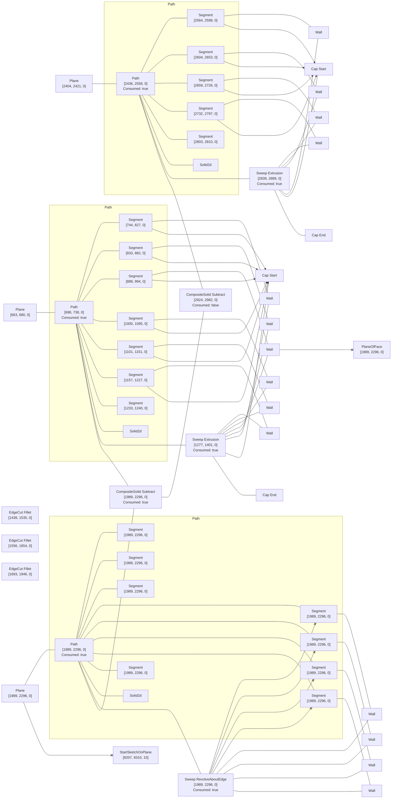

```mermaid
flowchart LR
  subgraph path2 [Path]
    2["Path<br>[698, 738, 0]<br>Consumed: true"]
      %% [ProgramBodyItem { index: 10 }, VariableDeclarationDeclaration, VariableDeclarationInit, PipeBodyItem { index: 0 }]
    3["Segment<br>[744, 827, 0]"]
      %% [ProgramBodyItem { index: 10 }, VariableDeclarationDeclaration, VariableDeclarationInit, PipeBodyItem { index: 1 }]
    4["Segment<br>[833, 882, 0]"]
      %% [ProgramBodyItem { index: 10 }, VariableDeclarationDeclaration, VariableDeclarationInit, PipeBodyItem { index: 2 }]
    5["Segment<br>[888, 994, 0]"]
      %% [ProgramBodyItem { index: 10 }, VariableDeclarationDeclaration, VariableDeclarationInit, PipeBodyItem { index: 3 }]
    6["Segment<br>[1000, 1095, 0]"]
      %% [ProgramBodyItem { index: 10 }, VariableDeclarationDeclaration, VariableDeclarationInit, PipeBodyItem { index: 4 }]
    7["Segment<br>[1101, 1151, 0]"]
      %% [ProgramBodyItem { index: 10 }, VariableDeclarationDeclaration, VariableDeclarationInit, PipeBodyItem { index: 5 }]
    8["Segment<br>[1157, 1227, 0]"]
      %% [ProgramBodyItem { index: 10 }, VariableDeclarationDeclaration, VariableDeclarationInit, PipeBodyItem { index: 6 }]
    9["Segment<br>[1233, 1240, 0]"]
      %% [ProgramBodyItem { index: 10 }, VariableDeclarationDeclaration, VariableDeclarationInit, PipeBodyItem { index: 7 }]
    10[Solid2d]
  end
  subgraph path25 [Path]
    25["Path<br>[1989, 2296, 0]<br>Consumed: true"]
      %% [ProgramBodyItem { index: 15 }, VariableDeclarationDeclaration, VariableDeclarationInit]
    26["Segment<br>[1989, 2296, 0]"]
      %% [ProgramBodyItem { index: 15 }, VariableDeclarationDeclaration, VariableDeclarationInit]
    27["Segment<br>[1989, 2296, 0]"]
      %% [ProgramBodyItem { index: 15 }, VariableDeclarationDeclaration, VariableDeclarationInit]
    28["Segment<br>[1989, 2296, 0]"]
      %% [ProgramBodyItem { index: 15 }, VariableDeclarationDeclaration, VariableDeclarationInit]
    29["Segment<br>[1989, 2296, 0]"]
      %% [ProgramBodyItem { index: 15 }, VariableDeclarationDeclaration, VariableDeclarationInit]
    30["Segment<br>[1989, 2296, 0]"]
      %% [ProgramBodyItem { index: 15 }, VariableDeclarationDeclaration, VariableDeclarationInit]
    31["Segment<br>[1989, 2296, 0]"]
      %% [ProgramBodyItem { index: 15 }, VariableDeclarationDeclaration, VariableDeclarationInit]
    32["Segment<br>[1989, 2296, 0]"]
      %% [ProgramBodyItem { index: 15 }, VariableDeclarationDeclaration, VariableDeclarationInit]
    33["Segment<br>[1989, 2296, 0]"]
      %% [ProgramBodyItem { index: 15 }, VariableDeclarationDeclaration, VariableDeclarationInit]
    34[Solid2d]
  end
  subgraph path42 [Path]
    42["Path<br>[2436, 2558, 0]<br>Consumed: true"]
      %% [ProgramBodyItem { index: 19 }, VariableDeclarationDeclaration, VariableDeclarationInit, PipeBodyItem { index: 0 }]
    43["Segment<br>[2564, 2598, 0]"]
      %% [ProgramBodyItem { index: 19 }, VariableDeclarationDeclaration, VariableDeclarationInit, PipeBodyItem { index: 1 }]
    44["Segment<br>[2604, 2653, 0]"]
      %% [ProgramBodyItem { index: 19 }, VariableDeclarationDeclaration, VariableDeclarationInit, PipeBodyItem { index: 2 }]
    45["Segment<br>[2659, 2726, 0]"]
      %% [ProgramBodyItem { index: 19 }, VariableDeclarationDeclaration, VariableDeclarationInit, PipeBodyItem { index: 3 }]
    46["Segment<br>[2732, 2797, 0]"]
      %% [ProgramBodyItem { index: 19 }, VariableDeclarationDeclaration, VariableDeclarationInit, PipeBodyItem { index: 4 }]
    47["Segment<br>[2803, 2810, 0]"]
      %% [ProgramBodyItem { index: 19 }, VariableDeclarationDeclaration, VariableDeclarationInit, PipeBodyItem { index: 5 }]
    48[Solid2d]
  end
  1["Plane<br>[663, 680, 0]"]
    %% [ProgramBodyItem { index: 9 }, VariableDeclarationDeclaration, VariableDeclarationInit]
  11["Sweep Extrusion<br>[1277, 1401, 0]<br>Consumed: true"]
    %% [ProgramBodyItem { index: 11 }, VariableDeclarationDeclaration, VariableDeclarationInit]
  12[Wall]
    %% face_code_ref=Missing NodePath
  13[Wall]
    %% face_code_ref=Missing NodePath
  14[Wall]
    %% face_code_ref=Missing NodePath
  15[Wall]
    %% face_code_ref=Missing NodePath
  16[Wall]
    %% face_code_ref=Missing NodePath
  17[Wall]
    %% face_code_ref=Missing NodePath
  18["Cap Start"]
    %% face_code_ref=Missing NodePath
  19["Cap End"]
    %% face_code_ref=Missing NodePath
  20["EdgeCut Fillet<br>[1438, 1535, 0]"]
    %% [ProgramBodyItem { index: 12 }, VariableDeclarationDeclaration, VariableDeclarationInit]
  21["EdgeCut Fillet<br>[1556, 1654, 0]"]
    %% [ProgramBodyItem { index: 13 }, VariableDeclarationDeclaration, VariableDeclarationInit]
  22["EdgeCut Fillet<br>[1693, 1946, 0]"]
    %% [ProgramBodyItem { index: 14 }, VariableDeclarationDeclaration, VariableDeclarationInit]
  23["PlaneOfFace<br>[1989, 2296, 0]"]
    %% [ProgramBodyItem { index: 15 }, VariableDeclarationDeclaration, VariableDeclarationInit]
  24["Plane<br>[1989, 2296, 0]"]
    %% [ProgramBodyItem { index: 15 }, VariableDeclarationDeclaration, VariableDeclarationInit]
  35["Sweep RevolveAboutEdge<br>[1989, 2296, 0]<br>Consumed: true"]
    %% [ProgramBodyItem { index: 15 }, VariableDeclarationDeclaration, VariableDeclarationInit]
  36[Wall]
    %% face_code_ref=Missing NodePath
  37[Wall]
    %% face_code_ref=Missing NodePath
  38[Wall]
    %% face_code_ref=Missing NodePath
  39[Wall]
    %% face_code_ref=Missing NodePath
  40["CompositeSolid Subtract<br>[1989, 2296, 0]<br>Consumed: true"]
    %% [ProgramBodyItem { index: 15 }, VariableDeclarationDeclaration, VariableDeclarationInit]
  41["Plane<br>[2404, 2421, 0]"]
    %% [ProgramBodyItem { index: 18 }, VariableDeclarationDeclaration, VariableDeclarationInit]
  49["Sweep Extrusion<br>[2839, 2889, 0]<br>Consumed: true"]
    %% [ProgramBodyItem { index: 20 }, VariableDeclarationDeclaration, VariableDeclarationInit]
  50[Wall]
    %% face_code_ref=Missing NodePath
  51[Wall]
    %% face_code_ref=Missing NodePath
  52[Wall]
    %% face_code_ref=Missing NodePath
  53[Wall]
    %% face_code_ref=Missing NodePath
  54["Cap Start"]
    %% face_code_ref=Missing NodePath
  55["Cap End"]
    %% face_code_ref=Missing NodePath
  56["CompositeSolid Subtract<br>[2924, 2982, 0]<br>Consumed: false"]
    %% [ProgramBodyItem { index: 21 }, VariableDeclarationDeclaration, VariableDeclarationInit]
  57["StartSketchOnPlane<br>[8207, 8310, 15]"]
    %% [ProgramBodyItem { index: 13 }, VariableDeclarationDeclaration, VariableDeclarationInit, FunctionExpressionBody, FunctionExpressionBodyItem { index: 0 }, VariableDeclarationDeclaration, VariableDeclarationInit]
  1 --- 2
  2 --- 3
  2 --- 4
  2 --- 5
  2 --- 6
  2 --- 7
  2 --- 8
  2 --- 9
  2 --- 10
  2 ---- 11
  2 --- 40
  3 --- 17
  3 x--> 18
  4 --- 16
  4 x--> 18
  5 --- 15
  5 x--> 18
  6 --- 14
  6 x--> 18
  7 --- 13
  7 x--> 18
  8 --- 12
  8 x--> 18
  11 --- 12
  11 --- 13
  11 --- 14
  11 --- 15
  11 --- 16
  11 --- 17
  11 --- 18
  11 --- 19
  15 <--x 23
  24 --- 25
  24 <--x 57
  25 --- 26
  25 --- 27
  25 --- 28
  25 --- 29
  25 --- 30
  25 --- 31
  25 --- 32
  25 --- 33
  25 --- 34
  25 ---- 35
  25 --- 40
  35 <--x 29
  29 --- 36
  35 <--x 30
  30 --- 37
  35 <--x 31
  31 --- 38
  35 <--x 32
  32 --- 39
  35 --- 36
  35 --- 37
  35 --- 38
  35 --- 39
  40 --- 56
  41 --- 42
  42 --- 43
  42 --- 44
  42 --- 45
  42 --- 46
  42 --- 47
  42 --- 48
  42 ---- 49
  42 --- 56
  43 --- 53
  43 x--> 54
  44 --- 52
  44 x--> 54
  45 --- 51
  45 x--> 54
  46 --- 50
  46 x--> 54
  49 --- 50
  49 --- 51
  49 --- 52
  49 --- 53
  49 --- 54
  49 --- 55
```
