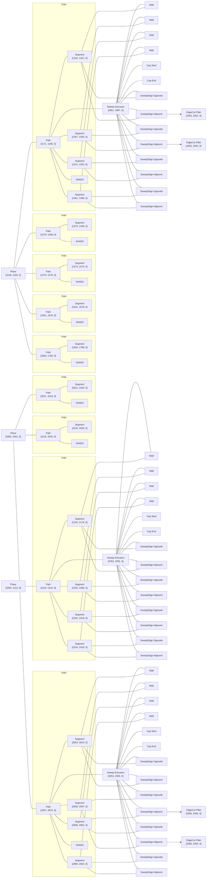

```mermaid
flowchart LR
  subgraph path2 [Path]
    2["Path<br>[1171, 1196, 0]"]
    3["Segment<br>[1202, 1261, 0]"]
    4["Segment<br>[1267, 1305, 0]"]
    5["Segment<br>[1311, 1355, 0]"]
    6["Segment<br>[1361, 1368, 0]"]
    7[Solid2d]
  end
  subgraph path8 [Path]
    8["Path<br>[1379, 1458, 0]"]
    9["Segment<br>[1379, 1458, 0]"]
    10[Solid2d]
  end
  subgraph path11 [Path]
    11["Path<br>[1473, 1576, 0]"]
    12["Segment<br>[1473, 1576, 0]"]
    13[Solid2d]
  end
  subgraph path14 [Path]
    14["Path<br>[1591, 1678, 0]"]
    15["Segment<br>[1591, 1678, 0]"]
    16[Solid2d]
  end
  subgraph path17 [Path]
    17["Path<br>[1693, 1788, 0]"]
    18["Segment<br>[1693, 1788, 0]"]
    19[Solid2d]
  end
  subgraph path36 [Path]
    36["Path<br>[2119, 2144, 0]"]
    37["Segment<br>[2150, 2176, 0]"]
    38["Segment<br>[2182, 2286, 0]"]
    39["Segment<br>[2292, 2318, 0]"]
    40["Segment<br>[2324, 2416, 0]"]
  end
  subgraph path57 [Path]
    57["Path<br>[2837, 2874, 0]"]
    58["Segment<br>[2880, 2902, 0]"]
    59["Segment<br>[2908, 2952, 0]"]
    60["Segment<br>[2958, 2997, 0]"]
    61["Segment<br>[3003, 3010, 0]"]
    62[Solid2d]
  end
  subgraph path63 [Path]
    63["Path<br>[3021, 3103, 0]"]
    64["Segment<br>[3021, 3103, 0]"]
    65[Solid2d]
  end
  subgraph path66 [Path]
    66["Path<br>[3118, 3200, 0]"]
    67["Segment<br>[3118, 3200, 0]"]
    68[Solid2d]
  end
  1["Plane<br>[1146, 1165, 0]"]
  20["Sweep Extrusion<br>[1851, 1897, 0]"]
  21[Wall]
  22[Wall]
  23[Wall]
  24[Wall]
  25["Cap Start"]
  26["Cap End"]
  27["SweepEdge Opposite"]
  28["SweepEdge Adjacent"]
  29["SweepEdge Opposite"]
  30["SweepEdge Adjacent"]
  31["SweepEdge Opposite"]
  32["SweepEdge Adjacent"]
  33["SweepEdge Opposite"]
  34["SweepEdge Adjacent"]
  35["Plane<br>[2094, 2113, 0]"]
  41["Sweep Extrusion<br>[2453, 2491, 0]"]
  42[Wall]
  43[Wall]
  44[Wall]
  45[Wall]
  46["Cap Start"]
  47["Cap End"]
  48["SweepEdge Opposite"]
  49["SweepEdge Adjacent"]
  50["SweepEdge Opposite"]
  51["SweepEdge Adjacent"]
  52["SweepEdge Opposite"]
  53["SweepEdge Adjacent"]
  54["SweepEdge Opposite"]
  55["SweepEdge Adjacent"]
  56["Plane<br>[2805, 2831, 0]"]
  69["Sweep Extrusion<br>[3253, 3300, 0]"]
  70[Wall]
  71[Wall]
  72[Wall]
  73[Wall]
  74["Cap Start"]
  75["Cap End"]
  76["SweepEdge Opposite"]
  77["SweepEdge Adjacent"]
  78["SweepEdge Opposite"]
  79["SweepEdge Adjacent"]
  80["SweepEdge Opposite"]
  81["SweepEdge Adjacent"]
  82["SweepEdge Opposite"]
  83["SweepEdge Adjacent"]
  84["EdgeCut Fillet<br>[1903, 2052, 0]"]
  85["EdgeCut Fillet<br>[1903, 2052, 0]"]
  86["EdgeCut Fillet<br>[3306, 3455, 0]"]
  87["EdgeCut Fillet<br>[3306, 3455, 0]"]
  1 --- 2
  1 --- 8
  1 --- 11
  1 --- 14
  1 --- 17
  2 --- 3
  2 --- 4
  2 --- 5
  2 --- 6
  2 ---- 20
  2 --- 7
  3 --- 21
  3 --- 27
  3 --- 28
  4 --- 22
  4 --- 29
  4 --- 30
  5 --- 23
  5 --- 31
  5 --- 32
  6 --- 24
  6 --- 33
  6 --- 34
  8 --- 9
  8 --- 10
  11 --- 12
  11 --- 13
  14 --- 15
  14 --- 16
  17 --- 18
  17 --- 19
  20 --- 21
  20 --- 22
  20 --- 23
  20 --- 24
  20 --- 25
  20 --- 26
  20 --- 27
  20 --- 28
  20 --- 29
  20 --- 30
  20 --- 31
  20 --- 32
  20 --- 33
  20 --- 34
  35 --- 36
  36 --- 37
  36 --- 38
  36 --- 39
  36 --- 40
  36 ---- 41
  37 --- 42
  37 --- 48
  37 --- 49
  38 --- 43
  38 --- 50
  38 --- 51
  39 --- 44
  39 --- 52
  39 --- 53
  40 --- 45
  40 --- 54
  40 --- 55
  41 --- 42
  41 --- 43
  41 --- 44
  41 --- 45
  41 --- 46
  41 --- 47
  41 --- 48
  41 --- 49
  41 --- 50
  41 --- 51
  41 --- 52
  41 --- 53
  41 --- 54
  41 --- 55
  56 --- 57
  56 --- 63
  56 --- 66
  57 --- 58
  57 --- 59
  57 --- 60
  57 --- 61
  57 ---- 69
  57 --- 62
  58 --- 73
  58 --- 82
  58 --- 83
  59 --- 72
  59 --- 80
  59 --- 81
  60 --- 71
  60 --- 78
  60 --- 79
  61 --- 70
  61 --- 76
  61 --- 77
  63 --- 64
  63 --- 65
  66 --- 67
  66 --- 68
  69 --- 70
  69 --- 71
  69 --- 72
  69 --- 73
  69 --- 74
  69 --- 75
  69 --- 76
  69 --- 77
  69 --- 78
  69 --- 79
  69 --- 80
  69 --- 81
  69 --- 82
  69 --- 83
  28 <--x 84
  30 <--x 85
  81 <--x 86
  79 <--x 87
```
