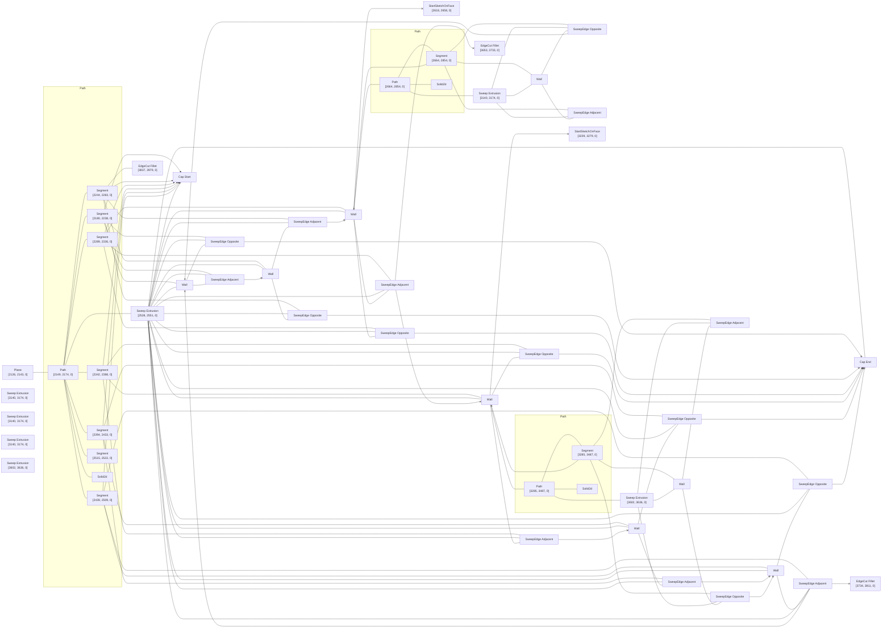

```mermaid
flowchart LR
  subgraph path2 [Path]
    2["Path<br>[2149, 2174, 0]"]
      %% [ProgramBodyItem { index: 20 }, VariableDeclarationDeclaration, VariableDeclarationInit, PipeBodyItem { index: 1 }]
    3["Segment<br>[2180, 2238, 0]"]
      %% [ProgramBodyItem { index: 20 }, VariableDeclarationDeclaration, VariableDeclarationInit, PipeBodyItem { index: 2 }]
    4["Segment<br>[2244, 2283, 0]"]
      %% [ProgramBodyItem { index: 20 }, VariableDeclarationDeclaration, VariableDeclarationInit, PipeBodyItem { index: 3 }]
    5["Segment<br>[2289, 2336, 0]"]
      %% [ProgramBodyItem { index: 20 }, VariableDeclarationDeclaration, VariableDeclarationInit, PipeBodyItem { index: 4 }]
    6["Segment<br>[2342, 2388, 0]"]
      %% [ProgramBodyItem { index: 20 }, VariableDeclarationDeclaration, VariableDeclarationInit, PipeBodyItem { index: 5 }]
    7["Segment<br>[2394, 2433, 0]"]
      %% [ProgramBodyItem { index: 20 }, VariableDeclarationDeclaration, VariableDeclarationInit, PipeBodyItem { index: 6 }]
    8["Segment<br>[2439, 2509, 0]"]
      %% [ProgramBodyItem { index: 20 }, VariableDeclarationDeclaration, VariableDeclarationInit, PipeBodyItem { index: 7 }]
    9["Segment<br>[2515, 2522, 0]"]
      %% [ProgramBodyItem { index: 20 }, VariableDeclarationDeclaration, VariableDeclarationInit, PipeBodyItem { index: 8 }]
    10[Solid2d]
  end
  subgraph path32 [Path]
    32["Path<br>[2664, 2854, 0]"]
      %% [ProgramBodyItem { index: 21 }, VariableDeclarationDeclaration, VariableDeclarationInit, PipeBodyItem { index: 1 }]
    33["Segment<br>[2664, 2854, 0]"]
      %% [ProgramBodyItem { index: 21 }, VariableDeclarationDeclaration, VariableDeclarationInit, PipeBodyItem { index: 1 }]
    34[Solid2d]
  end
  subgraph path42 [Path]
    42["Path<br>[3285, 3487, 0]"]
      %% [ProgramBodyItem { index: 22 }, VariableDeclarationDeclaration, VariableDeclarationInit, PipeBodyItem { index: 1 }]
    43["Segment<br>[3285, 3487, 0]"]
      %% [ProgramBodyItem { index: 22 }, VariableDeclarationDeclaration, VariableDeclarationInit, PipeBodyItem { index: 1 }]
    44[Solid2d]
  end
  1["Plane<br>[2126, 2143, 0]"]
    %% [ProgramBodyItem { index: 20 }, VariableDeclarationDeclaration, VariableDeclarationInit, PipeBodyItem { index: 0 }]
  11["Sweep Extrusion<br>[2528, 2551, 0]"]
    %% [ProgramBodyItem { index: 20 }, VariableDeclarationDeclaration, VariableDeclarationInit, PipeBodyItem { index: 9 }]
  12[Wall]
    %% face_code_ref=Missing NodePath
  13[Wall]
    %% face_code_ref=Missing NodePath
  14[Wall]
    %% face_code_ref=[ProgramBodyItem { index: 21 }, VariableDeclarationDeclaration, VariableDeclarationInit, PipeBodyItem { index: 0 }]
  15[Wall]
    %% face_code_ref=[ProgramBodyItem { index: 22 }, VariableDeclarationDeclaration, VariableDeclarationInit, PipeBodyItem { index: 0 }]
  16[Wall]
    %% face_code_ref=Missing NodePath
  17[Wall]
    %% face_code_ref=Missing NodePath
  18["Cap Start"]
    %% face_code_ref=Missing NodePath
  19["Cap End"]
    %% face_code_ref=Missing NodePath
  20["SweepEdge Opposite"]
  21["SweepEdge Adjacent"]
  22["SweepEdge Opposite"]
  23["SweepEdge Adjacent"]
  24["SweepEdge Opposite"]
  25["SweepEdge Adjacent"]
  26["SweepEdge Opposite"]
  27["SweepEdge Adjacent"]
  28["SweepEdge Opposite"]
  29["SweepEdge Adjacent"]
  30["SweepEdge Opposite"]
  31["SweepEdge Adjacent"]
  35["Sweep Extrusion<br>[3140, 3174, 0]"]
    %% [ProgramBodyItem { index: 21 }, VariableDeclarationDeclaration, VariableDeclarationInit, PipeBodyItem { index: 4 }]
  36[Wall]
    %% face_code_ref=Missing NodePath
  37["SweepEdge Opposite"]
  38["SweepEdge Adjacent"]
  39["Sweep Extrusion<br>[3140, 3174, 0]"]
    %% [ProgramBodyItem { index: 21 }, VariableDeclarationDeclaration, VariableDeclarationInit, PipeBodyItem { index: 4 }]
  40["Sweep Extrusion<br>[3140, 3174, 0]"]
    %% [ProgramBodyItem { index: 21 }, VariableDeclarationDeclaration, VariableDeclarationInit, PipeBodyItem { index: 4 }]
  41["Sweep Extrusion<br>[3140, 3174, 0]"]
    %% [ProgramBodyItem { index: 21 }, VariableDeclarationDeclaration, VariableDeclarationInit, PipeBodyItem { index: 4 }]
  45["Sweep Extrusion<br>[3602, 3636, 0]"]
    %% [ProgramBodyItem { index: 22 }, VariableDeclarationDeclaration, VariableDeclarationInit, PipeBodyItem { index: 3 }]
  46[Wall]
    %% face_code_ref=Missing NodePath
  47["SweepEdge Opposite"]
  48["SweepEdge Adjacent"]
  49["Sweep Extrusion<br>[3602, 3636, 0]"]
    %% [ProgramBodyItem { index: 22 }, VariableDeclarationDeclaration, VariableDeclarationInit, PipeBodyItem { index: 3 }]
  50["EdgeCut Fillet<br>[3653, 3733, 0]"]
    %% [ProgramBodyItem { index: 23 }, ExpressionStatementExpr]
  51["EdgeCut Fillet<br>[3734, 3811, 0]"]
    %% [ProgramBodyItem { index: 24 }, ExpressionStatementExpr]
  52["EdgeCut Fillet<br>[3837, 3979, 0]"]
    %% [ProgramBodyItem { index: 25 }, ExpressionStatementExpr]
  53["StartSketchOnFace<br>[2618, 2658, 0]"]
    %% [ProgramBodyItem { index: 21 }, VariableDeclarationDeclaration, VariableDeclarationInit, PipeBodyItem { index: 0 }]
  54["StartSketchOnFace<br>[3239, 3279, 0]"]
    %% [ProgramBodyItem { index: 22 }, VariableDeclarationDeclaration, VariableDeclarationInit, PipeBodyItem { index: 0 }]
  1 --- 2
  2 --- 3
  2 --- 4
  2 --- 5
  2 --- 6
  2 --- 7
  2 --- 8
  2 --- 9
  2 --- 10
  2 ---- 11
  3 --- 12
  3 x--> 18
  3 --- 20
  3 --- 21
  4 --- 13
  4 x--> 18
  4 --- 22
  4 --- 23
  4 --- 52
  5 --- 14
  5 x--> 18
  5 --- 24
  5 --- 25
  6 --- 15
  6 x--> 18
  6 --- 26
  6 --- 27
  7 --- 16
  7 x--> 18
  7 --- 28
  7 --- 29
  8 --- 17
  8 x--> 18
  8 --- 30
  8 --- 31
  11 --- 12
  11 --- 13
  11 --- 14
  11 --- 15
  11 --- 16
  11 --- 17
  11 --- 18
  11 --- 19
  11 --- 20
  11 --- 21
  11 --- 22
  11 --- 23
  11 --- 24
  11 --- 25
  11 --- 26
  11 --- 27
  11 --- 28
  11 --- 29
  11 --- 30
  11 --- 31
  12 --- 20
  12 --- 21
  31 <--x 12
  37 <--x 12
  21 <--x 13
  13 --- 22
  13 --- 23
  23 <--x 14
  14 --- 24
  14 --- 25
  14 --- 32
  33 <--x 14
  14 <--x 53
  25 <--x 15
  15 --- 26
  15 --- 27
  15 --- 42
  43 <--x 15
  15 <--x 54
  27 <--x 16
  16 --- 28
  16 --- 29
  29 <--x 17
  17 --- 30
  17 --- 31
  47 <--x 17
  20 <--x 19
  22 <--x 19
  24 <--x 19
  26 <--x 19
  28 <--x 19
  30 <--x 19
  25 <--x 50
  31 <--x 51
  32 --- 33
  32 --- 34
  32 ---- 35
  33 --- 36
  33 --- 37
  33 --- 38
  35 --- 36
  35 --- 37
  35 --- 38
  36 --- 37
  36 --- 38
  42 --- 43
  42 --- 44
  42 ---- 45
  43 --- 46
  43 --- 47
  43 --- 48
  45 --- 46
  45 --- 47
  45 --- 48
  46 --- 47
  46 --- 48
```
