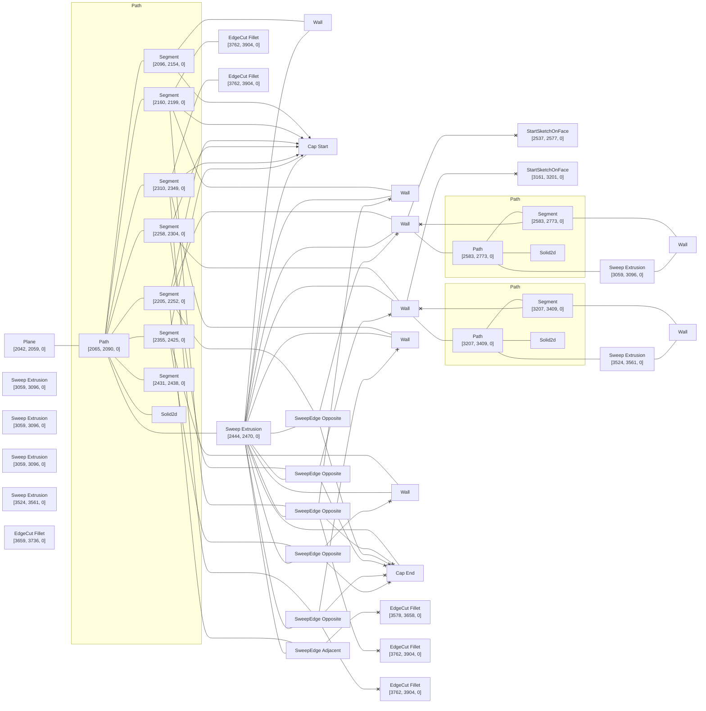

```mermaid
flowchart LR
  subgraph path2 [Path]
    2["Path<br>[2065, 2090, 0]"]
    3["Segment<br>[2096, 2154, 0]"]
    4["Segment<br>[2160, 2199, 0]"]
    5["Segment<br>[2205, 2252, 0]"]
    6["Segment<br>[2258, 2304, 0]"]
    7["Segment<br>[2310, 2349, 0]"]
    8["Segment<br>[2355, 2425, 0]"]
    9["Segment<br>[2431, 2438, 0]"]
    10[Solid2d]
  end
  subgraph path25 [Path]
    25["Path<br>[2583, 2773, 0]"]
    26["Segment<br>[2583, 2773, 0]"]
    27[Solid2d]
  end
  subgraph path33 [Path]
    33["Path<br>[3207, 3409, 0]"]
    34["Segment<br>[3207, 3409, 0]"]
    35[Solid2d]
  end
  1["Plane<br>[2042, 2059, 0]"]
  11["Sweep Extrusion<br>[2444, 2470, 0]"]
  12[Wall]
  13[Wall]
  14[Wall]
  15[Wall]
  16[Wall]
  17[Wall]
  18["Cap Start"]
  19["Cap End"]
  20["SweepEdge Opposite"]
  21["SweepEdge Opposite"]
  22["SweepEdge Opposite"]
  23["SweepEdge Opposite"]
  24["SweepEdge Opposite"]
  28["Sweep Extrusion<br>[3059, 3096, 0]"]
  29[Wall]
  30["Sweep Extrusion<br>[3059, 3096, 0]"]
  31["Sweep Extrusion<br>[3059, 3096, 0]"]
  32["Sweep Extrusion<br>[3059, 3096, 0]"]
  36["Sweep Extrusion<br>[3524, 3561, 0]"]
  37[Wall]
  38["Sweep Extrusion<br>[3524, 3561, 0]"]
  39["SweepEdge Adjacent"]
  40["EdgeCut Fillet<br>[3578, 3658, 0]"]
  41["EdgeCut Fillet<br>[3659, 3736, 0]"]
  42["EdgeCut Fillet<br>[3762, 3904, 0]"]
  43["EdgeCut Fillet<br>[3762, 3904, 0]"]
  44["EdgeCut Fillet<br>[3762, 3904, 0]"]
  45["EdgeCut Fillet<br>[3762, 3904, 0]"]
  46["StartSketchOnFace<br>[2537, 2577, 0]"]
  47["StartSketchOnFace<br>[3161, 3201, 0]"]
  1 --- 2
  2 --- 3
  2 --- 4
  2 --- 5
  2 --- 6
  2 --- 7
  2 --- 8
  2 --- 9
  2 ---- 11
  2 --- 10
  3 --- 12
  3 x--> 18
  4 --- 13
  4 --- 20
  4 --- 42
  4 x--> 18
  5 --- 14
  5 --- 21
  5 --- 39
  5 x--> 18
  6 --- 15
  6 --- 22
  6 x--> 18
  7 --- 16
  7 --- 23
  7 --- 44
  7 x--> 18
  8 --- 17
  8 --- 24
  8 x--> 18
  11 --- 12
  11 --- 13
  11 --- 14
  11 --- 15
  11 --- 16
  11 --- 17
  11 --- 18
  11 --- 19
  11 --- 20
  11 --- 21
  11 --- 22
  11 --- 23
  11 --- 24
  11 --- 39
  14 --- 25
  15 --- 33
  20 <--x 13
  20 <--x 19
  21 <--x 14
  21 <--x 19
  22 <--x 15
  22 <--x 19
  23 <--x 16
  23 <--x 19
  24 <--x 17
  24 <--x 19
  25 --- 26
  25 ---- 28
  25 --- 27
  26 --- 29
  26 <--x 14
  28 --- 29
  33 --- 34
  33 ---- 36
  33 --- 35
  34 --- 37
  34 <--x 15
  36 --- 37
  39 <--x 40
  20 <--x 43
  23 <--x 45
  14 <--x 46
  15 <--x 47
```
