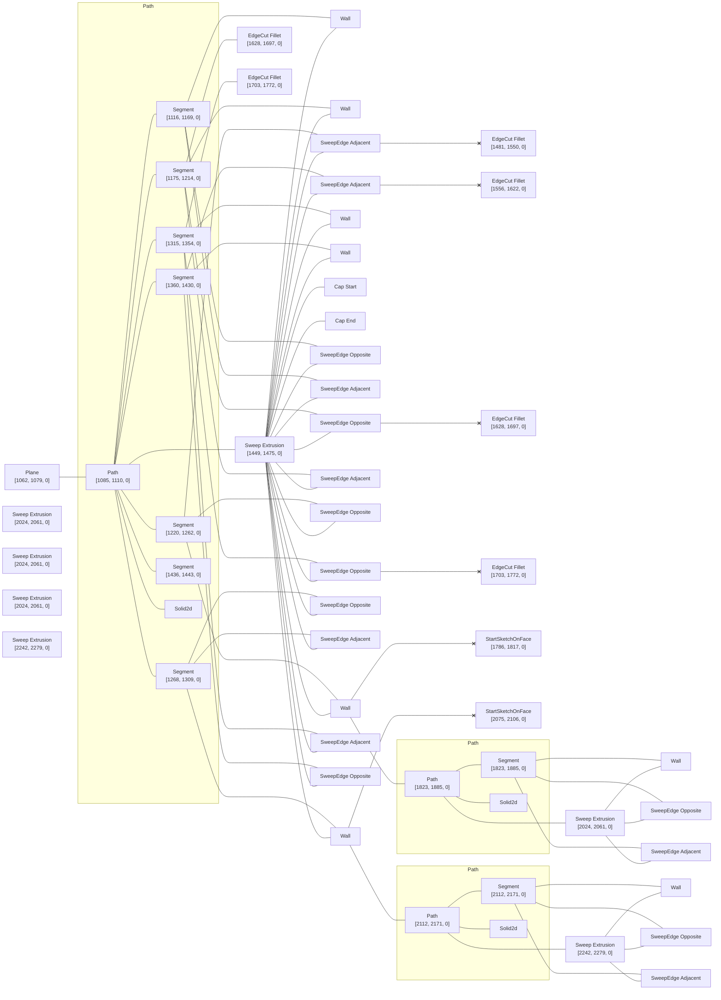

```mermaid
flowchart LR
  subgraph path2 [Path]
    2["Path<br>[1085, 1110, 0]"]
    3["Segment<br>[1116, 1169, 0]"]
    4["Segment<br>[1175, 1214, 0]"]
    5["Segment<br>[1220, 1262, 0]"]
    6["Segment<br>[1268, 1309, 0]"]
    7["Segment<br>[1315, 1354, 0]"]
    8["Segment<br>[1360, 1430, 0]"]
    9["Segment<br>[1436, 1443, 0]"]
    10[Solid2d]
  end
  subgraph path38 [Path]
    38["Path<br>[1823, 1885, 0]"]
    39["Segment<br>[1823, 1885, 0]"]
    40[Solid2d]
  end
  subgraph path48 [Path]
    48["Path<br>[2112, 2171, 0]"]
    49["Segment<br>[2112, 2171, 0]"]
    50[Solid2d]
  end
  1["Plane<br>[1062, 1079, 0]"]
  11["Sweep Extrusion<br>[1449, 1475, 0]"]
  12[Wall]
  13[Wall]
  14[Wall]
  15[Wall]
  16[Wall]
  17[Wall]
  18["Cap Start"]
  19["Cap End"]
  20["SweepEdge Opposite"]
  21["SweepEdge Adjacent"]
  22["SweepEdge Opposite"]
  23["SweepEdge Adjacent"]
  24["SweepEdge Opposite"]
  25["SweepEdge Adjacent"]
  26["SweepEdge Opposite"]
  27["SweepEdge Adjacent"]
  28["SweepEdge Opposite"]
  29["SweepEdge Adjacent"]
  30["SweepEdge Opposite"]
  31["SweepEdge Adjacent"]
  32["EdgeCut Fillet<br>[1481, 1550, 0]"]
  33["EdgeCut Fillet<br>[1556, 1622, 0]"]
  34["EdgeCut Fillet<br>[1628, 1697, 0]"]
  35["EdgeCut Fillet<br>[1628, 1697, 0]"]
  36["EdgeCut Fillet<br>[1703, 1772, 0]"]
  37["EdgeCut Fillet<br>[1703, 1772, 0]"]
  41["Sweep Extrusion<br>[2024, 2061, 0]"]
  42[Wall]
  43["SweepEdge Opposite"]
  44["SweepEdge Adjacent"]
  45["Sweep Extrusion<br>[2024, 2061, 0]"]
  46["Sweep Extrusion<br>[2024, 2061, 0]"]
  47["Sweep Extrusion<br>[2024, 2061, 0]"]
  51["Sweep Extrusion<br>[2242, 2279, 0]"]
  52[Wall]
  53["SweepEdge Opposite"]
  54["SweepEdge Adjacent"]
  55["Sweep Extrusion<br>[2242, 2279, 0]"]
  56["StartSketchOnFace<br>[1786, 1817, 0]"]
  57["StartSketchOnFace<br>[2075, 2106, 0]"]
  1 --- 2
  2 --- 3
  2 --- 4
  2 --- 5
  2 --- 6
  2 --- 7
  2 --- 8
  2 --- 9
  2 ---- 11
  2 --- 10
  3 --- 12
  3 --- 20
  3 --- 21
  4 --- 13
  4 --- 22
  4 --- 23
  4 --- 34
  5 --- 14
  5 --- 24
  5 --- 25
  6 --- 15
  6 --- 26
  6 --- 27
  7 --- 16
  7 --- 28
  7 --- 29
  7 --- 36
  8 --- 17
  8 --- 30
  8 --- 31
  11 --- 12
  11 --- 13
  11 --- 14
  11 --- 15
  11 --- 16
  11 --- 17
  11 --- 18
  11 --- 19
  11 --- 20
  11 --- 21
  11 --- 22
  11 --- 23
  11 --- 24
  11 --- 25
  11 --- 26
  11 --- 27
  11 --- 28
  11 --- 29
  11 --- 30
  11 --- 31
  14 --- 38
  15 --- 48
  25 <--x 32
  31 <--x 33
  22 <--x 35
  28 <--x 37
  38 --- 39
  38 ---- 41
  38 --- 40
  39 --- 42
  39 --- 43
  39 --- 44
  41 --- 42
  41 --- 43
  41 --- 44
  48 --- 49
  48 ---- 51
  48 --- 50
  49 --- 52
  49 --- 53
  49 --- 54
  51 --- 52
  51 --- 53
  51 --- 54
  14 <--x 56
  15 <--x 57
```
