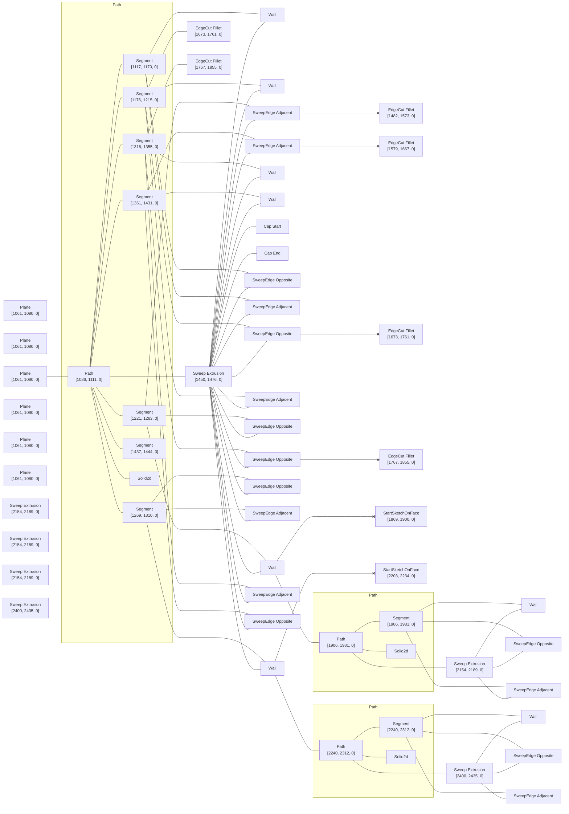

```mermaid
flowchart LR
  subgraph path7 [Path]
    7["Path<br>[1086, 1111, 0]"]
    8["Segment<br>[1117, 1170, 0]"]
    9["Segment<br>[1176, 1215, 0]"]
    10["Segment<br>[1221, 1263, 0]"]
    11["Segment<br>[1269, 1310, 0]"]
    12["Segment<br>[1316, 1355, 0]"]
    13["Segment<br>[1361, 1431, 0]"]
    14["Segment<br>[1437, 1444, 0]"]
    15[Solid2d]
  end
  subgraph path43 [Path]
    43["Path<br>[1906, 1981, 0]"]
    44["Segment<br>[1906, 1981, 0]"]
    45[Solid2d]
  end
  subgraph path53 [Path]
    53["Path<br>[2240, 2312, 0]"]
    54["Segment<br>[2240, 2312, 0]"]
    55[Solid2d]
  end
  1["Plane<br>[1061, 1080, 0]"]
  2["Plane<br>[1061, 1080, 0]"]
  3["Plane<br>[1061, 1080, 0]"]
  4["Plane<br>[1061, 1080, 0]"]
  5["Plane<br>[1061, 1080, 0]"]
  6["Plane<br>[1061, 1080, 0]"]
  16["Sweep Extrusion<br>[1450, 1476, 0]"]
  17[Wall]
  18[Wall]
  19[Wall]
  20[Wall]
  21[Wall]
  22[Wall]
  23["Cap Start"]
  24["Cap End"]
  25["SweepEdge Opposite"]
  26["SweepEdge Adjacent"]
  27["SweepEdge Opposite"]
  28["SweepEdge Adjacent"]
  29["SweepEdge Opposite"]
  30["SweepEdge Adjacent"]
  31["SweepEdge Opposite"]
  32["SweepEdge Adjacent"]
  33["SweepEdge Opposite"]
  34["SweepEdge Adjacent"]
  35["SweepEdge Opposite"]
  36["SweepEdge Adjacent"]
  37["EdgeCut Fillet<br>[1482, 1573, 0]"]
  38["EdgeCut Fillet<br>[1579, 1667, 0]"]
  39["EdgeCut Fillet<br>[1673, 1761, 0]"]
  40["EdgeCut Fillet<br>[1673, 1761, 0]"]
  41["EdgeCut Fillet<br>[1767, 1855, 0]"]
  42["EdgeCut Fillet<br>[1767, 1855, 0]"]
  46["Sweep Extrusion<br>[2154, 2189, 0]"]
  47[Wall]
  48["SweepEdge Opposite"]
  49["SweepEdge Adjacent"]
  50["Sweep Extrusion<br>[2154, 2189, 0]"]
  51["Sweep Extrusion<br>[2154, 2189, 0]"]
  52["Sweep Extrusion<br>[2154, 2189, 0]"]
  56["Sweep Extrusion<br>[2400, 2435, 0]"]
  57[Wall]
  58["SweepEdge Opposite"]
  59["SweepEdge Adjacent"]
  60["Sweep Extrusion<br>[2400, 2435, 0]"]
  61["StartSketchOnFace<br>[1869, 1900, 0]"]
  62["StartSketchOnFace<br>[2203, 2234, 0]"]
  3 --- 7
  7 --- 8
  7 --- 9
  7 --- 10
  7 --- 11
  7 --- 12
  7 --- 13
  7 --- 14
  7 ---- 16
  7 --- 15
  8 --- 17
  8 --- 25
  8 --- 26
  9 --- 18
  9 --- 27
  9 --- 28
  9 --- 39
  10 --- 19
  10 --- 29
  10 --- 30
  11 --- 20
  11 --- 31
  11 --- 32
  12 --- 21
  12 --- 33
  12 --- 34
  12 --- 41
  13 --- 22
  13 --- 35
  13 --- 36
  16 --- 17
  16 --- 18
  16 --- 19
  16 --- 20
  16 --- 21
  16 --- 22
  16 --- 23
  16 --- 24
  16 --- 25
  16 --- 26
  16 --- 27
  16 --- 28
  16 --- 29
  16 --- 30
  16 --- 31
  16 --- 32
  16 --- 33
  16 --- 34
  16 --- 35
  16 --- 36
  19 --- 43
  20 --- 53
  30 <--x 37
  36 <--x 38
  27 <--x 40
  33 <--x 42
  43 --- 44
  43 ---- 46
  43 --- 45
  44 --- 47
  44 --- 48
  44 --- 49
  46 --- 47
  46 --- 48
  46 --- 49
  53 --- 54
  53 ---- 56
  53 --- 55
  54 --- 57
  54 --- 58
  54 --- 59
  56 --- 57
  56 --- 58
  56 --- 59
  19 <--x 61
  20 <--x 62
```
