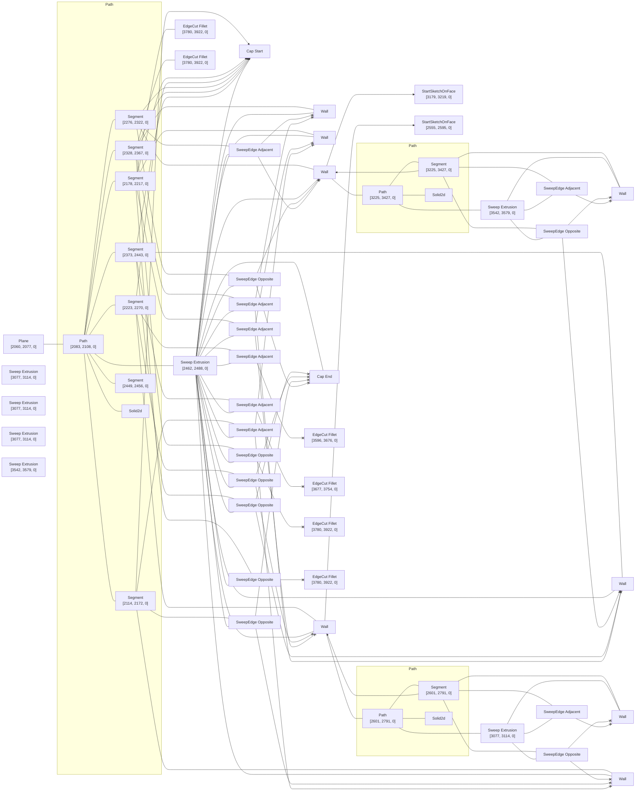

```mermaid
flowchart LR
  subgraph path4 [Path]
    4["Path<br>[2083, 2108, 0]"]
      %% [ProgramBodyItem { index: 20 }, VariableDeclarationDeclaration, VariableDeclarationInit, PipeBodyItem { index: 1 }]
    7["Segment<br>[2114, 2172, 0]"]
      %% [ProgramBodyItem { index: 20 }, VariableDeclarationDeclaration, VariableDeclarationInit, PipeBodyItem { index: 2 }]
    8["Segment<br>[2178, 2217, 0]"]
      %% [ProgramBodyItem { index: 20 }, VariableDeclarationDeclaration, VariableDeclarationInit, PipeBodyItem { index: 3 }]
    9["Segment<br>[2223, 2270, 0]"]
      %% [ProgramBodyItem { index: 20 }, VariableDeclarationDeclaration, VariableDeclarationInit, PipeBodyItem { index: 4 }]
    10["Segment<br>[2276, 2322, 0]"]
      %% [ProgramBodyItem { index: 20 }, VariableDeclarationDeclaration, VariableDeclarationInit, PipeBodyItem { index: 5 }]
    11["Segment<br>[2328, 2367, 0]"]
      %% [ProgramBodyItem { index: 20 }, VariableDeclarationDeclaration, VariableDeclarationInit, PipeBodyItem { index: 6 }]
    12["Segment<br>[2373, 2443, 0]"]
      %% [ProgramBodyItem { index: 20 }, VariableDeclarationDeclaration, VariableDeclarationInit, PipeBodyItem { index: 7 }]
    13["Segment<br>[2449, 2456, 0]"]
      %% [ProgramBodyItem { index: 20 }, VariableDeclarationDeclaration, VariableDeclarationInit, PipeBodyItem { index: 8 }]
    17[Solid2d]
  end
  subgraph path5 [Path]
    5["Path<br>[2601, 2791, 0]"]
      %% [ProgramBodyItem { index: 21 }, VariableDeclarationDeclaration, VariableDeclarationInit, PipeBodyItem { index: 1 }]
    14["Segment<br>[2601, 2791, 0]"]
      %% [ProgramBodyItem { index: 21 }, VariableDeclarationDeclaration, VariableDeclarationInit, PipeBodyItem { index: 1 }]
    16[Solid2d]
  end
  subgraph path6 [Path]
    6["Path<br>[3225, 3427, 0]"]
      %% [ProgramBodyItem { index: 22 }, VariableDeclarationDeclaration, VariableDeclarationInit, PipeBodyItem { index: 1 }]
    15["Segment<br>[3225, 3427, 0]"]
      %% [ProgramBodyItem { index: 22 }, VariableDeclarationDeclaration, VariableDeclarationInit, PipeBodyItem { index: 1 }]
    18[Solid2d]
  end
  1["Plane<br>[2060, 2077, 0]"]
    %% [ProgramBodyItem { index: 20 }, VariableDeclarationDeclaration, VariableDeclarationInit, PipeBodyItem { index: 0 }]
  2["StartSketchOnFace<br>[3179, 3219, 0]"]
    %% Missing NodePath
  3["StartSketchOnFace<br>[2555, 2595, 0]"]
    %% Missing NodePath
  19["Sweep Extrusion<br>[2462, 2488, 0]"]
    %% [ProgramBodyItem { index: 20 }, VariableDeclarationDeclaration, VariableDeclarationInit, PipeBodyItem { index: 9 }]
  20["Sweep Extrusion<br>[3077, 3114, 0]"]
    %% [ProgramBodyItem { index: 21 }, VariableDeclarationDeclaration, VariableDeclarationInit, PipeBodyItem { index: 4 }]
  21["Sweep Extrusion<br>[3077, 3114, 0]"]
    %% [ProgramBodyItem { index: 21 }, VariableDeclarationDeclaration, VariableDeclarationInit, PipeBodyItem { index: 4 }]
  22["Sweep Extrusion<br>[3077, 3114, 0]"]
    %% [ProgramBodyItem { index: 21 }, VariableDeclarationDeclaration, VariableDeclarationInit, PipeBodyItem { index: 4 }]
  23["Sweep Extrusion<br>[3077, 3114, 0]"]
    %% [ProgramBodyItem { index: 21 }, VariableDeclarationDeclaration, VariableDeclarationInit, PipeBodyItem { index: 4 }]
  24["Sweep Extrusion<br>[3542, 3579, 0]"]
    %% [ProgramBodyItem { index: 22 }, VariableDeclarationDeclaration, VariableDeclarationInit, PipeBodyItem { index: 3 }]
  25["Sweep Extrusion<br>[3542, 3579, 0]"]
    %% [ProgramBodyItem { index: 22 }, VariableDeclarationDeclaration, VariableDeclarationInit, PipeBodyItem { index: 3 }]
  26[Wall]
  27[Wall]
  28[Wall]
  29[Wall]
  30[Wall]
  31[Wall]
  32[Wall]
  33[Wall]
  34["Cap Start"]
  35["Cap End"]
  36["SweepEdge Opposite"]
  37["SweepEdge Opposite"]
  38["SweepEdge Opposite"]
  39["SweepEdge Opposite"]
  40["SweepEdge Opposite"]
  41["SweepEdge Opposite"]
  42["SweepEdge Opposite"]
  43["SweepEdge Opposite"]
  44["SweepEdge Adjacent"]
  45["SweepEdge Adjacent"]
  46["SweepEdge Adjacent"]
  47["SweepEdge Adjacent"]
  48["SweepEdge Adjacent"]
  49["SweepEdge Adjacent"]
  50["SweepEdge Adjacent"]
  51["SweepEdge Adjacent"]
  52["EdgeCut Fillet<br>[3596, 3676, 0]"]
    %% [ProgramBodyItem { index: 23 }, ExpressionStatementExpr]
  53["EdgeCut Fillet<br>[3677, 3754, 0]"]
    %% [ProgramBodyItem { index: 24 }, ExpressionStatementExpr]
  54["EdgeCut Fillet<br>[3780, 3922, 0]"]
    %% [ProgramBodyItem { index: 25 }, ExpressionStatementExpr]
  55["EdgeCut Fillet<br>[3780, 3922, 0]"]
    %% [ProgramBodyItem { index: 25 }, ExpressionStatementExpr]
  56["EdgeCut Fillet<br>[3780, 3922, 0]"]
    %% [ProgramBodyItem { index: 25 }, ExpressionStatementExpr]
  57["EdgeCut Fillet<br>[3780, 3922, 0]"]
    %% [ProgramBodyItem { index: 25 }, ExpressionStatementExpr]
  1 --- 4
  33 x--> 2
  32 x--> 3
  4 --- 7
  4 --- 8
  4 --- 9
  4 --- 10
  4 --- 11
  4 --- 12
  4 --- 13
  4 --- 17
  4 ---- 19
  5 --- 14
  5 --- 16
  5 ---- 21
  32 --- 5
  6 --- 15
  6 --- 18
  6 ---- 24
  33 --- 6
  7 --- 31
  7 x--> 34
  7 --- 42
  7 --- 50
  8 --- 30
  8 x--> 34
  8 --- 40
  8 --- 47
  8 --- 54
  9 --- 32
  9 x--> 34
  9 --- 41
  9 --- 51
  10 --- 33
  10 x--> 34
  10 --- 43
  10 --- 46
  11 --- 29
  11 x--> 34
  11 --- 38
  11 --- 48
  11 --- 56
  12 --- 28
  12 x--> 34
  12 --- 39
  12 --- 49
  14 --- 27
  14 x--> 32
  14 --- 37
  14 --- 45
  15 --- 26
  15 x--> 33
  15 --- 36
  15 --- 44
  19 --- 28
  19 --- 29
  19 --- 30
  19 --- 31
  19 --- 32
  19 --- 33
  19 --- 34
  19 --- 35
  19 --- 38
  19 --- 39
  19 --- 40
  19 --- 41
  19 --- 42
  19 --- 43
  19 --- 46
  19 --- 47
  19 --- 48
  19 --- 49
  19 --- 50
  19 --- 51
  21 --- 27
  21 --- 37
  21 --- 45
  24 --- 26
  24 --- 36
  24 --- 44
  36 <--x 26
  44 <--x 26
  37 <--x 27
  45 <--x 27
  36 <--x 28
  39 <--x 28
  48 <--x 28
  46 <--x 29
  48 <--x 29
  47 <--x 30
  50 <--x 30
  37 <--x 31
  42 <--x 31
  50 <--x 31
  41 <--x 32
  47 <--x 32
  43 <--x 33
  46 <--x 33
  39 <--x 35
  41 <--x 35
  42 <--x 35
  43 <--x 35
  38 <--x 55
  40 <--x 57
  49 <--x 53
  51 <--x 52
```
