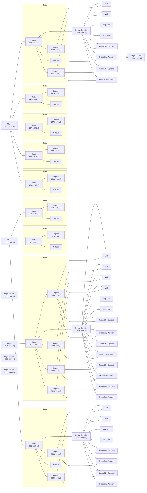

```mermaid
flowchart LR
  subgraph path2 [Path]
    2["Path<br>[1171, 1196, 0]"]
    3["Segment<br>[1202, 1261, 0]"]
    4["Segment<br>[1361, 1368, 0]"]
    5[Solid2d]
  end
  subgraph path6 [Path]
    6["Path<br>[1379, 1458, 0]"]
    7["Segment<br>[1379, 1458, 0]"]
    8[Solid2d]
  end
  subgraph path9 [Path]
    9["Path<br>[1473, 1576, 0]"]
    10["Segment<br>[1473, 1576, 0]"]
    11[Solid2d]
  end
  subgraph path12 [Path]
    12["Path<br>[1591, 1678, 0]"]
    13["Segment<br>[1591, 1678, 0]"]
    14[Solid2d]
  end
  subgraph path15 [Path]
    15["Path<br>[1693, 1788, 0]"]
    16["Segment<br>[1693, 1788, 0]"]
    17[Solid2d]
  end
  subgraph path28 [Path]
    28["Path<br>[2119, 2144, 0]"]
    29["Segment<br>[2150, 2176, 0]"]
    32["Segment<br>[2182, 2286, 0]"]
    33["Segment<br>[2292, 2318, 0]"]
    34["Segment<br>[2324, 2416, 0]"]
  end
  subgraph path51 [Path]
    51["Path<br>[2837, 2874, 0]"]
    52["Segment<br>[2880, 2902, 0]"]
    53["Segment<br>[3003, 3010, 0]"]
    54[Solid2d]
  end
  subgraph path55 [Path]
    55["Path<br>[3021, 3103, 0]"]
    56["Segment<br>[3021, 3103, 0]"]
    57[Solid2d]
  end
  subgraph path58 [Path]
    58["Path<br>[3118, 3200, 0]"]
    59["Segment<br>[3118, 3200, 0]"]
    60[Solid2d]
  end
  1["Plane<br>[1146, 1165, 0]"]
  18["Sweep Extrusion<br>[1851, 1897, 0]"]
  19[Wall]
  20[Wall]
  21["Cap Start"]
  22["Cap End"]
  23["SweepEdge Opposite"]
  24["SweepEdge Adjacent"]
  25["SweepEdge Opposite"]
  26["SweepEdge Adjacent"]
  27["Plane<br>[2094, 2113, 0]"]
  30["EdgeCut Fillet<br>[1903, 2052, 0]"]
  31["EdgeCut Fillet<br>[1903, 2052, 0]"]
  35["Sweep Extrusion<br>[2453, 2491, 0]"]
  36[Wall]
  37[Wall]
  38[Wall]
  39[Wall]
  40["Cap Start"]
  41["Cap End"]
  42["SweepEdge Opposite"]
  43["SweepEdge Adjacent"]
  44["SweepEdge Opposite"]
  45["SweepEdge Adjacent"]
  46["SweepEdge Opposite"]
  47["SweepEdge Adjacent"]
  48["SweepEdge Opposite"]
  49["SweepEdge Adjacent"]
  50["Plane<br>[2805, 2831, 0]"]
  61["Sweep Extrusion<br>[3253, 3300, 0]"]
  62[Wall]
  63[Wall]
  64["Cap Start"]
  65["Cap End"]
  66["SweepEdge Opposite"]
  67["SweepEdge Adjacent"]
  68["SweepEdge Opposite"]
  69["SweepEdge Adjacent"]
  70["EdgeCut Fillet<br>[3306, 3455, 0]"]
  71["EdgeCut Fillet<br>[3306, 3455, 0]"]
  1 --- 2
  1 --- 6
  1 --- 9
  1 --- 12
  1 --- 15
  2 --- 3
  2 --- 4
  2 ---- 18
  2 --- 5
  3 --- 19
  3 --- 23
  3 --- 24
  4 --- 20
  4 --- 25
  4 --- 26
  6 --- 7
  6 --- 8
  9 --- 10
  9 --- 11
  12 --- 13
  12 --- 14
  15 --- 16
  15 --- 17
  18 --- 19
  18 --- 20
  18 --- 21
  18 --- 22
  18 --- 23
  18 --- 24
  18 --- 25
  18 --- 26
  27 --- 28
  28 --- 29
  28 --- 32
  28 --- 33
  28 --- 34
  28 ---- 35
  29 --- 36
  29 --- 42
  29 --- 43
  24 <--x 30
  32 --- 37
  32 --- 44
  32 --- 45
  33 --- 38
  33 --- 46
  33 --- 47
  34 --- 39
  34 --- 48
  34 --- 49
  35 --- 36
  35 --- 37
  35 --- 38
  35 --- 39
  35 --- 40
  35 --- 41
  35 --- 42
  35 --- 43
  35 --- 44
  35 --- 45
  35 --- 46
  35 --- 47
  35 --- 48
  35 --- 49
  50 --- 51
  50 --- 55
  50 --- 58
  51 --- 52
  51 --- 53
  51 ---- 61
  51 --- 54
  52 --- 63
  52 --- 68
  52 --- 69
  53 --- 62
  53 --- 66
  53 --- 67
  55 --- 56
  55 --- 57
  58 --- 59
  58 --- 60
  61 --- 62
  61 --- 63
  61 --- 64
  61 --- 65
  61 --- 66
  61 --- 67
  61 --- 68
  61 --- 69
```
