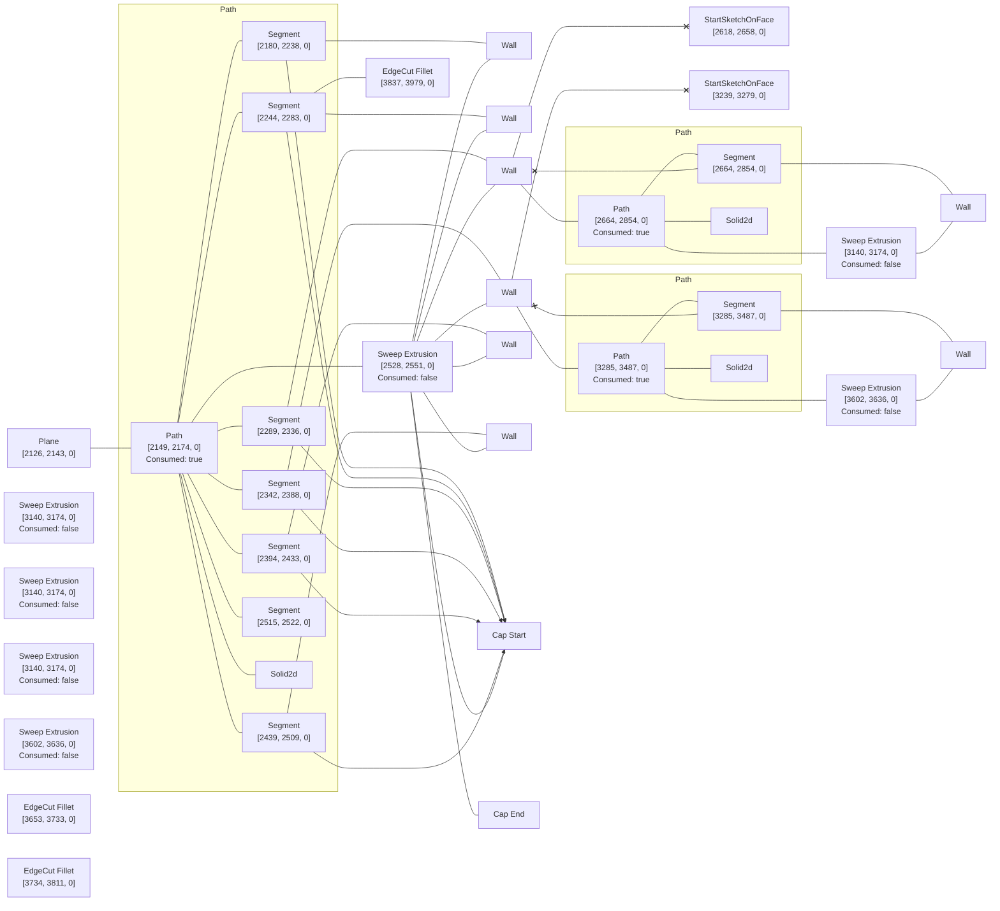

```mermaid
flowchart LR
  subgraph path2 [Path]
    2["Path<br>[2149, 2174, 0]<br>Consumed: true"]
      %% [ProgramBodyItem { index: 20 }, VariableDeclarationDeclaration, VariableDeclarationInit, PipeBodyItem { index: 1 }]
    3["Segment<br>[2180, 2238, 0]"]
      %% [ProgramBodyItem { index: 20 }, VariableDeclarationDeclaration, VariableDeclarationInit, PipeBodyItem { index: 2 }]
    4["Segment<br>[2244, 2283, 0]"]
      %% [ProgramBodyItem { index: 20 }, VariableDeclarationDeclaration, VariableDeclarationInit, PipeBodyItem { index: 3 }]
    5["Segment<br>[2289, 2336, 0]"]
      %% [ProgramBodyItem { index: 20 }, VariableDeclarationDeclaration, VariableDeclarationInit, PipeBodyItem { index: 4 }]
    6["Segment<br>[2342, 2388, 0]"]
      %% [ProgramBodyItem { index: 20 }, VariableDeclarationDeclaration, VariableDeclarationInit, PipeBodyItem { index: 5 }]
    7["Segment<br>[2394, 2433, 0]"]
      %% [ProgramBodyItem { index: 20 }, VariableDeclarationDeclaration, VariableDeclarationInit, PipeBodyItem { index: 6 }]
    8["Segment<br>[2439, 2509, 0]"]
      %% [ProgramBodyItem { index: 20 }, VariableDeclarationDeclaration, VariableDeclarationInit, PipeBodyItem { index: 7 }]
    9["Segment<br>[2515, 2522, 0]"]
      %% [ProgramBodyItem { index: 20 }, VariableDeclarationDeclaration, VariableDeclarationInit, PipeBodyItem { index: 8 }]
    10[Solid2d]
  end
  subgraph path20 [Path]
    20["Path<br>[2664, 2854, 0]<br>Consumed: true"]
      %% [ProgramBodyItem { index: 21 }, VariableDeclarationDeclaration, VariableDeclarationInit, PipeBodyItem { index: 1 }]
    21["Segment<br>[2664, 2854, 0]"]
      %% [ProgramBodyItem { index: 21 }, VariableDeclarationDeclaration, VariableDeclarationInit, PipeBodyItem { index: 1 }]
    22[Solid2d]
  end
  subgraph path28 [Path]
    28["Path<br>[3285, 3487, 0]<br>Consumed: true"]
      %% [ProgramBodyItem { index: 22 }, VariableDeclarationDeclaration, VariableDeclarationInit, PipeBodyItem { index: 1 }]
    29["Segment<br>[3285, 3487, 0]"]
      %% [ProgramBodyItem { index: 22 }, VariableDeclarationDeclaration, VariableDeclarationInit, PipeBodyItem { index: 1 }]
    30[Solid2d]
  end
  1["Plane<br>[2126, 2143, 0]"]
    %% [ProgramBodyItem { index: 20 }, VariableDeclarationDeclaration, VariableDeclarationInit, PipeBodyItem { index: 0 }]
  11["Sweep Extrusion<br>[2528, 2551, 0]<br>Consumed: false"]
    %% [ProgramBodyItem { index: 20 }, VariableDeclarationDeclaration, VariableDeclarationInit, PipeBodyItem { index: 9 }]
  12[Wall]
    %% face_code_ref=Missing NodePath
  13[Wall]
    %% face_code_ref=Missing NodePath
  14[Wall]
    %% face_code_ref=[ProgramBodyItem { index: 21 }, VariableDeclarationDeclaration, VariableDeclarationInit, PipeBodyItem { index: 0 }]
  15[Wall]
    %% face_code_ref=[ProgramBodyItem { index: 22 }, VariableDeclarationDeclaration, VariableDeclarationInit, PipeBodyItem { index: 0 }]
  16[Wall]
    %% face_code_ref=Missing NodePath
  17[Wall]
    %% face_code_ref=Missing NodePath
  18["Cap Start"]
    %% face_code_ref=Missing NodePath
  19["Cap End"]
    %% face_code_ref=Missing NodePath
  23["Sweep Extrusion<br>[3140, 3174, 0]<br>Consumed: false"]
    %% [ProgramBodyItem { index: 21 }, VariableDeclarationDeclaration, VariableDeclarationInit, PipeBodyItem { index: 4 }]
  24[Wall]
    %% face_code_ref=Missing NodePath
  25["Sweep Extrusion<br>[3140, 3174, 0]<br>Consumed: false"]
    %% [ProgramBodyItem { index: 21 }, VariableDeclarationDeclaration, VariableDeclarationInit, PipeBodyItem { index: 4 }]
  26["Sweep Extrusion<br>[3140, 3174, 0]<br>Consumed: false"]
    %% [ProgramBodyItem { index: 21 }, VariableDeclarationDeclaration, VariableDeclarationInit, PipeBodyItem { index: 4 }]
  27["Sweep Extrusion<br>[3140, 3174, 0]<br>Consumed: false"]
    %% [ProgramBodyItem { index: 21 }, VariableDeclarationDeclaration, VariableDeclarationInit, PipeBodyItem { index: 4 }]
  31["Sweep Extrusion<br>[3602, 3636, 0]<br>Consumed: false"]
    %% [ProgramBodyItem { index: 22 }, VariableDeclarationDeclaration, VariableDeclarationInit, PipeBodyItem { index: 3 }]
  32[Wall]
    %% face_code_ref=Missing NodePath
  33["Sweep Extrusion<br>[3602, 3636, 0]<br>Consumed: false"]
    %% [ProgramBodyItem { index: 22 }, VariableDeclarationDeclaration, VariableDeclarationInit, PipeBodyItem { index: 3 }]
  34["EdgeCut Fillet<br>[3653, 3733, 0]"]
    %% [ProgramBodyItem { index: 23 }, ExpressionStatementExpr]
  35["EdgeCut Fillet<br>[3734, 3811, 0]"]
    %% [ProgramBodyItem { index: 24 }, ExpressionStatementExpr]
  36["EdgeCut Fillet<br>[3837, 3979, 0]"]
    %% [ProgramBodyItem { index: 25 }, ExpressionStatementExpr]
  37["StartSketchOnFace<br>[2618, 2658, 0]"]
    %% [ProgramBodyItem { index: 21 }, VariableDeclarationDeclaration, VariableDeclarationInit, PipeBodyItem { index: 0 }]
  38["StartSketchOnFace<br>[3239, 3279, 0]"]
    %% [ProgramBodyItem { index: 22 }, VariableDeclarationDeclaration, VariableDeclarationInit, PipeBodyItem { index: 0 }]
  1 --- 2
  2 --- 3
  2 --- 4
  2 --- 5
  2 --- 6
  2 --- 7
  2 --- 8
  2 --- 9
  2 --- 10
  2 ---- 11
  3 --- 12
  3 x--> 18
  4 --- 13
  4 x--> 18
  4 --- 36
  5 --- 14
  5 x--> 18
  6 --- 15
  6 x--> 18
  7 --- 16
  7 x--> 18
  8 --- 17
  8 x--> 18
  11 --- 12
  11 --- 13
  11 --- 14
  11 --- 15
  11 --- 16
  11 --- 17
  11 --- 18
  11 --- 19
  14 --- 20
  21 <--x 14
  14 <--x 37
  15 --- 28
  29 <--x 15
  15 <--x 38
  20 --- 21
  20 --- 22
  20 ---- 23
  21 --- 24
  23 --- 24
  28 --- 29
  28 --- 30
  28 ---- 31
  29 --- 32
  31 --- 32
```
